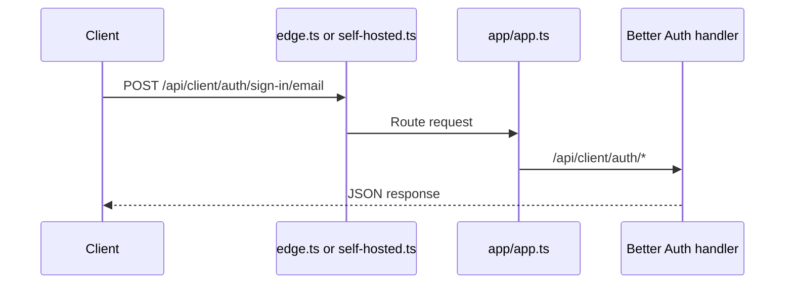

# API package architecture

TurboPanel API uses a **surface-based** architecture: URL namespaces (surfaces) mount feature routers and stay separate from domain code under `features/`.

## Folder structure

### `app/`

Application bootstrap and core configuration. This is the only place that creates the OpenAPIHono instance; runtime entry points (`edge.ts` for Edge, `self-hosted.ts` for Self-Hosted) import the canonical app and add environment-specific middleware.

- `app.ts` — OpenAPIHono instance (canonical app creator): mounts `/api/client/v1/health`, `/api/client/auth/status`, `/api/client/v1/install`, `/api/client/auth/mfa-policy`, OpenAPI doc, and the main `router.ts` for `/api/client/v1/*`, `/api/admin/v1/*`, and `/api/server/v1/*`
- `router.ts` — Mounts surface routers
- `context.ts` — Hono context types

### `surfaces/`

URL namespace routers that mount feature routers under specific prefixes.

- Better Auth handlers are mounted by entrypoint middleware under `/api/client/auth/*`
- `client.ts` — Client features under `/api/client/v1`
- `server.ts` — Server surface under `/api/server/v1` (no routes yet; auth will be added separately)

### `features/`

Domain modules organized by capability (for example `auth/`, `sessions/`, `users/`, `accounts/`).

Each feature typically has:

- `http.ts` — Hono route handlers (**only** file that imports Hono)
- `service.ts` — Business logic
- `repo.ts` — Database queries
- `schemas.ts` — Zod validation schemas
- `index.ts` — Exports router and types

### `platform/`

Shared infrastructure: `db/` (identity, config, data), `crypto/`, `email/`, `logging/`, `validation/`, etc.

### `middleware/`

Cross-cutting concerns: `auth.ts`, `cors.ts`, `error-handler.ts`, etc.

## Routing flow



## Naming conventions

### Hono import rule

**Only** `features/*/http.ts` files may import from `'hono'`. Services, repos, and schemas stay framework-agnostic.

### Database (single Postgres)

Production and dev use **one PostgreSQL 18 database** per environment. Drizzle schema groups tables by concern:

- **Identity** — Users, Better Auth sessions, verification, 2FA, organizations, invitations
- **Config** — `setting` key/value rows (instance flags, SMTP metadata, MFA toggles)
- **Runtime data** — Servers and other account-scoped rows

Migrations live in `apps/api/migrations/` with journal `meta/_journal.json`. Drizzle records applied revisions in the `public.migrations` table.

### Install flow (`POST /api/client/v1/install`)

When the instance is in **install mode** (root org/team env ids not yet reflected in the database), an unauthenticated operator completes setup by creating the first admin user and related rows. The endpoint is rate-limited per client (shared Redis in self-hosted, Cloudflare rate limiting on Edge) and is first-come-first-serve — no setup secret is required. After install, public signup defaults off until enabled via instance settings.

### Root admin authorization

Platform administrators are **not** derived from a `role` column on `user`. Admin APIs use membership in the **root organization** and **root team** configured by `TURBOPANEL_ROOT_ORG` and `TURBOPANEL_ROOT_TEAM` (see `isRootAdmin` in the API codebase).

## Adding new features

1. Create `features/my-feature/` with `http.ts`, `service.ts`, `repo.ts`, `schemas.ts`, `index.ts`.
2. Implement logic in `service.ts`, queries in `repo.ts`, schemas in `schemas.ts`, routes in `http.ts`.
3. Export the router from `index.ts` and mount it on the correct surface (`surfaces/admin.ts` or `surfaces/client.ts`).

## Architecture diagram

```mermaid
graph TD
    A[Client Request] --> B[app/app.ts]
    B --> C[app/router.ts]
    C --> D[surfaces/admin.ts]
    C --> E[surfaces/client.ts]
    C --> S[surfaces/server.ts]
    B --> F[/api/client/auth/* via Better Auth middleware]

    D --> G[features/settings/http.ts]
    E --> H[features/users/http.ts]

    G --> I[features/*/service.ts]
    H --> I
    I --> J[features/*/repo.ts]
    J --> K[platform/db/*]
```

**Legend:** Blue paths are HTTP handlers; yellow is service layer; red is repository layer.

### Dual router pattern (auth)

Public auth endpoints (signup, sign-in, sign-out, password reset, verification) are served by Better Auth
under `/api/client/auth/*`. Authenticated account and profile APIs remain under `/api/client/v1/*`.

## Related

- [Monorepo and development](/docs/architecture/monorepo)
- [Migration troubleshooting](/docs/getting-started/migration-troubleshooting)
- [API Reference](/docs/api) — Interactive OpenAPI browser
