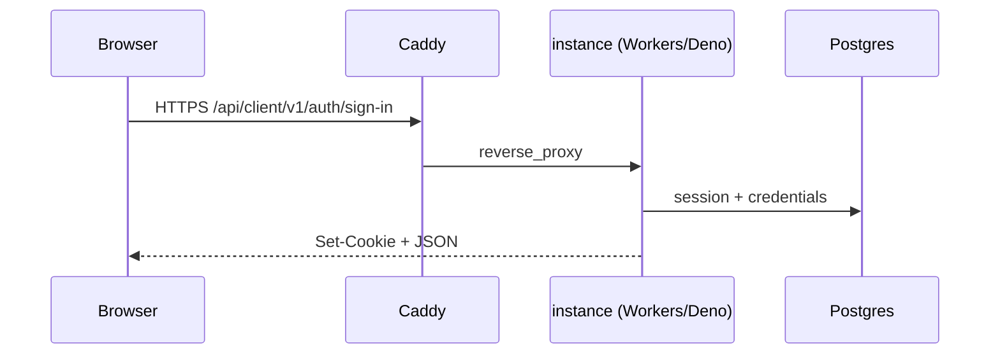

# Instance API architecture

The TurboPanel API lives in the [turbopanel/turbopanel](https://github.com/turbopanel/turbopanel) repository at `~/instance`. It is a **Hono** application with dual runtimes: **Cloudflare Workers** (`src/workers.ts` + wrangler) and **Deno** (`src/deno.ts` + Unix socket).

## Versioned surfaces

Four versioned surfaces each have REST + WebSocket namespaces (where applicable). Prefixes live in `src/surfaces.ts`. `GET /api/health` is the single unversioned probe.

| Surface | REST | WebSocket | Audience |
| ------- | ---- | --------- | -------- |
| Client | `/api/client/v1/*` | `/ws/client/v1` | End-user UI |
| Developer | `/api/developer/v1/*` | `/ws/developer/v1` | Dev console (`__DEV__` only) |
| Install | `/api/install/v1/*` | — | Self-hosted install wizard (Deno only) |
| Daemon | `/api/daemon/v1/*` | `/ws/daemon/v1` | Remote daemons |

Unversioned docs:

- `GET /api/openapi.json` — OpenAPI 3.1 spec
- `GET /api/reference` — Scalar embed

## Folder layout (`instance/src/`)

| Area | Files | Role |
| ---- | ----- | ---- |
| App shell | `app.ts`, `surfaces.ts` | `createApp()` mounts routers, health, OpenAPI, Scalar |
| Client | `client-routes.ts`, `auth/*` | Sign-in, org servers |
| Install | `install-routes.ts`, `auth/install-state.ts` | Self-hosted install wizard (`/api/install/v1/*`, Deno only) |
| Developer | `developer-routes-core.ts`, `developer-routes.ts` | Fleet, database (Deno-only extras in `developer-routes.ts`) |
| Daemon | `daemon-api-routes.ts`, `daemon-hub.ts` | Daemon registration, CA fetch, WS hub |
| Deno-only | `deno.ts`, `system-routes.ts`, `dev-sync.ts`, `tunnel-routes.ts` | Upgrade, reset-dev, dev-sync push |
| Database | `db.ts`, `db/schema.ts` | Drizzle + postgres.js (`prepare: true` on Workers/Hyperdrive for cached parameterized reads; `prepare: false` on Deno/direct Postgres) |
| Workers entry | `workers.ts` | Wrangler main; registers `developer-routes-core` only |

**Workers bundle rule:** Deno-only modules must not be imported from `app.ts` or `workers.ts` — register Deno routes only from `deno.ts`.

## Routing flow



In self-hosted production, Caddy terminates TLS and proxies `/api/*` and `/ws/*` to the Deno Unix socket. In local dev, Caddy proxies to the Deno Unix socket (default) or wrangler (Workers mode).

## Authentication

Custom auth built on the **Web Crypto API** (no `nodejs_compat`):

- Passwords: Argon2id (`src/client/authn/password.ts`, OWASP `m=19456,t=2,p=1`)
- Sessions: opaque DB tokens + signed cookies (`src/auth/session-store.ts`)
- **Install wizard (Deno only):** host PAM via `pamtester` for bootstrap; superadmin email/password for first org
- **Workers dev:** optional public sign-up via `TURBOPANEL_IS_SIGNUP_ENABLED`

Client auth routes under `/api/client/v1/auth/*`. Install wizard routes live under `/api/install/v1/*`. See the instance repo `AGENTS.md` for the full route table.

### Secret envelopes

Persisted secrets (variables, TLS private keys, principal passwords) use a single root of trust (`TURBOPANEL_SECRET` / `TURBOPANEL_SECRETS`) and the universal at-rest format `tpsecret`. At delivery the instance re-seals to recipient-bound `tpdaemon(serverId, keyId)` via `resealSecretForDaemon`; daemons decrypt only those envelopes — field order is exactly `tpdaemon.v<n>.<serverId>.<keyId>.<payload>`. The client surface encrypts only (optional show-once generate). There are no per-server at-rest keys — a credential is server-agnostic in Postgres and can be delivered to any authorized daemon. Key rotation uses lazy re-seal-on-write plus superadmin `POST /api/admin/v1/secrets/reencrypt`. Full scheme table and rotation runbook: [Security → Envelope grammar](/docs/deployment/security#envelope-grammar).

## Database

Single **PostgreSQL 18** database per environment. Schema groups:

| Group | Tables (examples) |
| ----- | ----------------- |
| Identity | `user`, `account`, `session`, `verification`, … |
| Organizations | `organization`, `member`, `team`, `invitation`, … |
| Config | `setting` |
| Runtime | `server` |

Schema changes are versioned in `instance/migrations/` and applied via `pnpm migrate` (Workers deploy and co-located dev converge). Deno dev can still use **drizzle-kit push** (`dev/scripts/sync.sh`) for quick iteration without committing SQL. See `instance/src/lib/db/AGENTS.md`.

## Compose documents & server placement

`project.options.compose` / `environment.options.compose` store a versioned **ComposeDocument** (`version: 1`, `data`, `presentation`) so YAML comments, blank lines, and section order survive editor round-trips. Deploy strips `presentation` to runtime YAML and merges the environment overlay onto the project base. The compose library lives at `instance/src/lib/compose/`.

### `x-turbopanel` vendor extension

TurboPanel reserves a top-level `x-turbopanel` key. This is a **standard Docker Compose `x-*` vendor extension**, so `docker compose` itself ignores it — the key round-trips untouched through `composeDocumentToRuntimeYaml`.

| Field | Purpose |
| --- | --- |
| `placement.server_id` | Environment → whole-server pin (UUID) |
| `view` | Compose UI tab preference: `editor` or `visual` (per project base and per environment overlay) |

### Environment pinning (today)

`placement.server_id` is read from the **environment overlay compose** and pins that **environment to one whole server**. Different environments in the same project may pin to different servers. The value must be a server UUID in the same organization (validated; unknown or stale ids fail cleanly). Project base compose does not own placement — stale project-level pins are ignored (hard cut) and stripped before merge into runtime YAML.

`view` is written when the compose Editor or Visual tab is saved. It is hidden from the YAML textarea (like placement) and restored on save; project and environment each keep their own preference.

### Deploy resolution

`POST /api/client/v1/environments/:id/deploy` accepts an optional request body `serverId`. Resolution order:

| Environment pinned? | Body `serverId` | Result |
| --- | --- | --- |
| Yes | omitted | Deploy to the pinned server |
| Yes | matches pin | Deploy to the pinned server |
| Yes | differs from pin | `400 server_placement_mismatch` |
| No | provided | Deploy to the requested server |
| No | omitted | `400` (a target is required) |

### Minimal example

Place this on the **environment** compose overlay (not the project base):

```yaml
x-turbopanel:
  placement:
    server_id: 01989d42-9adb-7e65-bc2e-f38792c53691
services:
  ...
```

### Future: per-service placement

**Per-service placement** (different services on different servers, Docker Swarm–style deploy compose) is a planned extension of this **same `x-turbopanel` mechanism** — the multi-server compose-placement seam noted in the instance/daemon architecture. It is not implemented yet.

## Daemon hub

Daemons connect to `/ws/daemon/v1` and send a `hello` with `hostname`, optional persisted `serverId`, and `machineId`. The instance resolves a canonical `server` row, dedupes reconnects, and routes commands over the hub (`src/daemon-hub.ts`).

Co-located daemons on the same host dial the Unix socket directly (no Caddy hop) and collapse to a single local slot.

## Adding new routes

1. Pick the surface (`client`, `developer`, `install`, `daemon`).
2. Add handlers in the matching `*-routes.ts` file (or `auth/http.ts` for client auth).
3. Update `src/openapi.ts` and `ui/src/lib/instance-api.ts` when the UI needs the endpoint.
4. If the route is Deno-only (filesystem, `systemctl`), register it from `deno.ts` — never from `workers.ts`.

## Related

- [Development architecture](/docs/architecture/development-architecture)
- [Database troubleshooting](/docs/getting-started/database-troubleshooting)
- [API Reference](/docs/api) — Interactive OpenAPI browser
