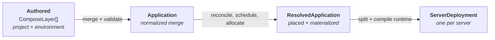

# TurboPanel is a Compose implementation

There is no TurboPanel manifest format. The thing you author is a **Docker Compose file**, and it is the same file whether you are running one container on one host or a spanning application across a fleet. Everything TurboPanel adds lives under a single reserved key — `x-turbopanel` — which the Compose Spec itself sets aside for exactly this purpose.

That is a contract, not a current implementation detail. It has three rules.

<Callout type="info" title="The three rules">
  1. **Compose says what the workload wants.**
  2. **`x-turbopanel` says only what Compose cannot express.**
  3. **The compiler decides how it runs.**
</Callout>

## Rule 1 — Compose says what the workload wants

Image, command, environment, ports, volumes, networks, `depends_on`, `healthcheck`, `deploy.replicas`, `deploy.resources`, `deploy.placement` — if the Compose Spec already has an expression for something, that is the expression TurboPanel reads. It is never re-asked under an extension key.

The practical consequence is portability in both directions. A compose file that runs under `docker compose up` on a laptop runs on TurboPanel. A compose file authored in TurboPanel is still a compose file: strip `x-turbopanel` and you have a document Docker understands, with no dangling references to a platform that is no longer there.

It also means TurboPanel is **not** allowed to quietly ignore a field. Every Compose key carries an explicit verdict — passthrough, interpreted, runtime-generated, or unsupported — and an unsupported one is *reported*, never silently dropped. A field that has no behavior here says so at deploy time instead of running a deployment that does something other than what the document said.

## Rule 2 — one extension namespace

`x-turbopanel` appears in exactly two places: at the document root, and on a service. Nothing else. There is no second namespace, no magic label prefix, no naming convention that secretly means something.

**At the root** it declares `principals` — the accounts services may run as, named by a document-local **alias**. An alias is deliberately all a document can say. What the account *is* on the host — its uid, gid, home directory, shell, keys, password — is a privilege decision recorded on a control-plane row and gated by an organization-manage permission. A line of YAML written by anyone with compose edit rights must not be able to decide it.

**On a service** it declares the handful of things Compose genuinely has no word for:

| Key | What it says |
| --- | --- |
| `serviceKind` | `container` (default), `site` (served by a host web engine), or `node` (a supervised host process built from Git) |
| `principal` | Which root-declared alias this service runs as |
| `hosting[]` | Hostnames, path prefixes, TLS and bind scope the edge should answer on |
| `source` | The Git repository, branch and build commands a release is built from |
| `php` | PHP version, extensions and pool directives for a `site` |
| `cron[]` | Scheduled jobs, rendered as systemd timers under the service's principal |

`hosting[]` is worth calling out because it is the one most often mistaken for something Compose has. It is **not** a `ports:` replacement. `ports:` publishes a host port; `hosting` declares a *name the edge routes by*, along with the certificate and the address family it should be answered on. Compose has no expression for that, which is precisely why it is here.

## Rule 3 — the compiler decides how

Which server a replica lands on, what a container is named, which Docker network it joins, which subnet address a spanning replica gets, which release tree a unit's working directory points at — those are compiler decisions. A document does not pin them, and a document that tries is refused rather than quietly honoured.

The standing example is **placement**. Compose has a `deploy.placement` block, and TurboPanel reads it as *constraints* — "this must land on a host labelled `ssd=true`". But *which server this environment runs on* is not a constraint, it is a pin, and it lives on the environment record where it can be changed without editing a document and re-deploying. Writing `x-turbopanel.placement` into stored compose is rejected on save, with a message that says where the pin actually lives.

### The canonical place for each concern

One row per question, one place its answer lives. A second source of truth for any of these is a bug.

| Concern | Canonical place |
| --- | --- |
| Image, command, ports, volumes, networks | Compose service body |
| Replica count and mode | `deploy.replicas` / `deploy.mode` |
| Placement constraints and spread | `deploy.placement.*` |
| Which server an environment runs on | The environment record — never compose |
| Resource ceiling | `deploy.resources`, clamped by the organization ∩ server limit |
| What kind of thing a service is | `x-turbopanel.serviceKind` |
| Which account a service runs as | `x-turbopanel.principal` (alias) → the principal record |
| Ingress hostnames, TLS, bind scope | `x-turbopanel.hosting[]` → hosting records |
| Git source | `x-turbopanel.source` |
| PHP version, extensions, pool | `x-turbopanel.php` |
| Scheduled jobs | `x-turbopanel.cron[]` |
| Spanning (TurboFabric) networks | `networks.<key>.driver: overlay` |
| Container naming scheme | Project settings |
| Variable and secret **values** | The variable store — compose carries refs, never values |

Two of those rows are the rule in action. **Spanning networks** could have been an `x-turbopanel` key; they are not, because Compose already has a word for "this network stretches across hosts" — `driver: overlay` — and inventing a second one would have meant a document whose networking said two different things. **Variable values** could have been inlined; they are not, because a secret in a document is a secret in every backup, diff and editor session that document passes through.

## The compiler: four models

A deploy is a compile. The document you authored is transformed in four named stages, and each stage is a type — not a convention, not a comment.

**Authored** is the set of layers as written: a project compose document, an optional environment overlay, and a platform layer. Each is independently valid Compose. They are merged left-to-right by the Compose Spec's own merge rules — sequences append with attribute-specific dedup, `command` and `entrypoint` fully replace, and the reserved `!reset` / `!override` tags let an author escape the default when they need to.

**Application** is that merged document read once into named parts: each service's kind, its `x-turbopanel` block, its interpreted `deploy:` policy, its hosting declarations and its principal alias; plus the root's aliases and the top-level networks, volumes, secrets and configs. It is a *read view* — it reaches no database and decides nothing. The same model can be built by the linter, by the visual editor and by a deploy, from the same bytes, with the same answer.

**ResolvedApplication** is the application after the control plane has answered what a document cannot: which service record each compose key became, which principal record each alias materialized into, where the scheduler placed every replica, which containers were allocated, and what the clamped resource ceiling is.

**ServerDeployment** is what one server is told to run — one compiled runtime `compose.yaml`, plus the material that never belongs in YAML: sealed variables, storage mounts, principal accounts, release sources, fabric networks.

<Callout type="warn" title="Daemons never see the authoring chain">
  A daemon is handed **one compiled document**, not the project / environment / platform layers it was merged from. It does not re-merge, does not re-interpret `deploy:`, and does not know what an alias is. Everything ambiguous was resolved before the payload was built — which is what makes a host's behavior a function of the payload alone.
</Callout>

## Why freeze it

The rules above are worth stating as a contract because each one closes a specific failure that platforms in this shape keep re-opening.

**A second namespace splits the document.** Once `x-turbopanel-scheduling` exists beside `x-turbopanel`, no single reader knows the whole document, validation forks, and the two drift. One namespace with an explicit per-key verdict is how a field either has behavior or says it does not.

**Re-asking a Compose question invents a second source of truth.** If replicas could be set in both `deploy.replicas` and an extension key, one of them is silently losing, and which one depends on merge order.

**Letting a document pin a compiler decision breaks the abstraction that makes fleets work.** A container name, an address, a placement — pinned in YAML, they are re-litigated on every deploy and cannot be changed without editing and redeploying every document that mentions them.

**Privilege in a document is privilege without a gate.** Aliases in compose, accounts on records, is the shape that keeps "who may edit YAML" and "who may create a Linux account with a shell" as two different questions.
