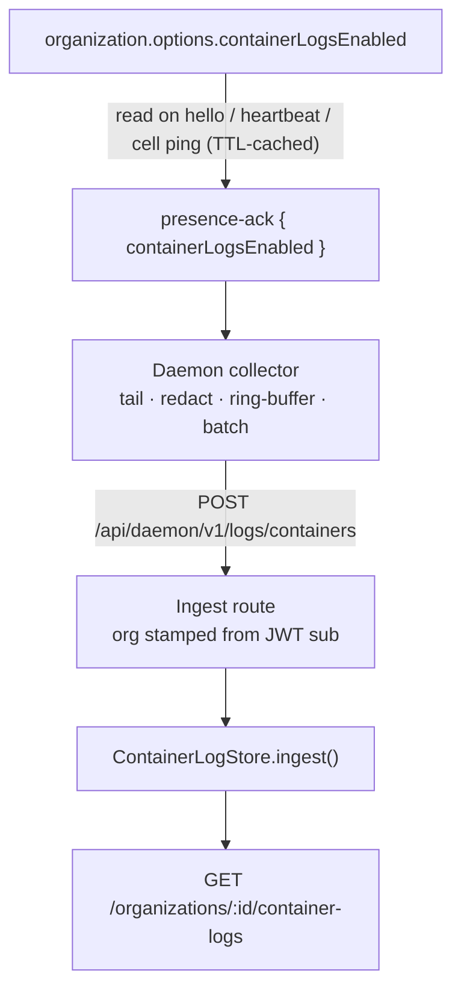

# Container logs

**Container logs** are the stdout/stderr a *running container* produces, stamped with the identity of where it came from: `organization → server → environment → service → container`. They are the opposite storage class from a [deployment log](/docs/architecture/deployment-logs), which is a transcript of one command fetched by its own id.

The distinction is not cosmetic. Container output is queried **across servers, services and time** — "everything my organization's `api` service logged in the last hour containing `ECONNREFUSED`". That is a scan with predicates over an unbounded row set, which is what a columnar store exists to answer and what a keyed-object layout cannot answer at all without reading every object.

<Callout type="info" title="Canonical source">
  Control-plane contract and both drivers:{' '}
  <File path="src/lib/container-logs/AGENTS.md" href="https://github.com/TurboPanel/turbopanel/blob/trunk/src/lib/container-logs/AGENTS.md">
    instance/src/lib/container-logs/AGENTS.md
  </File>
  . Daemon collector:{' '}
  <File path="src/logs/container-collector.ts" href="https://github.com/TurboPanel/turbopaneld/blob/trunk/src/logs/container-collector.ts">
    daemon/src/logs/container-collector.ts
  </File>
  . Storage classification: [Storage architecture](/docs/architecture/storage-architecture).
</Callout>

## Default-off, per organization

Unlike host metrics — always on, no gate — container logs are **opt-in**:

- The switch is `organization.options.containerLogsEnabled`, a single boolean, managed through `GET` / `PUT /api/client/v1/organizations/:id/container-logs-settings` (manage-gated). It is deliberately **not** a cascading default like host defaults: retention is billed and stored per tenant, so no lower layer could sensibly override it.
- The parser rejects truthy non-booleans rather than coercing them. `"yes"` must not switch on a billed feature.
- `resolveContainerLogStore({ enabled })` returns the **disabled store** whenever `enabled` is falsy, regardless of runtime and regardless of how complete the backend config is. The operator chooses to pay for the volume.
- A read against a disabled store answers **`503 container_logs_disabled`**, never an empty page: *"you never turned this on"* and *"your containers printed nothing"* must not look alike.

### The daemon learns the flag from presence, not a command



Every `hello` / `heartbeat` is answered with `presence-ack` carrying the flag, on both transports; the daemon starts or stops its collector when the value changes. A toggle must reach an **idle** daemon too, so the daemon sends a bare refresh heartbeat on a floor cadence, and the self-hosted transport additionally acks the once-a-minute cell ping. The projection read is TTL-cached so neither path becomes a query per frame.

A command type would have needed queueing, leasing, an outcome, and a retry story for **one boolean that is already re-sent on the next presence frame**. The ack costs one frame on a socket that is already open and converges by construction after a daemon restart, a control-plane restart, or a toggle applied while the daemon was offline. Any failure resolves to `false` — off is the safe direction for a billed, high-volume feature.

## Collection on the host

The collector tails each container with `docker container logs --follow --timestamps`, then:

- **Redacts** against the same process-wide deny-set as deployment logs (values this daemon actually decrypted — see [Deployment logs](/docs/architecture/deployment-logs)).
- **Ring-buffers with drop-oldest overflow.** Unlike deployment logs there is **no spool file**: container output is disposable, so a wedged uploader costs bounded memory instead of the host's disk.
- **Takes identity from deployment state, not container labels.** `docker ps` answers only "which container ids are alive"; environment and service ids come from the `deployment.json` this daemon wrote. A `com.turbopanel.*` label that drifted, was stripped, or was re-stamped outside the deployment pipeline can no longer misattribute a line.
- **Survives the outages it exists for.** A dropped WebSocket does not stop collection — batches are held while the transport is down and shipped on reconnect, and tails re-attach with `--since <cursor>` rather than `--tail 0`, including for a *recreated* container, which has a new id but inherits its environment's cursor.

### Ingest route

`POST /api/daemon/v1/logs/containers`, and like `/metrics` it must **never** touch the daemon cell.

| Rule | Why |
| ---- | --- |
| **Nothing identifying is read from the body.** `serverId` comes from the verified JWT `sub`; `organizationId` from that server's row. The daemon sends both for wire-shape parity and both are overwritten | A tenant boundary must not be assertable by the client |
| A server belonging to no organization gets `403` | There is no tenant to attribute output to |
| A malformed event **rejects the whole batch** (`400`) | Keeping the good half would hide a daemon bug |
| A store failure still answers `202` | Container output is disposable; a `5xx` would only make the daemon resend what nowhere can hold |
| Its **own** rate limiter, not the shared daemon REST bucket | Batched container output is far burstier than enroll/session/decrypt and must not be able to starve them |
| Body budget of 4 MB | Deliberately *not* max-batch × max-message, which would be a denial-of-service budget rather than a limit |

## API parity, not technology parity

The two runtimes share **one contract** — `ContainerLogStore.ingest()` and `ContainerLogStore.query()` — and nothing else. The backends are genuinely different technologies, chosen because each is what the runtime can actually operate well:

| | TurboPanel High Availability | Self-hosted |
| --- | --- | --- |
| Driver | `PipelinesIcebergContainerLogStore` | `ClickHouseContainerLogStore` |
| Write path | Workers Pipelines binding → Stream → Apache Iceberg table in R2 Data Catalog | One `JSONEachRow` insert per batch |
| Read path | R2 SQL HTTP query API | ClickHouse HTTP |
| Storage | Parquet data files in R2, described by Iceberg metadata | MergeTree table `container_logs` in the `turbopanel_metrics` database |
| Selected when | `enabled` **and** a `CONTAINER_LOGS` Pipelines binding **and** a complete R2 SQL config | `enabled` **and** a complete ClickHouse config |
| Retention | Snapshot expiry, 30 days | `TTL`, 30 days |

<Callout type="info" title="Parity is asserted, not assumed">
  A shared behavioural conformance suite runs against **both** drivers — empty-batch no-op, exactly
  one write request per batch, ingest→query round trip, organization scoping, limit clamping. Each
  driver's own tests then cover only what is genuinely backend-specific. If the two backends ever
  disagree about what the contract means, the shared suite is where it fails.
</Callout>

The one deliberate **divergence** is pagination. ClickHouse paginates on `timestamp` alone, so a page boundary landing inside a run of rows sharing one millisecond drops the remainder of that run — the fix would be a tie-break column, which costs every existing row. The Iceberg table is new, so it carries a `row_id` from the first write purely to make `(timestamp, row_id)` a **total order**; a keyset predicate on the pair skips and repeats nothing. This is documented rather than hidden, because a silently short page is worse than a known limitation.

## Predicates fix the physical layout

`ContainerLogQuery` is a **closed** predicate set: `organizationId` (required) plus optional `serverId`, `environmentId`, `serviceId`, `containerId`, `stream`, and `search`, over a required `[from, to)` window. That set is not merely an API surface — it *is* the storage plan, on both backends:

```sql
-- ClickHouse
ORDER BY (organization_id, server_id, service_id, timestamp)
PARTITION BY toYYYYMM(timestamp)
```

The same tuple is the **Iceberg column/partition plan**, followed by the remaining predicates as their own columns — `environment_id`, `container_id`, `stream`, `message`. **One column per predicate, never a JSON blob**, so the engine prunes data files instead of parsing rows, and the generated `WHERE` clauses are emitted in the same order for the same reason.

| Ordering decision | Reason |
| ----------------- | ------ |
| `organization_id` first | Required on every query; the most selective possible prefix |
| Time bucket as the partition | Every query carries `[from, to)`, so partition pruning always applies |
| `server_id`, then `service_id` | Most-selective-first among the optional predicates |
| `timestamp` **last** in the sort key | Makes a per-service tail a range read rather than a scan; moving time earlier would trade the common query for a rare one |
| `environment_id` **not** in the sort key | Derivable from the service in the common case; querying by environment alone is rare enough to accept a partition scan |

Because this tuple is the physical layout on both backends, **widening the predicate set later is a storage migration, not a type change.** That is exactly why it was fixed before either driver was written.

## Tenancy

`organizationId` is a required, non-optional field on every query, and the store scopes every read to it. The store has **no knowledge of authentication** and cannot enforce anything on a caller's behalf:

> The caller MUST pass the *authenticated* organization id. It must never forward an organization id read from a request body, query string, or header.

Ingest resolves the org from the daemon's authenticated server row — it does not accept one. The read route takes it from the authorized **path** parameter, and the query parser has no field for it, so a query string cannot widen a read past the authorized organization. Both paths are covered by tests that feed a hostile `organizationId` / `serverId` in the body and query string.

There is **no parameter binding** in the R2 SQL API — it takes one SQL string, exactly like the Analytics Engine SQL API. Every literal is therefore either validated against a strict shape (UUID, ISO timestamp, `stdout` / `stderr`, `namespace.table`) or escaped, and `organization_id` is injected by the store as the first predicate where a caller cannot omit, widen, or override it.

## Query budget — and the ceiling that does not exist

<Callout type="warn" title="R2 SQL offers no scanned-bytes cap">
  R2 SQL bills on **compressed bytes scanned**, with a per-query minimum, but its HTTP query API
  accepts exactly one field — the SQL string. There is no `max_bytes_scanned`, no cost cap, and no
  timeout knob, so nothing in TurboPanel can enforce a per-request byte budget against it, and we
  deliberately carry no config field that would pretend to. If Cloudflare ships one, it gets wired
  into the config and the request body in the same change. Billing constants and minima live in
  exactly one place — see [Cost dimensions](#cost-dimensions-turbopanel-high-availability) below.
</Callout>

What *is* enforced, before the request leaves the process, is a bound on the two axes TurboPanel controls:

| Axis | Bound |
| ---- | ----- |
| **Row count** | Clamped to **1,000** rows (well inside R2 SQL's own 1–10,000 `LIMIT` bound), and a `LIMIT` is always emitted |
| **Time window** | A `to - from` span wider than the configured maximum (default: the 30-day retention window) is a type error, not a very expensive scan |

Both are *proxies* for scan cost, not caps on it — actual bytes read still depend on data-file sizes and compaction state. The operational guardrail is therefore **compaction plus a narrow window**: keep R2 Data Catalog compaction on, and treat the timestamp filter as mandatory, which the SQL builder guarantees by requiring `[from, to)`.

## Cost dimensions (TurboPanel High Availability)

<Callout type="warn" title="Verified: 22 August 2026 — dimensions only, no rate constants">
  TurboPanel does **not** carry Cloudflare Pipelines, R2 Data Catalog, or R2 SQL rate constants in
  code or config, so none are reproduced here. The billing **dimensions** below are what the
  architecture is shaped around; for current rates see Cloudflare's{' '}
  <a href="https://developers.cloudflare.com/r2-sql/platform/pricing/">R2 SQL pricing</a> and{' '}
  <a href="https://developers.cloudflare.com/r2/pricing/">R2 pricing</a> pages. Cloudflare
  infrastructure cost is unrelated to TurboPanel product pricing (see{' '}
  <a href="https://turbopanel.io/pricing">turbopanel.io/pricing</a>). Analytics Engine constants live
  in exactly one place — [Server metrics](/docs/architecture/server-metrics).
</Callout>

| Dimension | Billed on | Architectural response |
| --------- | --------- | ---------------------- |
| R2 SQL queries | Compressed bytes scanned, with a per-query minimum | Mandatory time window, clamped row limit, predicate-ordered `WHERE`, partition pruning |
| R2 Data Catalog operations | Catalog operations, per million | One `send` per already-batched array — never per line |
| Compaction | Per GB **and** per object | Batching keeps data files large; many tiny files would multiply both |
| R2 storage | Stored bytes | 30-day snapshot expiry |

**Batching is the whole cost story.** `ingest()` takes an already-batched array and issues **exactly one** write; the daemon-side collector is what batches. The store never splits, re-batches, or sends per event, and an empty batch never touches the binding at all.

## Public beta, and graceful degradation

R2 Data Catalog and R2 SQL are both Cloudflare **public-beta** products, so this path always degrades rather than hard-failing a request:

- Config resolution returns `null` (→ disabled store) instead of throwing.
- Transport or envelope failures surface as an unavailable-store error, so the read route answers **`503 container_logs_unavailable`** rather than `500`.
- The response unwrap tolerates both the Cloudflare v4 envelope and a bare rows/data body — a beta envelope that shifts should not cost a redeploy.

The Stream, its sink, and the Data Catalog table are **not** auto-created; provision them before an environment's first deploy, the same manual-prerequisite convention as R2 buckets. Deliberately, **no Pipelines binding is committed for any environment**: a placeholder stream id would put this beta backend on the deploy critical path for every environment, including the ones with container logs switched off. Until a real stream exists the binding is simply absent and the resolver yields the disabled store — **the runtime resolver is the only activation gate.**

## Self-hosted ClickHouse notes

`container_logs` lives in the **same database as host metrics** (`turbopanel_metrics`) and is written by the same least-privilege application user, whose grant is already database-scoped — so the table needs **no new grant**. It is created at converge time by the ClickHouse bootstrap role, which carries the same DDL as the application's own idempotent `ensureSchema()`; a fresh install therefore has the table before any application traffic arrives. Both paths are idempotent, so whichever runs first wins and the other reconciles — **change the DDL in both places or not at all.**

The driver reuses the metrics ClickHouse HTTP client rather than forking a second one: there is one ClickHouse wire protocol in this codebase.
