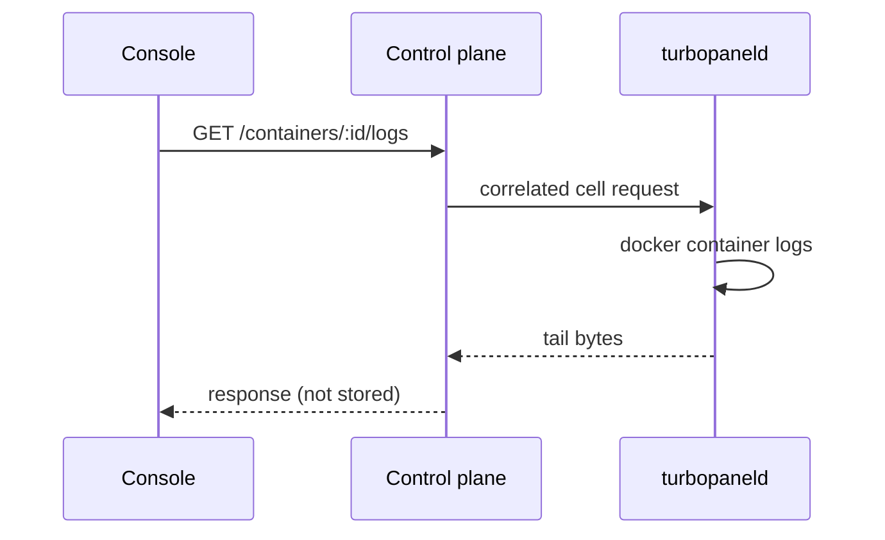

# Container logs are not retained

TurboPanel does **not** collect or store running-container stdout/stderr. There is no org-level retention switch, no ClickHouse or Iceberg table, no `CONTAINER_LOGS` ingest path, and no fleet-wide search. A line a container printed is gone from TurboPanel the moment you close the tail.

What you get instead is a **live tail**: the console calls `GET /api/client/v1/containers/:id/logs`, the instance correlates a cell request to that container's daemon, and the daemon runs `docker container logs` on the spot. Bytes travel that request and are discarded. Nothing is written to Postgres, R2, or ClickHouse.

<Callout type="info" title="The only log class TurboPanel stores">
  [Deployment logs](/docs/architecture/deployment-logs) — the stdout/stderr of one command, addressed by `commandId` — are retained for **90 days**. Container output is a different question and a different answer. Storage classes: [Storage architecture](/docs/architecture/storage-architecture).
</Callout>

## Live tail

The daemon does **not** follow containers in the background, does not batch output to an ingest route, and does not learn a `containerLogsEnabled` flag from `presence-ack`. Presence is liveness only. The same correlated cell pattern already used for managed-engine `compose logs` (`managed-logs-request`) is what answers a per-container tail.

## Ship logs off-host yourself

If you need history, search, alerts, or a copy that survives the container, **you** ship the logs. TurboPanel will not do it.

Typical operator-owned patterns:

- A Docker **logging driver** on the compose service (`json-file` with rotation is Docker's default; `syslog`, `fluentd`, `awslogs`, `gcplogs`, and similar drivers send elsewhere)
- A **host agent or sidecar** (Vector, Fluent Bit, Promtail, …) reading Docker's json-file, journald, or a bind-mounted log directory
- An **application logger** that already talks to your aggregator

Pin the destination, credentials, and retention on **your** sink. Those bytes never enter the control plane.

## Not a storage workload

Container output is not one of the four stored classes. Do not add a `container_logs` table, a Pipelines/Iceberg path, or an org `containerLogsEnabled` switch — classify a new store in [Storage architecture](/docs/architecture/storage-architecture) first, and it will not be this.
