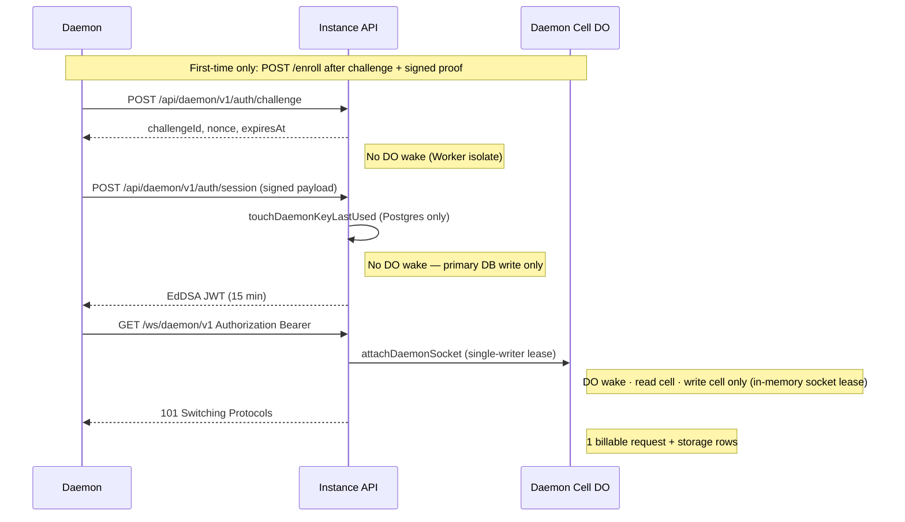
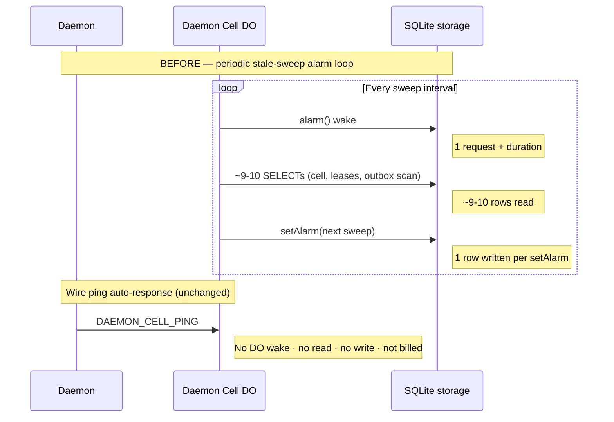
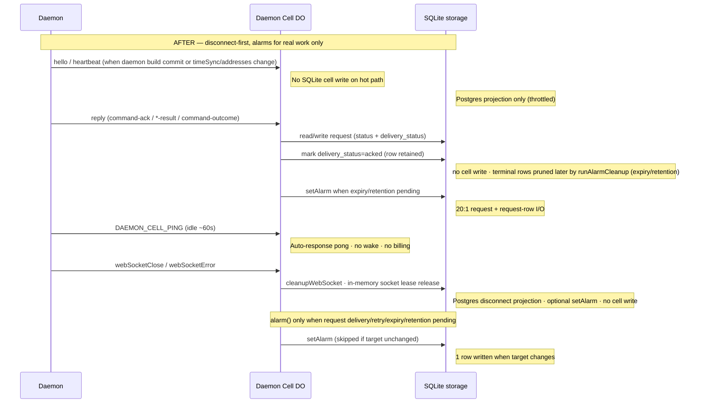
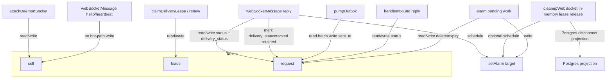
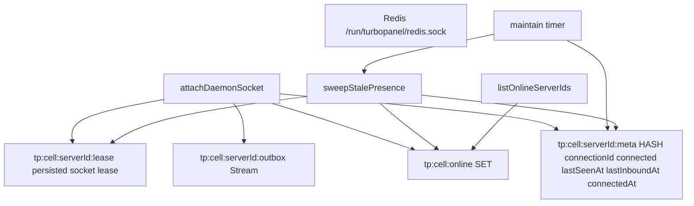
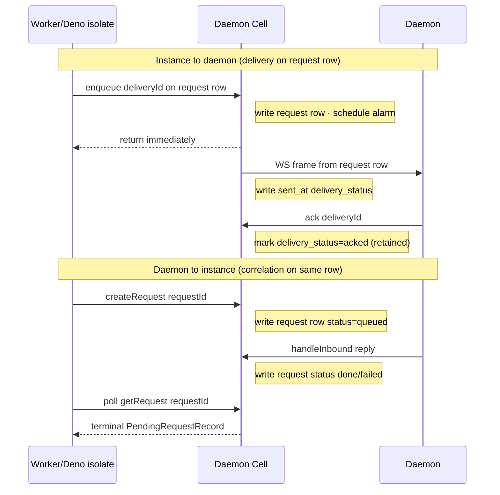
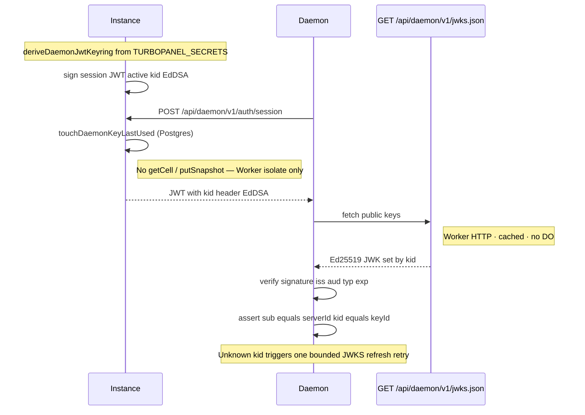
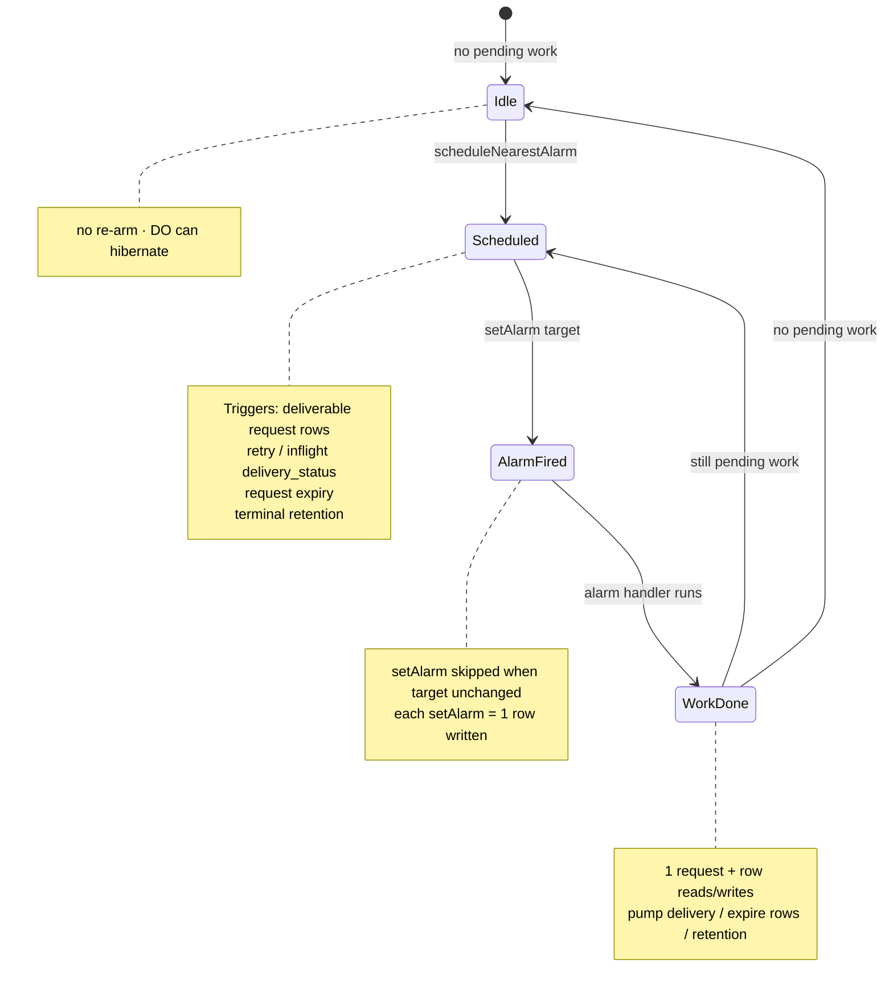

# Daemon cell architecture

The **daemon cell** is TurboPanel's low-latency coordination layer for remote daemons. Each cell is keyed by `serverId` and owns **presence**, **outbox delivery**, and **pending-request correlation** only. Postgres remains canonical for business data (`server` rows, commands, org membership).

<Callout type="info" title="Canonical source">
  This page mirrors shipped behavior documented in the instance repo. For agent maintenance and
  anti-regression rules, see <File path="AGENTS.md" href="https://github.com/TurboPanel/turbopanel/blob/trunk/AGENTS.md">instance/AGENTS.md</File> (Daemon Cell section).
</Callout>

## Overview and parity

| Runtime | Backend | Storage |
| ------- | ------- | ------- |
| Cloudflare Workers | <File path="src/daemon/cell/do.ts" href="https://github.com/TurboPanel/turbopanel/blob/trunk/src/daemon/cell/do.ts">DaemonCellObject</File> | SQLite-backed Durable Object per server, named by `serverId` via `getByName(serverId)` |
| Self-hosted Deno | <File path="src/daemon/cell/redis/" href="https://github.com/TurboPanel/turbopanel/tree/trunk/src/daemon/cell/redis">RedisDaemonCell</File> | Redis Streams + HASH + SET at `tp:cell:{serverId}:*` on Unix socket `/run/turbopanel/redis.sock` |

**Behavioral parity:** Cloudflare Workers (Durable Object) mode and self-hosted Deno/Redis mode must keep the same user-facing API and status semantics. DO and Redis are implementation details only — operators see identical `/api/daemon/v1/*` and `/ws/daemon/v1` behavior on both runtimes.

UI/API status reads (`GET /api/client/v1/servers`, batch status, per-server status) are **Postgres-only** — no read-time cell fan-out. `GET /api/client/v1/servers/:id/cell` is admin/debug-only and reads live cell snapshots.

**Reduced status columns:** the `server` row's liveness projection is just two columns — `connected` (boolean) and `status_changed_at` (the last online/offline transition, in either direction). There is no `daemon_status`, `last_seen_at`, `connected_at`, or `disconnected_at` column. `connectedAt` is derived (`status_changed_at` while `connected` is true, otherwise `null`), and the tri-state `online` / `offline` / `unknown` label surfaced to clients is computed from those two columns at read time, not stored. A separate, history-only **connection-status event stream** records every transition into the same metrics backend as host samples for uptime/downtime reporting — see [Server metrics](/docs/architecture/server-metrics) — and is never consulted to answer "is this server online right now."

## Durable Object billing model (SQLite-backed)

TurboPanel daemon cells use **SQLite-backed** Durable Objects. Do not apply legacy KV-backed Durable Object storage pricing.

<Callout type="warn" title="No legacy KV-backed DO pricing">
  TurboPanel cells bill against Cloudflare's **SQLite-backed DO** model (rows read/written, SQL stored
  data, compute requests/duration). Legacy KV-style DO pricing tables do not apply.
</Callout>

### Compute (Workers Paid)

- **Requests:** 1M/mo included, then **$0.15/M**. Billing includes HTTP requests, RPC sessions, WebSocket messages, and alarm invocations.
- **WebSocket connection establishment** counts as **1 request**.
- **Incoming** WebSocket messages are billed **20:1** (100 incoming = 5 billable requests). Outgoing WebSocket messages and protocol pings are **not** charged.
- **Duration:** 400,000 GB-s/mo included, then **$12.50/M GB-s**, billed at **128 MB/DO**.
- A DO incurs duration while executing JS or while idle-but-not-hibernatable.
- Standard `accept()` WebSockets bill for the **full connection lifetime** — use the **Hibernation API** (`ctx.acceptWebSocket()`).
- `setWebSocketAutoResponse()` auto-responses add **no wall-clock time**.

### Compute (Workers Free)

- 100,000 requests/day
- 13,000 GB-s/day

### SQLite storage (Workers Paid)

- **Rows read:** first 25B/mo, then **$0.001/M**
- **Rows written:** first 50M/mo, then **$1.00/M**
- **SQL stored data:** 5 GB-month included, then **$0.20/GB-month**
- KV-style `get()` / `put()` / `delete()` / `list()` are hidden SQLite tables billed as rows read/written
- **Each `setAlarm()` = 1 row written**
- **Deletes count as rows written**
- Stored data is billable until removed

### SQLite storage (Workers Free)

- 5M rows read/day
- 100,000 rows written/day
- 5 GB total

<Callout type="info" title="Infrastructure vs customer pricing">
  The figures above describe **Cloudflare infrastructure costs** for Workers-hosted cells. They are
  unrelated to TurboPanel's customer-facing pricing (see{' '}
  <a href="https://turbopanel.io/pricing">turbopanel.io/pricing</a>). Self-hosted control planes use
  the Redis cell backend and incur no Durable Object billing.
</Callout>

## Daemon cell lifecycle

<Steps>
  <Step>
    **Constructor** — registers `setWebSocketAutoResponse(DAEMON_CELL_PING → DAEMON_CELL_PONG)`, then
    synchronously calls `#initializeFromStorage()` from the constructor body.
  </Step>
  <Step>
    **`#initializeFromStorage()`** — restores `serverId`, `remoteAddress`, and `connectedAt` from
    hibernation WebSocket attachments (`getWebSockets()` / `deserializeAttachment`) only. Sets
    in-memory `#runtimeConnected` when a live attachment exists. Does **not** call `#ensureSchema()`
    or `SELECT` from `cell`. Daemon build identity comes from Postgres/in-memory, not the cell row.
  </Step>
  <Step>
    **`#ensureSchema()` (lazy)** — runs only on storage-touching paths: WS upgrade, storage RPCs,
    `webSocketMessage`, close/error cleanup, and `alarm`. Cold wakes that only handle liveness or
    diagnostics pay zero SQLite schema/version reads.
  </Step>
  <Step>
    **Attach** — JWT-verified WS upgrade calls `attachDaemonSocket`, which acquires the
    **single-writer lease** keyed by `connectionId`.
  </Step>
  <Step>
    **Outbox delivery** — deliverable frames are pumped via `#pumpOutboxToDaemonSockets`, scheduled by
    `#scheduleNearestAlarm` (not a perpetual in-DO loop).
  </Step>
  <Step>
    **Detach** — `webSocketClose` / `webSocketError` → `#cleanupWebSocket` releases the lease and marks
    offline when appropriate.
  </Step>
</Steps>

One stable DO id per server: always `getByName(serverId)` — never `newUniqueId()` / `idFromName()` per attach.

## WebSocket handshake

Remote daemons authenticate over REST before upgrading to `/ws/daemon/v1`. First-time nodes enroll; returning nodes reuse persisted keys.

<Steps>
  <Step>
    **Enrollment (first time)** — `POST /api/daemon/v1/auth/challenge` → sign enrollment payload →
    `POST /api/daemon/v1/enroll` with license + public JWK. Instance stores daemon public key on the
    `server` row.
  </Step>
  <Step>
    **Session issuance** — `POST /api/daemon/v1/auth/challenge` with `{ serverId, keyId }` → sign auth
    payload → `POST /api/daemon/v1/auth/session` returns a **15-minute stateless EdDSA JWT**.
  </Step>
  <Step>
    **WebSocket upgrade** — `GET /ws/daemon/v1` with `Authorization: Bearer &lt;token&gt;` → **101**
    Switching Protocols. Attach acquires the single-writer lease.
  </Step>
</Steps>

## WebSocket hibernation

Cost-safe Workers cells **must hibernate** when idle. Enforced rules:

- **`ctx.acceptWebSocket()`** — never standard `server.accept()` (hibernation API only).
- **No timers inside the DO** — never `setInterval`, `setTimeout`, or `scheduler.wait`. Schedule work with `ctx.storage.setAlarm()` only for genuine pending work.
- **Finish RPCs quickly** — no polling loops, long `await`s, or unresolved promises inside DO handlers.
- **Close DB connections** — always close Hyperdrive/postgres.js connections in a `finally` block; an open DB socket prevents hibernation.
- **Auto-response liveness** — `setWebSocketAutoResponse(DAEMON_CELL_PING → DAEMON_CELL_PONG)` answers wire pings **without waking the DO** (no request, no duration, no storage).

## Heartbeat and alarm behavior

### Presence model

- **`hello`** — sent once on connect with daemon build identity. On Workers, steady-state `hello` performs **no SQLite `cell` write** on the hot path — Postgres projection handles identity separately.
- **Wire cell ping** — after ~60 s of inbound silence, daemon sends `{"type":"ping"}` (`DAEMON_CELL_PING`). On Workers the DO auto-responds with pong **without waking** — this is the primary idle liveness signal.
- **App-level `heartbeat`** — sent when the daemon build commit changed since the last hello/heartbeat, **or** when `timeSync`/`addresses` differ from the last-sent snapshot (change-detected), not on every idle tick. On Workers, steady-state heartbeats also perform **no SQLite `cell` write** on the hot path.

### Storage coalescing

- Steady-state presence is **wire ping only** for liveness; auto-response timestamps (`getWebSocketAutoResponseTimestamp`) feed the offline-sweep cron. Ticks are serialized by a durable Postgres `setting` lease (`OFFLINE_SWEEP_LOCK`; `expiresAt` is `max(TTL, tick deadline + DB timeout)` so a live holder cannot be stolen mid-invocation) and bounded by a per-tick **hard** wall-clock deadline wrapping every awaited phase.
- `webSocketMessage` for `hello` / `heartbeat` does **not** write SQLite `cell` rows on the hot path on Workers.
- Postgres projection opens only for a genuine connect/disconnect transition, a daemon build-identity change, or new `timeSync`/`addresses` presence facts — never on elapsed time alone. There is no periodic "touch a timestamp every N seconds" write path; a heartbeat that carries none of those signals writes nothing.

### Before: recurring stale-sweep amplification

The legacy pattern re-armed a periodic stale-sweep alarm, waking the DO even when idle:

### After: hibernation / disconnect-first

Workers offline detection is **disconnect-first** — there is **no periodic stale-sweep alarm**. `#collectStaleDemotions` (`DAEMON_OFFLINE_SWEEP_MS`) runs only as an opportunistic backstop when `alarm()` already fired for real work.

## Disconnect cleanup

On Workers:

1. **`webSocketClose` / `webSocketError`** → `#cleanupWebSocket` marks offline and releases the socket lease **in-memory** (no lease-row delete, no `last_seen_at` write — column gone) on clean disconnect. Postgres demotion still runs via `#projectDisconnected`.
2. **No periodic stale-sweep alarm** — silent half-open sockets self-heal on reconnect (lease force-detach) or command dispatch (outbox requeue → consumer timeout).
3. **`#collectStaleDemotions`** — opportunistic backstop only when `alarm()` already fired for deliverable/retry/inflight request rows, expiry, or terminal retention work.
4. **AE-driven offline-sweep cron** (`"* * * * *"`) — each tick runs **one fleet-wide Analytics Engine SQL read** (`queryRecentlyActiveServerIds`, 180 s window). Connected servers present in the recent-host-sample set are provably alive and **skip** `checkLiveness` DO wakes; only **AE suspects** (absent from the set) are probed. Recently-offline self-heal can apply AE-direct heal without a wake. When AE config is missing or the query fails, the sweep falls back to check-all so offline detection is never lost. Ticks are serialized by a durable Postgres `setting` lease (`expiresAt` covers the enforced live runtime so a slow phase cannot be stolen by the next cron) and bounded by a per-tick **hard** wall-clock deadline: timed-out phases log and skip later work rather than overlapping the next invocation.

**WebSocket watchdog / max-age:** the absolute connection max-age cap (`MAX_WS_CONNECTION_AGE_MS` = 2 h) is now enforced **daemon-side** (self-recycle via `MAX_CONNECTION_AGE_MS` in IdlePresence). Instance half-open reaping (`#reapUnhealthySockets` / `evaluateSocketHealth`) runs only on AE-flagged suspects still visited by `checkLiveness`; the instance-side max-age check remains only as that suspect-path backstop.

On Redis (self-hosted), timer-driven `maintain()` + `sweepStalePresence` remain the offline path — cost-safe because there is no DO billing.

## Durable Object storage schema

SQLite tables in `DaemonCellObject` (`#ensureSchema`). `CELL_SCHEMA_VERSION` = **2** — on upgrade, `#ensureSchema` drops the legacy `cell`/`leases`/`outbox`/`requests` tables and recreates the singular set (safe because all cell state is ephemeral/rebuildable).

| Table | Columns |
| ----- | ------- |
| `cell` | `server_id` (PK), `remote_address` (sole `__direct__` co-located marker), `key_last_used_at` (written on attach), `updated_at` |
| `lease` | `lease_name` (PK), `holder`, `expires_at` — **delivery lease only** |
| `request` | `seq` (PK AUTOINCREMENT), `request_id` (UNIQUE), `delivery_id` (UNIQUE), `request_kind`, `command_text`, `payload_json`, `status` (correlation), `delivery_status` (delivery), `result_json`, `error`, `created_at`, `updated_at`, `expires_at`, `sent_at`, `ack_at`, `finished_at`, `daemon_received_at`, `daemon_responded_at`, `retry_count`, `retry_at` |

The singular `request` table carries two distinct status columns: `status` = correlation lifecycle (`queued→sent→acked→done/failed/expired`); `delivery_status` = delivery lifecycle (`queued`/`inflight`/`sent`/`acked`/`dead`). **Retain-on-ack-then-prune:** `ackOutbox` marks `delivery_status='acked'` and keeps the row for reply correlation; `#runAlarmCleanup` prunes by `expires_at`/`TERMINAL_UPDATE_RETENTION_MS`.

### Removed fields → new home

| Removed from cell storage | New home |
| ------------------------- | -------- |
| `session_id` | Not persisted — JWT is stateless (`jti` only) |
| `key_id` | JWT `kid` / JWKS path; passed via attach meta to Postgres projection |
| `hostname`, `machine_key` | Dedicated Postgres `server.hostname` / `server.machine_key` columns (via `touchServerMetadata` / projection) — `machineKey` is a derived, non-reversible HMAC of the host machine-id, not the raw value |
| `connection_id` | In-memory + WS attachment (`serializeAttachment`) |
| `connected` (persisted int) | In-memory `#runtimeConnected` + `getWebSockets()` |
| `connected_at`, `last_seen_at`, `daemon_build_json` | Postgres projection: `connected` + `status_changed_at` columns (`connectedAt` is derived, not stored) plus `server.daemon.projection` for daemonBuild; admin/debug cell snapshot sources `connectedAt`/`lastInboundAt`/`lastSeenAt`/`daemonBuild`/`connected` from Postgres, `keyLastUsedAt`/`remoteAddress` from the `cell` row |
| persisted `daemon-socket` lease row | In-memory + WS attachment on Workers (`getWebSockets()` + `serializeAttachment` carrying `connectionId`/`connectedAtMs`); **Redis retains the persisted lease + presence meta for the Lua sweep** (documented asymmetry) |

Co-located daemons are stored with `remote_address = '__direct__'` so colocated routing and tunnel assignment still work. Co-located detection reads the Postgres projection (`src/client/servers/colocated.ts`); the projection's `remoteAddress`/`__direct__` marker flows from attach meta into Postgres rather than from the cell-row snapshot.

## Redis parity (self-hosted)

Self-hosted Deno uses `RedisDaemonCell` at `tp:cell:{serverId}:*` (Streams + HASH + SET) on Unix socket `/run/turbopanel/redis.sock`.

Redis **intentionally retains its persisted socket lease + presence meta** (`connected`, `connectionId`, `lastInboundAt`, `lastSeenAt`, `connectedAt`) in the meta HASH **because Redis has no per-connection isolate memory** — the Lua sweep and orphan reclaim need persisted connection state. The online set powers `listOnlineServerIds()`. Delivery still uses the outbox Stream + PEL (no `delivery_status` column); the correlation record is retained until terminal+retention to match the DO merged lifecycle. No key renames (`eventsKey` removed).

Offline detection uses timer-driven `maintain()` + `sweepStalePresence` (`DAEMON_CELL_MAINTAIN_MS`, demote at `DAEMON_OFFLINE_SWEEP_MS`) — cost-safe with no DO billing. Liveness and slower cleanup (command-dispatch, webhook, execution-log, system-reconcile) use **separate** in-flight flags so a hung cleanup phase cannot suppress the next stale-presence tick; each lane still refuses to overlap itself.

## Merged request table (delivery + correlation)

One `request` row per `requestId` carries both delivery and correlation concerns:

| Concern | Fields | Key | Lifecycle |
| ------- | ------ | --- | --------- |
| **Delivery** | `seq`, `delivery_id`, `delivery_status`, `retry_count`/`retry_at`, `payload_json` | `deliveryId` | Retryable via `retry_count`/`retry_at`; ack marks `delivery_status='acked'` **in place** (row retained for reply correlation); pruned at terminal+`TERMINAL_UPDATE_RETENTION_MS` by `#runAlarmCleanup` |
| **Correlation** | `status`, `result_json`, `error`, timestamps | `requestId` | `PendingRequestRecord`: queued → sent → acked → done/failed/expired |

Daemon replies (`handleInbound`) mutate the **correlation status** on the same row. The WS send is ephemeral in-memory delivery. Redis keeps delivery on the outbox Stream + PEL but retains the correlation record until terminal+retention for behavioral parity.

**Enqueue-then-poll contract:** correlated outbound work (dev-sync, tunnel-token, public-urls apply, command dispatch) uses `createRequestAndWait` / `waitForRequest`. The backend **enqueues once and returns immediately** — it must not block inside the DO or Redis cell. The caller-side adapter polls `getRequest(requestId)` until terminal or deadline.

## Leases

Two lease types:

1. **Daemon-socket single-writer lease** — **in-memory on Workers** (`getWebSockets()` + `serializeAttachment` carrying `connectionId`/`connectedAtMs`); no persisted row. `attachDaemonSocket` still returns `{ connectionId, lease }` with the lease constructed in memory (`DAEMON_SOCKET_LEASE_MS`). `DaemonCellLease = { holder, expiresAt }` (no duplicate `token`). Ensures one live cell attachment per server.
2. **Delivery lease** — the only persisted lease in the singular `lease` table (`DELIVERY_LEASE_NAME`, `claimDeliveryLease` / `renewDeliveryLease` / `releaseDeliveryLease`). Owns in-flight delivery on the merged `request` row.

**Redis asymmetry:** Redis persists `leaseKey` + `connectionId`/`connected` in the meta HASH because it has no per-connection isolate memory.

Safety-critical single-daemon guarantee on managed hosts combines the cell lease with `IdlePresence` and `ensure-single-daemon.sh` flock on `/run/turbopanel/daemon.lock` (see [daemon AGENTS.md](https://github.com/TurboPanel/turbopaneld/blob/trunk/AGENTS.md)).

## JWT / JWKS auth flow

Daemon JWTs are **EdDSA (Ed25519)**, 15-minute lifetime.

**Header:** `{ alg: "EdDSA", typ: "JWT", kid }` where `kid` is the SHA-256 fingerprint of the public JWK.

**Claims:** `sub` (serverId), `kid`, `jti` (logging only), `iss`, `aud`, `typ`, `iat`, `exp`. No `sid`.

**Keyring:** `deriveDaemonJwtKeyring()` (HKDF salt `turbopanel`, info `daemon-jwt-eddsa`) derives keys deterministically from root secrets. With `TURBOPANEL_SECRETS`, **first key signs / all keys verify** (highest version signs).

**JWKS:** `GET /api/daemon/v1/jwks.json` publishes **public** Ed25519 verification keys only (`Cache-Control: public, max-age=300`).

**Daemon verification:** `DaemonJwksClient` caches JWKS (~1 h TTL, ≥60 s min refresh interval, single-flight refresh, refresh-on-unknown-kid with one bounded retry). `DaemonTokenManager` verifies each fresh session token by `kid`; trust JWT `sub` / `kid` over socket-pushed IDs.

**Rotation:** add a higher-version key, deploy, old tokens verify during their ≤15-min window, then drop the old key from the keyring/JWKS.

<Callout type="warn" title="JWKS never exposes secrets">
  JWKS publishes public Ed25519 verification material only — never
  `TURBOPANEL_SECRETS` or HMAC key material.
</Callout>

## Debug storage-op counters

Setting `TURBOPANEL_DAEMON_DEBUG=1` (via `isDaemonDebugEnabled()`) surfaces per-call-site counters on `CellDiagnostics`:

- `storageReads` / `storageWrites` / `storageByCallSite`
- Exposed via `getDiagnostics()` / `GET /rpc/diagnostics`
- DO: incremented by `#sql(callSite,…)` / `#setAlarm` / `#deleteAlarm` wrappers (thin pass-through when debug is off)
- Redis: equivalent counters via `#bumpMethodRoute` / `#bumpDiag`

Greppable trace lines use the `daemon-cell` component tag in instance logs. The dev console **Cell trace** viewer tails these lines — see [dev AGENTS.md](https://github.com/TurboPanel/dev/blob/trunk/AGENTS.md).

## Billing audit checklist

Use this table when reviewing cell changes for Cloudflare cost impact:

| Operation | Wakes DO | Reads storage | Writes storage | Billing impact |
| --------- | -------- | ------------- | -------------- | -------------- |
| WS connection establishment (upgrade) | Yes | `cell` | `cell` row only (in-memory socket lease, no lease row) | 1 request + rows |
| `POST /auth/session` (JWT issuance) | No | — | Postgres `server.daemon.key.lastUsedAt` only | primary DB write |
| `POST /api/daemon/v1/metrics` (host metrics ingest) | No | — | AE / DuckDB only | normal Worker/Deno request; **no DO duration** |
| Incoming WS message (`hello` / `heartbeat`, steady state) | Yes | none on hot path | none on hot path | 20:1 request when handled; no cell SQLite write |
| Incoming WS reply (`command-ack`, `*-result`, `command-outcome`) | Yes | `request` | `request` status + `delivery_status` update; marks `delivery_status='acked'` (row retained); no `cell` write; prune deferred to alarm cleanup; may call `setAlarm()` | 20:1 request + request-row I/O |
| Wire ping `DAEMON_CELL_PING` (auto-response) | No | No | No | Not charged (outgoing pong + protocol) |
| Alarm invocation (real pending work only) | Yes | `request` | deletes / `setAlarm` | 1 request + rows |
| `setAlarm()` (skipped when unchanged) | — | — | 1 row when target changes | 1 row written |
| WS close / error → cleanup | Yes | none required | in-memory socket lease release; Postgres disconnect projection; may call `setAlarm()` (no `cell` write) | request + optional alarm row |
| JWKS fetch (`/jwks.json`) | No (normal Worker) | — | — | cached HTTP request |
| Offline-sweep `checkLiveness` (AE suspects only) | Yes (suspects) | auto-response timestamp only | none | 1 subrequest per suspect; AE-active servers skip entirely |

**Host metrics no longer traverse the Durable Object** — they use `POST /api/daemon/v1/metrics` on the normal Worker isolate / Deno process — so idle connected servers incur no DO duration for metrics. AE pricing constants live in [Server metrics](/docs/architecture/server-metrics), not here.

**Auth/session:** after JWT verification, `POST /api/daemon/v1/auth/session` updates
`server.daemon.key.lastUsedAt` through the primary Postgres connection via
`touchDaemonKeyLastUsed()` — it does **not** call `registry.getCell(serverId).putSnapshot()`
and does not wake the Durable Object.

**Inbound reply path:** non-presence WS messages skip `#handlePresenceMessage` and run
`#recordInbound` (in-memory only — no `cell` write) plus `#handleInbound`, which reads `request`,
updates terminal or in-flight correlation `status` and `delivery_status` (acked/retained), and may schedule alarms for
retention/expiry via `#runAlarmCleanup` — do not bucket these with lightweight heartbeats.

### Alarm lifecycle

## Related

- [Control plane deployment](/docs/deployment/control-plane) — Workers vs self-hosted layout
- [Instance API architecture](/docs/architecture/api) — versioned surfaces and routing
- [Daemon setup](/docs/deployment/daemon-setup) — node installer and co-located daemon
