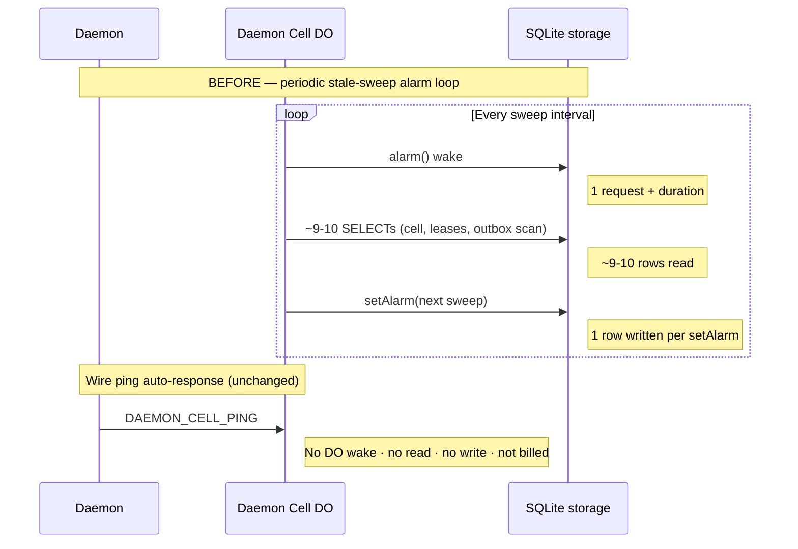
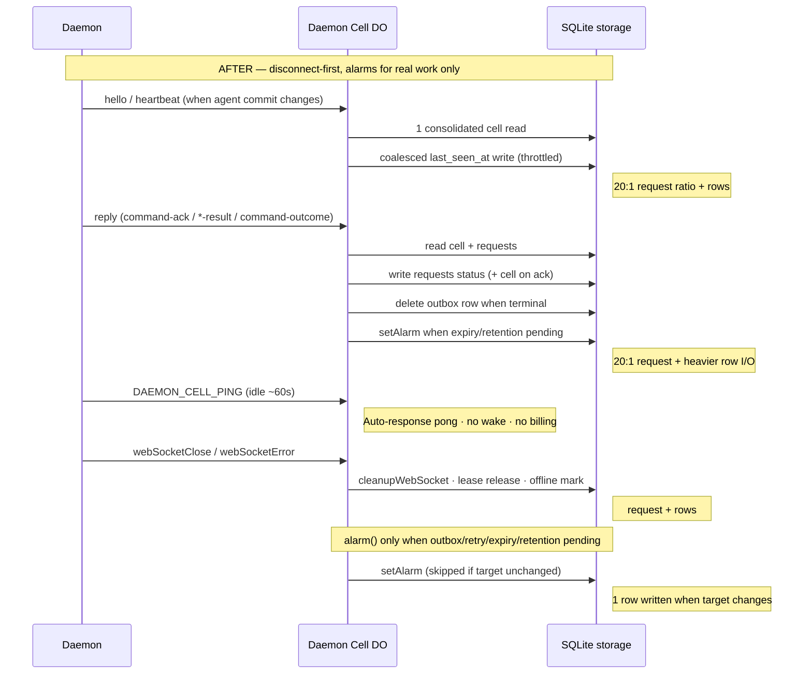
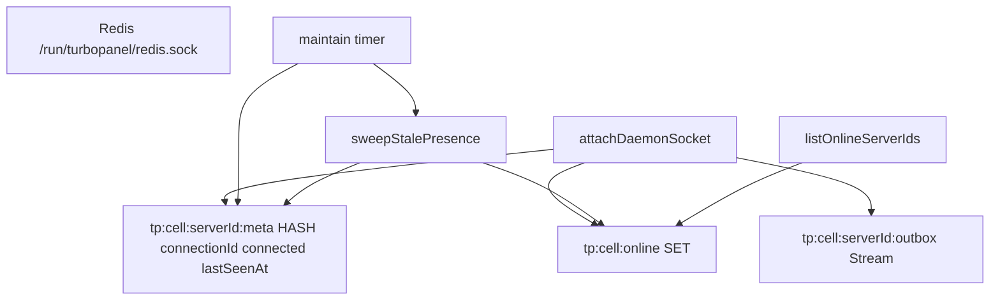
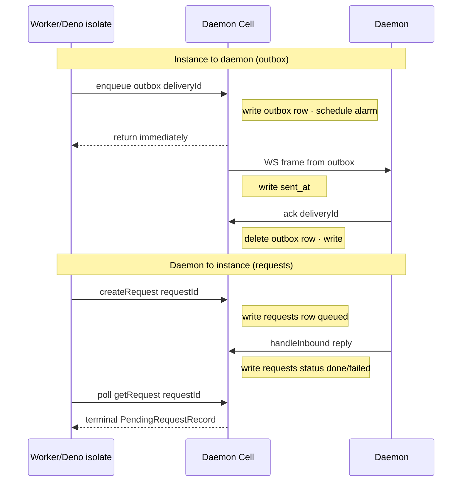
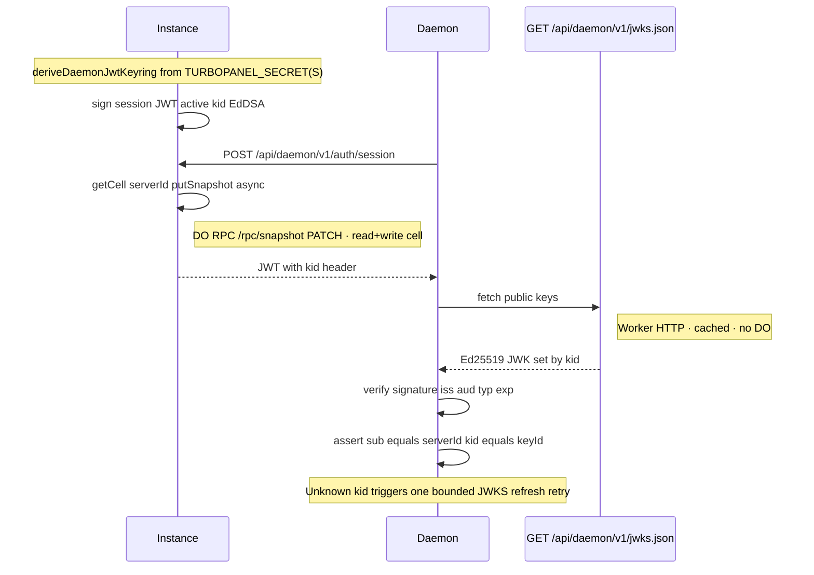
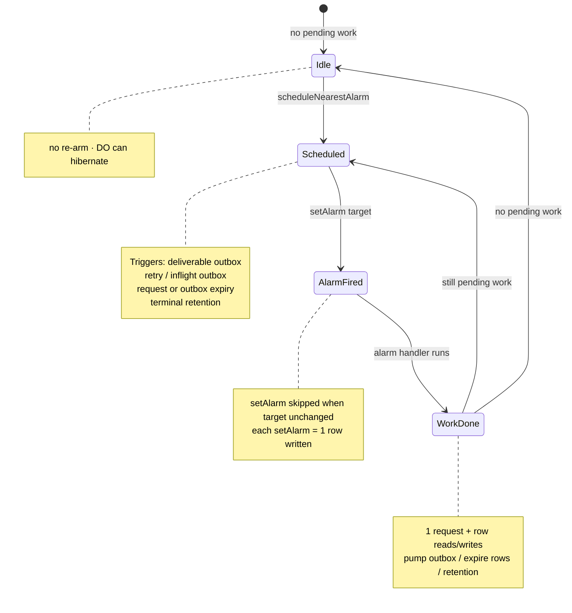

# Daemon cell architecture

The **daemon cell** is TurboPanel's low-latency coordination layer for remote daemons. Each cell is keyed by `serverId` and owns **presence**, **outbox delivery**, and **pending-request correlation** only. Postgres remains canonical for business data (`server` rows, commands, org membership).

<Callout type="info" title="Canonical source">
  This page mirrors shipped behavior documented in the instance repo. For agent maintenance and
  anti-regression rules, see{' '}
  <File path="AGENTS.md" href="https://github.com/turbopanel/turbopanel/blob/trunk/AGENTS.md">
    instance/AGENTS.md
  </File>{' '}
  (Daemon Cell section).
</Callout>

## Overview and parity

| Runtime | Backend | Storage |
| ------- | ------- | ------- |
| Cloudflare Workers | <File path="src/daemon/cell/do.ts" href="https://github.com/turbopanel/turbopanel/blob/trunk/src/daemon/cell/do.ts">DaemonCellObject</File> | SQLite-backed Durable Object per server, named by `serverId` via `getByName(serverId)` |
| Self-hosted Deno | <File path="src/daemon/cell/redis/" href="https://github.com/turbopanel/turbopanel/tree/trunk/src/daemon/cell/redis">RedisDaemonCell</File> | Redis Streams + HASH + SET at `tp:cell:{serverId}:*` on Unix socket `/run/turbopanel/redis.sock` |

**Behavioral parity:** Cloudflare Workers (Durable Object) mode and self-hosted Deno/Redis mode must keep the same user-facing API and status semantics. DO and Redis are implementation details only — operators see identical `/api/daemon/v1/*` and `/ws/daemon/v1` behavior on both runtimes.

UI/API status reads (`GET /api/client/v1/servers`, batch status, per-server status) are **Postgres-only** — no read-time cell fan-out. `GET /api/client/v1/servers/:id/cell` is admin/debug-only and reads live cell snapshots.

## Durable Object billing model (SQLite-backed)

TurboPanel daemon cells use **SQLite-backed** Durable Objects. Do not apply legacy KV-backed Durable Object storage pricing.

<Callout type="warn" title="No legacy KV-backed DO pricing">
  TurboPanel cells bill against Cloudflare's **SQLite-backed DO** model (rows read/written, SQL stored
  data, compute requests/duration). Legacy KV-style DO pricing tables do not apply.
</Callout>

### Compute (Workers Paid)

- **Requests:** 1M/mo included, then **$0.15/M**. Billing includes HTTP requests, RPC sessions, WebSocket messages, and alarm invocations.
- **WebSocket connection establishment** counts as **1 request**.
- **Incoming** WebSocket messages are billed **20:1** (100 incoming = 5 billable requests). Outgoing WebSocket messages and protocol pings are **not** charged.
- **Duration:** 400,000 GB-s/mo included, then **$12.50/M GB-s**, billed at **128 MB/DO**.
- A DO incurs duration while executing JS or while idle-but-not-hibernatable.
- Standard `accept()` WebSockets bill for the **full connection lifetime** — use the **Hibernation API** (`ctx.acceptWebSocket()`).
- `setWebSocketAutoResponse()` auto-responses add **no wall-clock time**.

### Compute (Workers Free)

- 100,000 requests/day
- 13,000 GB-s/day

### SQLite storage (Workers Paid)

- **Rows read:** first 25B/mo, then **$0.001/M**
- **Rows written:** first 50M/mo, then **$1.00/M**
- **SQL stored data:** 5 GB-month included, then **$0.20/GB-month**
- KV-style `get()` / `put()` / `delete()` / `list()` are hidden SQLite tables billed as rows read/written
- **Each `setAlarm()` = 1 row written**
- **Deletes count as rows written**
- Stored data is billable until removed

### SQLite storage (Workers Free)

- 5M rows read/day
- 100,000 rows written/day
- 5 GB total

<Callout type="info" title="Infrastructure vs customer pricing">
  The figures above describe **Cloudflare infrastructure costs** for Workers-hosted cells. They are
  unrelated to TurboPanel's customer-facing pricing (see{' '}
  <a href="https://turbopanel.io/pricing">turbopanel.io/pricing</a>). Self-hosted control planes use
  the Redis cell backend and incur no Durable Object billing.
</Callout>

## Daemon cell lifecycle

<Steps>
  <Step>
    **Constructor** — registers `setWebSocketAutoResponse(DAEMON_CELL_PING → DAEMON_CELL_PONG)`, then
    synchronously calls `#initializeFromStorage()` from the constructor body.
  </Step>
  <Step>
    **`#initializeFromStorage()`** — calls `#ensureSchema()` (creates SQLite tables; one-time idempotent
    migration renames legacy `cell_meta` → `cell`, migrates rows, and drops the old table), reads
    `cell` once (`SELECT server_id, remote_address, agent_json`), caches `#serverId`, and sets in-memory
    `#runtimeConnected` when `#hasLiveSocket()` finds a live WS attachment for that server.
  </Step>
  <Step>
    **Attach** — JWT-verified WS upgrade calls `attachDaemonSocket`, which acquires the
    **single-writer lease** keyed by `connectionId`.
  </Step>
  <Step>
    **Outbox delivery** — deliverable frames are pumped via `#pumpOutboxToDaemonSockets`, scheduled by
    `#scheduleNearestAlarm` (not a perpetual in-DO loop).
  </Step>
  <Step>
    **Detach** — `webSocketClose` / `webSocketError` → `#cleanupWebSocket` releases the lease and marks
    offline when appropriate.
  </Step>
</Steps>

One stable DO id per server: always `getByName(serverId)` — never `newUniqueId()` / `idFromName()` per attach.

## WebSocket handshake

Remote daemons authenticate over REST before upgrading to `/ws/daemon/v1`. First-time nodes enroll; returning nodes reuse persisted keys.

<Steps>
  <Step>
    **Enrollment (first time)** — `POST /api/daemon/v1/auth/challenge` → sign enrollment payload →
    `POST /api/daemon/v1/enroll` with license + public JWK. Instance stores daemon public key on the
    `server` row.
  </Step>
  <Step>
    **Session issuance** — `POST /api/daemon/v1/auth/challenge` with `{ serverId, keyId }` → sign auth
    payload → `POST /api/daemon/v1/auth/session` returns a **15-minute stateless EdDSA JWT**.
  </Step>
  <Step>
    **WebSocket upgrade** — `GET /ws/daemon/v1` with `Authorization: Bearer &lt;token&gt;` → **101**
    Switching Protocols. Attach acquires the single-writer lease.
  </Step>
</Steps>

```mermaid
sequenceDiagram
    participant Daemon
    participant Instance as Instance API
    participant Cell as Daemon Cell DO

    Note over Daemon,Cell: First-time only: POST /enroll after challenge + signed proof

    Daemon->>Instance: POST /api/daemon/v1/auth/challenge
    Instance-->>Daemon: challengeId, nonce, expiresAt
    Note right of Instance: No DO wake (Worker isolate)

    Daemon->>Instance: POST /api/daemon/v1/auth/session (signed payload)
    Instance->>Cell: putSnapshot keyLastUsedAt lastSeenAt (async RPC)
    Note right of Cell: DO wake · read cell · write cell
    Instance-->>Daemon: EdDSA JWT (15 min)
    Note right of Instance: JWT returned from Worker isolate; DO billed separately

    Daemon->>Instance: GET /ws/daemon/v1 Authorization Bearer
    Instance->>Cell: attachDaemonSocket (single-writer lease)
    Note right of Cell: DO wake · read cell+leases · write lease+cell
    Instance-->>Daemon: 101 Switching Protocols
    Note right of Cell: 1 billable request + storage rows
```

## WebSocket hibernation

Cost-safe Workers cells **must hibernate** when idle. Enforced rules:

- **`ctx.acceptWebSocket()`** — never standard `server.accept()` (hibernation API only).
- **No timers inside the DO** — never `setInterval`, `setTimeout`, or `scheduler.wait`. Schedule work with `ctx.storage.setAlarm()` only for genuine pending work.
- **Finish RPCs quickly** — no polling loops, long `await`s, or unresolved promises inside DO handlers.
- **Close DB connections** — always close Hyperdrive/postgres.js connections in a `finally` block; an open DB socket prevents hibernation.
- **Auto-response liveness** — `setWebSocketAutoResponse(DAEMON_CELL_PING → DAEMON_CELL_PONG)` answers wire pings **without waking the DO** (no request, no duration, no storage).

## Heartbeat and alarm behavior

### Presence model

- **`hello`** — sent once on connect with agent identity.
- **Wire cell ping** — after ~60 s of inbound silence, daemon sends `{"type":"ping"}` (`DAEMON_CELL_PING`). On Workers the DO auto-responds with pong **without waking**.
- **App-level `heartbeat`** — sent **only when the agent commit changed** since the last hello/heartbeat, not on every idle tick.

### Storage coalescing

- `webSocketMessage` performs a **single consolidated `cell` read** per message.
- `last_seen_at` writes are **coalesced** (`HEARTBEAT_COALESCE_MS`).
- Postgres projection (`lastSeenAt`) is throttled to **≤ once/60 s**; steady-state heartbeats skip DB entirely.

### Before: recurring stale-sweep amplification

The legacy pattern re-armed a periodic stale-sweep alarm, waking the DO even when idle:



### After: hibernation / disconnect-first



Workers offline detection is **disconnect-first** — there is **no periodic stale-sweep alarm**. `#collectStaleDemotions` (`DAEMON_OFFLINE_SWEEP_MS`) runs only as an opportunistic backstop when `alarm()` already fired for real work.

## Disconnect cleanup

On Workers:

1. **`webSocketClose` / `webSocketError`** → `#cleanupWebSocket` marks offline and releases the lease immediately on clean disconnect.
2. **No periodic stale-sweep alarm** — silent half-open sockets self-heal on reconnect (lease force-detach) or command dispatch (outbox requeue → consumer timeout).
3. **`#collectStaleDemotions`** — opportunistic backstop only when `alarm()` already fired for deliverable outbox, retries, expiry, or terminal retention work.

On Redis (self-hosted), timer-driven `maintain()` + `sweepStalePresence` remain the offline path — cost-safe because there is no DO billing.

## Durable Object storage schema

SQLite tables in `DaemonCellObject` (`#ensureSchema`):

| Table | Columns |
| ----- | ------- |
| `cell` | `server_id` (PK), `remote_address`, `connected_at`, `last_seen_at`, `key_last_used_at`, `agent_json`, `updated_at` |
| `leases` | `lease_name` (PK), `holder`, `expires_at` |
| `outbox` | `seq`, `request_id`, `delivery_id`, `kind`, `payload_json`, `status`, `created_at`, `expires_at`, `sent_at`, `acked_at`, `retry_count`, `retry_at` |
| `requests` | `request_id` (PK), `request_kind`, `command_text`, `status`, `result_json`, `error`, `created_at`, `updated_at`, `expires_at`, `ack_at`, `finished_at`, `sent_at`, `daemon_received_at`, `daemon_responded_at` |

### Removed fields → new home

| Removed from cell storage | New home |
| ------------------------- | -------- |
| `session_id` | Not persisted — JWT is stateless (`jti` only) |
| `key_id` | JWT `kid` / JWKS path; passed via attach meta to Postgres projection |
| `hostname`, `machine_id` | Postgres `server.metadata` (via `touchServerMetadata`) |
| `connection_id` | In-memory + WS attachment (`serializeAttachment`) / `leases.holder` |
| `connected` (persisted int) | In-memory `#runtimeConnected` + `getWebSockets()`; `last_seen_at` retained solely as offline-sweep input |

The legacy `cell_meta` table was renamed to `cell` with a one-time idempotent migration. Co-located daemons are stored with `remote_address = '__direct__'` so colocated routing and tunnel assignment still work.

```mermaid
graph TD
    subgraph Tables
        cell["cell"]
        leases["leases"]
        outbox["outbox"]
        requests["requests"]
    end

    attach["attachDaemonSocket"] -->|read| cell
    attach -->|read| leases
    attach -->|write| leases
    attach -->|write| cell

    wsPresence["webSocketMessage hello/heartbeat"] -->|read 1x| cell
    wsPresence -->|write coalesced| cell

    wsReply["webSocketMessage reply"] -->|read| cell
    wsReply -->|read| requests
    wsReply -->|write| requests
    wsReply -->|write cell on ack| cell
    wsReply -->|delete terminal| outbox
    wsReply -->|schedule| setAlarm

    authSession["POST auth/session putSnapshot"] -->|read| cell
    authSession -->|write keyLastUsedAt| cell

    pump["pumpOutbox"] -->|read batch| outbox
    pump -->|write sent_at| outbox

    inbound["handleInbound reply"] -->|read| requests
    inbound -->|write status| requests

    cleanup["cleanupWebSocket"] -->|read| leases
    cleanup -->|write release| leases
    cleanup -->|write offline| cell

    alarmOp["alarm pending work"] -->|read| outbox
    alarmOp -->|read| requests
    alarmOp -->|write delete/expiry| outbox
    alarmOp -->|write delete/expiry| requests
    alarmOp -->|write| setAlarm["setAlarm target"]
```



## Redis parity (self-hosted)

Self-hosted Deno uses `RedisDaemonCell` at `tp:cell:{serverId}:*` (Streams + HASH + SET) on Unix socket `/run/turbopanel/redis.sock`.

Redis keeps `connectionId` / `connected` in the meta HASH **because Redis has no per-connection isolate memory** — the Lua sweep and orphan reclaim need persisted connection state. The online set powers `listOnlineServerIds()`.

Offline detection uses timer-driven `maintain()` + `sweepStalePresence` (`DAEMON_CELL_MAINTAIN_MS`, demote at `DAEMON_OFFLINE_SWEEP_MS`) — cost-safe with no DO billing.



## Requests vs outbox

Two distinct queues inside the cell:

| Store | Purpose | Key | Lifecycle |
| ----- | ------- | --- | --------- |
| **`outbox`** | Instance → daemon durable delivery | `deliveryId` | Retryable via `retry_count` / `retry_at`; deleted on ack; ephemeral once delivered |
| **`requests`** | Correlation / response tracking | `requestId` | `PendingRequestRecord`: queued → sent → acked → done/failed/expired; terminal rows retained `TERMINAL_UPDATE_RETENTION_MS` |

Daemon replies (`handleInbound`) mutate the **request row** (completed responses). The WS send is ephemeral in-memory delivery.

**Enqueue-then-poll contract:** correlated outbound work (dev-sync, tunnel-token, public-urls apply, command dispatch) uses `createRequestAndWait` / `waitForRequest`. The backend **enqueues once and returns immediately** — it must not block inside the DO or Redis cell. The caller-side adapter polls `getRequest(requestId)` until terminal or deadline.



## Leases

Two lease types:

1. **Daemon-socket single-writer lease** — keyed by `connectionId` (`DAEMON_SOCKET_LEASE_NAME`, `holder = connectionId`). `DaemonCellLease = { holder, expiresAt }` (no duplicate `token`). Ensures one live cell attachment per server.
2. **Delivery lease** — distinct from the socket lease (`claimDeliveryLease` / `renewDeliveryLease` / `releaseDeliveryLease`). Owns in-flight outbox delivery.

Safety-critical single-daemon guarantee on managed hosts combines the cell lease with `IdlePresence` and `ensure-single-daemon.sh` flock on `/run/turbopanel/daemon.lock` (see [daemon AGENTS.md](https://github.com/turbopanel/turbopanel-daemon/blob/trunk/AGENTS.md)).

## JWT / JWKS auth flow

Daemon JWTs are **EdDSA (Ed25519)**, 15-minute lifetime.

**Header:** `{ alg: "EdDSA", typ: "JWT", kid }` where `kid` is the SHA-256 fingerprint of the public JWK.

**Claims:** `sub` (serverId), `kid`, `jti` (logging only), `iss`, `aud`, `typ`, `iat`, `exp`. No `sid`.

**Keyring:** `deriveDaemonJwtKeyring()` (HKDF salt `turbopanel`, info `daemon-jwt-eddsa`) derives keys deterministically from root secrets. With `TURBOPANEL_SECRETS`, **first key signs / all keys verify** (highest version signs).

**JWKS:** `GET /api/daemon/v1/jwks.json` publishes **public** Ed25519 verification keys only (`Cache-Control: public, max-age=300`).

**Daemon verification:** `DaemonJwksClient` caches JWKS (~1 h TTL, ≥60 s min refresh interval, single-flight refresh, refresh-on-unknown-kid with one bounded retry). `DaemonTokenManager` verifies each fresh session token by `kid`; trust JWT `sub` / `kid` over socket-pushed IDs.

**Rotation:** add a higher-version key, deploy, old tokens verify during their ≤15-min window, then drop the old key from the keyring/JWKS.

<Callout type="warn" title="JWKS never exposes secrets">
  JWKS publishes public Ed25519 verification material only — never `TURBOPANEL_SECRET`,
  `TURBOPANEL_SECRETS`, or HMAC key material.
</Callout>



## Debug storage-op counters

Setting `TURBOPANEL_DAEMON_DEBUG=1` (via `isDaemonDebugEnabled()`) surfaces per-call-site counters on `CellDiagnostics`:

- `storageReads` / `storageWrites` / `storageByCallSite`
- Exposed via `getDiagnostics()` / `GET /rpc/diagnostics`
- DO: incremented by `#sql(callSite,…)` / `#setAlarm` / `#deleteAlarm` wrappers (thin pass-through when debug is off)
- Redis: equivalent counters via `#bumpMethodRoute` / `#bumpDiag`

Greppable trace lines use the `daemon-cell` component tag in instance logs. The dev console **Cell trace** viewer tails these lines — see [turbopanel-dev AGENTS.md](https://github.com/turbopanel/turbopanel-dev/blob/trunk/AGENTS.md).

## Billing audit checklist

Use this table when reviewing cell changes for Cloudflare cost impact:

| Operation | Wakes DO | Reads storage | Writes storage | Billing impact |
| --------- | -------- | ------------- | -------------- | -------------- |
| WS connection establishment (upgrade) | Yes | `cell` + `leases` | lease + `cell` rows | 1 request + rows |
| `POST /auth/session` → `putSnapshot` (async RPC) | Yes (DO RPC) | `cell` (return snapshot) | `cell` (`key_last_used_at`, `last_seen_at`) | 1 RPC request + rows |
| Incoming WS message (`hello` / `heartbeat`) | Yes | 1 consolidated `cell` read | coalesced `last_seen_at` (throttled) | 20:1 request + rows |
| Incoming WS reply (`command-ack`, `*-result`, `command-outcome`) | Yes | `cell` + `requests` | `requests` status update; may update `cell` (ack path); may DELETE `outbox` when terminal; may call `setAlarm()` | 20:1 request + heavier row I/O |
| Wire ping `DAEMON_CELL_PING` (auto-response) | No | No | No | Not charged (outgoing pong + protocol) |
| Alarm invocation (real pending work only) | Yes | outbox / requests | deletes / `setAlarm` | 1 request + rows |
| `setAlarm()` (skipped when unchanged) | — | — | 1 row when target changes | 1 row written |
| WS close / error → cleanup | Yes | lease / `cell` | lease release + offline mark | request + rows |
| JWKS fetch (`/jwks.json`) | No (normal Worker) | — | — | cached HTTP request |

**Auth/session snapshot touch:** after JWT verification, `POST /api/daemon/v1/auth/session` fires
`registry.getCell(serverId).putSnapshot({ keyLastUsedAt, lastSeenAt })` without blocking the HTTP
response. On Workers this becomes a DO `/rpc/snapshot` PATCH — the object wakes, updates `cell`, and
reads the row back for the RPC response.

**Inbound reply path:** non-presence WS messages skip `#handlePresenceMessage` and run
`#recordInbound` (optional coalesced `cell` write) plus `#handleInbound`, which reads `requests`,
updates terminal or in-flight status, may delete matching `outbox` rows, and may schedule alarms for
retention/expiry — do not bucket these with lightweight heartbeats.

### Alarm lifecycle



## Related

- [Control plane deployment](/docs/deployment/control-plane) — Workers vs self-hosted layout
- [Instance API architecture](/docs/architecture/api) — versioned surfaces and routing
- [Daemon setup](/docs/deployment/daemon-setup) — node installer and co-located daemon
