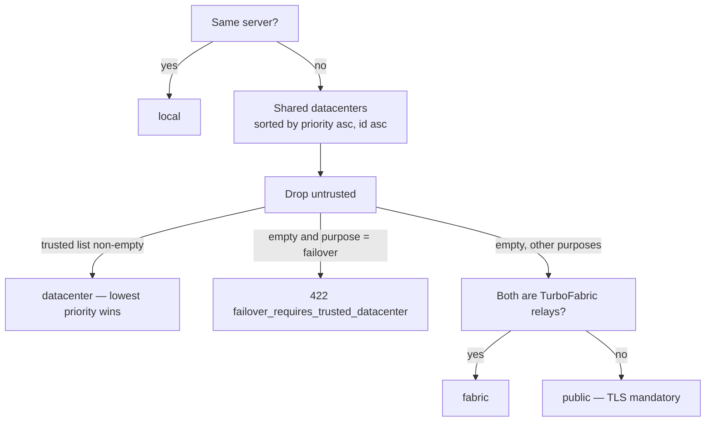

# Datacenter networks

This page is the model behind the **Datacenters**, **Network**, and server
**Network** tab screens. Read it before the [TurboFabric path
model](/docs/architecture/turbofabric-path-model): the path states only make
sense once you know what a datacenter is and how one is chosen.

## A datacenter is a logical routing domain, not a building

A **datacenter** is one or more mutually routable private subnets (IPv4 and/or
IPv6) plus **membership pins** — one pin per server per address, each pin
naming the subnet it belongs to. Two servers that share a datacenter can reach
each other directly on that L2 without any TurboPanel help.

- A server may hold pins in **several** datacenters. A dual-NIC host with one
  interface on the office LAN and another on a storage backhaul switch is one
  server in two datacenters.
- A single-network homelab is the degenerate case: one datacenter, one subnet,
  and the "building" and the "routing domain" happen to coincide.
- Two servers that happen to be in the same rack but on different, non-routed
  VLANs are **not** in the same datacenter, however close the cables are.

The control plane never types a CIDR for you. A datacenter is created from a
server's reported private address; the first subnet is the daemon-reported
prefix when there is one, otherwise a typical LAN `/24` or `/64`. Further
subnets are added explicitly.

## Priority and trust

Every datacenter carries two routing-policy fields, both stored under
`options` and returned already defaulted on the wire:

| Field | Type | Default | Meaning |
| --- | --- | --- | --- |
| `priority` | integer `0`–`1000` | `100` | Ladder rank — **lower wins** when two servers share more than one datacenter. Out-of-range values are dropped by the instance, not clamped; the console validates before it sends. |
| `trusted` | boolean | `true` | Whether the L2 is under the operator's control. `false` marks a shared retail LAN, a provider-owned segment, or anything you would not put unencrypted replication on. |

An **untrusted** datacenter is skipped entirely by the datacenter rung.
Traffic between two servers whose only shared datacenter is untrusted falls
through to TurboFabric (encrypted, over the same physical link if that is the
only one) and, if neither is a relay, to a TLS-mandatory public listener. A
**failover replica** across an untrusted-only pair is refused outright — see
below — because failover replication has to stay on a LAN the operator owns.

Changing either field is not cosmetic: `PATCH /datacenters/:id` recomputes the
stored replication transport of every managed member whose pair crosses that
datacenter and re-converges ProxySQL backends and the mesh.

## The ladder

For any pair of servers the instance picks exactly one transport:

The tiebreak is `priority asc`, then `datacenterId asc`. Two datacenters with
the same priority therefore still produce a deterministic answer, and the
console can name the winner before anything is created: the datacenter Routing
panel reads *"Backhaul (priority 10) currently wins over Primary LAN (100) for
db-1 ↔ db-2"*, and a managed member row reads `Datacenter LAN · Backhaul
(priority 10)`. Those hints are derived client-side from the same rule; the
instance's answer is authoritative.

`local → datacenter → fabric → public` is the same order the [managed database
ingress](/docs/architecture/managed-database-ingress) page describes for
replication and ProxySQL backends. Failover replicas stop at `datacenter`;
read replicas may continue down the ladder.

## Collision matrix

Every CIDR the control plane writes or allocates on behalf of an organization
passes one collision authority. Each pair below is a **hard failure** with its
own `409` code, and the response carries `cidr` (what was refused) and
`conflictingCidr` (what it hit) so the console can show *what* is in the way:

| Candidate vs | Code | Why it breaks |
| --- | --- | --- |
| The organization's TurboFabric host range (`tp0`) | `cidr_overlaps_fabric` | Mesh addresses would be indistinguishable from LAN addresses |
| The TurboFabric container pool | `cidr_overlaps_fabric_pool` | Relay `/16` prefixes are carved from it; a LAN inside it would shadow container routes |
| Any other site subnet in the organization | `subnet_overlaps` | Site subnets are an org-wide address space: two subnets claiming the same addresses cannot both be routed |
| A site subnet in another datacenter, **both** with a gateway relay | `cidr_overlaps_gateway_advertised` | Two gateways would push overlapping prefixes into the same WireGuard `AllowedIPs` |
| A reserved range | `cidr_overlaps_reserved` | Something outside TurboPanel already routes it |
| A Docker network registration carrying a CIDR, a Docker address pool, or the Docker default bridge network | `cidr_overlaps_docker_network` | dockerd would hand containers addresses that also exist on the LAN |

Note the third and fourth rows: overlapping site subnets are refused
**organization-wide**, whichever datacenters they belong to. Two offices that
both use `192.168.1.0/24` cannot both be entered as-is — renumber one, or
enter only the one TurboPanel needs to route. The gateway-specific code is not
an exception to that rule; it is the more specific explanation for the case
that actually breaks the mesh: when both datacenters have a gateway-role relay
advertising their subnets, `AllowedIPs` would become ambiguous, and the
refusal says so instead of the general `subnet_overlaps`.

Overlap is family-aware: an IPv6 candidate never collides with an IPv4 range.

## Reserved ranges

A **reserved range** (`kind: 'reserved'` in the network registry) is a CIDR
TurboPanel must never assign — not to a container, not to the mesh, not to an
internal service — because something outside TurboPanel already routes it: a
corporate VPN allocation, a remote branch reachable over a site-to-site
tunnel, an upstream block your provider hands you.

Reserved ranges are org-scoped and carry no datacenter or host. They
constrain more than operator writes:

- The TurboFabric allocators (`tp0` host range, relay `/16` prefixes, per-host
  `tpn_*` subnets) take their exclusion list from the same registry and never
  land inside one.
- Docker address pools may not overlap one, so dockerd's auto-carved networks
  stay clear of it as well.
- A site subnet or a Docker registration that overlaps one is `409
  cidr_overlaps_reserved`.

The point is that addresses in a reserved range keep reaching Caddy and your
published services without ever colliding with an address TurboPanel handed
out. See [Network addressing](/docs/deployment/network-addressing) for the
operator walkthrough.

## TurboPanel never configures host interfaces

TurboPanel **observes** host interfaces; it does not bring them up, assign
addresses, or write routes. The daemon reports the addresses it sees, the
control plane records membership pins against them, and that is the whole
contract. Addresses are expected to change — DHCP leases, a re-cabled NIC, a
provider renumbering.

When a pinned address disappears from the daemon's report, the instance's
maintenance sweep looks for a replacement inside the pin's subnet:

- **Exactly one** unambiguous candidate → the pin is re-pointed automatically
  (a *repin*).
- **None**, or **more than one** → the pin is marked **stale**
  (`address_gone_no_candidate` / `address_gone_ambiguous`) and keeps naming the
  last known address. Nothing is guessed. The console shows a **Stale** badge
  with the reason; you re-pin by unassigning and re-adding the server, or wait
  for the host to report a usable address.

A repin re-converges replication transports, ProxySQL backends, and the mesh
on the next sweep. What it does **not** do is move a running site: a hosting's
bind address is frozen at deploy time, so the environment surfaces a
`needsRedeploy` notice instead, and the operator decides when to redeploy.

## Related

- [TurboFabric path model](/docs/architecture/turbofabric-path-model)
- [Managed database ingress](/docs/architecture/managed-database-ingress)
- [Network addressing](/docs/deployment/network-addressing)
- [Instance API](/docs/architecture/api)
