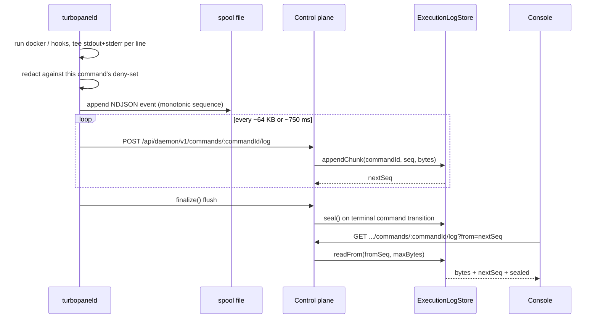

# Deployment logs

A **deployment log** (an *execution log*, internally) is the stdout/stderr a daemon produces while running one command — a deploy, a lifecycle action, a stop, a managed-engine apply. It is addressed by `commandId`, streamed while the command is still running, and read back by the console live.

The transcript is a **separate, never load-bearing channel**. The command's own outcome travels on the WebSocket `command-outcome` frame as before; an upload failure, a full disk, or a disabled log store can never change whether a command succeeded.

This is the **only** log class TurboPanel stores. Running-container stdout/stderr is a live on-demand tail and is never retained — see [Container logs](/docs/architecture/container-logs).

<Callout type="info" title="Canonical source">
  Control-plane contract:{' '}
  <File path="src/lib/execution-logs/AGENTS.md" href="https://github.com/TurboPanel/turbopanel/blob/trunk/src/lib/execution-logs/AGENTS.md">
    instance/src/lib/execution-logs/AGENTS.md
  </File>
  . Daemon-side capture:{' '}
  <File path="src/deploy/AGENTS.md" href="https://github.com/TurboPanel/turbopaneld/blob/trunk/src/deploy/AGENTS.md">
    daemon/src/deploy/AGENTS.md
  </File>{' '}
  (Streamed transcript capture). Storage classification: [Storage architecture](/docs/architecture/storage-architecture).
</Callout>

## End to end



## The `ExecutionLogStore` contract

Four methods, identical on every driver, exercised by one shared conformance suite:

| Method | Contract |
| ------ | -------- |
| `appendChunk(commandId, seq, bytes)` | **Idempotent on `(commandId, seq)`** — a replayed `seq` is a no-op returning the current `nextSeq`. A **gap** throws `ExecutionLogGapError` carrying the expected seq; the route maps it to `409` with `nextSeq` so the daemon resends from the right place. Appending after `seal()` throws `ExecutionLogSealedError` → `409`. |
| `readFrom(commandId, fromSeq, maxBytes)` | Returns a byte slice plus `nextSeq` and `sealed`. Returns `null` only when **no transcript exists at all**. |
| `seal(commandId)` | Compacts the live parts into one gzipped object. Called on the command's terminal transition; **best effort by contract** — sealing must never fail an otherwise-completed command. |
| `delete(commandId)` | Removes the transcript; also the unit retention operates on. |

### Three states, never conflated

`null`, empty, and sealed-empty mean different things and the API keeps them apart:

| Store answer | Meaning | The console shows |
| ------------ | ------- | ----------------- |
| `null` (`exists: false`) | Nothing has been written yet | "Waiting for output" — **not** a 404 |
| `exists: true`, zero bytes | Running, no output yet | Live view, still polling |
| `sealed: true` | The command reached a terminal status | Final transcript, polling stops |

A poll loop never 404s, so "waiting for output" and "no transcript retained" stay distinguishable.

### Progress is guaranteed

`nextSeq` advances only past chunks returned **in full**, so a resumed read never re-emits a partial chunk's tail nor skips its remainder. A chunk larger than the caller's byte budget yields a partial slice with `nextSeq` unchanged — the reader still makes progress, and the console dedupes by event sequence because that replay is expected.

### Caps and the truncation marker

| Cap | Value |
| --- | ----- |
| `MAX_EXECUTION_LOG_CHUNK_BYTES` | 256 KiB per uploaded chunk |
| `MAX_EXECUTION_LOG_TOTAL_BYTES` | 8 MiB per transcript (control plane) |
| `MAX_COMMAND_LOG_BYTES` | 2 MiB per command (daemon-side stop) |

Past the total cap, an append becomes a no-op that flips `truncated` and writes `EXECUTION_LOG_TRUNCATION_MARKER` **once, as a real part** — a reader sees *why* the transcript stops instead of getting a silently short tail. The overflow append still advances `nextSeq`, so a runaway command finishes normally instead of retrying forever.

## The read contract the console mirrors

`GET /api/client/v1/servers/:id/commands/:commandId/log?from=&max=`

- `from` is a **chunk sequence, not a byte offset**. Poll with the previous response's `nextSeq`.
- `sealed` is the stop condition. The console's `useCommandLog` hook polls at 1 s **only while the latest read is not sealed**, then stops — there is no timer to cancel and no fixed poll ceiling.
- Chunks accumulate client-side keyed by `(serverId, commandId)` and are deduped by event sequence.
- Rendering is one shared transcript component across the deploy overview, deployment history, managed apply, and managed engine logs. ANSI is **stripped**, never interpreted.

Deploy history reuses the same ids: `GET /api/client/v1/environments/:id/deployments` reads the append-only `command` table, and a row's `id` **is** the command id — so the same id that lists a past deploy also fetches its transcript.

## Daemon durability: the spool file

The daemon does not hold a transcript in memory and hope the socket stays up.

```
<stateDir>/spool/execution-logs/<commandId>.log      mode 0600 under a 0700 dir
```

- One **NDJSON `CommandOutputEvent` per line**, each with a monotonic `sequence`. The file is the durability source of truth; the in-memory buffer is only a batching cache.
- Lines are tagged with the deploy **phase** they belong to: `prepare`, `pull`, `build`, `pre-deploy`, `compose-up`, `health`, `post-deploy`, plus `hooks`, `managed-apply`, the `lifecycle-*` actions, and `stop`.
- **Upload cadence:** batched when the buffer reaches ~64 KB or ~750 ms, and once more on `finalize()`. Retry uses capped backoff; a chunk that still cannot be delivered is warned and dropped.
- **Resends are idempotent by `sequence`**, which is what makes retry and crash-recovery safe: the store's `appendChunk` treats a replayed seq as a no-op.
- **Orphan sweep:** a fully-acked spool file is deleted on `finalize()`. One left behind by a crash or a failed upload is best-effort re-uploaded and deleted, **once per daemon process** (not per reconnect), and the sweep skips any spool file a live sink still owns — handlers outlive socket lifetime, so a sweep must never touch an in-flight transcript.

## Redaction happens before the spool write

This is the guarantee that matters most, and it is not pattern matching.

<Callout type="warn" title="Deny-set, not heuristics">
  The redaction deny-set is built from the values **this command actually decrypted** — variable
  material, principal passwords, TLS private keys, and (for `managed.apply`) credential plaintexts.
  Every line is scrubbed to `***` and stripped of log-injection control characters **before it is
  written to disk**, so plaintext never reaches the spool file, let alone the network. TurboPanel
  deliberately does **not** rely on a generic secret-scanning regex, which would both miss real
  secrets and mangle innocent output.
</Callout>

Deny-set construction keeps each plaintext **exactly** as decrypted *and* expands multiline material into its individual lines — so a PEM private key is scrubbed even though the sink only ever sees one line at a time. The deny-set is **process-wide**, which is why a collector or sink that starts late still redacts values decrypted earlier in the process's life.

## Sealing and retention

1. **Seal** — on the command's terminal transition, `transitionCommand` compacts the parts into one gzipped object. Because terminal transitions fire from runtimes with no shared request context (queue consumer, Durable Object, cron isolate, Deno AMQP consumer), the seal path uses a module-scoped sink registered at process init. Sealing is best effort: an unsealed transcript is still readable and still reachable by the sweep.
2. **Retention** — **90 days** by default (`TURBOPANEL_EXECUTION_LOG_RETENTION_DAYS`). This is the **only** log class TurboPanel stores. `sweepExpired` rides the **existing** once-a-minute maintenance tick. No new timer, no new connection.

| Setting | Default |
| ------- | ------- |
| `TURBOPANEL_EXECUTION_LOG_RETENTION_DAYS` | **90** |
| `EXECUTION_LOG_SWEEP_LIMIT` (per tick) | 200 |

Bytes are **date-partitioned in UTC** so retention is a prefix delete rather than a scan; the per-command index is flat and date-free, so a read never has to guess the partition.

```
execution-logs/index/<commandId>.json                            per-command index
execution-logs/data/<yyyy>/<mm>/<dd>/<commandId>/<seq>.part      live chunks
execution-logs/data/<yyyy>/<mm>/<dd>/<commandId>.log.gz          sealed transcript
```

Part keys are zero-padded to 9 digits, so a lexical listing is also a sequence-ordered listing. The index records each chunk's byte `offset` and `length` in the concatenated transcript — that is what makes `readFrom` a slice rather than a re-scan, on both the live and the sealed representation.

## Driver matrix

| Runtime | Driver | Selected when |
| ------- | ------ | ------------- |
| TurboPanel High Availability (Cloudflare Workers) | `R2ExecutionLogStore` | the `EXECUTION_LOGS` R2 binding is present |
| Self-hosted (Deno) | `FilesystemExecutionLogStore` | default |
| Self-hosted (Deno) | `S3ExecutionLogStore` | `TURBOPANEL_EXECUTION_LOG_DRIVER=s3` **and** a complete config |
| either | `DisabledExecutionLogStore` | backend config incomplete |

R2 and S3 share one object-store base; each supplies only `get` / `put` / `delete` / `list`. The filesystem driver keeps a single growing file per command instead of one object per chunk — appends are cheap on a filesystem, and the index's offsets already make an arbitrary read positional. Files and directories are `0600` / `0700` and live under the **state** tree (default `/var/lib/turbopanel/execution-logs`): these are durable product data, not rotatable process logs.

The disabled store is a **safe no-op on every method**, so a deployment with no configured backend still runs commands normally — it just does not retain their transcripts.

### Configuration

| Variable | Applies to | Default |
| -------- | ---------- | ------- |
| `TURBOPANEL_EXECUTION_LOG_DIR` | Self-hosted, filesystem | `<stateDir>/execution-logs` |
| `TURBOPANEL_EXECUTION_LOG_DRIVER` | Self-hosted | `filesystem` (or `s3`) |
| `TURBOPANEL_EXECUTION_LOG_RETENTION_DAYS` | Both runtimes | `90` |
| `TURBOPANEL_EXECUTION_LOG_S3_ENDPOINT` / `_BUCKET` / `_REGION` / `_ACCESS_KEY_ID` / `_SECRET_ACCESS_KEY` | Self-hosted, S3 | — (all required) |
| `TURBOPANEL_EXECUTION_LOG_S3_FORCE_PATH_STYLE` | Self-hosted, S3 | `1` (path-style) |

On TurboPanel High Availability, R2 buckets are **not** auto-created — create the bucket for each environment before its first deploy.

## Ingest security

`POST /api/daemon/v1/commands/:commandId/log` verifies the daemon JWT's `sub` owns the command. **Unknown and foreign command ids both return `403`**, so a daemon cannot probe another server's command ids by watching for a `404`. The route is rate-limited on the shared daemon REST limiter.

Reads require a session plus a server read grant, and decode to UTF-8 server-side.
