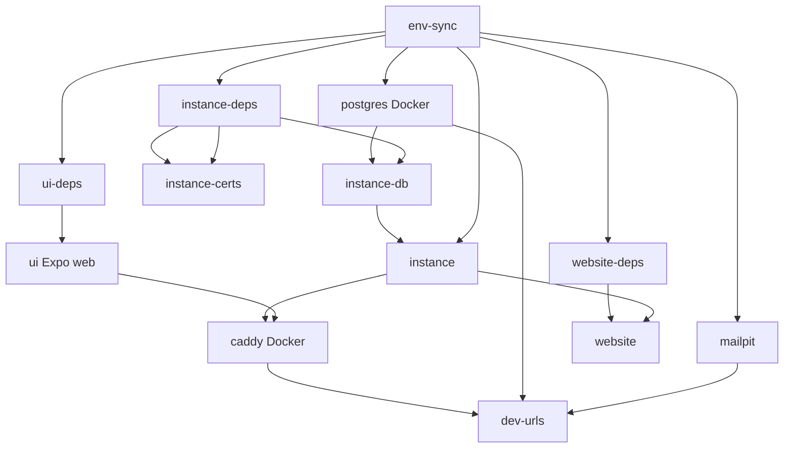

# Development architecture

This page describes how the TurboPanel **multi-repo** dev environment is orchestrated. Before you start, see [Prerequisites](/docs/development/prerequisites). For day-to-day commands, see [Local development](/docs/getting-started/development) and [Tilt troubleshooting](/docs/getting-started/tilt-troubleshooting).

## Repository model

TurboPanel split from a single monorepo into sibling repositories under a common parent directory (for example `~/turbopanel/`). The [turbopanel-dev](https://github.com/turbopanel/turbopanel-dev) repo is the entry point:

| Path | GitHub repo | Role |
| ---- | ----------- | ---- |
| `dev/` | turbopanel/turbopanel-dev | `pull.sh`, `Tiltfile`, `dev/.env`, Docker Compose for Postgres + Caddy |
| `instance/` | turbopanel/turbopanel | Hono API (Workers wrangler + Deno self-hosted) |
| `ui/` | turbopanel/turbopanel-ui | Expo web / native UI |
| `daemon/` | turbopanel/turbopanel-daemon | Agent daemon (Ansible); not started by Tilt |
| `website/` | turbopanel/turbopanel-website | Marketing + Fumadocs (this site) |

`pull.sh` clones missing siblings and fast-forwards clean checkouts on `trunk`. Repos with uncommitted changes are skipped.

## Tiltfile architecture

A single [`Tiltfile`](https://github.com/turbopanel/turbopanel-dev/blob/trunk/Tiltfile) in `dev/` loads `dev/.env` and wires host processes + Docker Compose. Run `tilt up` from the `dev/` checkout.

### Resource graph

### Key resources

| Resource | What it does |
| -------- | ------------ |
| `env-sync` | `scripts/sync-env.sh` — `dev/.env` → `instance/.dev.vars`, `instance/.env`, `docker/.env` |
| `postgres` | Postgres 18 in Docker (`127.0.0.1:5432`, data in `dev/.postgresql/`) |
| `caddy` | HTTPS reverse proxy on `CADDY_PORT` (default **8443**) → wrangler or Deno socket + Expo |
| `instance-deps` / `ui-deps` / `website-deps` | `pnpm install` in each repo |
| `instance-certs` | Platform CA + leaf cert (`pnpm cert:generate` in `instance/`) |
| `instance-db` | `./sync.sh --force` when `schema.ts` changes |
| `instance` | Workers (`wrangler dev`) or Deno (`scripts/instance-serve.sh`) |
| `ui` | `pnpm web` on `EXPO_PORT` (default **8081**) |
| `website` | `pnpm dev` on `WEBSITE_PORT` (default **19820**) |
| `mailpit` | Local SMTP + web UI for dev email |

Caddy waits for `instance-certs`, `instance`, and `ui` before starting so TLS and upstreams are ready.

### Instance runtime switch

`TURBOPANEL_INSTANCE_RUNTIME` in `dev/.env` is `workers` (default) or `deno`. The Tilt nav button runs `scripts/switch-runtime.sh`, re-syncs env, recreates Caddy, and restarts the instance resource.

## Database schema (development)

There are **no versioned migration files** in early development. Schema stays aligned via drizzle-kit:

1. **Push (code → DB):** edit `instance/src/db/schema.ts`, run `./sync.sh` (Tilt `instance-db` runs `./sync.sh --force` on schema changes).
2. **Pull (DB → code):** change tables in Drizzle Studio, then `./introspect.sh`.

On Deno startup, `ensureDbSchemaReady()` auto-pushes when the `user` table is missing (fresh Postgres volume).

See [Database troubleshooting](/docs/getting-started/database-troubleshooting) for resets and connection issues.

## Port allocation

| Service | Default port | Config key |
| ------- | ------------ | ---------- |
| Caddy HTTPS | 8443 | `CADDY_PORT` |
| Website | 19820 | `WEBSITE_PORT` |
| Wrangler (internal) | 18787 | `INSTANCE_DEV_PORT` |
| Expo web | 8081 | `EXPO_PORT` |
| Postgres | 5432 | `POSTGRES_PORT` |
| Mailpit web | 19826 | `MAILPIT_WEB_PORT` |
| Mailpit SMTP | 19825 | `MAILPIT_SMTP_PORT` |
| Tilt UI | 10350 | — |

Browser traffic should use **Caddy on `:8443`**, not wrangler directly. The website on `:19820` calls the API through Caddy for Scalar / cross-origin docs (`TURBOPANEL_CORS_ORIGINS`).

## Technology choices

- **Hono** — Shared HTTP app for Workers and Deno (`instance/src/app.ts`).
- **Expo / React Native** — Cross-platform UI (`ui/`).
- **Next.js + Fumadocs** — Marketing and documentation (`website/`).
- **Drizzle + Postgres** — Schema in `instance/src/db/schema.ts`; Hyperdrive in Workers production.
- **Caddy** — TLS termination and reverse proxy in dev and self-hosted production.
- **Ansible (daemon)** — Installs and updates runtimes, instance, UI, and Caddy on managed hosts.

These support both Cloudflare Workers (cloud-hosted) and Deno + Caddy (self-hosted) deployment models described in [Introduction](/docs/getting-started/introduction).
