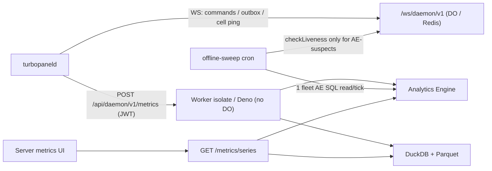

# Server metrics architecture

TurboPanel collects **host metrics** from connected daemons via authenticated `POST /api/daemon/v1/metrics` — one sample per minute per server at the baseline cadence. Metrics is **disposable, statistical, and may be sampled**; it is not a billing ledger or audit trail.

<Callout type="info" title="Canonical source">
  Agent maintenance detail lives in <File path="AGENTS.md" href="https://github.com/TurboPanel/turbopanel/blob/trunk/AGENTS.md">instance/AGENTS.md</File> and <File path="AGENTS.md" href="https://github.com/TurboPanel/turbopaneld/blob/trunk/AGENTS.md">daemon/AGENTS.md</File> (Host metrics).
  Operations: [Metrics deployment](/docs/deployment/metrics).
</Callout>

## Overview

One **versioned wire contract** (`METRICS_SCHEMA_VERSION = 2`) is mirrored in the daemon and instance repos (not build-coupled). Storage is **dual-runtime**:

| Runtime | Store | Backend |
| ------- | ----- | ------- |
| Cloudflare Workers | Analytics Engine | `SERVER_METRICS` binding → `turbopanel_server_telemetry` dataset |
| Self-hosted Deno | DuckDB + Parquet | `DuckDbParquetServerMetricsStore` (embedded, no port) |

Store selection: `resolveServerMetricsStore` (always on — Workers → Analytics Engine, Deno → DuckDB + Parquet).



HTTP request body (schema v2 — illustrative subset of the 38 metric fields):

```json
{
  "type": "metrics",
  "version": 2,
  "at": "2026-07-12T12:00:00.000Z",
  "intervalSeconds": 60,
  "sequence": 42,
  "metrics": { "cpuUserPercent": 8.1, "cpuIdlePercent": 87.5, "load1": 0.8, "..." : "..." },
  "dimensions": { "schemaVersion": 2, "collectionMode": "baseline", "daemonVersion": "…", "operatingSystem": "…", "architecture": "…", "kernelRelease": "…" }
}
```

Scheduling: first sample POSTs immediately on connect (including the co-located self-hosted daemon), a primed second sample ~**2 s** later fills rate metrics (CPU / disk / net), then a **60 s** baseline interval with ≤**5 s** deterministic per-`serverId` phase jitter. On top of the baseline, a UI-requested **live-mode lease** switches the daemon to a **10 s** sampling cadence (`collectionMode: "live"`) for the duration of the lease — capped at **60 minutes** by default, with expiry enforced daemon-side so an abandoned browser tab cannot hold a server in fast sampling. Monotonic process-local `sequence` (resets on daemon restart). Independent of cell ping/`heartbeat` liveness — see daemon `AGENTS.md`. Host metrics are ingested **only** via authenticated `POST /api/daemon/v1/metrics`; WebSocket `{ type: "metrics" }` frames are no longer accepted.

## Metrics v2 contract

`HOST_METRIC_KEYS` is a **named logical allowlist** (schema v2, **38 metrics**) for the wire/API/query surface only — it carries **no positional order**. Physical storage positions are backend-private, defined in each backend's own field-map/schema files, never derived from this list.

Metrics by family:

| Family | Metrics |
| ------ | ------- |
| CPU breakdown | `cpuUserPercent`, `cpuSystemPercent`, `cpuNicePercent`, `cpuIdlePercent`, `cpuIowaitPercent`, `cpuIrqPercent`, `cpuSoftirqPercent`, `cpuStealPercent` |
| Load | `load1`, `load5`, `load15` |
| Memory | `memoryTotalBytes`, `memoryAvailableBytes`, `memoryFreeBytes` |
| Swap | `swapTotalBytes`, `swapFreeBytes` |
| Storage probes (system / hosting / Docker) | `systemStorageTotalBytes`, `systemStorageAvailableBytes`, `hostingStorageTotalBytes`, `hostingStorageAvailableBytes`, `dockerStorageTotalBytes`, `dockerStorageAvailableBytes` |
| Disk throughput / IOPS / latency | `diskReadBytesPerSecond`, `diskWriteBytesPerSecond`, `diskReadOpsPerSecond`, `diskWriteOpsPerSecond`, `diskReadLatencyMs`, `diskWriteLatencyMs` |
| Network (uplink vs TurboFabric) | `uplinkReceiveBytesPerSecond`, `uplinkTransmitBytesPerSecond`, `fabricReceiveBytesPerSecond`, `fabricTransmitBytesPerSecond` |
| Sensors | `cpuTemperatureCelsius`, `gpuTemperatureCelsius`, `cpuPowerWatts`, `gpuPowerWatts` |
| System | `processCount`, `uptimeSeconds` |

**Derived, not stored:** usage percentages are computed client-side from the stored components — `cpuUsagePercent = 100 - cpuIdlePercent`, and memory/swap/storage "used" values derive from the total/available/free bytes. The wire and both backends carry only the components above.

**Missing values** are `null` on the wire — never coerced to `0`. First-sample rate metrics (disk/network per-second) are `null` until a second delta exists; absent sensors (no temperature/power probe on the host) stay `null` permanently.

## Analytics Engine mapping (Workers)

One AE data point holds only 20 doubles, so each v2 host sample (38 metrics) is written as **two data points** — `blob2 = "core"` and `blob2 = "extended"` (19 fixed metrics each, `CORE_METRIC_KEYS` / `EXTENDED_METRIC_KEYS` in the backend's `field-map.ts`), with `double20` reserved for `intervalSeconds` on both parts. The dataset name is **`turbopanel_server_telemetry`** — brand-new for the two-part layout; the retired single-datapoint dataset `turbopanel_server_metrics` is never queried.

| Slot | Content |
| ---- | ------- |
| `indexes[0]` / `index1` | Authenticated `serverId` UUID only — never org, account, hostname, or metric name |
| `double1` … `double19` | Metrics rows: the part's 19 metric values in `CORE_METRIC_KEYS` / `EXTENDED_METRIC_KEYS` order (backend-private) |
| `double20` | Metrics rows (both parts): the sample's `intervalSeconds` — the weighting term for all aggregates |
| `blob1` | Event type discriminator — `"metrics"` (host sample part) or `"status"` (connection-status transition; see below) |
| `blob2` | Metrics rows: part discriminator `"core"` / `"extended"` (empty on status rows) |
| `blob3` | Schema version (string, both event types) |
| `blob4` … `blob7` | Metrics rows: `daemonVersion`, operating system, architecture, kernel release |
| `blob8` … `blob10` | Metrics rows: `collectionMode`, daemon `at` timestamp (ISO), sequence |
| `blob11` … `blob14` | Metrics rows: cpuTemperature / gpuTemperature / cpuPower / gpuPower sensor identities (empty when unselected) |
| `blob15` … `blob16` | Metrics rows: uplink / fabric interface selections (comma-joined; empty when unselected) |
| `blob17` | Status rows only: transition reason (empty on metrics rows) |
| `blob18` … `blob20` | Reserved empty strings on every event type |

AE doubles have no null. Missing metrics store **`AE_MISSING_METRIC_SENTINEL = -1e308`** — never `0`. All host metrics are ≥ 0, so the sentinel cannot collide. On the AE SQL read path, compare against **`-pow(10, 308)`** (scientific-notation literals and `NULLIF` are not documented for AE SQL).

Host reads filter `blob1 = 'metrics'` plus supported schema versions in `blob3`, then first **recombine the two part rows into one logical sample per `(index1, timestamp)`** — logical rows without a core part (orphaned extended writes) are dropped — before bucket/server aggregation, so `sample_count` / `latest_at` / metric averages all describe the same logical rows.

### Connection-status event stream (`blob1 = "status"`)

Every genuine online/offline transition on a `server` row (not a heartbeat or identity-only touch) also writes **one status event**. On Analytics Engine it lands in the same `turbopanel_server_telemetry` dataset, discriminated from host samples by `blob1`; on self-hosted Deno it lands in a **separate typed `server_status_events` DuckDB table** (never shared with host samples).

| Slot (AE) | Content |
| ---- | ------- |
| `blob1` | `"status"` |
| `blob3` | Schema version (same slot as metrics rows) |
| `blob17` | Transition reason — `"connect"` \| `"disconnect"` \| `"sweep_stale"` \| `"self_heal"` (closed set) |
| `double1` | `1` (connected) or `0` (disconnected) |
| all other doubles/blobs | Missing-metric sentinel / empty string — a status row carries no host metrics and no part discriminator (`blob2` stays empty) |

AE stamps its own ingestion `timestamp` for status rows; DuckDB stores `at` directly (the event's own timestamp). Both backends expose this via `GET /api/client/v1/servers/:id/metrics/connection`, which resolves prior state before the range plus in-range transitions through the shared backend-neutral `computeStatusUptime` parity seam — so AE and DuckDB report identical uptime/downtime numbers for the same query.

**Volume impact is negligible against the write-volume formulas below** — status rows are written only on a state flip (at most a handful per server per day in normal operation), not once per sampling interval like host rows, so they do not materially change the write-volume math in this doc.

<Callout type="warn" title="History-only — never authoritative for liveness">
  This event stream (and the `/metrics/connection` endpoint built on it) exists purely for
  historical uptime/downtime reporting. It is asynchronous, best-effort, and sampled/disposable like
  all server metrics. The Postgres `server.connected` / `server.status_changed_at` columns (see
  [Daemon cell architecture](/docs/architecture/daemon-cell)) are the sole source of truth for
  whether a server is online **right now** — never gate a current-liveness decision on Analytics
  Engine or DuckDB status history.
</Callout>

**Query aggregation** (SQL API): filter `blob1 = 'metrics'` and supported `blob3`; rows under `result.data` (Cloudflare v4 envelope). Weighted average per bucket, scoped to the part that owns the metric:

```sql
SUM(if(doubleN = -pow(10, 308), 0.0, doubleN * double20 * _sample_interval))
/ SUM(if(doubleN = -pow(10, 308), 0.0, double20 * _sample_interval))
```

Metrics is **sampled** — always weight by `intervalSeconds` (`double20`) times `_sample_interval`; do not assume one row per minute.

**Hosted retention:** Cloudflare Analytics Engine retains data for **3 months**. UI/API max range is 90 days on Workers; do not imply long-term persistence beyond AE retention on hosted deployments.

## DuckDB + Parquet schema (self-hosted)

The Deno path uses `DuckDbParquetServerMetricsStore` over the embedded `@duckdb/node-api` engine — no external service, no port, no credentials. Everything lives under the metrics state root (`TURBOPANEL_METRICS_DIR`, default `<stateDir>/metrics`): `metrics.duckdb` (hot database), `parquet/` (sealed daily partitions), `tmp/` (spill + in-flight exports). Schema DDL is idempotent (`CREATE TABLE IF NOT EXISTS` + `CREATE INDEX IF NOT EXISTS`, applied once per open).

**Two real typed tables — no positional layout, no sentinel.** Missing metrics are genuine SQL `NULL`s, and columns are named per metric via `metricColumnName` (snake_case, e.g. `cpu_user_percent`):

| Table | Columns |
| ----- | ------- |
| `server_metric_samples` | `server_id UUID`, `sampled_at TIMESTAMP`, `received_at TIMESTAMP`, `interval_seconds SMALLINT`, `collection_mode VARCHAR`, plus one nullable `DOUBLE` per metric key |
| `server_status_events` | `server_id UUID`, `at TIMESTAMP`, `connected BOOLEAN`, `reason VARCHAR` |

Writes are **batched in-process** into one transaction; queries force-flush pending batches, and the store closes cleanly on SIGINT/SIGTERM so accepted rows persist across a graceful shutdown.

**Daily Parquet archive:** each completed UTC day is sealed out of the hot table into `parquet/server-metrics/year=YYYY/month=MM/day=DD/metrics.parquet` — export to `tmp/`, validate the produced file's row count by re-reading it, atomic rename into the partition tree, and only then delete the hot rows. Interrupted exports are swept on the next tick and never mistaken for sealed partitions. Reads union the hot table with the partitions overlapping the range (`read_parquet([...], union_by_name := true)`), so a query spanning hot and archived days is one logical scan.

Aggregates are `interval_seconds`-weighted averages over present rows; resolution is chosen at **query time** (no rollup tables or materialized views). Late arrivals and duplicates are accepted — a late sample for an already sealed day is merged on the next archive tick (the partition is rebuilt from the union of the sealed file and the day's hot rows).

Resource caps and configuration:

| Env | Purpose |
| --- | ------- |
| `TURBOPANEL_METRICS_DIR` | Metrics state root override |
| `TURBOPANEL_SERVER_METRICS_RETENTION_DAYS` | Retention days (default **90**) — prunes expired Parquet partitions plus any hot/status rows past the cutoff |
| `TURBOPANEL_SERVER_METRICS_DUCKDB_THREADS` | DuckDB `SET threads` cap (default **2**) |
| `TURBOPANEL_SERVER_METRICS_DUCKDB_MEMORY_LIMIT` | DuckDB `SET memory_limit` in MiB (default **128**) |

## Query API & caching

| Endpoint | Purpose |
| -------- | ------- |
| `GET /api/client/v1/servers/:id/metrics/series` | Time-series buckets for selected metrics |
| `GET /api/client/v1/servers/:id/metrics/summary` | Aggregated summary for a range |
| `GET /api/client/v1/servers/:id/metrics/connection` | Uptime/downtime history from the status event stream (history-only — see above) |

Session + server read grant required. **One combined backend query** per `(server, range)` — not per metric or chart.

**Resolution ladder:** range ≤ 10 min → 10 s; ≤ 1 h → 60 s; ≤ 6 h → 300 s; ≤ 24 h → 900 s; ≤ 7 d → 3600 s; ≤ 30 d → 21600 s; else 43200 s. Max **`MAX_METRICS_POINTS` = 1500** points; range ≤ **90 days**.

**Aggregation policy** is interval-aware and per-metric (`weighted-average` / `last` / `max` descriptors) rather than a flat average — most gauges bucket as `intervalSeconds`-weighted averages, while metrics like `uptimeSeconds` use `last`/`max` semantics.

**Chart cache:** key includes authorized `serverId`, bucket-rounded range, sorted metrics, resolution, backend, schema version. TTL: live **45 s** / historical **300 s**.

## Cost model

Metrics ingestion runs on the normal Worker isolate (or Deno process) and **no longer incurs Durable Object GB-sec** — see [Daemon Cell](/docs/architecture/daemon-cell) for DO billing. The Analytics Engine price constants, limits, and formulas below remain the single source of truth for AE cost planning.

<Callout type="warn" title="Verified: 12 July 2026 (Cloudflare docs updated 2026-04-23); currently not billed">
  Cloudflare states Analytics Engine is **currently not billed**. The constants below are for
  capacity planning only — not product pricing. TurboPanel product tiers remain on{' '}
  <a href="https://turbopanel.io/pricing">turbopanel.io/pricing</a>.
</Callout>

### Cloudflare Analytics Engine limits & prices

| Item | Workers Paid | Workers Free |
| ---- | ------------ | ------------ |
| **Writes** | 10M/mo included, then **$0.25/M** | 100k/day |
| **Reads** (SQL API) | 1M/mo included, then **$1.00/M** | 10k/day |
| **Retention** | **3 months** | **3 months** |
| Per `writeDataPoint` | ≤ 250 data points/invocation; ≤ 20 doubles, 20 blobs, 1 index; blobs ≤ 16 KB; index ≤ 96 B | same |

All **38 metrics = two** `writeDataPoint` calls (core + extended) per sample — still well under the 250-datapoint-per-invocation cap.

### Write volume formulas

| Constant | Value |
| -------- | ----- |
| Samples per server per day | `86400 / intervalSeconds` = **1,440** @ 60 s |
| AE writes per server per day | `2 × 1,440` = **2,880** @ 60 s (two data points per sample) |
| Monthly AE writes (fleet) | `connectedServers × 2 × (2,592,000 / intervalSeconds)` |
| Included write allowance | **10,000,000**/mo |
| Break-even (connected servers @ 1 min) | `10,000,000 / 86,400 ≈ **115**` servers before write overage |
| Write overage cost | `max(0, monthlyWrites − 10,000,000) / 1,000,000 × $0.25` |

Live 10 s mode adds short bursts of 6× write volume per leased server, but each session is bounded by the **60-minute** lease cap (≤ 720 extra writes per session) — negligible against the monthly totals above.

### Read volume (dashboards)

Reads scale with **dashboard views ÷ cache TTL** (live 45 s / historical 300 s), **not** chart count or fleet size — one combined query per server/range/resolution, cache-collapsed.

| Item | Value |
| ---- | ----- |
| Included SQL reads | **1,000,000**/mo |
| Read overage | `$1.00` per million |

### Worked examples (60 s interval, all servers connected 24×7)

| Connected servers | Monthly writes | Write overage | Est. write cost/mo |
| ----------------- | -------------- | ------------- | ------------------ |
| 100 | 8,640,000 | 0 | $0.00 |
| 1,000 | 86,400,000 | 76,400,000 | $19.10 |
| 5,000 | 432,000,000 | 422,000,000 | $105.50 |

Cloudflare **currently does not bill** Analytics Engine — treat overage dollars as planning figures until billing activates.
