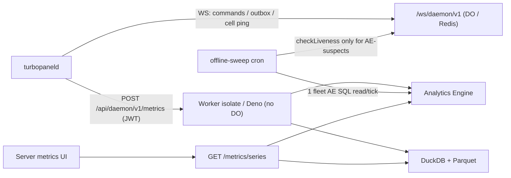

# Server metrics architecture

TurboPanel collects **host metrics** from connected daemons via authenticated `POST /api/daemon/v1/metrics` — one sample per minute per server at the baseline cadence. Metrics is **disposable, statistical, and may be sampled**; it is not a billing ledger or audit trail.

<Callout type="info" title="Canonical source">
  What each console chart means: [Server metrics](/docs/metrics).
  Agent maintenance detail lives in <File path="AGENTS.md" href="https://github.com/TurboPanel/turbopanel/blob/trunk/src/daemon/metrics/AGENTS.md">instance/src/daemon/metrics/AGENTS.md</File> and <File path="AGENTS.md" href="https://github.com/TurboPanel/turbopaneld/blob/trunk/src/metrics/AGENTS.md">daemon/src/metrics/AGENTS.md</File>.
  Operations: [Metrics deployment](/docs/deployment/metrics).
</Callout>

## Overview

One **versioned wire contract** (`METRICS_SCHEMA_VERSION_V4 = 4`) is mirrored in the daemon and instance repos (not build-coupled). v4 groups metrics **by entity** (host, network device, filesystem, block device, GPU, hardware signal, ingress source, database proxy) instead of a flat key list — every leaf value is `number | null` (missing is always `null`, never coerced to `0`), and every entity carries a stable logical id instead of relying on positional membership in an allowlist. Storage is **dual-runtime**:

| Runtime | Store | Backend |
| ------- | ----- | ------- |
| Cloudflare Workers | Analytics Engine | `SERVER_METRICS_V4` binding → `turbopanel_server_metrics_v4` dataset |
| Self-hosted Deno | DuckDB + Parquet | one typed table per family (embedded, no port) |

Store selection: `resolveServerMetricsStoreV4` (always on — Workers → Analytics Engine, Deno → DuckDB + Parquet).



Every sample writes **two mandatory rows** — `host.system` and `host.io` — plus zero or more rows for whichever additional families are actually **present** on that host this tick. See [Metrics v4 contract](#metrics-v4-contract) below.

HTTP request body (schema v4 — illustrative subset). The minimal shape (a VM with one NIC, no GPU, no managed-service sidecars):

```json
{
  "type": "metrics",
  "metadata": {
    "version": 4,
    "sampledAt": "2026-09-05T12:00:00.000Z",
    "intervalSeconds": 60,
    "sequence": 42,
    "collectionMode": "baseline",
    "topologyGeneration": 1,
    "bootGeneration": 1
  },
  "host": {
    "cpu": { "busyPercent": 8.1, "userPercent": 5.2, "systemPercent": 2.9, "...": "..." },
    "kernel": { "fileHandlesUsedPercent": 3.1, "conntrackUsedPercent": null },
    "memory": { "availableBytes": 2147483648, "swapUsedBytes": 0, "...": "..." },
    "storage": { "diskReadBytesPerSecond": 102400, "diskWriteBytesPerSecond": 51200, "...": "..." },
    "network": { "tcpRetransmitPercent": 0.02, "softnetDropsPerSecond": 0 }
  },
  "networks": [{ "deviceId": "eth0", "receiveBytesPerSecond": 12000, "transmitBytesPerSecond": 8000, "...": "..." }],
  "filesystems": [],
  "blockDevices": [],
  "gpus": [],
  "hardwareSignals": [],
  "ingressSources": [],
  "databaseProxies": [],
  "events": []
}
```

A bare-metal host with a GPU, hosting-ingress Caddy, and hardware sensors declares the corresponding entity arrays instead of a `parts` list — presence is what drives extra rows, not a declared allowlist:

```json
{
  "networks": [{ "deviceId": "eth0" }, { "deviceId": "eth1" }],
  "gpus": [{ "gpuId": "gpu0", "utilizationPercent": 34.2, "temperatureCelsius": 61, "...": "..." }],
  "ingressSources": [{ "sourceId": "caddy0", "sourceKind": "caddy", "requests": 12.4, "...": "..." }],
  "hardwareSignals": [{ "signalId": "cpu-package", "kind": "temp", "value": 58.5 }, "..."]
}
```

Scheduling: first sample POSTs immediately on connect (including the co-located self-hosted daemon), a primed second sample ~**2 s** later fills rate metrics (CPU / disk / net), then a **60 s** baseline interval with ≤**5 s** deterministic per-`serverId` phase jitter. On top of the baseline, a UI-requested **live-mode lease** switches the daemon to a **10 s** sampling cadence (`collectionMode: "live"`) for the duration of the lease — capped at **60 minutes** by default, with expiry enforced daemon-side so an abandoned browser tab cannot hold a server in fast sampling. Monotonic process-local `metadata.sequence` (resets on daemon restart). Independent of cell ping/`heartbeat` liveness — see daemon `AGENTS.md`. Host metrics are ingested **only** via authenticated `POST /api/daemon/v1/metrics`; WebSocket `{ type: "metrics" }` frames are no longer accepted.

## Metrics v4 contract

v4 has no `MetricPart`/19-slot-per-part allowlist coupling. Metrics are grouped into **families** (`HostedFamilyV4` in `metric-descriptors-v4.ts`), each one either **universal** (always emitted, even if every value is null), **presence-gated** (emitted only when the source entity array is non-empty), or **capability-gated** (emitted only when the resolved `MetricsCapabilityPlan` enables it).

| Family | Gating | Entity scope | Metrics |
| ------ | ------ | ------------ | ------- |
| `host.system` | Universal | host (no entity id) | 19 — CPU (10: busy/user/system/iowait/steal/softirq/pressure-some/max-core-busy/procs-running/procs-blocked), kernel (2: file-handles-used%, conntrack-used%), memory (7: available/swap-used/pressure-some/pressure-full/swap-in/swap-out/major-page-faults) |
| `host.io` | Universal | host (no entity id) | 11 — storage (9: io-pressure-some/full, disk read/write bytes+latency, max-block-util%, root-fs available bytes/free inodes), network (2: TCP retransmit%, softnet drops/s) |
| `gpu` | Presence-gated | one row per page of `gpus[]` | 9 per GPU — utilization%, memory used bytes, memory activity%, GPU + memory temperature, power watts, PCIe rx/tx bytes/s, throttle% |
| `network` | Presence-gated (paged NICs beyond the two embedded in `host.io`) | one row per page of the non-embedded `networks[]` | 6 per NIC — rx/tx bytes/s, rx/tx errors/s, rx/tx drops/s |
| `filesystem` | Presence-gated | one row per page of `filesystems[]` | 2 per filesystem — available bytes, free inodes |
| `block` | Presence-gated | one row per page of `blockDevices[]` | 9 per device — read/write bytes+ops/s, read/write latency ms, utilization%, temperature, queue depth |
| `hardware.physical` | Presence-gated | one row per page of `hardwareSignals[]` | 1 per signal (`value`) — conservative physical sensor readings (CPU package temp/power, storage temp, trustworthy board temps); never fan RPM or GPU temp/power, which ride `gpu` instead |
| `managed.ingress` | Presence-gated | one unpaged row per `ingressSources[]` entry | 17 — requests/s, response class rates (2xx/3xx/4xx/5xx), request errors/s, request/response bytes/s, avg duration, latency-bucket rates (`<100ms`/`<500ms`/`<1s`/`<5s`), in-flight, upstreams healthy/total, retries/s |
| `managed.database_proxy` | Presence-gated | one unpaged row per `databaseProxies[]` entry | 6 — queries/s, slow queries/s, connection errors/s, client/backend connections, backends up |
| `cpu.detail` | Capability-gated | one row (embeds up to 4 CPU hotspots) | 4 busiest-core hotspots (3 fields each) + 7 host-wide scalars (avg/min/max frequency, context switches/s, interrupts/s, forks/s, IRQ%) |
| `memory.detail` | Capability-gated | one row | 18 — slab/dirty/writeback/commit breakdown plus reclaim/compaction rates |
| `cpu.core.live` | Presence-gated, live sessions only | one row per page of `cpuCoreLive[]` | 3 per core — busy%, iowait%, steal% |

**Entitlement vs. emission are distinct.** The platform default capability plan grants `gpuSlots: 1` to every server regardless of machine class — the base entitlement includes one GPU slot. The `gpu` family is presence-gated: a server with that entitlement but no actual GPU still emits zero `gpu` rows, because the source array is empty. Entitlement caps *how many* entities may be reported; presence decides *whether* a family is emitted at all this tick. The same split applies to every other presence-gated family — `physicalHardwareSignalSlots` defaults to `19` on physical machines and `0` on virtual ones, but a physical host with no working sensors still emits nothing for `hardware.physical`.

**Missing values** are `null` on the wire — never coerced to `0`. First-sample rate metrics are `null` until a second delta exists; a metric a host genuinely doesn't support (no temperature probe, no swap configured) stays `null` permanently.

## Topology generations

Every sample carries `metadata.topologyGeneration` and `metadata.bootGeneration`. `topologyGeneration` bumps only when the daemon's enumerated entity set (NICs, GPUs, filesystems, block devices, hardware signals) actually changes shape — a NIC replaced, a GPU added, a disk removed — not on every value change. The ingest route resolves a `SlotMapping` for the sample's own `topologyGeneration` (`client/servers/topology-slot-mapping.ts`) and threads it through packing so:

- `host.io`'s two embedded NIC slots (see below) stay pinned to `SlotMapping.normalNicSlot1`/`.normalNicSlot2`'s `deviceId`, not raw array position — a 2-NIC host with a TurboFabric mesh interface stays at 2 rows even though `networks[]` has 3 entries, because the fabric device is in `SlotMapping.fabricDeviceIds` and never pages as a `network` row.
- Every paged family (`gpu`/`network`/`filesystem`/`block`/`hardware.physical`) orders entities by the matching `SlotMapping.*PageOrder` list, and stamps each page's contributing entity ids so a stored row is self-describing regardless of which generation produced it — a query never needs to reinterpret a page's identity under a later generation's mapping.
- With no resolved generation yet (first sample, resync pending), packing falls back to positional order gracefully rather than dropping data.

Every stored row also carries the sample's own `topologyGeneration`, so a UI can segment charts around a topology change the same way v3 segmented around a hardware-profile-generation change.

## Events

A closed catalog of ~37 discrete state-change/fault kinds (`MetricEventKindV4`) is distinct from the continuous numeric families above — OOM kills, hung tasks, filesystem state changes, SMART/NVMe/RAID faults, NIC link flaps, TurboFabric mesh state, fan/thermal/PSU/voltage/ECC faults, GPU Xid/ECC/retirement/thermal faults, clock-sync loss, and topology/boot-generation bumps. Each kind is classified once as a physical-hardware-health signal or not (`HARDWARE_HEALTH_EVENT_KIND_V4`) — the split `hardwareHealthEventsEnabled` in the capability plan actually gates; OS/kernel conditions, filesystem state, TurboFabric state, clock-sync state, and generation bumps always survive a plan that disables hardware-health events. Every event writes its own `"event"`-kind AE row (see the envelope table below), and self-hosted Deno writes them to a dedicated `server_metric_events` table.

## Analytics Engine mapping (Workers)

One AE data point holds only 20 doubles, so a v4 sample writes **two or more** data points depending on which families are present. `host.system` and `host.io` are always emitted — one row each, even if every value is missing. Every other family pages `AE_V4_METRIC_DOUBLE_SLOT_COUNT = 19` metric-value slots per row: `entitiesPerPage = floor(19 / fieldsPerEntity)`, so a family whose entities need more double slots fits fewer per page.

| Family | Fields per entity | Entities per page | Page-count formula |
| ------ | ------------------ | ------------------ | ------------------- |
| `gpu` | 9 | 2 | `ceil(gpus.length / 2)` |
| `network` (beyond the 2 NICs embedded in `host.io`) | 6 | 3 | `ceil(pagedNetworks.length / 3)` |
| `filesystem` | 2 | 9 | `ceil(filesystems.length / 9)` |
| `block` | 9 | 2 | `ceil(blockDevices.length / 2)` |
| `hardware.physical` | 1 | 19 | `ceil(hardwareSignals.length / 19)` |

`managed.ingress` and `managed.database_proxy` have no paging concept — one unpaged row per source entry, since a managed-service sidecar count is small and unbounded paging would add no value. `cpu.detail`/`memory.detail` are single fixed-shape rows. `cpu.core.live` pages the same way as the entity families above, only on a live sample.

The dataset name is **`turbopanel_server_metrics_v4`** — a distinct dataset from the retired v3 `turbopanel_server_host_metrics` layout, since AE datasets can't be deleted or truncated and a positional-layout change always needs a new name.

| Slot | Content |
| ---- | ------- |
| `indexes[0]` / `index1` | Authenticated `serverId` UUID only — never org, account, hostname, or metric name |
| `double1` … `double19` | `"metrics"` rows: that row's metric values in the family's declared field order (backend-private); unused trailing slots are sentinel-filled, never left as array holes. `host.io` additionally embeds its two normal-NIC-slot readings (3 values each — receive bytes/s, transmit bytes/s, a combined problem-packets/s figure) at `double12`..`double17`, on top of its 11 descriptor-owned slots at `double1`..`double11` |
| `double20` | Every `"metrics"` row: the sample's `intervalSeconds` — the weighting term for `weighted-average` / `last` / `max` aggregates |
| `blob1` | Row-kind discriminator — `"metrics"` / `"event"` / `"status"` |
| `blob2` | `"metrics"` rows: the `HostedFamilyV4`; `"event"` rows: the event's kind; empty on `"status"` rows |
| `blob3` | Schema version (string, every row kind) |
| `blob4` | Collection mode (`"baseline"` / `"live"`); empty on `"status"` rows |
| `blob5` | `"metrics"` rows: `metadata.sampledAt`; `"event"` rows: the event's own `at`; empty on `"status"` rows (AE stamps its own ingestion timestamp there) |
| `blob6` | Sample sequence (stringified integer); empty on `"status"` rows |
| `blob7` | `metadata.topologyGeneration` (stringified integer); empty on `"status"` rows |
| `blob8` | Reserved for a future capability-plan-generation hash — always `""` today |
| `blob9` | Page index within a paged family (`"0"` for unpaged rows) |
| `blob10` | Family-conditional: `sourceId` for `managed.ingress`/`managed.database_proxy` rows, comma-joined per-page entity ids for `gpu`/`network`/`filesystem`/`block`/`hardware.physical` rows, the event's `source` for `"event"` rows, empty on `host.system`/`host.io` |
| `blob11` | `"event"` rows only: `event.entityId` |
| `blob12` | `"event"` rows only: `JSON.stringify(event.payload)` |
| `blob13` | `"event"` rows only: `event.eventId` |
| `blob14` … `blob16` | Reserved empty on every row kind |
| `blob17` | `"status"` rows: transition reason. `"event"` rows: the event's severity. Empty on `"metrics"` rows |
| `blob18` … `blob20` | Reserved empty on every row kind |

AE doubles have no null. Missing metrics store **`AE_V4_MISSING_METRIC_SENTINEL = -1e308`** — the same literal and rationale as v3, declared independently since this dataset has no dependency on the v3 layout. All host metrics are ≥ 0, so the sentinel cannot collide. On the AE SQL read path, compare against **`-pow(10, 308)`**.

### Connection-status event stream (`blob1 = "status"`)

Every genuine online/offline transition on a `server` row also writes **one status event**. On Analytics Engine it lands in the same `turbopanel_server_metrics_v4` dataset, discriminated by `blob1`; on self-hosted Deno it lands in a separate typed `server_status_events` DuckDB table (never shared with sample tables).

<Callout type="warn" title="History-only — never authoritative for liveness">
  This event stream (and the `/metrics/connection` endpoint built on it) exists purely for
  historical uptime/downtime reporting. It is asynchronous, best-effort, and sampled/disposable like
  all server metrics. The Postgres `server.connected` / `server.status_changed_at` columns (see
  [Daemon cell architecture](/docs/architecture/daemon-cell)) are the sole source of truth for
  whether a server is online **right now** — never gate a current-liveness decision on Analytics
  Engine or DuckDB status history.
</Callout>

**Hosted retention:** Cloudflare Analytics Engine retains data for **3 months**. UI/API max range is 90 days on Workers; do not imply long-term persistence beyond AE retention on hosted deployments.

## DuckDB + Parquet schema (self-hosted)

The Deno path uses the embedded `@duckdb/node-api` engine — no external service, no port, no credentials. Everything lives under the metrics state root (`TURBOPANEL_METRICS_DIR`, default `<stateDir>/metrics`): `metrics.duckdb` (hot database), `parquet/` (sealed daily partitions, one subtree per family), `tmp/` (spill + in-flight exports), and a sidecar schema marker (`DUCKDB_SCHEMA_MARKER_VERSION`, currently **6** — open creates the current layout on a new file; see [Metrics deployment](/docs/deployment/metrics)).

**One real typed table per family — no positional layout, no sentinel.** Missing metrics are genuine SQL `NULL`s. This replaces v3's single wide `server_metric_samples` table with a dedicated table per entity type:

| Table | Family |
| ----- | ------ |
| `server_host_samples` | `host.system` + `host.io` |
| `server_network_samples` | `network` |
| `server_filesystem_samples` | `filesystem` |
| `server_block_samples` | `block` |
| `server_gpu_samples` | `gpu` |
| `server_hardware_signal_samples` | `hardware.physical` |
| `server_ingress_samples` | `managed.ingress` |
| `server_database_proxy_samples` | `managed.database_proxy` |
| `server_cpu_hotspot_samples` | `cpu.detail` |
| `server_cpu_core_samples` | `cpu.core.live` |
| `server_memory_detail_samples` | `memory.detail` |
| `server_metric_events` | events |
| `server_status_events` | connection-status transitions (never sealed to Parquet — retention prunes its hot rows directly) |

**Daily Parquet archive:** each completed UTC day is sealed independently **per family** into `parquet/<family-subdir>/year=YYYY/month=MM/day=DD/metrics.parquet` — export to `tmp/`, validate the produced file's row count by re-reading it, atomic rename into the partition tree, and only then delete that family's hot rows. Resealing a day that already has a partition (late arrivals) merges the existing sealed rows with the new hot rows, keeping archiving idempotent and one-file-per-day per family.

Resource caps and configuration:

| Env | Purpose |
| --- | ------- |
| `TURBOPANEL_METRICS_DIR` | Metrics state root override |
| `TURBOPANEL_SERVER_METRICS_RETENTION_DAYS` | Retention days (default **90**) — prunes expired Parquet partitions plus any hot/status rows past the cutoff |
| `TURBOPANEL_SERVER_METRICS_DUCKDB_THREADS` | DuckDB `SET threads` cap (default **2**) |
| `TURBOPANEL_SERVER_METRICS_DUCKDB_MEMORY_LIMIT` | DuckDB `SET memory_limit` in MiB (default **128**) |

## Query API & caching

| Endpoint | Purpose |
| -------- | ------- |
| `GET /api/client/v1/servers/:id/metrics/series` | Time-series buckets for selected metrics |
| `GET /api/client/v1/servers/:id/metrics/summary` | Aggregated summary for a range |
| `GET /api/client/v1/servers/:id/metrics/connection` | Uptime/downtime history from the status event stream (history-only — see above) |
| `GET /api/client/v1/servers/metrics/latest` | One fleet snapshot for the org servers overview — never N per-server chart calls |

Session + server read grant required. **One combined backend query** per `(server, range)` — not per metric or chart.

**Resolution ladder:** range ≤ 10 min → 10 s; ≤ 1 h → 60 s; ≤ 6 h → 300 s; ≤ 24 h → 900 s; ≤ 7 d → 3600 s; ≤ 30 d → 21600 s; else 43200 s. Max **`MAX_METRICS_POINTS` = 1500** points; range ≤ **90 days**.

**Chart cache:** key includes authorized `serverId`, bucket-rounded range, sorted metrics, resolution, backend, and `v{schemaVersion}` (schema v4) — plus the sample's `topologyGeneration` when a caller scopes a request to one generation, so cache entries never blur rows from two different topology shapes together. TTL: live **45 s** / historical **300 s**.

## Cost model

Metrics ingestion runs on the normal Worker isolate (or Deno process) and **no longer incurs Durable Object GB-sec** — see [Daemon Cell](/docs/architecture/daemon-cell) for DO billing. The Analytics Engine price constants and formulas below remain the single source of truth for AE cost planning.

<Callout type="warn" title="Verified: 5 September 2026 (Cloudflare docs updated 2026-04-23); currently not billed">
  Cloudflare states Analytics Engine is **currently not billed**. The constants below are for
  capacity planning only — not product pricing. TurboPanel product tiers remain on{' '}
  <a href="https://turbopanel.io/pricing">turbopanel.io/pricing</a>.
</Callout>

### Cloudflare Analytics Engine limits & prices

| Item | Workers Paid | Workers Free |
| ---- | ------------ | ------------ |
| **Writes** | 10M/mo included, then **$0.25/M** | 100k/day |
| **Reads** (SQL API) | 1M/mo included, then **$1.00/M** | 10k/day |
| **Retention** | **3 months** | **3 months** |
| Per `writeDataPoint` | ≤ 250 data points/invocation; ≤ 20 doubles, 20 blobs, 1 index; blobs ≤ 16 KB; index ≤ 96 B | same |

The write-volume formula itself is unchanged from v3 (`rowsPerSample × samplesPerDay`) — what changed is what drives `rowsPerSample`: instead of 2–4 rows keyed to four fixed wire parts, it now ranges from **2** (the universal baseline) up to however many pages a host's presence-gated entity counts require. The table below gives exact, test-verified row counts for 16 representative machine shapes (`turbopanel/src/daemon/metrics/testing/representative-machines.ts`):

| Machine shape | AE rows/sample | Why |
| ------------- | ---------------- | --- |
| 1-NIC VM | **2** | `host.system` + `host.io` only |
| 2-NIC VM | **2** | Both NICs fit the `host.io` embed |
| 2-NIC + TurboFabric VM | **2** | Fabric device excluded from `network` paging |
| 1-GPU VM | **3** | + 1 `gpu` page |
| Web VM (Caddy ingress) | **3** | + 1 `managed.ingress` row |
| Web + GPU VM | **4** | + `gpu` + `managed.ingress` |
| DB-only VM (no proxy sidecar) | **2** | Entitlement without presence emits nothing extra |
| DB + ProxySQL VM | **3** | + 1 `managed.database_proxy` row |
| Bare metal, ≤19 hardware signals | **3** | + 1 `hardware.physical` page |
| Bare metal + GPU | **4** | + `gpu` + `hardware.physical` |
| 4-NIC host (2 embedded + 2 paged) | **3** | + 1 `network` page |
| 8-NIC host (2 embedded + 6 paged) | **4** | + 2 `network` pages (`ceil(6/3)`) |
| 16-GPU host | **10** | + 8 `gpu` pages (`ceil(16/2)`) |
| 24-block-device host | **14** | + 12 `block` pages (`ceil(24/2)`) |
| 12-extra-filesystem host | **4** | + 2 `filesystem` pages (`ceil(12/9)`) |
| Large CPU/RAM host (detail enabled) | **4** | + `cpu.detail` + `memory.detail` |

### Write volume formulas

| Constant | Value |
| -------- | ----- |
| Samples per server per day | `86400 / intervalSeconds` = **1,440** @ 60 s |
| AE writes per server per day | `rowsPerSample × 1,440` |
| Monthly AE writes (one server) | `rowsPerSample × (2,592,000 / intervalSeconds)` = `rowsPerSample × 43,200` @ 60 s |
| Included write allowance | **10,000,000**/mo |
| Write overage cost | `max(0, monthlyWrites − 10,000,000) / 1,000,000 × $0.25` |

**Break-even connected-server count (60 s interval, 24×7) by rows/sample:**

| Rows/sample | Representative shape | Monthly writes/server | Break-even servers |
| ------------ | --------------------- | ------------------------ | ------------------- |
| 2 | 1-NIC VM, DB-only VM | 86,400 | ≈ **115** |
| 3 | Web VM, bare metal (low signals) | 129,600 | ≈ **77** |
| 4 | Web + GPU VM, large CPU/RAM host | 172,800 | ≈ **57** |
| 10 | 16-GPU host | 432,000 | ≈ **23** |
| 14 | 24-block-device host | 604,800 | ≈ **16** |

Live 10 s mode adds short bursts of 6× write volume per leased server, but each session is bounded by the **60-minute** lease cap — negligible against the monthly totals above.

### Read volume (dashboards)

Reads scale with **dashboard views ÷ cache TTL** (live 45 s / historical 300 s), **not** chart count or fleet size — one combined query per server/range/resolution, cache-collapsed.

| Item | Value |
| ---- | ----- |
| Included SQL reads | **1,000,000**/mo |
| Read overage | `$1.00` per million |

### Worked examples (60 s interval, all servers connected 24×7)

| Connected servers | Shape | Rows/sample | Monthly writes | Write overage | Est. write cost/mo |
| ------------------ | ----- | ----------- | --------------- | -------------- | -------------------- |
| 100 | 1-NIC VM | 2 | 8,640,000 | 0 | $0.00 |
| 100 | Web + GPU VM | 4 | 17,280,000 | 7,280,000 | $1.82 |
| 100 | 16-GPU host | 10 | 43,200,000 | 33,200,000 | $8.30 |
| 1,000 | 1-NIC VM | 2 | 86,400,000 | 76,400,000 | $19.10 |
| 1,000 | Web + GPU VM | 4 | 172,800,000 | 162,800,000 | $40.70 |
| 1,000 | 16-GPU host | 10 | 432,000,000 | 422,000,000 | $105.50 |
| 5,000 | 1-NIC VM | 2 | 432,000,000 | 422,000,000 | $105.50 |
| 5,000 | Web + GPU VM | 4 | 864,000,000 | 854,000,000 | $213.50 |
| 5,000 | 16-GPU host | 10 | 2,160,000,000 | 2,150,000,000 | $537.50 |

Cloudflare **currently does not bill** Analytics Engine — treat overage dollars as planning figures until billing activates.
