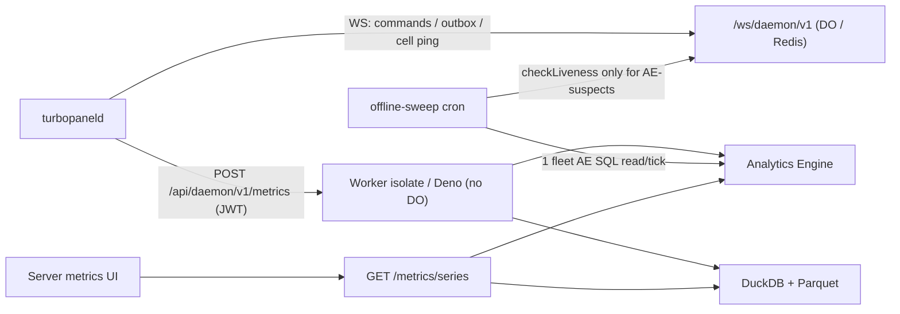

# Server metrics architecture

TurboPanel collects **host metrics** from connected daemons via authenticated `POST /api/daemon/v1/metrics` — one sample per minute per server at the baseline cadence. Metrics is **disposable, statistical, and may be sampled**; it is not a billing ledger or audit trail.

<Callout type="info" title="Canonical source">
  Agent maintenance detail lives in <File path="AGENTS.md" href="https://github.com/TurboPanel/turbopanel/blob/trunk/AGENTS.md">instance/AGENTS.md</File> and <File path="AGENTS.md" href="https://github.com/TurboPanel/turbopaneld/blob/trunk/AGENTS.md">daemon/AGENTS.md</File> (Host metrics).
  Operations: [Metrics deployment](/docs/deployment/metrics).
</Callout>

## Overview

One **versioned wire contract** (`METRICS_SCHEMA_VERSION = 3`) is mirrored in the daemon and instance repos (not build-coupled). Storage is **dual-runtime**:

| Runtime | Store | Backend |
| ------- | ----- | ------- |
| Cloudflare Workers | Analytics Engine | `SERVER_METRICS` binding → `turbopanel_server_host_metrics` dataset |
| Self-hosted Deno | DuckDB + Parquet | `DuckDbParquetServerMetricsStore` (embedded, no port) |

Store selection: `resolveServerMetricsStore` (always on — Workers → Analytics Engine, Deno → DuckDB + Parquet).



Each daemon sample is one to **four** physical data points, not one — see [Metrics v3 contract](#metrics-v3-contract) below for the `parts` split.

HTTP request body (schema v3 — illustrative subset of the 68 metric fields). The mandatory-only shape (`core` + `extended`, e.g. a VM with no hardware sensors and no traffic sidecars):

```json
{
  "type": "metrics",
  "version": 3,
  "at": "2026-07-12T12:00:00.000Z",
  "intervalSeconds": 60,
  "sequence": 42,
  "parts": ["core", "extended"],
  "metrics": { "cpuUserPercent": 8.1, "cpuIdlePercent": 87.5, "load1": 0.8, "..." : "..." },
  "dimensions": { "schemaVersion": 3, "collectionMode": "baseline", "hardwareProfileGeneration": 1, "trafficSources": { "caddy": false, "proxysql": false } }
}
```

A bare-metal host with hardware sensors and both traffic sidecars running declares the two conditional parts too:

```json
{
  "type": "metrics",
  "version": 3,
  "at": "2026-07-12T12:00:00.000Z",
  "intervalSeconds": 60,
  "sequence": 43,
  "parts": ["core", "extended", "sensors", "traffic"],
  "metrics": { "cpuTemperatureCelsius": 52.4, "caddyRequestsTotal": 1204, "proxysqlQueriesTotal": 8831, "..." : "..." },
  "dimensions": { "schemaVersion": 3, "collectionMode": "baseline", "hardwareProfileGeneration": 4, "trafficSources": { "caddy": true, "proxysql": true } }
}
```

`dimensions` always carries `schemaVersion`, `collectionMode`, `hardwareProfileGeneration`, and `trafficSources` (`{ caddy, proxysql }` — which traffic sidecars actually contributed data this tick, independent of whether `"traffic"` is in `parts`); `runtimeMode` is an optional, instance-side-only field. Daemon version, OS, architecture, and kernel release moved to host facts on the `server` row and are no longer wire dimensions.

Scheduling: first sample POSTs immediately on connect (including the co-located self-hosted daemon), a primed second sample ~**2 s** later fills rate metrics (CPU / disk / net), then a **60 s** baseline interval with ≤**5 s** deterministic per-`serverId` phase jitter. On top of the baseline, a UI-requested **live-mode lease** switches the daemon to a **10 s** sampling cadence (`collectionMode: "live"`) for the duration of the lease — capped at **60 minutes** by default, with expiry enforced daemon-side so an abandoned browser tab cannot hold a server in fast sampling. Monotonic process-local `sequence` (resets on daemon restart). Independent of cell ping/`heartbeat` liveness — see daemon `AGENTS.md`. Host metrics are ingested **only** via authenticated `POST /api/daemon/v1/metrics`; WebSocket `{ type: "metrics" }` frames are no longer accepted.

## Metrics v3 contract

`HOST_METRIC_KEYS` is a **named logical allowlist** (schema v3, **68 metrics**) for the wire/API/query surface only — it carries **no positional order**. Physical storage positions are backend-private, defined in each backend's own field-map/schema files, never derived from this list.

Every metric is assigned to exactly one of four `MetricPart`s (`HOST_METRICS_METRIC_DESCRIPTORS[key].part`). `core` and `extended` are **mandatory** — every sample declares them, even when every value in a part is null. `sensors` and `traffic` are **conditional** — a sample declares one only when the daemon actually resolved at least one field for it that tick (hardware sensors detected / a traffic sidecar reachable).

Metrics by family:

| Family | Part | Metrics |
| ------ | ---- | ------- |
| CPU breakdown | `core` | `cpuUserPercent`, `cpuSystemPercent`, `cpuNicePercent`, `cpuIdlePercent`, `cpuIowaitPercent`, `cpuIrqPercent`, `cpuSoftirqPercent`, `cpuStealPercent` |
| Load | `core` | `load1`, `load5`, `load15` |
| Memory | `core` | `memoryTotalBytes`, `memoryAvailableBytes` |
| Swap | `core` | `swapTotalBytes`, `swapFreeBytes` |
| System | `core` | `processCount`, `uptimeSeconds` |
| Storage probes (system / hosting / Docker) | `extended` | `systemStorageTotalBytes`, `systemStorageAvailableBytes`, `hostingStorageTotalBytes`, `hostingStorageAvailableBytes`, `dockerStorageTotalBytes`, `dockerStorageAvailableBytes` |
| Disk throughput / IOPS / latency | `extended` | `diskReadBytesPerSecond`, `diskWriteBytesPerSecond`, `diskReadOpsPerSecond`, `diskWriteOpsPerSecond`, `diskReadLatencyMs`, `diskWriteLatencyMs` |
| Network (classification-keyed) | `extended` | `interfaceReceiveBytesPerSecond`, `interfaceTransmitBytesPerSecond` (the `uplink`-classified aggregate, honestly named on the wire — no more "uplink" framing in the field name itself), `fabricReceiveBytesPerSecond`, `fabricTransmitBytesPerSecond` (TurboFabric-classified aggregate) |
| GPU (mandatory) | `extended` | `gpuTemperatureCelsius`, `gpuPowerWatts` |
| Sensors — CPU | `sensors` | `cpuTemperatureCelsius`, `cpuPowerWatts` |
| Sensors — GPU | `sensors` | `gpuUtilizationPercent`, `gpuFanRpm` |
| Sensors — other temperatures | `sensors` | `disk1TemperatureCelsius`, `disk2TemperatureCelsius`, `ambient1TemperatureCelsius`, `ambient2TemperatureCelsius`, `boardTemperatureCelsius` |
| Sensors — fans | `sensors` | `cpuFanRpm`, `systemFan1Rpm`, `systemFan2Rpm` |
| Network (named NIC slots) | `sensors` | `nic1ReceiveBytesPerSecond`, `nic1TransmitBytesPerSecond`, `nic2ReceiveBytesPerSecond`, `nic2TransmitBytesPerSecond` — operator-assigned `HardwareProfile.nic1`/`.nic2` interfaces, resolved through the same hardware-profile round trip as the sensor slots |
| Traffic — Caddy (hosting ingress) | `traffic` | `caddyRequestsTotal`, `caddyResponses2xxTotal`, `caddyResponses3xxTotal`, `caddyResponses4xxTotal`, `caddyResponses5xxTotal`, `caddyRequestBytesTotal`, `caddyResponseBytesTotal`, `caddyRequestDurationSecondsSum`, `caddyRequestsUnder100msTotal`, `caddyRequestsUnder1sTotal`, `caddyRequestsInFlight` |
| Traffic — ProxySQL | `traffic` | `proxysqlQueriesTotal`, `proxysqlSlowQueriesTotal`, `proxysqlConnectionErrorsTotal`, `proxysqlClientConnections`, `proxysqlBackendConnections`, `proxysqlBackendsUp` |

Note `cpuTemperatureCelsius`/`cpuPowerWatts` live in the conditional `sensors` part alongside the rest of the sensor tree, while `gpuTemperatureCelsius`/`gpuPowerWatts` live in the mandatory `extended` part — an asymmetry in the descriptor map, not a documentation typo.

**Derived, not stored:** usage percentages are computed at query time from the stored components — `cpuUsagePercent = 100 - cpuIdlePercent`, and memory/swap/storage "used" values derive from the total/available/free bytes. Traffic-derived figures follow the same treatment: HTTP error rate and average latency for the Caddy traffic family are computed at query time from the stored response-class and duration-sum counters, never stored as their own fields. The wire and both backends carry only the raw components above (`src/daemon/metrics/query/derived-metrics.ts`).

**Missing values** are `null` on the wire — never coerced to `0`. First-sample rate metrics (disk/network per-second, and the traffic per-interval counter deltas) are `null` until a second delta exists; absent sensors (no temperature/power probe on the host) stay `null` permanently, and a VM with no hwmon simply never declares the `"sensors"` part at all.

## Analytics Engine mapping (Workers)

One AE data point holds only 20 doubles, so each v3 host sample (68 metrics) is written as **two to four** data points — always `blob2 = "core"` and `blob2 = "extended"`, plus `blob2 = "sensors"` and/or `blob2 = "traffic"` only when the daemon declared them in `sample.parts` **and** at least one of that part's metric values actually resolved this tick (a declared-but-entirely-null optional part writes no row at all). Each part holds at most 19 metric values (`CORE_METRIC_KEYS` / `EXTENDED_METRIC_KEYS` / `SENSOR_METRIC_KEYS` / `TRAFFIC_METRIC_KEYS` in `field-map.ts`, derived from `HOST_METRICS_METRIC_DESCRIPTORS[key].part` — never hand-maintained), with `double20 = intervalSeconds` reserved on every part.

The dataset name is **`turbopanel_server_host_metrics`** — brand-new for the four-part conditional layout. AE datasets cannot be deleted or truncated, so a positional-layout change always needs a new name rather than reusing one whose old rows would misparse under the new column meaning. Two retired dataset names are history only and are never queried by current code: `turbopanel_server_metrics` (the original single-datapoint v1/v2 layout) and `turbopanel_server_telemetry` (the two-part core/extended v2 layout this replaces).

| Slot | Content |
| ---- | ------- |
| `indexes[0]` / `index1` | Authenticated `serverId` UUID only — never org, account, hostname, or metric name |
| `double1` … `double19` | Metrics rows: the part's metric values (≤ 19) in that part's key-array order (backend-private); unused trailing slots before `double20` are sentinel-filled, never left as array holes |
| `double20` | Metrics rows (every part): the sample's `intervalSeconds` — the weighting term for `weighted-average` / `last` / `max` aggregates |
| `blob1` | Event type discriminator — `"metrics"` (host sample part) or `"status"` (connection-status transition; see below) |
| `blob2` | Metrics rows: part discriminator `"core"` / `"extended"` / `"sensors"` / `"traffic"` (empty on status rows) |
| `blob3` | Schema version (string, both event types) |
| `blob4` | Collection mode (`"baseline"` / `"live"`) |
| `blob5` | Daemon sample timestamp (wire `at`, ISO string) |
| `blob6` | Daemon sample sequence (stringified integer) |
| `blob7` | Hardware profile generation (stringified integer; sensor/NIC layout epoch) |
| `blob8` | `traffic`-part rows only: comma-joined contributing traffic sources (e.g. `"caddy,proxysql"`); empty on every other part |
| `blob9` … `blob16` | Reserved empty strings on every event type — identities (daemon version, OS/arch/kernel, sensor/interface selections) now live in Postgres, projected onto the `server` row and the hardware-profile record instead |
| `blob17` | Status rows only: transition reason (empty on metrics rows) |
| `blob18` … `blob20` | Reserved empty strings on every event type |

AE doubles have no null. Missing metrics store **`AE_MISSING_METRIC_SENTINEL = -1e308`** — never `0`. All host metrics are ≥ 0, so the sentinel cannot collide. On the AE SQL read path, compare against **`-pow(10, 308)`** (scientific-notation literals and `NULLIF` are not documented for AE SQL).

Host reads filter `blob1 = 'metrics'` plus supported schema versions in `blob3`, then first **recombine the 2-4 part rows into one logical sample per `(index1, timestamp)`** — logical rows without a core part (orphaned extended/sensors/traffic writes) are dropped — before bucket/server aggregation, so `sample_count` / `latest_at` / metric averages all describe the same logical rows. The summary read keeps the same invariant without the recombining subquery: `sample_count` sums only the `core` part's `_sample_interval`, and `latest_at` is scoped to `core` rows so a landed `sensors`/`traffic` orphan write can never advance it past a `core` row `sample_count` doesn't count.

### Connection-status event stream (`blob1 = "status"`)

Every genuine online/offline transition on a `server` row (not a heartbeat or identity-only touch) also writes **one status event**. On Analytics Engine it lands in the same `turbopanel_server_host_metrics` dataset, discriminated from host samples by `blob1`; on self-hosted Deno it lands in a **separate typed `server_status_events` DuckDB table** (never shared with host samples).

| Slot (AE) | Content |
| ---- | ------- |
| `blob1` | `"status"` |
| `blob3` | Schema version (same slot as metrics rows) |
| `blob17` | Transition reason — `"connect"` \| `"disconnect"` \| `"sweep_stale"` \| `"self_heal"` (closed set) |
| `double1` | `1` (connected) or `0` (disconnected) |
| all other doubles/blobs | Missing-metric sentinel / empty string — a status row carries no host metrics and no part discriminator (`blob2` stays empty) |

AE stamps its own ingestion `timestamp` for status rows; DuckDB stores `at` directly (the event's own timestamp). Both backends expose this via `GET /api/client/v1/servers/:id/metrics/connection`, which resolves prior state before the range plus in-range transitions through the shared backend-neutral `computeStatusUptime` parity seam — so AE and DuckDB report identical uptime/downtime numbers for the same query.

**Volume impact is negligible against the write-volume formulas below** — status rows are written only on a state flip (at most a handful per server per day in normal operation), not once per sampling interval like host rows, so they do not materially change the write-volume math in this doc.

<Callout type="warn" title="History-only — never authoritative for liveness">
  This event stream (and the `/metrics/connection` endpoint built on it) exists purely for
  historical uptime/downtime reporting. It is asynchronous, best-effort, and sampled/disposable like
  all server metrics. The Postgres `server.connected` / `server.status_changed_at` columns (see
  [Daemon cell architecture](/docs/architecture/daemon-cell)) are the sole source of truth for
  whether a server is online **right now** — never gate a current-liveness decision on Analytics
  Engine or DuckDB status history.
</Callout>

**Query aggregation** (SQL API): filter `blob1 = 'metrics'` and supported `blob3`; rows under `result.data` (Cloudflare v4 envelope). Two aggregation policies apply, scoped to the part that owns the metric:

**Weighted average** (most metrics — gauges and rates), interval- and sampling-weighted:

```sql
SUM(if(doubleN = -pow(10, 308), 0.0, doubleN * double20 * _sample_interval))
/ SUM(if(doubleN = -pow(10, 308), 0.0, double20 * _sample_interval))
```

**Sum** (monotonic traffic counters — `caddyRequestsTotal` and the other `caddy*Total`/`proxysql*Total` fields): each stored value is already a daemon-computed per-interval delta, a complete total for its own collection interval, so the sum expression weights only by AE's own `_sample_interval` row-sampling correction and **never** by `intervalSeconds` (`double20`) — weighting by both would double-count the interval a delta already spans (`sumExpressionForMetric` vs `weightedAvgExpressionForMetric` in `sql-api.ts`). A bucket where every logical sample lacks the metric's part reports missing, never a fabricated `0` — the same `0.0 / 0.0` (`NaN` → `null`) idiom the weighted-average expression relies on.

Metrics is **sampled** — the weighted-average path always weights by `intervalSeconds` (`double20`) times `_sample_interval`; do not assume one row per minute. The sum path weights only by `_sample_interval`.

**Hosted retention:** Cloudflare Analytics Engine retains data for **3 months**. UI/API max range is 90 days on Workers; do not imply long-term persistence beyond AE retention on hosted deployments.

## DuckDB + Parquet schema (self-hosted)

The Deno path uses `DuckDbParquetServerMetricsStore` over the embedded `@duckdb/node-api` engine — no external service, no port, no credentials. Everything lives under the metrics state root (`TURBOPANEL_METRICS_DIR`, default `<stateDir>/metrics`): `metrics.duckdb` (hot database), `parquet/` (sealed daily partitions), `tmp/` (spill + in-flight exports), `schema-version` (sidecar marker — see [Metrics deployment](/docs/deployment/metrics) for the wipe-on-stale behavior it drives). Schema DDL is idempotent (`CREATE TABLE IF NOT EXISTS` + `CREATE INDEX IF NOT EXISTS`, applied once per open).

**One real typed table per event kind — no positional layout, no sentinel.** Missing metrics are genuine SQL `NULL`s, and columns are named per metric via `metricColumnName` (snake_case, e.g. `cpu_user_percent`). Deliberately one wide table for all four parts rather than a table-per-part split — every metric column is already independently nullable, and a `parts` column (comma-joined declared `MetricPart`s, e.g. `"core,extended,sensors"`) lets a query tell "part never declared" apart from "part declared, every value null" without a join:

| Table | Columns |
| ----- | ------- |
| `server_metric_samples` | `server_id UUID`, `sampled_at TIMESTAMP`, `received_at TIMESTAMP`, `interval_seconds SMALLINT`, `collection_mode VARCHAR`, `hardware_profile_generation SMALLINT` (nullable), `parts VARCHAR NOT NULL`, plus one nullable `DOUBLE` per metric key |
| `server_status_events` | `server_id UUID`, `at TIMESTAMP`, `connected BOOLEAN`, `reason VARCHAR` |

Writes are **batched in-process** into one transaction; queries force-flush pending batches, and the store closes cleanly on SIGINT/SIGTERM so accepted rows persist across a graceful shutdown.

**Daily Parquet archive:** each completed UTC day is sealed out of the hot table into `parquet/server-metrics/year=YYYY/month=MM/day=DD/metrics.parquet` — export to `tmp/`, validate the produced file's row count by re-reading it, atomic rename into the partition tree, and only then delete the hot rows. Interrupted exports are swept on the next tick and never mistaken for sealed partitions. Reads union the hot table with the partitions overlapping the range (`read_parquet([...], union_by_name := true)`), so a query spanning hot and archived days is one logical scan.

Bucket aggregation is per-metric, driven by the same `weighted-average` / `last` / `max` / `sum` policy map both backends share (`HOST_METRICS_METRIC_DESCRIPTORS[key].aggregation`): most gauges use an `interval_seconds`-weighted average over present rows, slow-moving storage capacities keep the latest observed value (`last`), `uptimeSeconds` takes the bucket maximum (`max`), and the monotonic traffic counters plain-total the present rows (`sum`, via `sumValueSql` in `store.ts`) — never weighted by `interval_seconds`, since each stored value is already a per-interval delta. Resolution is chosen at **query time** (no rollup tables or materialized views). Late arrivals and duplicates are accepted — a late sample for an already sealed day is merged on the next archive tick (the partition is rebuilt from the union of the sealed file and the day's hot rows).

Resource caps and configuration:

| Env | Purpose |
| --- | ------- |
| `TURBOPANEL_METRICS_DIR` | Metrics state root override |
| `TURBOPANEL_SERVER_METRICS_RETENTION_DAYS` | Retention days (default **90**) — prunes expired Parquet partitions plus any hot/status rows past the cutoff |
| `TURBOPANEL_SERVER_METRICS_DUCKDB_THREADS` | DuckDB `SET threads` cap (default **2**) |
| `TURBOPANEL_SERVER_METRICS_DUCKDB_MEMORY_LIMIT` | DuckDB `SET memory_limit` in MiB (default **128**) |

## Query API & caching

| Endpoint | Purpose |
| -------- | ------- |
| `GET /api/client/v1/servers/:id/metrics/series` | Time-series buckets for selected metrics |
| `GET /api/client/v1/servers/:id/metrics/summary` | Aggregated summary for a range |
| `GET /api/client/v1/servers/:id/metrics/connection` | Uptime/downtime history from the status event stream (history-only — see above) |
| `GET /api/client/v1/servers/metrics/latest` | One fleet snapshot (CPU / memory / swap % over a fixed ~10 min lookback) for the org servers overview — never N per-server chart calls |

Session + server read grant required. **One combined backend query** per `(server, range)` — not per metric or chart.

**Resolution ladder:** range ≤ 10 min → 10 s; ≤ 1 h → 60 s; ≤ 6 h → 300 s; ≤ 24 h → 900 s; ≤ 7 d → 3600 s; ≤ 30 d → 21600 s; else 43200 s. Max **`MAX_METRICS_POINTS` = 1500** points; range ≤ **90 days**.

**Aggregation policy** is interval-aware and per-metric (`weighted-average` / `last` / `max` / `sum` descriptors) rather than a flat average — most gauges bucket as `intervalSeconds`-weighted averages, `uptimeSeconds` uses `max` semantics, and monotonic traffic counters use `sum` semantics (see the Analytics Engine mapping section above for the query-level distinction).

**Chart cache:** key includes authorized `serverId`, bucket-rounded range, sorted metrics, resolution, backend, and `v{schemaVersion}` (schema v3) — plus `g{hardwareProfileGeneration}` when a caller scopes a request to one generation, omitted otherwise so it never collides with a full-range entry. TTL: live **45 s** / historical **300 s**.

`/series` and `/summary` (never the O(1) fleet-latest route) also attach a `cpuLimits` thermal/power-headroom envelope and the resolved `temperatureUnit`; `/series` additionally attaches `sensorsAvailable`, `generationBreaks`, and `hardwareProfileGenerations` so the UI can segment charts around a hardware-profile change instead of drawing a misleading continuous line across it.

## Cost model

Metrics ingestion runs on the normal Worker isolate (or Deno process) and **no longer incurs Durable Object GB-sec** — see [Daemon Cell](/docs/architecture/daemon-cell) for DO billing. The Analytics Engine price constants, limits, and formulas below remain the single source of truth for AE cost planning.

<Callout type="warn" title="Verified: 3 September 2026 (Cloudflare docs updated 2026-04-23); currently not billed">
  Cloudflare states Analytics Engine is **currently not billed**. The constants below are for
  capacity planning only — not product pricing. TurboPanel product tiers remain on{' '}
  <a href="https://turbopanel.io/pricing">turbopanel.io/pricing</a>.
</Callout>

### Cloudflare Analytics Engine limits & prices

| Item | Workers Paid | Workers Free |
| ---- | ------------ | ------------ |
| **Writes** | 10M/mo included, then **$0.25/M** | 100k/day |
| **Reads** (SQL API) | 1M/mo included, then **$1.00/M** | 10k/day |
| **Retention** | **3 months** | **3 months** |
| Per `writeDataPoint` | ≤ 250 data points/invocation; ≤ 20 doubles, 20 blobs, 1 index; blobs ≤ 16 KB; index ≤ 96 B | same |

All **68 metrics = two to four** `writeDataPoint` calls per sample — `core` + `extended` always, plus `sensors` and/or `traffic` when declared and non-empty — still well under the 250-datapoint-per-invocation cap.

### Write volume formulas

Row count per sample depends on which optional parts a server's daemon declares:

| Profile | Parts written | Rows/sample |
| ------- | -------------- | ----------- |
| VM, no hardware sensors, no traffic sidecars | `core`, `extended` | **2** |
| Bare metal, sensors detected, no hosting proxy | `core`, `extended`, `sensors` | **3** |
| Bare metal, sensors detected, hosting proxy running | `core`, `extended`, `sensors`, `traffic` | **4** |

| Constant | Value |
| -------- | ----- |
| Samples per server per day | `86400 / intervalSeconds` = **1,440** @ 60 s |
| AE writes per server per day | `rowsPerSample × 1,440` — **2,880 / 4,320 / 5,760** @ 60 s for the three profiles above |
| Monthly AE writes (one server) | `rowsPerSample × (2,592,000 / intervalSeconds)` = `rowsPerSample × 43,200` @ 60 s |
| Included write allowance | **10,000,000**/mo |
| Write overage cost | `max(0, monthlyWrites − 10,000,000) / 1,000,000 × $0.25` |

**Break-even connected-server count (60 s interval, 24×7) per profile:**

| Profile | Rows/sample | Monthly writes/server | Break-even servers |
| ------- | ----------- | ---------------------- | ------------------- |
| VM, no traffic | 2 | 86,400 | ≈ **115** |
| Bare metal, no hosting proxy | 3 | 129,600 | ≈ **77** |
| Bare metal + hosting proxy | 4 | 172,800 | ≈ **57** |

Live 10 s mode adds short bursts of 6× write volume per leased server, but each session is bounded by the **60-minute** lease cap (at most a few thousand extra writes per session, scaled by the same rows-per-sample factor) — negligible against the monthly totals above.

### Read volume (dashboards)

Reads scale with **dashboard views ÷ cache TTL** (live 45 s / historical 300 s), **not** chart count or fleet size — one combined query per server/range/resolution, cache-collapsed.

| Item | Value |
| ---- | ----- |
| Included SQL reads | **1,000,000**/mo |
| Read overage | `$1.00` per million |

### Worked examples (60 s interval, all servers connected 24×7)

| Connected servers | Profile | Rows/sample | Monthly writes | Write overage | Est. write cost/mo |
| ------------------ | ------- | ----------- | --------------- | -------------- | -------------------- |
| 100 | VM, no traffic | 2 | 8,640,000 | 0 | $0.00 |
| 100 | Bare metal, no proxy | 3 | 12,960,000 | 2,960,000 | $0.74 |
| 100 | Bare metal + proxy | 4 | 17,280,000 | 7,280,000 | $1.82 |
| 1,000 | VM, no traffic | 2 | 86,400,000 | 76,400,000 | $19.10 |
| 1,000 | Bare metal, no proxy | 3 | 129,600,000 | 119,600,000 | $29.90 |
| 1,000 | Bare metal + proxy | 4 | 172,800,000 | 162,800,000 | $40.70 |
| 5,000 | VM, no traffic | 2 | 432,000,000 | 422,000,000 | $105.50 |
| 5,000 | Bare metal, no proxy | 3 | 648,000,000 | 638,000,000 | $159.50 |
| 5,000 | Bare metal + proxy | 4 | 864,000,000 | 854,000,000 | $213.50 |

Cloudflare **currently does not bill** Analytics Engine — treat overage dollars as planning figures until billing activates.
