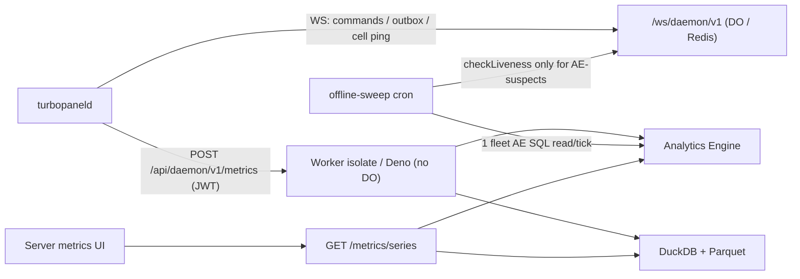

# Server metrics architecture

TurboPanel collects **host metrics** from connected daemons via authenticated `POST /api/daemon/v1/metrics` — one sample per minute per server, every family on every sample. Metrics is **disposable, statistical, and may be sampled**; it is not a billing ledger or audit trail.

<Callout type="info" title="Canonical source">
  What each console chart means: [Server metrics](/docs/metrics). The five PSI stall-time percentages are explained there under [Pressure Stall Information](/docs/metrics#pressure-stall-information).
  Agent maintenance detail lives in <File path="AGENTS.md" href="https://github.com/TurboPanel/turbopanel/blob/trunk/src/daemon/metrics/AGENTS.md">instance/src/daemon/metrics/AGENTS.md</File> and <File path="AGENTS.md" href="https://github.com/TurboPanel/turbopaneld/blob/trunk/src/metrics/AGENTS.md">daemon/src/metrics/AGENTS.md</File>.
  Operations: [Metrics deployment](/docs/deployment/metrics). Which tier a server lands on and what that entitles: [License tiers](/docs/deployment/tiers).
</Callout>

## Overview

One **versioned wire contract** (`METRICS_SCHEMA_VERSION = 6`) is mirrored in the daemon and instance repos (not build-coupled). Ingest rejects any sample whose `metadata.version` is not `6`; there is no dual-accept and no migration. The contract groups metrics **by entity** — host, network device, filesystem, block device, GPU, hardware signal, ingress source, database proxy — plus four **host-wide singletons** (diagnostics, router, storage accounting, Docker usage) that carry no entity id. Every leaf value is `number | null` (missing is always `null`, never coerced to `0`), and every entity carries a stable logical id instead of relying on positional membership in an allowlist. Storage is **dual-runtime**:

| Runtime | Store | Backend |
| ------- | ----- | ------- |
| Cloudflare Workers | Analytics Engine | `SERVER_METRICS` binding → `turbopanel_server_metrics_v6` dataset |
| Self-hosted Deno | DuckDB + Parquet | one typed table per family (embedded, no port) |

Store selection: `resolveServerMetricsStore` (always on — Workers → Analytics Engine, Deno → DuckDB + Parquet).



Every sample writes **two mandatory rows** — `host.system` and `host.io` — plus one row for each family actually **present** on that host this tick. See [Metrics v6 contract](#metrics-v6-contract) below.

HTTP request body (schema v6 — illustrative subset). The minimal shape (a VM with one NIC, no GPU, no managed-service sidecars, before the daemon's first storage walk completes):

```json
{
  "type": "metrics",
  "metadata": {
    "version": 6,
    "sampledAt": "2026-09-07T12:00:00.000Z",
    "intervalSeconds": 60,
    "sequence": 42,
    "topologyGeneration": 1,
    "bootGeneration": 1
  },
  "host": {
    "cpu": { "busyPercent": 8.1, "userPercent": 5.2, "systemPercent": 2.9, "saturatedCoreCount": 0, "...": "..." },
    "kernel": { "fileHandlesUsedPercent": 3.1, "conntrackUsedPercent": null },
    "memory": { "usedBytes": 1610612736, "cachedFilesBytes": 536870912, "swapUsedBytes": 0, "...": "..." },
    "storage": { "diskReadBytesPerSecond": 102400, "diskWriteBytesPerSecond": 51200, "diskLatencyMs": 0.4, "...": "..." },
    "network": { "tcpRetransmitPercent": 0.02, "softnetDropsPerSecond": 0 }
  },
  "networks": [{ "deviceId": "eth0", "receiveBytesPerSecond": 12000, "transmitBytesPerSecond": 8000, "...": "..." }],
  "filesystems": [],
  "blockDevices": [],
  "gpus": [],
  "hardwareSignals": [],
  "ingressSources": [],
  "databaseProxies": [],
  "events": [],
  "diagnostics": {
    "cpu": { "averageFrequencyMHz": 2400, "contextSwitchesPerSecond": 1800, "...": "..." },
    "memory": { "memoryFreeBytes": 268435456, "dirtyBytes": 4096, "...": "..." }
  }
}
```

A bare-metal hosting box with a GPU, a site Caddy, the shared hosting router, and hardware sensors declares the corresponding entity arrays and singletons — presence is what drives extra rows, not a declared allowlist. GPU and drive temperatures are **signals**, not fields on the `gpus[]` / `blockDevices[]` entries:

```json
{
  "networks": [{ "deviceId": "eth0" }, { "deviceId": "eth1" }],
  "gpus": [{ "gpuId": "gpu0", "utilizationPercent": 34.2, "memoryUsedBytes": 8589934592, "...": "..." }],
  "hardwareSignals": [
    { "signalId": "coretemp:Package id 0", "kind": "temperature", "value": 58.5 },
    { "signalId": "gpu0:temperature", "kind": "temperature", "value": 61 },
    { "signalId": "nvme0n1:temperature", "kind": "temperature", "value": 41 },
    "..."
  ],
  "ingressSources": [{ "sourceId": "caddy", "sourceKind": "caddy", "requests": 744, "bucket10ms": 512, "...": "..." }],
  "router": { "backendsUp": 11, "backendsTotal": 12, "retries": 0, "tlsCertSoonestExpiryDays": 45, "...": "..." },
  "storage": { "hostingUsedBytes": 53687091200, "hostingFreeBytes": 429496729600, "dockerUsedBytes": 21474836480, "...": "..." },
  "dockerUsage": { "layersBytes": 17179869184, "imagesCount": 42, "volumesReclaimableBytes": 0, "...": "..." }
}
```

Scheduling: first sample POSTs immediately on connect (including the co-located self-hosted daemon), a primed second sample ~**2 s** later fills rate metrics (CPU / disk / net), then a **60 s** baseline interval with ≤**5 s** deterministic per-`serverId` phase jitter. On top of the baseline, a UI-requested **live-mode lease** switches the daemon to a **10 s** sampling cadence for the duration of the lease — capped at **60 minutes** by default, with expiry enforced daemon-side so an abandoned browser tab cannot hold a server in fast sampling. **Live samples are never stored on either backend**: while any lease is active the sample lands in a short-lived buffer the live chart reads from, and the durable write is skipped. The `intervalSeconds` on the wire is the only cadence marker — there is no collection-mode flag. Monotonic process-local `metadata.sequence` (resets on daemon restart). Independent of cell ping/`heartbeat` liveness — see daemon `AGENTS.md`. Host metrics are ingested **only** via authenticated `POST /api/daemon/v1/metrics`; WebSocket `{ type: "metrics" }` frames are not accepted.

## Metrics v6 contract

The contract has no `MetricPart`/19-slot-per-part allowlist coupling. Metrics are grouped into **families** (`HostedFamily` in `metric-descriptors.ts`), each one either **universal** (always emitted, even if every value is null), **presence-gated** (emitted only when the source entity array or singleton is populated), or **capability-gated** (emitted only up to what the resolved `MetricsCapabilityPlan` allows). There is **one cadence**: every family writes on every 60 s sample. No family is decimated, demoted to a slower tier, or held over across empty buckets.

| Family | Gating | Entity scope | Metrics |
| ------ | ------ | ------------ | ------- |
| `host.system` | Universal | host (no entity id) | 19 — CPU (11: busy/user/system/iowait/steal/softirq/pressure-some/saturated-core-count/procs-running/procs-blocked/process-count), memory (8: used/cached-files/swap-used/pressure-some/pressure-full/swap-in/swap-out/major-page-faults) |
| `host.io` | Universal | host (no entity id) | 11 — kernel (2: file-handles-used%, conntrack-used%), storage (7: io-pressure-some/full, disk read/write bytes, one combined disk latency, root-fs available bytes/free inodes), network (2: TCP retransmit%, softnet drops/s) — plus the two embedded monitored-NIC slots |
| `host.diagnostics` | Presence-gated, **granted at every tier** | host (no entity id) | 19 — CPU (7: avg/min/max frequency, context switches/s, interrupts/s, forks/s, IRQ%) + memory (12: free, cached, anon, slab reclaimable/unreclaimable, dirty, writeback, shmem, committed, direct/kswapd scan rates, compaction stalls/s). Replaces v5's two capability-gated `cpu.detail`/`memory.detail` rows with one always-on row |
| `gpu` | Presence-gated + `gpuSlots` | one row per page of `gpus[]` | 6 per GPU — utilization%, memory used bytes, memory activity%, PCIe rx/tx bytes/s, throttle%. Temperatures and power moved to `hardware.physical` |
| `network` | Presence-gated + `normalNicSlots` (NICs beyond the two embedded in `host.io`) | one row per page of the non-embedded `networks[]` | 6 per NIC — rx/tx bytes/s, rx/tx errors/s, rx/tx drops/s |
| `filesystem` | Presence-gated + `extraFilesystemSlots` | one row per page of `filesystems[]` | 2 per filesystem — available bytes, free inodes |
| `block` | Presence-gated + `detailedBlockDeviceSlots` | one row per page of `blockDevices[]` | 8 per device — read/write bytes+ops/s, read/write latency ms, utilization%, queue depth. Drive temperature moved to `hardware.physical` |
| `hardware.physical` | Presence-gated + `physicalHardwareSignalSlots` — **physical machines only**, never emitted on a VM | one row per page of `hardwareSignals[]` | 1 per signal (`value`) — every temperature and power reading in the contract: CPU package temp/power, board temps, storage temps, per-GPU temp / memory temp / power, per-service-drive temp. Fan RPM is not a signal |
| `managed.ingress` | Presence-gated + `managedIngressEnabled` | one unpaged row per `ingressSources[]` entry (**Caddy only**) | 19 — requests, response class counts (2xx/3xx/4xx/5xx), request errors, request/response bytes, a raw per-interval duration **sum**, six cumulative latency buckets (≤10ms/50ms/100ms/500ms/1s/5s), in-flight, upstreams healthy/total, retries |
| `managed.router` | Presence-gated + `managedIngressEnabled` | host (no entity id) — the shared hosting Traefik | 12 — backends up/total, services, routers, retries, backend 5xx, backend latency avg + requests, open connections, config reloads + age, soonest TLS expiry (7 spare slots) |
| `managed.database_proxy` | Presence-gated + `databaseProxyMetricsEnabled` | one unpaged row per `databaseProxies[]` entry (ProxySQL) | 17 — queries, slow queries, query/backend latency avg, active transactions, client connections + created/aborted, rejected at max-connections, backend connections + created/aborted, connection errors, backends up/total, bytes from/to backends (2 spare slots) |
| `managed.storage` | Presence-gated, **granted at every tier** | host (no entity id) | 19 — hosting/backup/Docker/logs used bytes, hosting/backup/logs free bytes, then a postgres/mysql/mariadb census (instances running + healthy, connections used + max per engine). Absent until the daemon's first directory walk completes |
| `managed.docker` | Presence-gated + `managedDockerEnabled` (**S2 and up**) | host (no entity id) | 10 — layer bytes, image count + reclaimable bytes, container bytes + count, volume bytes + count + reclaimable, build-cache bytes + reclaimable (9 spare slots) |

**Entitlement vs. emission are distinct.** A capability-plan slot count (`gpuSlots: 2`) is what a server is *allowed* to report; whether it emits rows depends entirely on whether the daemon found that hardware. A server entitled to two GPUs with none installed emits zero `gpu` rows. Entitlement caps *how many* entities may be reported; presence decides *whether* a family is emitted at all this tick. The same split applies everywhere — `physicalHardwareSignalSlots` is 19 on a physical machine (11 on the entry tier) and 0 on a VM, but a physical host with no working sensors still emits nothing for `hardware.physical`. Hosted ingest enforces the ceiling with `truncateSampleToCapabilityPlan`; self-hosted ingest skips truncation entirely.

### Pressure Stall Information (PSI) [#pressure-stall-information]

The five `*Pressure*Percent` fields on `host.system` and `host.io` are Linux **Pressure Stall Information**. They are **not** utilization: each is the share of that sample's wall clock during which tasks were stalled on CPU, memory, or disk (from the kernel `total` counter in `/proc/pressure/`, never the kernel's `avg10`/`avg60`/`avg300` windows).

| Field | Means |
| ----- | ----- |
| `host.cpu.pressureSomePercent` | At least one task waited for a CPU |
| `host.memory.pressureSomePercent` | At least one task waited for RAM (reclaim, compaction, or swap) |
| `host.memory.pressureFullPercent` | Every non-idle task waited for RAM — the machine stalled |
| `host.storage.ioPressureSomePercent` | At least one task waited on disk |
| `host.storage.ioPressureFullPercent` | Every non-idle task waited on disk — the machine stalled |

**Some** is contention. **Full** (memory and I/O only) is a stall. CPU has no Full series — a CPU is never completely stalled the way memory and disk can be. Unsupported kernels omit `/proc/pressure/` and those fields stay `null`. How to read the charts: [Pressure Stall Information](/docs/metrics#pressure-stall-information).

### Memory diagnostics [#memory-diagnostics]

The memory half of `host.diagnostics` is the **Memory detail** group — what RAM is made of, and whether the kernel is working to free some. These are **not** a second used-%: they are `/proc/meminfo` gauges and `/proc/vmstat` reclaim rates, reported on every Linux host. Operator reading: [Memory detail](/docs/metrics/memory#memory-detail).

| Field | Chart | Means |
| ----- | ----- | ----- |
| `diagnostics.memoryFreeBytes` | [Free & cached](/docs/metrics/memory#memory-detail-primary) | Truly unused pages. Low free is normal — Linux spends idle RAM on cache |
| `diagnostics.cachedBytes` | [Free & cached](/docs/metrics/memory#memory-detail-primary) | Raw page cache (`Cached`). Not the same series as overview `cachedFilesBytes` |
| `diagnostics.anonPagesBytes` | [Free & cached](/docs/metrics/memory#memory-detail-primary) | Process heap/stack. The leak line; this is what becomes swap |
| `diagnostics.slabReclaimableBytes` | [Slab](/docs/metrics/memory#memory-detail-slab) | Kernel caches it can drop |
| `diagnostics.slabUnreclaimableBytes` | [Slab](/docs/metrics/memory#memory-detail-slab) | Kernel objects that stay until their owner is gone |
| `diagnostics.dirtyBytes` | [Dirty & writeback](/docs/metrics/memory#memory-detail-dirty) | File pages modified in RAM, not yet written |
| `diagnostics.writebackBytes` | [Dirty & writeback](/docs/metrics/memory#memory-detail-dirty) | Pages the kernel is writing to disk right now |
| `diagnostics.shmemBytes` | [Shared memory](/docs/metrics/memory#memory-detail-other-gauges) | `tmpfs` / POSIX shm / some container overlays — used RAM no single process owns |
| `diagnostics.committedAsBytes` | [Committed](/docs/metrics/memory#memory-detail-commit) | Virtual memory promised to processes (overcommit). Can exceed RAM |
| `diagnostics.pageScanDirectPerSecond` | [Page reclaim](/docs/metrics/memory#memory-detail-reclaim) | A process had to reclaim for itself — that allocation stalls |
| `diagnostics.pageScanKswapdPerSecond` | [Page reclaim](/docs/metrics/memory#memory-detail-reclaim) | Background reclaim. Healthier than direct scan |
| `diagnostics.compactionStallsPerSecond` | [Compaction stalls](/docs/metrics/memory#memory-detail-compaction) | A process waited while the kernel packed fragmented pages |

**Missing values** are `null` on the wire — never coerced to `0`. First-sample rate metrics are `null` until a second delta exists; a metric a host genuinely doesn't support (no temperature probe, no swap configured, no `/proc/pressure/`) stays `null` permanently. The twelve per-engine census fields on `managed.storage` are `null` for an engine the host does not run, and for every engine until the daemon's first managed-engine census lands; an engine with instances present reports real counts, including `0` running.

**Retired since v4:** `host.cpu.maxCoreBusyPercent` → `saturatedCoreCount` (cores at or above 90% busy); `host.memory.availableBytes` → `usedBytes` + `cachedFilesBytes`; `host.storage.diskReadLatencyMs` + `diskWriteLatencyMs` → one `diskLatencyMs`; `host.storage.maxBlockDeviceUtilPercent` removed; `gpu.temperatureCelsius` / `memoryTemperatureCelsius` / `powerWatts` and `block.temperatureCelsius` moved to `hardware.physical`; `cpu.detail` + `memory.detail` merged into `host.diagnostics` (seven memory fields dropped: page tables, kernel stack, commit limit, and the four active/inactive splits); `cpu.core.live` and the NUMA reservation deleted outright; `collectionMode` removed from the metadata.

## Topology generations

Every sample carries `metadata.topologyGeneration` and `metadata.bootGeneration`. `topologyGeneration` bumps only when the daemon's enumerated entity set (NICs, GPUs, filesystems, block devices, hardware signals) actually changes shape — a NIC replaced, a GPU added, a disk removed — not on every value change. The ingest route resolves a `SlotMapping` for the sample's own `topologyGeneration` (`client/servers/topology-slot-mapping.ts`) and threads it through packing so:

- `host.io`'s two embedded NIC slots (see below) stay pinned to `SlotMapping.normalNicSlot1`/`.normalNicSlot2`'s `deviceId`, not raw array position — a 2-NIC host with a TurboFabric mesh interface stays at 2 rows even though `networks[]` has 3 entries, because the fabric device is in `SlotMapping.fabricDeviceIds` and never pages as a `network` row.
- Every paged family (`gpu`/`network`/`filesystem`/`block`/`hardware.physical`) orders entities by the matching `SlotMapping.*PageOrder` list, and stamps each page's contributing entity ids so a stored row is self-describing regardless of which generation produced it — a query never needs to reinterpret a page's identity under a later generation's mapping.
- With no resolved generation yet (first sample, resync pending), packing falls back to positional order gracefully rather than dropping data.

Every stored row also carries the sample's own `topologyGeneration`, so a UI can segment charts around a topology change the same way v3 segmented around a hardware-profile-generation change. Capacity totals (memory, swap, root filesystem) live on the generation record, never in a sample, so a percentage from last week is still divided by last week's capacity after a RAM upgrade.

## Events

A closed catalog of ~37 discrete state-change/fault kinds (`MetricEventKind`) is distinct from the continuous numeric families above — OOM kills, hung tasks, filesystem state changes, SMART/NVMe/RAID faults, NIC link flaps, TurboFabric mesh state, fan/thermal/PSU/voltage/ECC faults, GPU Xid/ECC/retirement/thermal faults, clock-sync loss, and topology/boot-generation bumps. Each kind is classified once as a physical-hardware-health signal or not (`HARDWARE_HEALTH_EVENT_KIND`) — the split `hardwareHealthEventsEnabled` in the capability plan actually gates; OS/kernel conditions, filesystem state, TurboFabric state, clock-sync state, and generation bumps always survive a plan that disables hardware-health events. Every event writes its own `"event"`-kind AE row (see the envelope table below), and self-hosted Deno writes them to a dedicated `server_metric_events` table.

## Analytics Engine mapping (Workers)

One AE data point holds only 20 doubles, so a sample writes **two or more** data points depending on which families are present. `host.system` and `host.io` are always emitted — one row each, even if every value is missing. Every paged family packs `AE_METRIC_DOUBLE_SLOT_COUNT = 19` metric-value slots per row: `entitiesPerPage = floor(19 / fieldsPerEntity)`, so a family whose entities need more double slots fits fewer per page.

| Family | Fields per entity | Entities per page | Page-count formula |
| ------ | ------------------ | ------------------ | ------------------- |
| `gpu` | 6 | 3 | `ceil(gpus.length / 3)` |
| `network` (beyond the 2 NICs embedded in `host.io`) | 6 | 3 | `ceil(pagedNetworks.length / 3)` |
| `filesystem` | 2 | 9 | `ceil(filesystems.length / 9)` |
| `block` | 8 | 2 | `ceil(blockDevices.length / 2)` |
| `hardware.physical` | 1 | 19 | `ceil(hardwareSignals.length / 19)` |

`managed.ingress` and `managed.database_proxy` have no paging concept — one unpaged row per source entry, since a managed-service sidecar count is small and unbounded paging would add no value. `host.diagnostics`, `managed.router`, `managed.storage`, and `managed.docker` are **single fixed-shape rows** per sample — one hosting root, one Docker daemon, one shared router per host — and carry no entity identity.

The dataset name is **`turbopanel_server_metrics_v6`**. The Wrangler binding is **`SERVER_METRICS`**.

| Slot | Content |
| ---- | ------- |
| `indexes[0]` / `index1` | Authenticated `serverId` UUID only — never org, account, hostname, or metric name |
| `double1` … `double19` | `"metrics"` rows: that row's metric values in the family's declared field order (backend-private); unused trailing slots are sentinel-filled, never left as array holes. `host.io` lays out kernel (`double1`–`2`), storage (`double3`–`9`), a spare, network (`double11`–`12`), a spare, then embeds its two monitored-NIC-slot readings (3 values each — receive bytes/s, transmit bytes/s, a combined problem-packets/s figure) at `double14`..`double19` |
| `double20` | Every `"metrics"` and `"event"` row: the sample's `intervalSeconds` — the weighting term for `weighted-average` / `last` / `max` aggregates |
| `blob1` | Row-kind discriminator — `"metrics"` / `"event"` / `"status"` |
| `blob2` | `"metrics"` rows: the `HostedFamily`; `"event"` rows: the event's kind; empty on `"status"` rows |
| `blob3` | Schema version (string, every row kind) |
| `blob4` | Reserved — always empty in v6. v5 stamped the collection mode here; cadence is now carried by `intervalSeconds` alone |
| `blob5` | `"metrics"` rows: `metadata.sampledAt`; `"event"` rows: the event's own `at`; empty on `"status"` rows (AE stamps its own ingestion timestamp there) |
| `blob6` | Sample sequence (stringified integer); empty on `"status"` rows |
| `blob7` | `metadata.topologyGeneration` (stringified integer); empty on `"status"` rows |
| `blob8` | The capability-plan generation ingest resolved the sample under (stringified integer); empty only when plan resolution did not run |
| `blob9` | Page index within a paged family (`"0"` for unpaged rows) |
| `blob10` | Family-conditional: `sourceId` for `managed.ingress`/`managed.database_proxy` rows, comma-joined per-page entity ids for `gpu`/`network`/`filesystem`/`block`/`hardware.physical` rows, the event's `source` for `"event"` rows, empty on `host.system`/`host.io` and on the four host-wide singletons |
| `blob11` | `"event"` rows only: `event.entityId` |
| `blob12` | `"event"` rows only: `JSON.stringify(event.payload)` |
| `blob13` | `"event"` rows only: `event.eventId` |
| `blob14` … `blob16` | Reserved empty on every row kind |
| `blob17` | `"status"` rows: transition reason. `"event"` rows: the event's severity. Empty on `"metrics"` rows |
| `blob18` … `blob20` | Reserved empty on every row kind |

AE doubles have no null. Missing metrics store **`AE_MISSING_METRIC_SENTINEL = -1e308`**. All host metrics are ≥ 0, so the sentinel cannot collide. On the AE SQL read path, compare against **`-pow(10, 308)`**.

### Connection-status event stream (`blob1 = "status"`)

Every genuine online/offline transition on a `server` row also writes **one status event**. On Analytics Engine it lands in the same `turbopanel_server_metrics_v6` dataset, discriminated by `blob1`; on self-hosted Deno it lands in a separate typed `server_status_events` DuckDB table (never shared with sample tables).

<Callout type="warn" title="History-only — never authoritative for liveness">
  This event stream (and the `/metrics/connection` endpoint built on it) exists purely for
  historical uptime/downtime reporting. It is asynchronous, best-effort, and sampled/disposable like
  all server metrics. The Postgres `server.connected` / `server.status_changed_at` columns (see
  [Daemon cell architecture](/docs/architecture/daemon-cell)) are the sole source of truth for
  whether a server is online **right now** — never gate a current-liveness decision on Analytics
  Engine or DuckDB status history.
</Callout>

**Hosted retention:** Cloudflare Analytics Engine retains data for **3 months**. UI/API max range is 90 days on Workers; do not imply long-term persistence beyond AE retention on hosted deployments.

## DuckDB + Parquet schema (self-hosted)

The Deno path uses the embedded `@duckdb/node-api` engine — no external service, no port, no credentials. Everything lives under the metrics state root (`TURBOPANEL_METRICS_DIR`, default `<stateDir>/metrics`): `metrics.duckdb` (hot database), `parquet/` (sealed daily partitions, one subtree per family), `tmp/` (spill + in-flight exports), and a sidecar schema marker (`DUCKDB_SCHEMA_MARKER_VERSION` **8**). The marker number is intentionally **not** the wire schema version: `METRICS_SCHEMA_VERSION = 6` counts contract revisions, while the marker counts on-disk layout generations of the self-hosted store and bumps whenever DDL widens or adds a table (every statement is `CREATE TABLE IF NOT EXISTS`, so an unbumped marker would silently keep an older, narrower table). v6 wire samples land in layout **8** — the two numbers are expected to differ and are never reconciled. A missing, corrupt, or non-matching marker discards those files and the current store is created on the next open — there is no in-place migration. See [Metrics deployment](/docs/deployment/metrics).

**One real typed table per family — no positional layout, no sentinel.** Missing metrics are genuine SQL `NULL`s. DuckDB writes one row per entity with named nullable columns — 24 drives is 24 rows, not 12 packed pages; AE paging is a Cloudflare-only concern. The current layout:

| Table | Family |
| ----- | ------ |
| `server_host_samples` | `host.system` + `host.io` + the CPU half of `host.diagnostics` (`cpu_diagnostics_*` columns), one wide row |
| `server_memory_diagnostics_samples` | the memory half of `host.diagnostics` |
| `server_network_samples` | `network` |
| `server_filesystem_samples` | `filesystem` |
| `server_block_samples` | `block` |
| `server_gpu_samples` | `gpu` |
| `server_hardware_signal_samples` | `hardware.physical` |
| `server_ingress_samples` | `managed.ingress` |
| `server_router_samples` | `managed.router` (one row per sample, no entity id) |
| `server_database_proxy_samples` | `managed.database_proxy` |
| `server_storage_samples` | `managed.storage` (one row per sample) |
| `server_docker_samples` | `managed.docker` (one row per sample) |
| `server_metric_events` | events |
| `server_status_events` | connection-status transitions (never sealed to Parquet — retention prunes its hot rows directly) |

The v5 `server_cpu_hotspot_samples`, `server_cpu_core_samples`, and `server_memory_detail_samples` tables no longer exist.

**Daily Parquet archive:** each completed UTC day is sealed independently **per family** into `parquet/<family-subdir>/year=YYYY/month=MM/day=DD/metrics.parquet` — export to `tmp/`, validate the produced file's row count by re-reading it, atomic rename into the partition tree, and only then delete that family's hot rows. Resealing a day that already has a partition (late arrivals) merges the existing sealed rows with the new hot rows, keeping archiving idempotent and one-file-per-day per family. Live samples never reach these tables, so a day's partition holds baseline-cadence rows only.

Resource caps and configuration:

| Env | Purpose |
| --- | ------- |
| `TURBOPANEL_METRICS_DIR` | Metrics state root override |
| `TURBOPANEL_SERVER_METRICS_RETENTION_DAYS` | Retention days (default **90**) — prunes expired Parquet partitions plus any hot/status rows past the cutoff |
| `TURBOPANEL_SERVER_METRICS_DUCKDB_THREADS` | DuckDB `SET threads` cap (default **2**) |
| `TURBOPANEL_SERVER_METRICS_DUCKDB_MEMORY_LIMIT` | DuckDB `SET memory_limit` in MiB (default **128**) |

## Query API & caching

| Endpoint | Purpose |
| -------- | ------- |
| `GET /api/client/v1/servers/:id/metrics/series` | Time-series buckets for selected metrics |
| `GET /api/client/v1/servers/:id/metrics/summary` | Aggregated summary for a range |
| `GET /api/client/v1/servers/:id/metrics/connection` | Uptime/downtime history from the status event stream (history-only — see above) |
| `GET /api/client/v1/servers/metrics/latest` | One fleet snapshot for the org servers overview — never N per-server chart calls |

Session + server read grant required. **One combined backend query** per `(server, range)` — not per metric or chart.

**Derived at read time, never stored:** used-percent figures (memory, swap, root filesystem) divide by the capacity of the generation each bucket was sampled under; ingress latency mean and p50/p90/p99 come from the stored duration sum and six bucket counters. Sums and counts add cleanly across any window, so a 5-minute view and a 24-hour view use identical math — a stored per-minute percentile could not be re-bucketed that way.

**Resolution ladder:** range ≤ 10 min → 10 s; ≤ 1 h → 60 s; ≤ 6 h → 300 s; ≤ 24 h → 900 s; ≤ 7 d → 3600 s; ≤ 30 d → 21600 s; else 43200 s. Max **`MAX_METRICS_POINTS` = 1500** points; range ≤ **90 days**.

**Chart cache:** key includes authorized `serverId`, bucket-rounded range, sorted metrics, resolution, backend, and `v{schemaVersion}` (schema v6) — plus the sample's `topologyGeneration` when a caller scopes a request to one generation, so cache entries never blur rows from two different topology shapes together. TTL: live **45 s** / historical **300 s**.

## Cost model

Metrics ingestion runs on the normal Worker isolate (or Deno process) and **incurs no Durable Object GB-sec** — see [Daemon Cell](/docs/architecture/daemon-cell) for DO billing. The Analytics Engine price constants and formulas below are the single source of truth for AE cost planning; no other page restates them.

<Callout type="warn" title="Verified: 7 September 2026 (Cloudflare docs updated 2026-04-23); currently not billed">
  Cloudflare states Analytics Engine is **currently not billed**. The constants below are for
  capacity planning only — not product pricing. TurboPanel product tiers are on{' '}
  <a href="https://turbopanel.io/pricing">turbopanel.io/pricing</a>; what each tier entitles is in
  [License tiers](/docs/deployment/tiers).
</Callout>

### Cloudflare Analytics Engine limits & prices

| Item | Workers Paid | Workers Free |
| ---- | ------------ | ------------ |
| **Writes** | 10M/mo included, then **$0.25/M** | 100k/day |
| **Reads** (SQL API) | 1M/mo included, then **$1.00/M** | 10k/day |
| **Retention** | **3 months** | **3 months** |
| Per `writeDataPoint` | ≤ 250 data points/invocation; ≤ 20 doubles, 20 blobs, 1 index; blobs ≤ 16 KB; index ≤ 96 B | same |

### Rows per sample by tier

Every sample writes `rowsPerSample` data points, every minute, with no cadence discount: `rowsPerSample` starts at **2** (the universal baseline) and grows by one row per populated family page. What scales with the tier is **entity cardinality** — how many NICs, drives, GPUs, and extra filesystems a server may report — not depth: `host.diagnostics` and `managed.storage` are on at every tier because doubles inside a row are free.

The table assumes a **fully loaded** server: every entitled slot filled, a site Caddy (`managed.ingress`), the shared hosting router (`managed.router`), a ProxySQL sidecar (`managed.database_proxy`), the storage-accounting row, and the Docker breakdown from S2 up (the entry tier does not grant `managed.docker`, and its extra-filesystem entitlement is carved out to zero). Two NICs embed in `host.io`; the daemon's monitored-NIC ceiling is 11, so S7 and SX page at most nine NICs. A physical machine adds one `hardware.physical` page (11 signal slots on S1, 19 above); a VM never emits that family.

| Tier | Entitlement (NIC / drive / GPU / extra fs) | Rows/sample (VM) | Rows/sample (physical) | Writes/mo (VM / physical) | AE cost/mo (VM / physical) |
| ---- | ------------------------------------------ | ---------------- | ---------------------- | ------------------------- | -------------------------- |
| S1 | 2 / 2 / 2 / 0 | **9** | **10** | 388,800 / 432,000 | $0.097 / $0.108 |
| S2 | 2 / 4 / 2 / 9 | 12 | 13 | 518,400 / 561,600 | $0.130 / $0.140 |
| S3 | 5 / 6 / 2 / 9 | 14 | 15 | 604,800 / 648,000 | $0.151 / $0.162 |
| S4 | 5 / 8 / 4 / 9 | 16 | 17 | 691,200 / 734,400 | $0.173 / $0.184 |
| S5 | 8 / 12 / 4 / 18 | 20 | 21 | 864,000 / 907,200 | $0.216 / $0.227 |
| S6 | 8 / 16 / 6 / 18 | 22 | 23 | 950,400 / 993,600 | $0.238 / $0.248 |
| S7 | 11 / 20 / 8 / 18 | 25 | 26 | 1,080,000 / 1,123,200 | $0.270 / $0.281 |
| SX | 11 / 24 / 8 / 18 | 27 | 28 | 1,166,400 / 1,209,600 | $0.292 / $0.302 |

Row by row, a fully loaded **S1** on a physical machine is: `host.system` + `host.io` + `host.diagnostics` + `managed.storage` + one `block` page (2 drives) + one `gpu` page (2 GPUs) + `managed.ingress` + `managed.router` + `managed.database_proxy` + one `hardware.physical` page = **10 rows/min**, or **$0.108/mo** at the unsubsidised write rate. The same machine as a VM drops the sensor page: **9 rows/min, $0.097/mo**. Real machines are usually cheaper — a plain VM with no sidecars is 4 rows (`host.system`, `host.io`, `host.diagnostics`, `managed.storage`), and no single knob costs more than one row per page it opens.

### The 250-point invocation limit

Analytics Engine accepts at most 250 data points per Worker invocation, and every family writes on every tick, so the worst sample is also the typical sample. The inventory splits three ways, mirroring the tier model's write-limit check: **hardware only** is every entitled NIC, drive, GPU, and extra-filesystem page plus the always-on host rows (`host.system`, `host.io`, `host.diagnostics`, `managed.storage`, and `managed.docker` from S2 up) and the physical sensor page — no managed-service rows at all; **+ sources** adds the three fixed traffic rows (`managed.ingress`, `managed.router`, `managed.database_proxy`), which is the fully loaded physical figure from the table above; **+ 128 events** stacks a full event burst on top of that. Even the largest ladder shape stays far below the ceiling:

| Tier | Hardware only | + sources (physical, fully loaded) | + 128 events | Headroom to 250 |
| ---- | ------------- | ---------------------------------- | ------------ | --------------- |
| S1 | 7 | 10 | 138 | 112 |
| S2 | 10 | 13 | 141 | 109 |
| S3 | 12 | 15 | 143 | 107 |
| S4 | 14 | 17 | 145 | 105 |
| S5 | 18 | 21 | 149 | 101 |
| S6 | 20 | 23 | 151 | 99 |
| S7 | 23 | 26 | 154 | 96 |
| SX | 25 | 28 | 156 | 94 |

**Hardware alone never exceeds 29 points.** On the ladder as entitled it tops out at **25** (SX physical, every slot filled); 29 is the conservative bound the budget is planned against, and even that leaves more than 220 points spare before a single sidecar or event is counted. With the three traffic rows the numeric ceiling is **28**, and with a full event burst it is **156** — the 250-point limit does not constrain the ladder at any tier. Self-hosted ingest is not metered and not truncated, so an operator's own disk can hold whatever their hardware reports.

### Representative machines

Exact, test-verified row counts for the fixed machine shapes in `turbopanel/src/daemon/metrics/testing/representative-machines.ts` (these fixtures carry only the families named, so a shape without `host.diagnostics` or `managed.storage` does not pay for them):

| Machine shape | AE rows/sample | Why |
| ------------- | ---------------- | --- |
| 1-NIC VM | **2** | `host.system` + `host.io` only |
| 2-NIC VM | **2** | Both NICs fit the `host.io` embed |
| 2-NIC + TurboFabric VM | **2** | Fabric device excluded from `network` paging |
| 1-GPU VM | **3** | + 1 `gpu` page |
| Web VM (site Caddy + hosting router) | **4** | + `managed.ingress` + `managed.router` |
| Web + GPU VM | **5** | + `gpu` + `managed.ingress` + `managed.router` |
| DB-only VM (no proxy sidecar) | **2** | Entitlement without presence emits nothing extra |
| DB + ProxySQL VM | **3** | + 1 `managed.database_proxy` row |
| Bare metal, ≤19 hardware signals | **3** | + 1 `hardware.physical` page |
| Bare metal + GPU | **4** | + `gpu` + `hardware.physical` |
| 4-NIC host (2 embedded + 2 paged) | **3** | + 1 `network` page |
| 8-NIC host (2 embedded + 6 paged) | **4** | + 2 `network` pages (`ceil(6/3)`) |
| 16-GPU host | **8** | + 6 `gpu` pages (`ceil(16/3)`) |
| 24-drive host (drive temperatures as signals) | **16** | + 12 `block` pages (`ceil(24/2)`) + 2 `hardware.physical` pages (`ceil(24/19)`) |
| 12-extra-filesystem host | **4** | + 2 `filesystem` pages (`ceil(12/9)`) |
| Large CPU/RAM host with diagnostics | **3** | + 1 `host.diagnostics` row (v5 needed two) |
| Hosting box (3 role filesystems + Docker breakdown) | **5** | + `filesystem` + `managed.storage` + `managed.docker` |
| Same hosting box on the entry tier | **3** | `managed.docker` dropped by the plan; `managed.storage` stays |
| VM with one event in the sample | **3** | + 1 `"event"` row |

### Write volume formulas

| Constant | Value |
| -------- | ----- |
| Samples per server per day | `86400 / intervalSeconds` = **1,440** @ 60 s |
| AE writes per server per day | `rowsPerSample × 1,440` |
| Monthly AE writes (one server) | `rowsPerSample × (2,592,000 / intervalSeconds)` = `rowsPerSample × 43,200` @ 60 s |
| Included write allowance | **10,000,000**/mo |
| Write overage cost | `max(0, monthlyWrites − 10,000,000) / 1,000,000 × $0.25` |

**Break-even connected-server count (60 s interval, 24×7) by rows/sample:**

| Rows/sample | Representative shape | Monthly writes/server | Break-even servers |
| ------------ | --------------------- | ------------------------ | ------------------- |
| 2 | 1-NIC VM, DB-only VM | 86,400 | ≈ **115** |
| 3 | Bare metal (low signals), DB + ProxySQL VM | 129,600 | ≈ **77** |
| 4 | Web VM, plain S1 VM with storage accounting | 172,800 | ≈ **57** |
| 5 | Web + GPU VM | 216,000 | ≈ **46** |
| 10 | Fully loaded S1, physical | 432,000 | ≈ **23** |
| 16 | 24-drive host | 691,200 | ≈ **14** |
| 28 | Fully loaded SX, physical | 1,209,600 | ≈ **8** |

Live 10 s mode adds **no durable writes**: leased samples are buffered for the live chart and never written to Analytics Engine or DuckDB, so a live session costs nothing here regardless of how long it runs.

### Read volume (dashboards)

Reads scale with **dashboard views ÷ cache TTL** (live 45 s / historical 300 s), **not** chart count or fleet size — one combined query per server/range/resolution, cache-collapsed.

| Item | Value |
| ---- | ----- |
| Included SQL reads | **1,000,000**/mo |
| Read overage | `$1.00` per million |

### Worked examples (60 s interval, all servers connected 24×7)

| Connected servers | Shape | Rows/sample | Monthly writes | Write overage | Est. write cost/mo |
| ------------------ | ----- | ----------- | --------------- | -------------- | -------------------- |
| 100 | 1-NIC VM | 2 | 8,640,000 | 0 | $0.00 |
| 100 | Web + GPU VM | 5 | 21,600,000 | 11,600,000 | $2.90 |
| 100 | Fully loaded S1, physical | 10 | 43,200,000 | 33,200,000 | $8.30 |
| 1,000 | 1-NIC VM | 2 | 86,400,000 | 76,400,000 | $19.10 |
| 1,000 | Web + GPU VM | 5 | 216,000,000 | 206,000,000 | $51.50 |
| 1,000 | Fully loaded S1, physical | 10 | 432,000,000 | 422,000,000 | $105.50 |
| 5,000 | 1-NIC VM | 2 | 432,000,000 | 422,000,000 | $105.50 |
| 5,000 | Web + GPU VM | 5 | 1,080,000,000 | 1,070,000,000 | $267.50 |
| 5,000 | Fully loaded S1, physical | 10 | 2,160,000,000 | 2,150,000,000 | $537.50 |

Cloudflare **currently does not bill** Analytics Engine — treat overage dollars as planning figures until billing activates.
