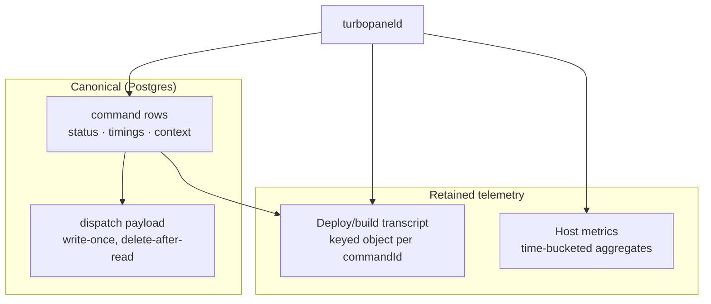

# Storage architecture

TurboPanel does not have "a database." It has **four storage workloads**, each with a different access pattern, and each is deliberately served by the backend that matches that pattern on the runtime it is deployed to. The whole design follows one rule:

> **Classify by the question you ask of the data, not by the shape of the data.**

A deploy transcript and a running container's stdout can both be called "logs" and still belong in opposite classes — one is stored, one is not. See [Deployment logs](/docs/architecture/deployment-logs) (keyed objects, the only log class TurboPanel retains) versus [Container logs](/docs/architecture/container-logs) (live tail, never stored).

<Callout type="info" title="Canonical source">
  Per-subsystem maintenance rules live in the instance repo: <File path="src/lib/commands/AGENTS.md" href="https://github.com/TurboPanel/turbopanel/blob/trunk/src/lib/commands/AGENTS.md">commands/AGENTS.md</File>, <File path="src/lib/execution-logs/AGENTS.md" href="https://github.com/TurboPanel/turbopanel/blob/trunk/src/lib/execution-logs/AGENTS.md">execution-logs/AGENTS.md</File>, and <File path="src/daemon/metrics/AGENTS.md" href="https://github.com/TurboPanel/turbopanel/blob/trunk/src/daemon/metrics/AGENTS.md">daemon/metrics/AGENTS.md</File>.
</Callout>

## The four workload classes

| # | Workload | Access pattern | TurboPanel High Availability | Self-hosted | Canonical doc |
| - | -------- | -------------- | ---------------------------- | ----------- | ------------- |
| 1 | **Command state** — `command` rows, status, timings, context | Relational, transactional, joined and filtered; source of truth | Postgres via Hyperdrive | Postgres (co-located) | <File path="src/lib/commands/AGENTS.md" href="https://github.com/TurboPanel/turbopanel/blob/trunk/src/lib/commands/AGENTS.md">commands/AGENTS.md</File> |
| 2 | **Command execution material** — the one-shot daemon payload | Written once, read once, then deleted | Postgres `dispatch` side table | Postgres `dispatch` side table | <File path="src/lib/db/AGENTS.md" href="https://github.com/TurboPanel/turbopanel/blob/trunk/src/lib/db/AGENTS.md">db/AGENTS.md</File> |
| 3 | **Deploy/build transcript** — a command's stdout/stderr | `GET` by known `commandId`, whole or resumed from an offset | R2 keyed objects (`EXECUTION_LOGS`) | Filesystem under the state tree (or S3) | <File path="src/lib/execution-logs/AGENTS.md" href="https://github.com/TurboPanel/turbopanel/blob/trunk/src/lib/execution-logs/AGENTS.md">execution-logs/AGENTS.md</File> |
| 4 | **Analytics** — host metrics + connection-status events | Aggregate over time buckets; sampled and disposable | Analytics Engine | DuckDB + Parquet under the metrics state root | <File path="src/daemon/metrics/AGENTS.md" href="https://github.com/TurboPanel/turbopanel/blob/trunk/src/daemon/metrics/AGENTS.md">daemon/metrics/AGENTS.md</File> |

Classes **1 and 2** are canonical business data. Classes **3 and 4** are product telemetry: valuable, retained on a clock, and never load-bearing for a control-plane decision.

Container stdout/stderr is **not** a fifth class. It is tailed live via an on-demand `docker container logs` cell round trip and is never stored — see [Container logs](/docs/architecture/container-logs).

## Why the deploy transcript is a keyed object

The only real query is "show me command `X`'s output, from sequence `N`". That is one object, not a scan across orgs, servers, and time. Putting transcripts in a columnar table would buy nothing — there is no cross-transcript question to answer — and would pay a per-query scan, a table to compact, and a schema to migrate for what is one object fetch today.

`ExecutionLogStore` is a `GET`-by-known-key workload. Running-container output is the opposite question and is **not stored at all**; operators who need that history ship it to their own sink.

## Retention, by class

| Workload | Default retention | Mechanism |
| -------- | ----------------- | --------- |
| Command state | Indefinite (append-only history) | — |
| Command execution material | Deleted on success; ~24 h on failure | `dispatch` sweep on the maintenance tick |
| Deploy/build transcript | **90 days**, configurable — the **only** log class TurboPanel stores | Date-partitioned prefix delete on the shared once-a-minute maintenance tick |
| Host metrics | 3 months (Analytics Engine) / **90 days** (DuckDB + Parquet) | Analytics Engine: platform-managed dataset retention. DuckDB: daily archive tick seals each completed UTC day into a Parquet partition, then prunes partitions and hot rows past the retention cutoff |

## Rules that keep the classification honest

- **Postgres holds no log bytes.** There is no execution-log column and no container-log table on the control plane. `hasLog` on a batched status response is resolved store-side via `ExecutionLogStore.exists` — do not add a column to cache it.
- **Every telemetry store has a disabled fallback.** `resolveExecutionLogStore` and `resolveServerMetricsStoreV4` return a safe no-op store rather than throwing when their backend is unconfigured, so a half-converged deployment still serves commands. **Callers never branch on availability.**
- **Container output is never stored.** Host metrics are always on; container stdout is an on-demand live tail. Do not reintroduce a `container_logs` table, a Pipelines/Iceberg path, or an org `containerLogsEnabled` switch.
- **Never gate liveness on telemetry.** `server.connected` / `server.status_changed_at` in Postgres are the only source of truth for whether a server is online right now — see [Daemon cell](/docs/architecture/daemon-cell).
