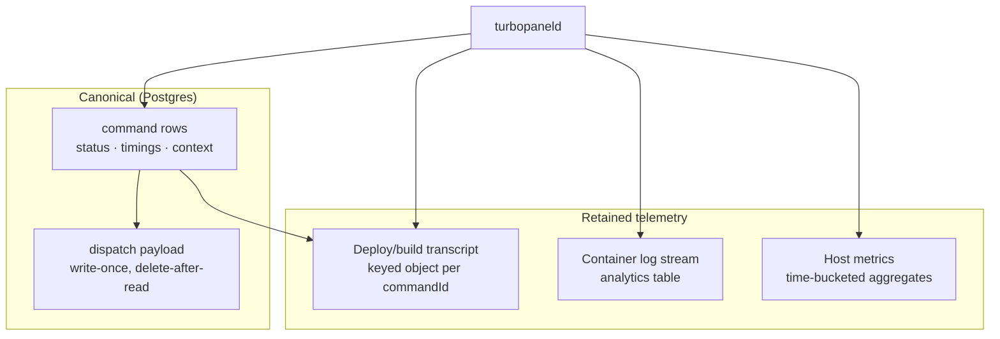
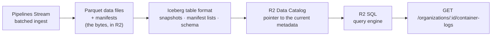

# Storage architecture

TurboPanel does not have "a database." It has **five storage workloads**, each with a different access pattern, and each is deliberately served by the backend that matches that pattern on the runtime it is deployed to. The whole design follows one rule:

> **Classify by the question you ask of the data, not by the shape of the data.**

Two subsystems can both be called "logs" and still belong in opposite storage classes — see [Deployment logs](/docs/architecture/deployment-logs) (keyed objects) versus [Container logs](/docs/architecture/container-logs) (an analytics table).

<Callout type="info" title="Canonical source">
  Per-subsystem maintenance rules live in the instance repo:{' '}
  <File path="src/lib/commands/AGENTS.md" href="https://github.com/TurboPanel/turbopanel/blob/trunk/src/lib/commands/AGENTS.md">
    commands/AGENTS.md
  </File>
  ,{' '}
  <File path="src/lib/execution-logs/AGENTS.md" href="https://github.com/TurboPanel/turbopanel/blob/trunk/src/lib/execution-logs/AGENTS.md">
    execution-logs/AGENTS.md
  </File>
  ,{' '}
  <File path="src/lib/container-logs/AGENTS.md" href="https://github.com/TurboPanel/turbopanel/blob/trunk/src/lib/container-logs/AGENTS.md">
    container-logs/AGENTS.md
  </File>
  , and{' '}
  <File path="src/daemon/metrics/AGENTS.md" href="https://github.com/TurboPanel/turbopanel/blob/trunk/src/daemon/metrics/AGENTS.md">
    daemon/metrics/AGENTS.md
  </File>
  .
</Callout>

## The five workload classes

| # | Workload | Access pattern | TurboPanel High Availability | Self-hosted | Canonical doc |
| - | -------- | -------------- | ---------------------------- | ----------- | ------------- |
| 1 | **Command state** — `command` rows, status, timings, context | Relational, transactional, joined and filtered; source of truth | Postgres via Hyperdrive | Postgres (co-located) | <File path="src/lib/commands/AGENTS.md" href="https://github.com/TurboPanel/turbopanel/blob/trunk/src/lib/commands/AGENTS.md">commands/AGENTS.md</File> |
| 2 | **Command execution material** — the one-shot daemon payload | Written once, read once, then deleted | Postgres `dispatch` side table | Postgres `dispatch` side table | <File path="src/lib/db/AGENTS.md" href="https://github.com/TurboPanel/turbopanel/blob/trunk/src/lib/db/AGENTS.md">db/AGENTS.md</File> |
| 3 | **Deploy/build transcript** — a command's stdout/stderr | `GET` by known `commandId`, whole or resumed from an offset | R2 keyed objects (`EXECUTION_LOGS`) | Filesystem under the state tree (or S3) | <File path="src/lib/execution-logs/AGENTS.md" href="https://github.com/TurboPanel/turbopanel/blob/trunk/src/lib/execution-logs/AGENTS.md">execution-logs/AGENTS.md</File> |
| 4 | **Container log stream** — running-container stdout/stderr | Scan with predicates across orgs, servers, services and time | Pipelines → Apache Iceberg in R2 Data Catalog, read with R2 SQL | ClickHouse `container_logs` | <File path="src/lib/container-logs/AGENTS.md" href="https://github.com/TurboPanel/turbopanel/blob/trunk/src/lib/container-logs/AGENTS.md">container-logs/AGENTS.md</File> |
| 5 | **Analytics** — host metrics + connection-status events | Aggregate over time buckets; sampled and disposable | Analytics Engine | ClickHouse `turbopanel_server_metrics` | <File path="src/daemon/metrics/AGENTS.md" href="https://github.com/TurboPanel/turbopanel/blob/trunk/src/daemon/metrics/AGENTS.md">daemon/metrics/AGENTS.md</File> |

Classes **1 and 2** are canonical business data. Classes **3, 4 and 5** are product telemetry: valuable, retained on a clock, and never load-bearing for a control-plane decision.

## Why classes 3 and 4 are not the same store

They are storage mirror images, and unifying them would make both worse.

| | **Deploy/build transcript** (class 3) | **Container log stream** (class 4) |
| --- | --- | --- |
| The only real query | "Show me command `X`'s output, from sequence `N`" | "Everything my org's `api` service logged in the last hour matching `ECONNREFUSED`" |
| Key | A single known `commandId` | A predicate set over an unbounded row set |
| Cardinality of a read | One object | Many rows, across servers and time |
| Right backend | Keyed object store + tiny per-command index | Columnar table with a fixed sort/partition key |
| Wrong backend cost | A table, a schema migration, and scan cost for a lookup nobody scans | Listing and reading every object to answer one filter |

`ExecutionLogStore` is a `GET`-by-known-key workload. Putting it in Iceberg/R2 SQL would buy nothing — there is no cross-transcript question to answer — and would pay a per-query scan, a table to compact, and a schema to migrate for what is one object fetch today. That is why the deploy transcript is **not** in the Iceberg path even on TurboPanel High Availability, where the Iceberg path already exists for container logs.

## The Iceberg stack on TurboPanel High Availability

Container logs (class 4) are the only workload that uses Apache Iceberg. Four layers, each doing exactly one job:

| Layer | What it actually is |
| ----- | ------------------- |
| **Parquet data files** | The rows themselves, columnar, compressed, written into an R2 bucket |
| **Iceberg table format** | Metadata *about* those files — schema, partition spec, manifests listing each data file with its column bounds, and snapshots naming the set of manifests valid at a point in time |
| **R2 Data Catalog** | The catalog: it records **which metadata file is current** for `namespace.table`, and makes a commit atomic |
| **R2 SQL** | The engine that reads the catalog pointer, prunes data files using manifest bounds, and scans only what survives pruning |

<Callout type="warn" title="The catalog is a pointer, not a second copy">
  R2 Data Catalog does **not** store your log rows. It stores the coordinates of the current
  metadata file for a table. Every byte of log data lives once, as Parquet in R2. A commit swaps
  which metadata file is current; a query resolves that pointer, then reads only the data files the
  manifests say could possibly match. Reasoning about the catalog as "the database" leads to wrong
  cost models and wrong retention plans — retention is a matter of expiring snapshots and deleting
  the data files they orphan, not of deleting catalog entries.
</Callout>

Because Iceberg commits are per-write, **batching is the cost story**: one `send` per already-batched array of events, never one per line. A send-per-line path would produce many tiny data files, each needing its own catalog commit and later compaction. The daemon-side collector batches; the store never re-batches.

## Retention, by class

| Workload | Default retention | Mechanism |
| -------- | ----------------- | --------- |
| Command state | Indefinite (append-only history) | — |
| Command execution material | Deleted on success; ~24 h on failure | `dispatch` sweep on the maintenance tick |
| Deploy/build transcript | **30 days**, configurable | Date-partitioned prefix delete on the shared once-a-minute maintenance tick |
| Container log stream | **30 days** | ClickHouse `TTL` / Iceberg snapshot expiry |
| Host metrics | 3 months (Analytics Engine) / **90 days** (ClickHouse) | Backend retention / `TTL` |

## Rules that keep the classification honest

- **Postgres holds no log bytes.** There is no execution-log column and no container-log table on the control plane. `hasLog` on a batched status response is resolved store-side via `ExecutionLogStore.exists` — do not add a column to cache it.
- **Every telemetry store has a disabled fallback.** `resolveExecutionLogStore`, `resolveContainerLogStore`, and `resolveServerMetricsStore` all return a safe no-op store rather than throwing when their backend is unconfigured, so a half-converged deployment still serves commands. **Callers never branch on availability.**
- **Container logs are opt-in.** Host metrics are always on; container logs are per-organization and default-off, because container output is high-volume and billed.
- **Never gate liveness on telemetry.** `server.connected` / `server.status_changed_at` in Postgres are the only source of truth for whether a server is online right now — see [Daemon cell](/docs/architecture/daemon-cell).
