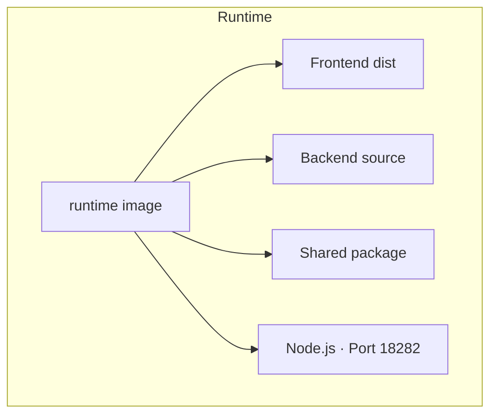

# Control Plane Deployment

The TurboPanel Control Plane is a self-hosted Docker image containing the frontend (Expo web build) and backend (Hono API with integrated daemon functionality). It is the centralized management interface for Docker containers and infrastructure across multiple servers.

## Overview

### Purpose

- Centralized management for Docker containers and infrastructure
- REST API and frontend (Expo web) for management
- Integrated Docker management on the control plane server (self-hosted)
- WebSocket server for remote daemons (self-hosted)

### Relationship to Daemon

In self-hosted mode, the control plane can manage local Docker directly without a separate daemon on the same server. Additional servers use the daemon image and connect via WebSocket. See [Daemon Setup](/docs/deployment/daemon-setup) for multi-server deployments.

<Callout type="info" title="Integrated Daemon">
  The first server (where the control plane runs) includes integrated daemon functionality. You do
  not need a separate daemon process on the control plane node.
</Callout>

### Architecture



## Deployment Models Comparison

| Feature                          | Self-Hosted                 | Edge                          |
| -------------------------------- | --------------------------- | ----------------------------- |
| **Control Plane**                | This Docker image (Node.js) | Edge                          |
| **Frontend**                     | ✅ Included (Expo web)      | ✅ Served separately          |
| **Integrated Daemon**            | ✅ Yes (local Docker)       | ❌ No (separate daemon)       |
| **Daemon on Control Plane Node** | ❌ Not needed               | ✅ Required                   |
| **Daemon on Additional Servers** | ✅ Required (WebSocket)     | ✅ Required (Durable Objects) |
| **Communication**                | WebSocket                   | Durable Objects               |
| **Pricing**                      | Free, unlimited             | $X per server                 |

**This guide covers Self-Hosted deployment only.** Edge mode uses a different control plane on the TurboPanel Edge platform.

## Installation

### Quick Start

```bash
curl -sSL https://start.trbp.nl/ | sh
```

The script pulls the image, creates directories, configures Docker Compose, and starts the container.

### Manual Docker

1. `docker pull turbopanel/turbopanel:latest`
2. Run with port 18282, Docker socket mount, `--restart unless-stopped`
3. Access UI at `http://your-server-ip:18282`

```bash
docker run -d \
  --name turbopanel \
  --restart unless-stopped \
  -p 18282:18282 \
  -v /var/run/docker.sock:/var/run/docker.sock \
  turbopanel/turbopanel:latest
```

### Docker Compose

Save the following as `docker-compose.yml` in a directory of your choice (for example `/opt/turbopanel/`), then run `docker compose up -d` from that directory:

```yaml
services:
  turbopanel:
    image: turbopanel/turbopanel:latest
    restart: unless-stopped
    ports:
      - '18282:18282'
    volumes:
      - /var/run/docker.sock:/var/run/docker.sock
```

```bash
docker compose up -d
```

The [install script](https://start.trbp.nl/) writes an equivalent compose file and starts the container for you; the path it uses may vary by environment.

### Multi-Server Setup

- **Control plane server:** Use this image only; integrated daemon handles local Docker.
- **Additional servers:** Deploy the daemon image; see [Daemon Setup](/docs/deployment/daemon-setup).

## Configuration

### Environment Variables

| Variable             | Description                      | Default         | Required |
| -------------------- | -------------------------------- | --------------- | -------- |
| `PORT`               | API and frontend port            | `18282`         | No       |
| `FRONTEND_DIST_PATH` | Frontend dist path in image      | `apps/app/dist` | No       |
| `LOG_LEVEL`          | `debug`, `info`, `warn`, `error` | `info`          | No       |

`NODE_ENV` is set to `production` in the control-plane image; you do not configure it in Compose for normal deployments.

### Volume and Port

- **Docker socket:** `-v /var/run/docker.sock:/var/run/docker.sock` (required for local Docker management)
- **Port:** `-p 18282:18282`

<Callout type="warn" title="Docker Socket">
  Mounting the Docker socket gives full daemon access. Use network isolation and authentication in
  production. See [Security](/docs/deployment/security) for best practices.
</Callout>

### API Endpoints

| Endpoint             | Description                                     |
| -------------------- | ----------------------------------------------- |
| `/api/client/v1/*`   | Authenticated client REST API                   |
| `/api/admin/v1/*`    | Admin REST API                                  |
| `/api/client/auth/*` | Better Auth (sign-in, sessions, password, etc.) |
| `/`                  | Web UI                                          |
| `/api/openapi.json`  | OpenAPI spec                                    |
| `/api/client/v1/health` | Health check                                 |

## Communication Patterns

- **Frontend–Backend:** Same port; API under `/api/client/v1`, `/api/admin/v1`, and `/api/client/auth`; REST + WebSocket; token-based auth
- **Integrated Daemon:** Direct Docker socket access on control plane server; no separate daemon container
- **WebSocket Server:** `ws://your-control-plane:18282/agent/connect`; token auth; commands to daemons, responses/logs back

## Comparison: Control Plane vs Daemon

| Feature           | Control Plane (turbopanel)             | Daemon                       |
| ----------------- | -------------------------------------- | ---------------------------- |
| **Purpose**       | Centralized management interface       | Execute commands on servers  |
| **Components**    | Frontend + Backend + Integrated Daemon | Backend only (daemon subset) |
| **Port**          | 18282                                  | 18284                        |
| **Entry Point**   | `src/self-hosted.ts`                   | `apps/daemon` (`main.ts`)    |
| **Frontend**      | ✅ Included                            | ❌ Not included              |
| **Docker Socket** | Local container management             | Remote container management  |
| **Deployment**    | One per infrastructure                 | One per server (except CP)   |
| **API / Web UI**  | ✅ Full REST API, Web UI               | ❌ Command execution only    |

## Related Documentation

- [Daemon Setup](/docs/deployment/daemon-setup) — Multi-server deployments and daemon configuration
- [Security](/docs/deployment/security) — Security best practices
- [Deployment Troubleshooting](/docs/deployment/troubleshooting) — Common deployment issues
