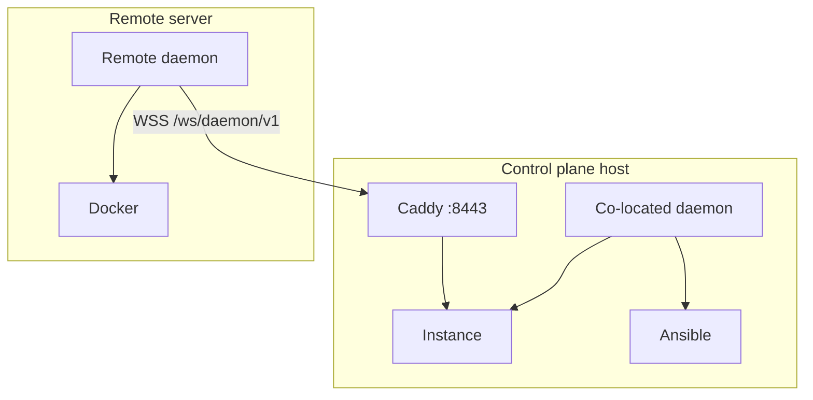

# Daemon Setup

The TurboPanel **daemon** ([turbopaneld](https://github.com/turbopanel/turbopaneld)) runs on managed servers. It connects to the instance over **HTTPS/WSS**, runs Ansible to install runtimes and services, and manages Docker, tunnels, and orchestration locally.

## Overview

### Purpose

- Connect to the instance control plane as a remote daemon
- Run Ansible playbooks (installs, upgrades, Postgres, Caddy, instance, UI)
- Apply dev-sync pushes and Cloudflare tunnel tokens from the instance
- Report server identity (`serverId`, `hostname`, `machineId`) on WebSocket `hello`

### Relationship to control plane

The daemon is **not** a slim Docker-only executor in the new architecture — it is the constant on every TurboPanel-managed host and the only party that runs Ansible. On the control plane host it runs co-located (Unix socket or Caddy URL). On additional servers it dials the instance URL you provide at install time.

### Architecture



## Deployment models

| Feature | Cloud-hosted instance | Self-hosted instance |
| ------- | --------------------- | -------------------- |
| Instance URL | `https://your-worker.workers.dev` | `https://<host>:8443` |
| Co-located daemon | Optional (dev / socket mode) | Yes on control plane |
| Remote daemon | Required per extra server | Required per extra server |
| Communication | WSS through instance URL | WSS through Caddy or direct socket |
| Edge coordination | WSS (Durable Objects **not implemented yet**) | WSS |

## Installation

### Supported platforms

| OS | Architecture | Notes |
| -- | ------------ | ----- |
| Debian 12+ (Bookworm/Trixie) | `x86_64` (amd64) | Recommended for managed servers |
| Debian 12+ (Bookworm/Trixie) | `aarch64` (arm64) | Supported |
| Raspberry Pi OS **64-bit** | `aarch64` (arm64) | Supported on 64-bit images only |

**Not supported:** 32-bit ARM (`armv7l`, `armhf`), 32-bit Raspberry Pi OS, or any
CPU architecture other than `aarch64` and `x86_64`. Unsupported hosts fail during
Ansible provisioning with an explicit architecture error.

### Remote managed server (official installer)

Obtain a license from your TurboPanel organization, then run the channel
installer. Set `TURBOPANEL_LICENSE` to the base64url-encoded
`licenseId:licenseToken` (the UI copy-paste command includes this).

**Production control plane** (Cloudflare Workers — default host from the channel
manifest):

```bash
curl -fsSL trbp.nl/run.sh | TURBOPANEL_LICENSE=<base64url-encoded-license> sh
```

**Self-hosted instance** (pass `TURBOPANEL_HOST` with the full instance URL):

```bash
curl -fsSL trbp.nl/run.sh | \
  TURBOPANEL_LICENSE=<base64url-encoded-license> \
  TURBOPANEL_HOST=https://<instance-host>:8443 \
  sh
```

When the instance is reachable on the same host as the installer script, you may
fetch `run.sh` from the instance URL instead:

```bash
curl -fsSL https://<instance-host>:8443/run.sh | \
  TURBOPANEL_LICENSE=<base64url-encoded-license> \
  TURBOPANEL_HOST=https://<instance-host>:8443 \
  sh
```

The installer self-escalates with `sudo` and prompts for your password when
needed — do not prefix the pipeline with `sudo`.

While provisioning runs, the terminal shows a **rolling status view** (spinner on
TTY hosts) with neutral labels — orchestration instead of Ansible tool names,
**cache** instead of Redis, **queue** instead of RabbitMQ. Vendor paths, role
names, and env vars on disk are unchanged; full detail remains in
`/var/log/turbopanel/daemon.log` after install. See the daemon repo
[`AGENTS.md` — Installer presentation layer](https://github.com/turbopanel/turbopaneld/blob/trunk/AGENTS.md#installer-presentation-layer).

For self-hosted HTTPS, the installer fetches the platform CA from
`GET /api/daemon/v1/instance/ca` and configures `TURBOPANEL_INSTANCE_CA`.
Re-run the same command any time to upgrade or reconcile a node.

### Refresh an existing node

If the server is already installed, re-run the same **`run.sh`** installer. Build
the license argument from state on disk (or copy a fresh install command from the UI):

```bash
LICENSE_B64=$(python3 -c "
import base64
id = open('/var/lib/turbopanel/license.id').read().strip()
tok = open('/var/lib/turbopanel/license.token').read().strip()
print(base64.urlsafe_b64encode(f'{id}:{tok}'.encode()).decode().rstrip('='))
")

curl -fsSL trbp.nl/run.sh | \
  TURBOPANEL_LICENSE="$LICENSE_B64" \
  TURBOPANEL_UPDATE_CHANNEL=trunk \
  sh
```

See [Refresh a stuck daemon](/docs/deployment/daemon-update) for offline UI
mismatches, missing license files, and self-hosted hosts.

<Callout type="info" title="Control plane host">
  On the machine that runs the instance, use the [dev](https://github.com/turbopanel/dev)
  console (**Start dev stack**) or Ansible co-located install — not the remote node installer.
</Callout>

### Install options

| Variable / flag | Description |
| ---- | ----------- |
| `TURBOPANEL_LICENSE` / `--license <b64>` | **Required.** Base64url-encoded `licenseId:licenseToken`. |
| `TURBOPANEL_UPDATE_CHANNEL` / `--channel <name>` | Release channel (`trunk`, `edge`, `canary`, `rc`, `release`). Default: `trunk`. Written to `.env` as `TURBOPANEL_UPDATE_CHANNEL`. |
| `TURBOPANEL_HOST` / `--host <URL>` | Optional for production (defaults to manifest `defaultControlPlaneUrl`). Required for self-hosted instances (`https://…`). |
| `TURBOPANEL_INSECURE_TLS=1` / `--insecure-tls` | Use `curl -k` for bootstrap downloads only (dev/self-signed CDN or instance) |
| `--tunnel-token <TOKEN>` | Cloudflare tunnel token for this node |
| `--instance-ca <PATH>` | PEM platform CA (skips automatic CA fetch) |
| `--no-start` | Provision without starting `turbopaneld.service` |

### What gets installed (FHS layout)

The installer bootstraps uv/Python/Ansible and runs `daemon-install.yml`, which
lays out a clean **Filesystem Hierarchy Standard** tree — there is **no source
checkout** on a managed server:

| Purpose | Path |
| ------- | ---- |
| Native daemon binary | `/opt/turbopanel/bin/turbopaneld` |
| Deno JS runtime (hosts where the native binary cannot load) | `/opt/turbopanel/bin/turbopaneld.js` |
| Orchestration assets (Ansible) | `/opt/turbopanel/share/orchestration` |
| Static UI export (control plane host) | `/opt/turbopanel/share/ui` |
| Vendored runtimes (deno/uv/python/ansible/cloudflared) | `/opt/turbopanel/vendor` |
| Config (`daemon.env`, `instance-ca.pem`) | `/etc/turbopanel` |
| Persistent identity (license, `server.id`, keys, tunnels) | `/var/lib/turbopanel` |
| Logs | `/var/log/turbopanel` |
| Runtime (sockets, `daemon.lock`) | `/run/turbopanel` |

- User `turbopanel:turbopanel` (UID/GID 9999) with passwordless sudo
- `turbopaneld.service` (systemd, single process via `flock`). The unit runs the
  native binary when `turbopaneld --version` succeeds. On hosts where that probe
  fails — notably some Raspberry Pi arm64 kernels with a **16 KiB** page size,
  which cannot load the usual **4 KiB**-page `deno compile` binary — install
  downloads `turbopaneld.js`, installs vendored Deno, and uses
  `deno run …/bin/turbopaneld.js` as the supported ExecStart for that hardware.
  Deno is installed only on that path; native hosts skip it.

<Callout type="info" title="Co-located dev is different">
  A control-plane host provisioned via the [dev](https://github.com/turbopanel/dev)
  console runs the daemon **from a source checkout** under `$HOME` (e.g. `~/daemon`, via
  `deno run main.ts`). Config lives in `/etc/turbopanel/daemon.env`; mutable state, logs,
  and sockets under dev-user-owned FHS paths (`/etc/turbopanel`, `/var/lib/turbopanel`,
  `/var/log/turbopanel`, `/run/turbopanel`); vendored runtimes under
  `/opt/turbopanel/vendor`. No dedicated `turbopanel` / `turbopaneli` / `turbopanelc`
  service accounts are created — systemd units and Docker-backed services run as the
  current dev user. The FHS tree above (including `turbopanel:turbopanel`) applies to
  managed/production installs only.
</Callout>

## Configuration

Runtime config: `/etc/turbopanel/daemon.env` (`EnvironmentFile=` on `turbopaneld.service`).

| Variable | Purpose |
| -------- | ------- |
| `TURBOPANEL_INSTANCE_URL` | HTTPS base URL of instance (remote nodes) |
| `TURBOPANEL_INSTANCE_CA` | Platform CA PEM path for TLS (default `/etc/turbopanel/instance-ca.pem`) |
| `TURBOPANEL_UPDATE_CHANNEL` | Release channel for manual updates and UI updates (`trunk` default) |
| `TURBOPANEL_DEV_INSTANCE` | `1` for co-located dev (Ansible installs instance/UI) |

Co-located socket mode omits `TURBOPANEL_INSTANCE_URL` and dials `unix:///run/turbopanel/instance.sock`.

## Communication

- **WebSocket:** `wss://<instance>/ws/daemon/v1`
- **Hello:** daemon sends `hostname`, optional `serverId`, `machineId`; instance returns canonical `serverId`
- **Commands:** instance routes over `daemon-hub`; dev-sync and tunnel-token messages for operator pushes

## Common issues

| Issue | Solution |
| ----- | -------- |
| Connection failures | Verify `--host` / `TURBOPANEL_INSTANCE_URL`, firewall, TLS CA trust |
| TLS errors | Re-fetch CA from `/api/daemon/v1/instance/ca` or pass `--instance-ca` |
| Unsupported architecture | TurboPanel requires 64-bit `aarch64` or `x86_64`; 32-bit Raspberry Pi OS is not supported |
| Docker permission errors | Ensure `turbopanel` user is in `docker` group (installer adds this when Docker is installed) |

See [Deployment troubleshooting](/docs/deployment/troubleshooting) for more.

## Related documentation

- [Control plane](/docs/deployment/control-plane) — Instance and Caddy layout
- [Security](/docs/deployment/security) — TLS and socket hardening
- [Daemon README](https://github.com/turbopanel/turbopaneld/blob/trunk/README.md) — Maintainer reference
