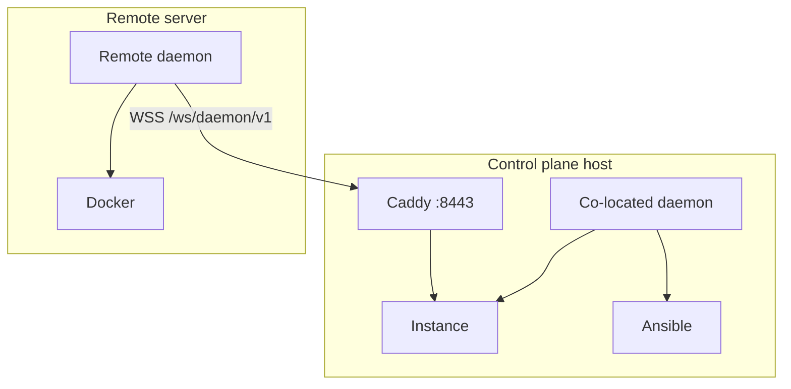

# Daemon Setup

The TurboPanel **daemon** ([turbopanel-daemon](https://github.com/turbopanel/turbopanel-daemon)) runs on managed servers. It connects to the instance over **HTTPS/WSS**, runs Ansible to install runtimes and services, and manages Docker, tunnels, and orchestration locally.

## Overview

### Purpose

- Connect to the instance control plane as a remote daemon
- Run Ansible playbooks (installs, upgrades, Postgres, Caddy, instance, UI)
- Apply dev-sync pushes and Cloudflare tunnel tokens from the instance
- Report server identity (`serverId`, `hostname`, `machineId`) on WebSocket `hello`

### Relationship to control plane

The daemon is **not** a slim Docker-only executor in the new architecture — it is the constant on every TurboPanel-managed host and the only party that runs Ansible. On the control plane host it runs co-located (Unix socket or Caddy URL). On additional servers it dials the instance URL you provide at install time.

### Architecture



## Deployment models

| Feature | Cloud-hosted instance | Self-hosted instance |
| ------- | --------------------- | -------------------- |
| Instance URL | `https://your-worker.workers.dev` | `https://<host>:8443` |
| Co-located daemon | Optional (dev / socket mode) | Yes on control plane |
| Remote daemon | Required per extra server | Required per extra server |
| Communication | WSS through instance URL | WSS through Caddy or direct socket |
| Edge coordination | WSS (Durable Objects **not implemented yet**) | WSS |

## Installation

### Remote managed server (official installer)

From [turbopanel-cdn](https://github.com/turbopanel/turbopanel-cdn):

```bash
curl -fsSL https://raw.githubusercontent.com/turbopanel/turbopanel-cdn/trunk/install.sh \
  | sudo bash -s -- \
      --instance-url https://<instance-host>:8443
```

For self-hosted HTTPS, the installer fetches the platform CA from `GET /api/daemon/v1/instance/ca` (one insecure bootstrap `curl` if needed) and configures `TURBOPANEL_INSTANCE_CA`.

<Callout type="info" title="Control plane host">
  On the machine that runs the instance, use the [turbopanel-dev](https://github.com/turbopanel/turbopanel-dev)
  console (**Start dev stack**) or Ansible co-located install — not the remote node installer.
</Callout>

### Install options

| Flag | Description |
| ---- | ----------- |
| `--instance-url <URL>` | **Required** for remote nodes. Base URL (`https://…` or `http://…`). |
| `--tunnel-token <TOKEN>` | Cloudflare tunnel token for this node |
| `--instance-ca <PATH>` | PEM platform CA (skips automatic CA fetch) |
| `--insecure-tls` | Skip TLS verification (dev only) |
| `--branch <NAME>` | Git branch (default `trunk`) |
| `--no-start` | Provision without starting `turbopanel-daemon.service` |

### What gets installed

The installer bootstraps uv/Python/Ansible and runs `daemon-install.yml`:

- User `turbopanel:turbopanel` (UID/GID 9999) with passwordless sudo
- Daemon checkout under `/opt/turbopanel/platform/daemon` on `trunk`
- Deno runtime under `/opt/turbopanel/runtimes/`
- `turbopanel-daemon.service` (systemd, single process via `flock`)

## Configuration

Runtime config: `/opt/turbopanel/platform/daemon/.env`

| Variable | Purpose |
| -------- | ------- |
| `TURBOPANEL_INSTANCE_URL` | HTTPS base URL of instance (remote nodes) |
| `TURBOPANEL_INSTANCE_CA` | Platform CA PEM path for TLS |
| `TURBOPANEL_DEV_INSTANCE` | `1` for co-located dev (Ansible installs instance/UI) |

Co-located socket mode omits `TURBOPANEL_INSTANCE_URL` and dials `unix:///run/turbopanel/instance.sock`.

## Communication

- **WebSocket:** `wss://<instance>/ws/daemon/v1`
- **Hello:** daemon sends `hostname`, optional `serverId`, `machineId`; instance returns canonical `serverId`
- **Commands:** instance routes over `daemon-hub`; dev-sync and tunnel-token messages for operator pushes

## Common issues

| Issue | Solution |
| ----- | -------- |
| Connection failures | Verify `TURBOPANEL_INSTANCE_URL`, firewall, TLS CA trust |
| TLS errors | Re-fetch CA from `/api/daemon/v1/instance/ca` or pass `--instance-ca` |
| Docker permission errors | Ensure `turbopanel` user is in `docker` group (installer adds this) |

See [Deployment troubleshooting](/docs/deployment/troubleshooting) for more.

## Related documentation

- [Control plane](/docs/deployment/control-plane) — Instance and Caddy layout
- [Security](/docs/deployment/security) — TLS and socket hardening
- [Daemon README](https://github.com/turbopanel/turbopanel-daemon/blob/trunk/README.md) — Maintainer reference
