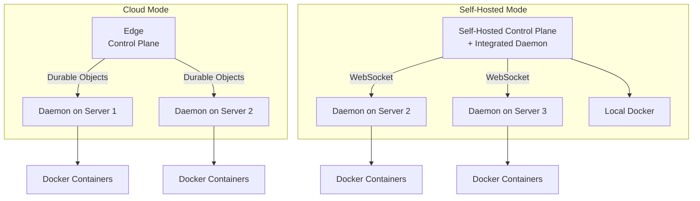

# Daemon Setup

The TurboPanel Daemon is a lightweight service designed to run on managed servers. It executes commands from the control plane, manages Docker containers, and streams logs and SSH sessions back to the control plane.

## Overview

### Purpose

- Execute commands from the control plane on remote servers
- Manage Docker containers and services
- Stream logs and metrics to the control plane
- Provide SSH session proxying; report server status and health

### Relationship to Control Plane

The daemon is a **lightweight subset** of the backend without frontend dependencies. It runs on managed servers and communicates with the control plane, which coordinates multiple daemons.

### Architecture



## Deployment Models

| Feature                      | Cloud-Hosted    | Self-Hosted                |
| ---------------------------- | --------------- | -------------------------- |
| Control Plane                | Edge            | Node.js on your server     |
| Daemon on Control Plane Node | ✅ Required     | ❌ Integrated (not needed) |
| Daemon on Additional Servers | ✅ Required     | ✅ Required                |
| Communication                | Durable Objects | WebSocket                  |
| Pricing                      | $X per server   | Free, unlimited            |

**Cloud Mode:** Control plane runs on Edge platform; daemons connect via Durable Objects.

**Self-Hosted Mode:** Control plane runs on your server; first server needs no separate daemon; additional servers run the daemon with WebSocket.

## Installation

<Tabs items={['Cloud Mode', 'Self-Hosted Mode']}>
  <Tab value="Cloud Mode">

```bash
docker pull ghcr.io/turbopanel/daemon:latest
docker run -d \
  --name turbopanel-daemon \
  -p 18284:18284 \
  -e AGENT_MODE=durable-objects \
  -e CONTROL_PLANE_URL=https://your-control-plane.workers.dev \
  -e AGENT_TOKEN=your-secret-token \
  -v /var/run/docker.sock:/var/run/docker.sock \
  ghcr.io/turbopanel/daemon:latest
```

  </Tab>
  <Tab value="Self-Hosted Mode">

<Callout type="info" title="No Daemon Needed">
  On the first server (control plane), no separate daemon is required. The control plane includes
  integrated daemon functionality for local Docker. Deploy the daemon only on additional servers.
</Callout>

```bash
# On additional servers only (not on control plane)
docker pull ghcr.io/turbopanel/daemon:latest
docker run -d \
  --name turbopanel-daemon \
  -p 18284:18284 \
  -e AGENT_MODE=websocket \
  -e CONTROL_PLANE_URL=http://your-control-plane:18282 \
  -e AGENT_TOKEN=your-secret-token \
  -v /var/run/docker.sock:/var/run/docker.sock \
  ghcr.io/turbopanel/daemon:latest
```

  </Tab>
</Tabs>

## Configuration

### Environment Variables

| Variable            | Description                        | Default | Required         |
| ------------------- | ---------------------------------- | ------- | ---------------- |
| `AGENT_PORT`        | Port for the daemon to listen on   | `18284` | No               |
| `AGENT_MODE`        | `websocket` or `durable-objects`   | -       | Yes              |
| `CONTROL_PLANE_URL` | URL of control plane               | -       | Yes              |
| `AGENT_TOKEN`       | Authentication token (recommended) | -       | No (recommended) |
| `LOG_LEVEL`         | `debug`, `info`, `warn`, `error`   | `info`  | No               |

### Docker Socket

Required: `-v /var/run/docker.sock:/var/run/docker.sock`

<Callout type="warn" title="Docker Socket Access">
  Mounting the socket gives full Docker daemon access. Use network isolation and authentication in
  production. See [Security](/docs/deployment/security) for best practices.
</Callout>

## Communication Patterns

### WebSocket (Self-Hosted)

The daemon connects to `ws://CONTROL_PLANE_URL/agent/connect` with token in handshake. Commands flow from control plane to daemon; responses and logs flow back. Message types include command, response, log, heartbeat. Automatic reconnection with exponential backoff; heartbeat for connection health.

### Durable Objects (Cloud)

The daemon connects to a Durable Object via HTTP/WebSocket. Flow: authenticate with control plane → control plane creates/retrieves Durable Object → daemon establishes WebSocket → commands routed through Durable Object API.

## Common Issues

| Issue                               | Solution                                                                                                                |
| ----------------------------------- | ----------------------------------------------------------------------------------------------------------------------- |
| **Connection failures**             | Verify `CONTROL_PLANE_URL`, network/firewall, and that `AGENT_MODE` matches control plane                               |
| **Docker socket permission denied** | Ensure socket is mounted and container user (turbopanel:turbopanel) can access it; `docker ps` in container should work |
| **Port 18284 in use**               | Change `AGENT_PORT` or host mapping (e.g. `-p 18285:18284`)                                                             |

For detailed troubleshooting, see [Deployment Troubleshooting](/docs/deployment/troubleshooting).

## Related Documentation

- [Control Plane](/docs/deployment/control-plane) — Control plane setup and configuration
- [Security](/docs/deployment/security) — Security best practices for daemons
- [Deployment Troubleshooting](/docs/deployment/troubleshooting) — Common issues and debugging
