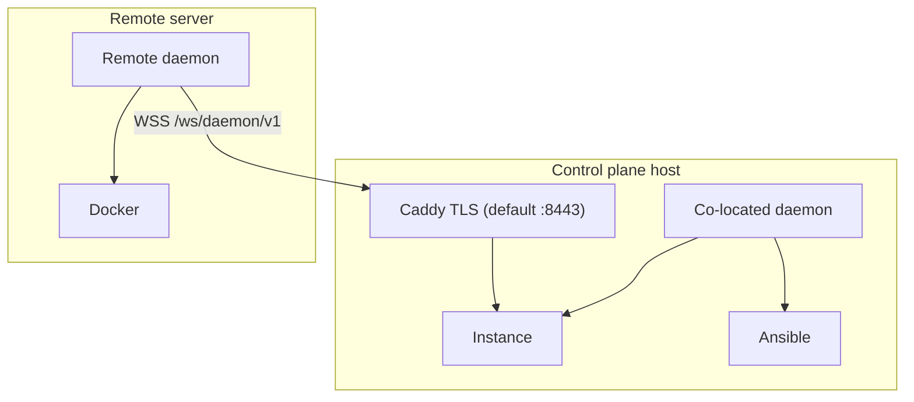

# Daemon Setup

The TurboPanel **daemon** ([turbopaneld](https://github.com/TurboPanel/turbopaneld)) runs on managed servers. It connects to the instance over **HTTPS/WSS**, runs Ansible to install runtimes and services, and manages Docker, tunnels, and orchestration locally.

## Overview

### Purpose

- Connect to the instance control plane as a remote daemon
- Run Ansible playbooks (installs, upgrades, Postgres, Caddy, instance, UI)
- Apply dev-sync pushes and Cloudflare tunnel tokens from the instance
- Report server identity (`serverId`, `hostname`, `machineId`) on WebSocket `hello`

### Relationship to control plane

The daemon is the constant on every TurboPanel-managed host and the only party that runs Ansible. On the control plane host it runs co-located (Unix socket or Caddy URL). On additional servers it dials the instance URL you provide at install time.

### Architecture



## Deployment models

| Feature | TurboPanel High Availability | Self-hosted instance |
| ------- | ---------------------------- | -------------------- |
| Instance URL | Hosted Workers URL (manifest default) | `https://<host>:8443` for every hostname |
| Co-located daemon | Contributor dev only (socket mode) | Installed with the control plane; dials the instance socket |
| Remote daemon | Required per extra server | Required per extra server |
| Communication | WSS through instance URL | WSS through Caddy or direct socket |
| Daemon coordination | WSS (Durable Objects) | WSS (Redis cell) |

Both control-plane models are in **private alpha** and not yet publicly available. The installer and daemon behavior below apply when you have access.

Every self-hosted hostname is `https://<host>:8443`. The certificate follows the name. Port **80** accepts HTTP-01 only while a Let's Encrypt certificate is being issued or renewed. Port **443** is hosting.

| Source | `GET /api/daemon/v1/instance/ca` | `--insecure-tls` |
| --- | --- | --- |
| **Platform CA** | 200 | yes, until that CA is trusted |
| **Uploaded**, publicly trusted | 404 | no |
| **Uploaded**, private | uploaded issuer (`GET /api/daemon/v1/instance/uploaded-trust`) | bootstrap may use `-k`; runtime still verifies the chain and the hostname |
| **Let's Encrypt** | 404 | no |

Full table: [Control plane](/docs/deployment/control-plane#control-plane-tls-modes). The issuance window, including `port 80 is held by <process>`, is in [Hostnames and TLS](/docs/deployment/hostnames-and-tls).

## Installation

### Supported platforms

| OS | Architecture | Notes |
| -- | ------------ | ----- |
| Debian 12+ (Bookworm/Trixie) | `x86_64` (amd64) | Recommended for managed servers |
| Debian 12+ (Bookworm/Trixie) | `aarch64` (arm64) | Supported |
| Raspberry Pi OS **64-bit** | `aarch64` (arm64) | Supported on 64-bit images only |

**Not supported:** 32-bit ARM (`armv7l`, `armhf`), 32-bit Raspberry Pi OS, or any CPU architecture other than `aarch64` and `x86_64`. Unsupported hosts fail during Ansible provisioning with an explicit architecture error.

### Remote managed server (production installer)

<Steps>
  <Step>
    Obtain a license from your TurboPanel organization. Set `TURBOPANEL_LICENSE` to the
    base64url-encoded `licenseId:licenseToken` (the UI copy-paste command includes this).
  </Step>
  <Step>
    Run the channel installer from **turbopanel.sh** — production and self-hosted instances use this
    host, not the contributor Vagrant workflow.
  </Step>
  <Step>
    For a Platform CA hostname, the installer fetches the bundle from
    `GET /api/daemon/v1/instance/ca` and configures `TURBOPANEL_INSTANCE_CA`.
    A 404 on a Let's Encrypt name, or on an uploaded certificate that chains to a public root, uses the system trust store.
    A private upload uses the issuer from `GET /api/daemon/v1/instance/uploaded-trust`.
    Re-run the same command any time to upgrade or reconcile a node.
  </Step>
</Steps>

Self-hosted examples below use `https://<host>:8443`. A Let's Encrypt hostname, and an uploaded certificate that chains to a public root, omit `--insecure-tls`.

<CodeGroup titles={['TurboPanel High Availability', 'Self-hosted']}>

```bash
curl -fsSL turbopanel.sh | TURBOPANEL_LICENSE=<base64url-encoded-license> sh
```

```bash
curl -fsSL turbopanel.sh | \
  TURBOPANEL_LICENSE=<base64url-encoded-license> \
  TURBOPANEL_HOST=https://<instance-host>:8443 \
  sh
```

</CodeGroup>

The installer self-escalates with `sudo` and prompts for your password when needed — do not prefix the pipeline with `sudo`.

While provisioning runs, the terminal shows a **rolling status view** (spinner on TTY hosts) with neutral labels — orchestration instead of Ansible tool names, **cache** instead of Redis, **queue** instead of RabbitMQ. Vendor paths, role names, and env vars on disk are unchanged; full detail remains in `/var/log/turbopanel/daemon.log` after install. See the daemon repo [`AGENTS.md` — Installer presentation layer](https://github.com/TurboPanel/turbopaneld/blob/trunk/AGENTS.md#installer-presentation-layer).

#### Contributor dev overlay only

The instance host `/run.sh` path is **development-only** — served by the dev overlay Caddyfile at `https://<dev-host>:8443/run.sh`. LAN names use `curl -k` and `TURBOPANEL_INSECURE_TLS=1` because the leaf is the Platform CA:

```bash
curl -fsSLk https://<dev-host>:8443/run.sh | \
  TURBOPANEL_LICENSE=<base64url-encoded-license> \
  TURBOPANEL_HOST=https://<dev-host>:8443 \
  TURBOPANEL_INSECURE_TLS=1 \
  sh
```

### Refresh an existing node

If the server is already installed, re-run the same **`turbopanel.sh`** installer. Build the license argument from state on disk (or copy a fresh install command from the UI):

```bash
LICENSE_B64=$(python3 -c "
import base64
id = open('/var/lib/turbopanel/license.id').read().strip()
tok = open('/var/lib/turbopanel/license.token').read().strip()
print(base64.urlsafe_b64encode(f'{id}:{tok}'.encode()).decode().rstrip('='))
")

HOST=$(sed -n 's/^TURBOPANEL_INSTANCE_URL=//p' /etc/turbopanel/daemon.env)
CHANNEL=$(sed -n 's/^TURBOPANEL_UPDATE_CHANNEL=//p' /etc/turbopanel/daemon.env)

curl -fsSL turbopanel.sh | \
  TURBOPANEL_LICENSE="$LICENSE_B64" \
  TURBOPANEL_HOST="$HOST" \
  TURBOPANEL_UPDATE_CHANNEL="$CHANNEL" \
  sh
```

Pass the node's own control plane and channel back, as above. The installer does not read them from `daemon.env` on a remote node: without `TURBOPANEL_HOST` it uses the hosted control plane named in the release manifest, and without `TURBOPANEL_UPDATE_CHANNEL` it uses `trunk`.

See [Refresh a stuck daemon](/docs/deployment/daemon-update) for offline UI mismatches, missing license files, and self-hosted hosts.

<Callout type="info" title="Control plane host">
  On the machine that runs the instance, use contributor [dev](https://github.com/TurboPanel/dev)
  (**Start dev stack**) for local development — or the managed production converge for self-hosted
  when available. Do not use the remote node installer on the co-located dev control plane.
</Callout>

### Install options

| Variable / flag | Description |
| ---- | ----------- |
| `TURBOPANEL_LICENSE` / `--license <b64>` | **Required.** Base64url-encoded `licenseId:licenseToken`. |
| `TURBOPANEL_UPDATE_CHANNEL` / `--channel <name>` | Release channel. Default: `trunk`. Channel names (`trunk`, `canary`, `rc`, `release`, …) are technical identifiers — not product branding. `release`, `rc` and `canary` resolve from the daemon's [GitHub Releases](https://github.com/TurboPanel/turbopaneld/releases) (latest non-pre-release, the rolling `rc` pre-release, and the rolling `canary` pre-release carrying the newest green `trunk` build); `trunk` from the per-merge build drop. Written to `.env` as `TURBOPANEL_UPDATE_CHANNEL`. |
| `TURBOPANEL_HOST` / `--host <URL>` | Optional for TurboPanel High Availability (defaults to manifest `defaultControlPlaneUrl`). Required for self-hosted instances (`https://…`). |
| `TURBOPANEL_INSECURE_TLS=1` / `--insecure-tls` | Use `curl -k` for bootstrap downloads only (platform CA / self-signed). Omitted when `TURBOPANEL_TLS_PUBLIC` is set (Let's Encrypt, or an uploaded publicly trusted cert). |
| `--tunnel-token <TOKEN>` | Cloudflare tunnel token for this node |
| `--instance-ca <PATH>` | PEM platform CA (skips automatic CA fetch) |
| `--no-start` | Provision without starting `turbopaneld.service` |

### What gets installed (FHS layout)

The installer bootstraps uv/Python/Ansible and runs `daemon-install.yml`, which lays out a clean **Filesystem Hierarchy Standard** tree — there is **no source checkout** on a managed server:

| Purpose | Path |
| ------- | ---- |
| Native daemon binary | `/opt/turbopanel/bin/turbopaneld` |
| Deno JS runtime (hosts where the native binary cannot load) | `/opt/turbopanel/bin/turbopaneld.js` |
| Orchestration assets (Ansible) | `/opt/turbopanel/share/orchestration` |
| Static UI export (control plane host) | `/opt/turbopanel/share/ui` |
| Vendored runtimes (deno/uv/python/ansible/cloudflared) | `/opt/turbopanel/vendor` |
| Config (`daemon.env`, `instance-ca.pem`) | `/etc/turbopanel` |
| Persistent identity (license, `server.id`, keys, tunnels) | `/var/lib/turbopanel` |
| Logs | `/var/log/turbopanel` |
| Runtime (sockets, `daemon.lock`) | `/run/turbopanel` |

- User `tp:tp` (UID/GID 9999). Its sudo rule is limited to named commands: the orchestration helper plus fixed lists of file, service, account, network, and Docker utilities, without a password. Several of those (`docker`, `systemctl`, `cp`, `tee`, `find`) take any arguments, so treat the `tp` account as equivalent to root on that host.
- `turbopaneld.service` (systemd, single process via `flock`). The unit runs the native binary when `turbopaneld --version` succeeds. On hosts where that probe fails — notably some Raspberry Pi arm64 kernels with a **16 KiB** page size — install downloads `turbopaneld.js`, installs vendored Deno, and uses `deno run …/bin/turbopaneld.js` as the supported ExecStart for that hardware.

<Callout type="info" title="Contributor dev is different">
  A control-plane host provisioned via the [dev](https://github.com/TurboPanel/dev) console runs the
  daemon **from a source checkout** under `$HOME` (e.g. `~/turbopaneld`, via `deno run main.ts`). Config
  lives in `/etc/turbopanel/daemon.env`; mutable state, logs, and sockets under dev-user-owned FHS
  paths; vendored runtimes under `/opt/turbopanel/vendor`. No dedicated `tp` / `tpctrl` / `tpcache`
  service accounts are created. The FHS tree above (including `tp:tp`) applies to managed/production
  installs only.
</Callout>

## Configuration

Runtime config: `/etc/turbopanel/daemon.env` (`EnvironmentFile=` on `turbopaneld.service`).

| Variable | Purpose |
| -------- | ------- |
| `TURBOPANEL_INSTANCE_URL` | HTTPS base URL of instance (remote nodes) |
| `TURBOPANEL_INSTANCE_CA` | Platform CA PEM path for TLS (default `/etc/turbopanel/instance-ca.pem`) |
| `TURBOPANEL_UPDATE_CHANNEL` | Release channel for manual updates and UI updates (`trunk` default) |
| `TURBOPANEL_DEV_INSTANCE` | `1` for co-located dev (Ansible installs instance/UI) |

Co-located socket mode omits `TURBOPANEL_INSTANCE_URL` and dials `unix:///run/turbopanel/instance.sock`. On a
self-hosted control plane that is the daemon the instance installer provisions: it starts before the wizard has
issued a license, re-checks the daemon state directory every few seconds, and enrols as soon as the wizard writes
the first organization's license there. Contributor dev keeps the console opt-in (`TURBOPANEL_DEV_INSTANCE`);
a managed install connects without it.

## Communication

- **WebSocket:** `wss://<instance>/ws/daemon/v1`
- **Hello:** daemon sends `hostname`, optional `serverId`, `machineId`; instance returns canonical `serverId`
- **Commands:** instance routes over `daemon-hub`; dev-sync and tunnel-token messages for operator pushes

## Common issues

| Issue | Solution |
| ----- | -------- |
| Connection failures | Verify `--host` / `TURBOPANEL_INSTANCE_URL`, a firewall *outside* the host (security group, provider firewall — the installer removes `ufw`/`firewalld` on the host itself), TLS CA trust |
| TLS errors | Re-fetch the Platform CA from `/api/daemon/v1/instance/ca` or pass `--instance-ca`. A 404 on a Let's Encrypt or publicly trusted upload means the system trust store (no `instance-ca.pem`, no `--insecure-tls`). A private upload uses `/api/daemon/v1/instance/uploaded-trust`. |
| Unsupported architecture | TurboPanel requires 64-bit `aarch64` or `x86_64`; 32-bit Raspberry Pi OS is not supported |
| Docker permission errors | Ensure `tp` user is in `docker` group (installer adds this when Docker is installed) |

See [Deployment troubleshooting](/docs/deployment/troubleshooting) for more.

## Uninstalling

Remove this host with the [uninstall script](/docs/deployment/uninstall).

```bash
curl -fsSL https://raw.githubusercontent.com/TurboPanel/turbopaneld/trunk/scripts/uninstall.sh | sudo sh
```

Unlike the installer, this script must be run with `sudo` (or from a root shell) and needs a terminal. Over SSH, use `ssh -t`.

## Related documentation

- [Deployment hub](/docs/deployment) — Operator overview
- [Control plane](/docs/deployment/control-plane) — Instance and Caddy layout
- [Security](/docs/deployment/security) — TLS and socket hardening
- [Uninstall](/docs/deployment/uninstall) — Remove TurboPanel from a host
- [Daemon README](https://github.com/TurboPanel/turbopaneld/blob/trunk/README.md) — Maintainer reference
