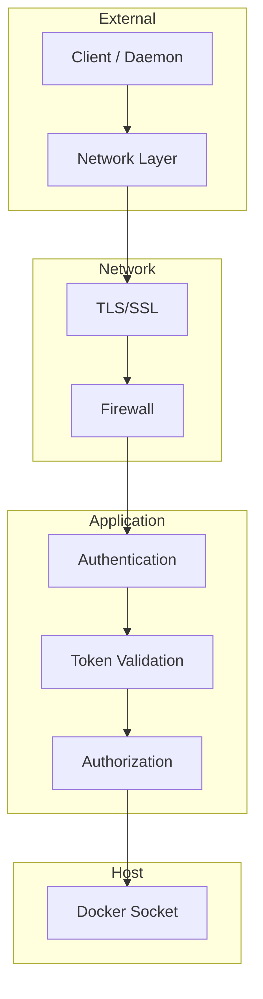

# Security

This guide covers comprehensive security best practices for deploying TurboPanel. Securing both the control plane and daemons is essential for production deployments. For setup instructions, see [Control Plane](/docs/deployment/control-plane) and [Daemon Setup](/docs/deployment/daemon-setup).

## Introduction

TurboPanel's security model spans the control plane (management interface and API) and daemons (remote Docker executors). Both components require attention to authentication, network isolation, and Docker socket access. This guide consolidates security guidelines from both components into a unified reference.

## Control Plane Security

### TLS/SSL Configuration

<Callout type="info" title="Production Requirement">
  For production deployments, always use a reverse proxy (nginx, Caddy, Traefik) for HTTPS. Never
  expose the control plane directly on HTTP in production.
</Callout>

```nginx
# nginx example
server {
    listen 443 ssl;
    server_name turbopanel.example.com;

    ssl_certificate /path/to/cert.pem;
    ssl_certificate_key /path/to/key.pem;

    location / {
        proxy_pass http://localhost:18282;
        proxy_set_header Host $host;
        proxy_set_header X-Real-IP $remote_addr;
    }
}
```

### Authentication

The control plane implements:

- Token-based authentication for API access
- Daemon token authentication for WebSocket connections (`AGENT_TOKEN`)
- Secure token storage and rotation policies
- Session management for web UI

### Initial install endpoint

`POST /api/client/v1/install` is only available while the instance is uninitialized (install mode). It is rate-limited per client IP; the first successful caller becomes the root admin. No setup secret is required — navigate to the install screen in your browser and complete the form.

### Network Isolation

- Use Docker networks to isolate containers
- Restrict Docker socket access to necessary containers only
- Implement firewall rules to restrict access to port 18282
- Use VPN or private networks for daemon communication when possible
- Consider Docker Swarm or Kubernetes network policies

### Docker Socket Security

<Callout type="warn" title="Docker Socket Access">
  The Docker socket provides full daemon access. Any process with socket access can create, destroy,
  or modify all containers and images on the host. Use network isolation, authentication, and audit
  logging.
</Callout>

Mitigation strategies:

- Run control plane in isolated Docker network
- Use Docker socket proxy for read-only access if applicable
- Implement audit logging for Docker operations
- Regularly review and rotate credentials
- Monitor Docker daemon logs for suspicious activity
- Consider Docker context restrictions

### Token Management

- Store tokens in environment variables or secrets manager
- Never commit tokens to version control
- Implement token rotation policies
- Use strong, unique tokens for each daemon
- Monitor token usage and revoke compromised tokens
- Use secrets management (Docker secrets, Kubernetes secrets, etc.)

### Firewall Rules

Recommended:

- Allow inbound to port 18282 only from trusted networks
- Restrict outbound to necessary services only
- Block direct Docker socket access from external networks
- Use fail2ban or similar for brute-force protection
- Implement rate limiting on API endpoints

### Non-Root User

The container runs as non-root (`turbopanel:turbopanel`, UID 9999). The Dockerfile creates this user and switches before running the application.

## Daemon Security

### Authentication

- **Daemon token:** Use `AGENT_TOKEN` environment variable for authentication with the control plane
- **Token Rotation:** Implement token rotation policies in production
- **Token Storage:** Store tokens securely (secrets manager, environment injection); never in code or image

### Network Security

<Callout type="info" title="Production Requirement">
  Use HTTPS/WSS for production deployments. Never use plain HTTP/WSS for daemon-to-control-plane in
  production.
</Callout>

- **TLS/SSL:** Use HTTPS/WSS for production deployments
- **Network Isolation:** Run daemons in isolated networks when possible (Docker networks, VPC)
- **Firewall Rules:** Restrict daemon port (18284) to control plane only; block unnecessary inbound/outbound

### Docker Socket Security

- **User Permissions:** Daemon runs as non-root user (`turbopanel:turbopanel`, UID 9999)
- **Socket Binding:** Only bind socket to necessary containers; avoid exposing socket to other services

### Best Practices

1. Use strong, unique tokens for each daemon
2. Enable TLS/SSL in production
3. Monitor daemon connections and activity (logs, metrics)
4. Implement rate limiting on control plane for daemon endpoints
5. Regularly rotate authentication tokens
6. Use network policies to restrict daemon communication to control plane only

## Security Layers Overview



## Secure Deployment Example

<Tabs items={['Self-Hosted', 'Cloud-Hosted']}>
  <Tab value="Self-Hosted">

```bash
# Control plane behind nginx with TLS
# nginx handles SSL termination and proxies to localhost:18282

# Daemon with token from secrets, WSS to control plane
docker run -d \
  --name turbopanel-daemon \
  -p 18284:18284 \
  -e AGENT_MODE=websocket \
  -e CONTROL_PLANE_URL=wss://turbopanel.example.com \
  -e AGENT_TOKEN=$(cat /run/secrets/agent_token) \
  -v /var/run/docker.sock:/var/run/docker.sock \
  ghcr.io/turbopanel/daemon:latest
```

  </Tab>
  <Tab value="Cloud-Hosted">

```bash
# Daemon connecting to cloud control plane
docker run -d \
  --name turbopanel-daemon \
  -p 18284:18284 \
  -e AGENT_MODE=durable-objects \
  -e CONTROL_PLANE_URL=https://your-control-plane.workers.dev \
  -e AGENT_TOKEN=$(cat /run/secrets/agent_token) \
  -v /var/run/docker.sock:/var/run/docker.sock \
  ghcr.io/turbopanel/daemon:latest
```

  </Tab>
</Tabs>

<Callout type="info" title="Daemon hardening">
  - **Firewall:** Restrict the host firewall so port 18284 only accepts traffic from the control
  plane IP or CIDR range. - **Read-only socket:** When a daemon only needs read operations
  (inspection, logs), mount the Docker socket read-only: `-v
  /var/run/docker.sock:/var/run/docker.sock:ro`. Daemons that must create or modify containers
  require full socket access.
</Callout>

## Related Documentation

- [Control Plane](/docs/deployment/control-plane) — Installation and configuration
- [Daemon Setup](/docs/deployment/daemon-setup) — Daemon deployment for both modes
- [REST API Reference](/docs/backend/api-reference) — API structure and authentication
