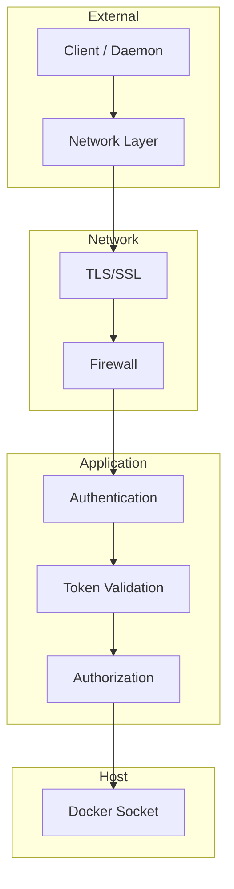

# Security

This guide covers comprehensive security best practices for deploying TurboPanel. Securing both the control plane and daemons is essential for production deployments. For setup instructions, see [Control Plane](/docs/deployment/control-plane) and [Daemon Setup](/docs/deployment/daemon-setup).

## Introduction

TurboPanel's security model spans the control plane (management interface and API) and daemons (remote Docker executors). Both components require attention to authentication, network isolation, and Docker socket access. This guide consolidates security guidelines from both components into a unified reference.

## Control Plane Security

Tenant **hosting** certificates (sites on :80/:443) are separate from the
control-plane leaf. Operators pin a library cert, use Caddy `tls internal`, or
pin a Let's Encrypt row that Caddy issues on the serving host. See
[Hostnames and TLS](/docs/deployment/hostnames-and-tls).

### TLS/SSL Configuration

<Callout type="info" title="Production Requirement">
  For production deployments, always use a reverse proxy (nginx, Caddy, Traefik) for HTTPS. Never
  expose the control plane directly on HTTP in production.
</Callout>

Self-hosted Caddy TLS is selected by `turbopanel_tls_mode` (default `self_signed`):

| Mode | Listen | Platform CA served | `--insecure-tls` |
| --- | --- | --- | --- |
| `self_signed` (default) | `:8443` | yes | yes |
| `upload` | `:8443` (or `caddy_port`) | unless `turbopanel_tls_public` | follows `turbopanel_tls_public` |
| `lets_encrypt` | `:443` (+ `:80` challenge) | no (404) | no |

`lets_encrypt` needs `:80`/`:443` free on the control-plane host. See [Control plane](/docs/deployment/control-plane#control-plane-tls-modes).

Self-hosted deployments ship **Caddy** on port **8443** with a platform CA by default. You can terminate TLS at an outer reverse proxy instead, proxying to Caddy or the instance socket:

```nginx
# nginx example — proxy to Caddy HTTPS or upstream HTTP
server {
    listen 443 ssl;
    server_name turbopanel.example.com;

    ssl_certificate /path/to/cert.pem;
    ssl_certificate_key /path/to/key.pem;

    location / {
        proxy_pass https://127.0.0.1:8443;
        proxy_set_header Host $host;
        proxy_set_header X-Real-IP $remote_addr;
    }
}
```

### Authentication

The control plane implements:

- Signed session cookies for the web UI (`TURBOPANEL_SECRETS`)
- Argon2id password hashing for credential accounts (OWASP `m=19456,t=2,p=1`)
- TOTP second factor with one-time backup codes
- Passkeys (WebAuthn, user-verification required, browser-only)
- GitHub / Google sign-in with **identity persisted only, no provider tokens, and no automatic linking by email**
- Re-authentication (password, or a session younger than 15 minutes) for enroll/disable 2FA, passkey add/remove, and provider unlink
- Host PAM gate for the Deno install wizard (not for routine sign-in)
- WSS registration for daemons at `/ws/daemon/v1` (network-layer access control recommended)

Operator flows: [Accounts and access](/docs/getting-started/accounts-and-access).

### Initial install endpoint

On Deno self-hosted, install endpoints are only available while the instance is uninitialized. The wizard verifies host PAM (`root` or sudo user) then creates a **superadmin** credential account. Host accounts cannot sign in for routine use — only the superadmin email/password works after install.

### Network Isolation

- Use Docker networks to isolate containers
- Restrict Docker socket access to necessary containers only
- Implement firewall rules to restrict access to the HTTPS entrypoint (default **8443**; **443** in `lets_encrypt`)
- Use TurboFabric or private networks for daemon communication when possible
- Consider Docker Swarm or Kubernetes network policies

### Docker Socket Security

<Callout type="warn" title="Docker Socket Access">
  The Docker socket provides full daemon access. Any process with socket access can create, destroy,
  or modify all containers and images on the host. Use network isolation, authentication, and audit
  logging.
</Callout>

Mitigation strategies:

- Run control plane in isolated Docker network
- Use Docker socket proxy for read-only access if applicable
- Implement audit logging for Docker operations
- Regularly review and rotate credentials
- Monitor Docker daemon logs for suspicious activity
- Consider Docker context restrictions

### Tenant compose field gate

On a self-hosted server, every tenant app on that host shares the same Docker daemon and the same Docker socket the panel itself talks to. A compose service that sets `privileged`, `cap_add`, `devices`, `network_mode`, `pid`, `ipc`, `userns_mode`, `security_opt`, `cgroup_parent`, or `sysctls` gets root-equivalent access to that shared host — compromising every other tenant co-hosted on it, and on the documented co-located topology, potentially the control plane's own root secret too.

These ten fields are **deny-by-default** for every organization. An org owner has to opt in explicitly — `PUT /organizations/:id/compose-privileged-fields` — before a deploy that sets any of them will run; a compose document that names one without the opt-in is refused with `403 compose_field_requires_org_opt_in`, naming the field. Ordinary fields a tenant needs for everyday deploys — bind mounts (`volumes`), published ports (`ports`), a non-root user (`user`), dropping a capability (`cap_drop`) — are unaffected; only the namespace/capability-*escaping* set is gated.

This is authorization, not yet an audited one: TurboPanel has no audit-log table today, so a toggle flip is not currently recorded anywhere beyond the organization row itself. Turn this on only for an organization with a real, understood need for one of these fields — it is not a per-field allowlist, and turning it on admits all ten.

### Token Management

- Store tokens in environment variables or secrets manager
- Never commit tokens to version control
- Implement token rotation policies
- Use strong, unique tokens for each daemon
- Monitor token usage and revoke compromised tokens
- Use secrets management (Docker secrets, Kubernetes secrets, etc.)

### Secret management (at rest vs delivery)

TurboPanel uses a **single root of trust** — the versioned `TURBOPANEL_SECRETS` keyring — for session signing, daemon JWT material, and data encryption. There are **no per-server at-rest encryption keys**.

| Envelope | When | Scope |
| -------- | ---- | ----- |
| `tpsecret.v<n>.…` | At rest in Postgres | Universal format for secret variables, TLS private keys, and principal passwords |
| `tpdaemon.v<n>.<serverId>.<keyId>.…` | At delivery only | Recipient-bound; produced by `resealSecretForDaemon` just before a daemon receives the secret |

A credential sealed as `tpsecret` is **server-agnostic at rest**, so the same stored secret can be delivered to any authorized daemon. Delivery decrypts the at-rest envelope inside the instance and re-seals it for that daemon's `(serverId, keyId)`; daemons decrypt only `tpdaemon` envelopes via authenticated `POST /api/daemon/v1/secrets/decrypt`. Global `tpsecret` blobs are never handed to daemons.

**Encrypt-only client boundary:** the client/UI surface seals secrets (`encryptSecret` / `generateSealedSecret`) and may show a generated plaintext once. It never decrypts at-rest envelopes for display or reuse.

#### Envelope grammar

Every TurboPanel-authored serialized secret uses one grammar: **`<scheme>.v<version>.<fields…>`**. The embedded version selects the key directly (no trial decrypt). **Password hashes are the deliberate exception** — they stay standard PHC Argon2id (`$argon2id$v=19$m=…`) for interoperability.

| Scheme | Shape | Where |
| --- | --- | --- |
| `tpsecret` | `tpsecret.v<n>.<payload>` | At rest (variables, TLS private keys, principal passwords, email secrets, TOTP secret, OAuth client secrets) |
| `tpdaemon` | `tpdaemon.v<n>.<serverId>.<keyId>.<payload>` | Daemon delivery only |
| `tpsession` | `tpsession.v<n>.<token>.<sig>` | Session cookie value |
| `tpotp` | `tpotp.v<n>.<hmacHex>` | Email OTP verifier at rest |
| `tpchallenge` | `tpchallenge.v<n>.<payload>.<sig>` | Stateless daemon enroll/auth challenge |
| `tp2fa` | `tp2fa.v<n>.<payload>.<sig>` | Stateless two-factor sign-in challenge |
| `tpwebauthn` | `tpwebauthn.v<n>.<payload>.<sig>` | Stateless WebAuthn ceremony challenge |
| `tpoauth` | `tpoauth.v<n>.<payload>.<sig>` | OAuth start/callback CSRF state |

**Keyring (`TURBOPANEL_SECRETS`):** the list is authoritative **in the order written** — first entry is current/signing; remaining entries are decrypt/verify-only fallbacks. Entries listed out of descending-version order log a warning and the first entry still signs. Example keyring shape (placeholder material only): `2:<new-key>,1:<old-key>`.

#### Rotation (self-hosted runbook)

1. **Add a key version** — re-run the instance converge with the opt-in extra-var `turbopanel_instance_secret_rotate=true` (default `false` in the daemon `instance-launch` role; ordinary converges never rotate). The task generates a fresh key via the instance `scripts/generate-secret.mjs`, computes the next version, and prepends it to `/etc/turbopanel/instance/.instance_secrets` (`root:<turbopanel_group>`, mode `0640`, comma-separated `<version>:<value>`, highest first).
2. **Re-converge normally** — the role slurps the keyring into `turbopanel_instance_secrets` and the `instance-deno.dev-vars.j2` / `instance-workers.dev-vars.j2` templates emit `TURBOPANEL_SECRETS`. Restart picks up the new keyring for the instance and the mailer (which loads the same env files to decrypt `MAILGUN_API_KEY` / `SMTP_PASS`).
3. **Confirm new writes use the new version** — update any secret variable and check the stored blob now begins `tpsecret.v<new>`; `GET /api/daemon/v1/jwks.json` publishes one `kid` per keyring version.
4. **Sweep existing rows** — Admin → Secrets → **Re-encrypt secrets** (`POST /api/admin/v1/secrets/reencrypt`). Batches are bounded; resume with the returned `cursor` until `completed: true`. Valid `tpdaemon` blobs are skipped by design; plaintext or malformed blobs are reported as `failed` and must be fixed by hand. The sweep covers every table holding `tpsecret` material — variables, TLS private keys, principal passwords, storage content, the `secret` table, git forge app envelopes (private key / client secret / webhook secret), GitLab connection OAuth token pairs, the TOTP secret, and the stored auth-provider/email client secrets — so a key cannot be retired before all of it is re-sealed.
5. **Retire the old key** — only after the sweep completes **and** old-key artifacts have aged out: daemon JWTs ≤15 min; daemon enroll/auth challenges (`tpchallenge`) ≤60 s; account-security challenges (`tp2fa` / `tpwebauthn`) ≤5 min; OAuth state (`tpoauth`) ≤10 min. Waiting 10 minutes covers every current stateless auth envelope. Note the user-visible consequence: session cookies embed the signing version, so dropping a key signs out anyone whose cookie was issued under it. Retire by editing `.instance_secrets` to remove the entry and re-converging — and only once nothing is still sealed under it.

#### Backup and escrow

`TURBOPANEL_SECRETS` is the single root of trust described above — losing it is **permanent, total data loss**: every session, every daemon's authorization, and every at-rest secret, TLS private key, and password becomes unrecoverable. Back it up before real data depends on it, not after.

**Self-hosted.** The keyring lives in exactly one place, `/etc/turbopanel/instance/.instance_secrets` on the control-plane host, and nothing copies it anywhere by default. Set the `instance-launch` role's `turbopanel_instance_secret_escrow_path` extra-var to a path **on the machine running the Ansible playbook** — never a path on the control-plane host itself, or it isn't actually a backup — and every converge pulls a fresh copy there via `ansible.builtin.fetch`, including after a rotation. Point it at removable media, an encrypted volume, or wherever your own backup policy already keeps secrets; the task copies the file as-is and applies no additional encryption of its own, the same trust model the file already has on the source host. Left unset (the default), no backup exists and losing the host is unrecoverable.

**Hosted (Cloudflare Workers).** There is no equivalent automatable step: `wrangler secret put` is write-only, and Cloudflare has no API to read a secret's value back once set. The value has to be preserved by whoever generates it, at generation time — store it the same way you would any other credential with no recovery path (a password manager, an offline printed copy, your organization's secrets-management tooling) before it is typed into `wrangler secret put` and the local copy is discarded.

### Backup and disaster recovery

The control plane's own Postgres database holds every organization's secrets, TLS private keys, and OAuth tokens — the same "no copy, no recovery" stakes as the root secret above, for a much larger blast radius if it's lost.

**Self-hosted.** A nightly backup is on by default — `postgres_backup_enabled: true` in the daemon `instance-launch`/`system-compose` role. Every night (`postgres_backup_oncalendar`, default `03:00`) `pg_dump -Fc` runs inside the database container over its default local connection (no password handling — the same trust model the customer-facing managed-engine backup feature already relies on), writes atomically, and prunes to the newest `postgres_backup_retention_keep` dumps (default 14) under `/var/lib/turbopanel/backup/postgres`. That alone protects against operator error and container/data corruption on the same volume, but **it is not yet off-host** by default — a lost or destroyed control-plane host takes the backups with it just like the database itself. Set `postgres_backup_remote_destination` to an `rsync`-compatible target (`user@host:/path/`) to have the script push each fresh dump off-host immediately after it's written; left unset, backups stay local only.

- **RPO (recovery point objective):** up to 24 hours — the gap since the last nightly dump. Lower it by running the backup script manually before a risky change, or by shortening `postgres_backup_oncalendar`.
- **RTO (recovery time objective):** no fixed target published yet; dominated by restore time, which scales with database size. Time a real restore on your own data before treating any number here as a promise.
- **Restore runbook:**
  1. Stop the stack so nothing writes to the database mid-restore: `systemctl stop turbopanel-system-stack`.
  2. Confirm the dump you're restoring from is intact — `pg_restore --list <dump>` should enumerate its contents without error before you touch the live database.
  3. Bring the database container back up on its own (`docker compose -p turbopanel-system -f /etc/turbopanel/system/docker-compose.yml up -d database`), then drop and recreate the target database: `docker exec turbopanel-database dropdb -U turbopanel turbopanel && docker exec turbopanel-database createdb -U turbopanel turbopanel`.
  4. Restore: `docker exec -i turbopanel-database pg_restore -U turbopanel -d turbopanel < <dump>`.
  5. Restart the full stack (`systemctl start turbopanel-system-stack`) and confirm the instance comes up and can read a known row before considering the restore complete.
  - A rotation performed after the dump was taken means the restored database's secrets are sealed under an old key version the running instance may no longer trust for signing — re-run the [rotation runbook](#rotation-self-hosted-runbook)'s sweep step after a restore if the dump predates a rotation, rather than assuming the restored data is immediately consistent with the current keyring.

**Hosted (Cloudflare Workers).** Workers route through Hyperdrive, a connection pooler in front of an origin Postgres — Hyperdrive itself takes no snapshots and isn't a backup service. What backs that origin, and who owns its backup/restore procedure, isn't settled yet; treat the self-hosted backup story above as the reference until this is documented here.

### Firewall Rules

Recommended:

- Allow inbound to the HTTPS entrypoint (default **8443**; **443** in `lets_encrypt`) only from trusted networks
- Restrict outbound to necessary services only
- Block direct Docker socket access from external networks
- Use fail2ban or similar for brute-force protection
- Implement rate limiting on API endpoints
- For **managed databases**, treat ProxySQL listeners (**5432** / **3306**) as the only host SQL ingress — never expose engine containers; keep private replication/backend paths on site or TurboFabric CIDRs. Prefer org-CA **`verify-full`** clients after downloading the CA PEM. Full contract: [Managed database ingress](/docs/architecture/managed-database-ingress).

### Service users (self-hosted)

Managed hosts use dedicated users: `tp` (UID 9999, daemon + Ansible), `tpctrl` (UID 9998, instance/UI), and `tpcaddy` (UID 9993, Caddy). Full UID/GID map (Redis, Postgres, RabbitMQ, optional web-server accounts): [instance AGENTS.md — Production UID/GID allocation](https://github.com/TurboPanel/turbopanel/blob/trunk/AGENTS.md#production-uidgid-allocation). Neither should run as root in steady state.

## Daemon Security

### Authentication

- Daemons register over WSS; restrict who can reach `/ws/daemon/v1` and `/api/daemon/v1/*` at the network layer
- Use TLS with the platform CA (or a public CA) for all daemon ↔ instance traffic. Public TLS (`lets_encrypt` / `TURBOPANEL_TLS_PUBLIC`) uses the system trust store and omits `--insecure-tls`.
- Rotate the instance root keyring with the self-hosted [Rotation runbook](#rotation-self-hosted-runbook); run the admin at-rest secret re-encrypt sweep before dropping old key versions

### Network Security

<Callout type="info" title="Production Requirement">
  Use HTTPS/WSS for production deployments. Never use plain HTTP/WSS for daemon-to-control-plane in
  production.
</Callout>

- **TLS/SSL:** Use HTTPS/WSS for production deployments
- **Network Isolation:** Run daemons in isolated networks when possible (Docker networks, VPC)
- **Firewall Rules:** Daemons are outbound clients — block unnecessary inbound to daemon hosts; allow outbound **8443** by default (or **443** / your instance URL) from daemons to the control plane

### Docker Socket Security

- **User Permissions:** Daemon runs as non-root user (`tp:tp`, UID 9999)
- **Socket Binding:** Only bind socket to necessary containers; avoid exposing socket to other services

### Best Practices

1. Use strong, unique tokens for each daemon
2. Enable TLS/SSL in production
3. Monitor daemon connections and activity (logs, metrics)
4. Implement rate limiting on control plane for daemon endpoints
5. Regularly rotate authentication tokens
6. Use network policies to restrict daemon communication to control plane only

## Security Layers Overview



## Secure Deployment Example

<Tabs items={['Self-Hosted', 'TurboPanel High Availability']}>
  <Tab value="Self-Hosted">

```bash
# Self-hosted: Caddy on 8443 with platform CA by default (Ansible install)
# Optional outer nginx terminates public TLS and proxies to Caddy:
# lets_encrypt binds :443 and omits --instance-ca / --insecure-tls.

# Remote managed server — official installer
curl -fsSL https://raw.githubusercontent.com/TurboPanel/turbopanel-cdn/trunk/install.sh \
  | sudo bash -s -- \
      --instance-url https://turbopanel.example.com:8443 \
      --instance-ca /etc/turbopanel/instance-ca.pem
```

  </Tab>
  <Tab value="TurboPanel High Availability">

```bash
# Remote managed server connecting to TurboPanel High Availability
# Hosted enrollments use the installer manifest default.
# Set TURBOPANEL_HOST only when you have a documented custom hosted URL.
curl -fsSL turbopanel.sh | TURBOPANEL_LICENSE=<base64url-encoded-license> sh
```

  </Tab>
</Tabs>

<Callout type="info" title="Daemon hardening">
  Daemons dial outbound to the instance — no inbound listener is required on managed
  server hosts for control-plane connectivity. Mount the Docker socket read-only (`:ro`) only when the daemon truly
  needs read-only inspection; orchestration requires full socket access.
</Callout>

## Related Documentation

- [Control Plane](/docs/deployment/control-plane) — Installation and configuration
- [Daemon Setup](/docs/deployment/daemon-setup) — Daemon deployment for both modes
- [API Reference](/docs/api) — OpenAPI browser and authentication routes
