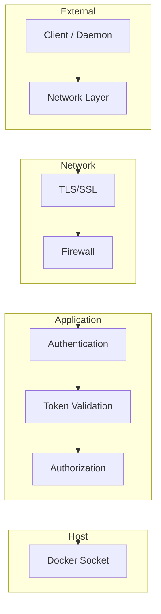

# Security

This guide covers comprehensive security best practices for deploying TurboPanel. Securing both the control plane and daemons is essential for production deployments. For setup instructions, see [Control Plane](/docs/deployment/control-plane) and [Daemon Setup](/docs/deployment/daemon-setup).

## Introduction

TurboPanel's security model spans the control plane (management interface and API) and daemons (remote Docker executors). Both components require attention to authentication, network isolation, and Docker socket access. This guide consolidates security guidelines from both components into a unified reference.

## Control Plane Security

### TLS/SSL Configuration

<Callout type="info" title="Production Requirement">
  For production deployments, always use a reverse proxy (nginx, Caddy, Traefik) for HTTPS. Never
  expose the control plane directly on HTTP in production.
</Callout>

Self-hosted deployments ship **Caddy** on port **8443** with a platform CA. You can terminate TLS at an outer reverse proxy instead, proxying to Caddy or the instance socket:

```nginx
# nginx example — proxy to Caddy HTTPS or upstream HTTP
server {
    listen 443 ssl;
    server_name turbopanel.example.com;

    ssl_certificate /path/to/cert.pem;
    ssl_certificate_key /path/to/key.pem;

    location / {
        proxy_pass https://127.0.0.1:8443;
        proxy_set_header Host $host;
        proxy_set_header X-Real-IP $remote_addr;
    }
}
```

### Authentication

The control plane implements:

- Signed session cookies for the web UI (`TURBOPANEL_SECRET` / `TURBOPANEL_SECRETS`)
- PBKDF2 password hashing for credential accounts
- Host PAM gate for the Deno install wizard (not for routine sign-in)
- WSS registration for daemons at `/ws/daemon/v1` (network-layer access control recommended)

### Initial install endpoint

On Deno self-hosted, install endpoints are only available while the instance is uninitialized. The wizard verifies host PAM (`root` or sudo user) then creates a **superadmin** credential account. Host accounts cannot sign in for routine use — only the superadmin email/password works after install.

### Network Isolation

- Use Docker networks to isolate containers
- Restrict Docker socket access to necessary containers only
- Implement firewall rules to restrict access to the HTTPS entrypoint (default **8443**)
- Use VPN or private networks for daemon communication when possible
- Consider Docker Swarm or Kubernetes network policies

### Docker Socket Security

<Callout type="warn" title="Docker Socket Access">
  The Docker socket provides full daemon access. Any process with socket access can create, destroy,
  or modify all containers and images on the host. Use network isolation, authentication, and audit
  logging.
</Callout>

Mitigation strategies:

- Run control plane in isolated Docker network
- Use Docker socket proxy for read-only access if applicable
- Implement audit logging for Docker operations
- Regularly review and rotate credentials
- Monitor Docker daemon logs for suspicious activity
- Consider Docker context restrictions

### Token Management

- Store tokens in environment variables or secrets manager
- Never commit tokens to version control
- Implement token rotation policies
- Use strong, unique tokens for each daemon
- Monitor token usage and revoke compromised tokens
- Use secrets management (Docker secrets, Kubernetes secrets, etc.)

### Secret management (at rest vs delivery)

TurboPanel uses a **single root of trust** — `TURBOPANEL_SECRET` or the versioned `TURBOPANEL_SECRETS` keyring — for session signing, daemon JWT material, and data encryption. There are **no per-server at-rest encryption keys**.

| Envelope | When | Scope |
| -------- | ---- | ----- |
| `tpsecret.v1.…` | At rest in Postgres | Universal format for secret variables, TLS private keys, and principal passwords |
| `tpdaemon.v1.<serverId>.<keyId>.…` | At delivery only | Recipient-bound; produced by `resealSecretForDaemon` just before a daemon receives the secret |

A credential sealed as `tpsecret` is **server-agnostic at rest**, so the same stored secret can be delivered to any authorized daemon. Delivery decrypts the at-rest envelope inside the instance and re-seals it for that daemon's `(serverId, keyId)`; daemons decrypt only `tpdaemon` envelopes via authenticated `POST /api/daemon/v1/secrets/decrypt`. Global `tpsecret` blobs are never handed to daemons.

**Encrypt-only client boundary:** the client/UI surface seals secrets (`encryptSecret` / `generateSealedSecret`) and may show a generated plaintext once. It never decrypts at-rest envelopes for display or reuse.

**Rotation:** add a new highest version to `TURBOPANEL_SECRETS` and deploy. New writes **lazy re-seal** under the current data-encryption key version; older `tpsecret` rows stay decryptable via keyring fallbacks until rewritten. Superadmin `POST /api/admin/v1/secrets/reencrypt` (Admin → Secrets → **Re-encrypt secrets**) sweeps existing `variable`, `tls`, and `principal` blobs onto the current version. Each sweep write is conditional on the original envelope still being present, so a concurrent secret update during rotation is left untouched. Drop old root keys from the keyring only after the sweep (and after short-lived daemon JWTs issued under those keys have expired).

### Firewall Rules

Recommended:

- Allow inbound to the HTTPS entrypoint (default **8443**) only from trusted networks
- Restrict outbound to necessary services only
- Block direct Docker socket access from external networks
- Use fail2ban or similar for brute-force protection
- Implement rate limiting on API endpoints

### Service users (self-hosted)

Managed hosts use dedicated users: `turbopanel` (UID 9999, daemon + Ansible) and `instance` (UID 9998, instance + Caddy + UI). Neither should run as root in steady state.

## Daemon Security

### Authentication

- Daemons register over WSS; restrict who can reach `/ws/daemon/v1` and `/api/daemon/v1/*` at the network layer
- Use TLS with the platform CA (or a public CA) for all daemon ↔ instance traffic
- Rotate `TURBOPANEL_SECRET` / `TURBOPANEL_SECRETS` on the instance per your key-rotation policy, then run the admin at-rest secret re-encrypt sweep before dropping old key versions (see [Secret management](#secret-management-at-rest-vs-delivery))

### Network Security

<Callout type="info" title="Production Requirement">
  Use HTTPS/WSS for production deployments. Never use plain HTTP/WSS for daemon-to-control-plane in
  production.
</Callout>

- **TLS/SSL:** Use HTTPS/WSS for production deployments
- **Network Isolation:** Run daemons in isolated networks when possible (Docker networks, VPC)
- **Firewall Rules:** Daemons are outbound clients — block unnecessary inbound to daemon hosts; allow outbound **8443** (or your instance URL) from daemons to the control plane

### Docker Socket Security

- **User Permissions:** Daemon runs as non-root user (`turbopanel:turbopanel`, UID 9999)
- **Socket Binding:** Only bind socket to necessary containers; avoid exposing socket to other services

### Best Practices

1. Use strong, unique tokens for each daemon
2. Enable TLS/SSL in production
3. Monitor daemon connections and activity (logs, metrics)
4. Implement rate limiting on control plane for daemon endpoints
5. Regularly rotate authentication tokens
6. Use network policies to restrict daemon communication to control plane only

## Security Layers Overview



## Secure Deployment Example

<Tabs items={['Self-Hosted', 'Cloud-Hosted']}>
  <Tab value="Self-Hosted">

```bash
# Self-hosted: Caddy on 8443 with platform CA (default Ansible install)
# Optional outer nginx terminates public TLS and proxies to Caddy:

# Remote managed server — official installer
curl -fsSL https://raw.githubusercontent.com/turbopanel/turbopanel-cdn/trunk/install.sh \
  | sudo bash -s -- \
      --instance-url https://turbopanel.example.com:8443 \
      --instance-ca /etc/turbopanel/instance-ca.pem
```

  </Tab>
  <Tab value="Cloud-Hosted">

```bash
# Remote managed server connecting to Workers instance
curl -fsSL https://raw.githubusercontent.com/turbopanel/turbopanel-cdn/trunk/install.sh \
  | sudo bash -s -- \
      --instance-url https://your-instance.workers.dev
```

  </Tab>
</Tabs>

<Callout type="info" title="Daemon hardening">
  Daemons dial outbound to the instance — no inbound listener is required on managed
  server hosts for control-plane connectivity. Mount the Docker socket read-only (`:ro`) only when the daemon truly
  needs read-only inspection; orchestration requires full socket access.
</Callout>

## Related Documentation

- [Control Plane](/docs/deployment/control-plane) — Installation and configuration
- [Daemon Setup](/docs/deployment/daemon-setup) — Daemon deployment for both modes
- [API Reference](/docs/api) — OpenAPI browser and authentication routes
