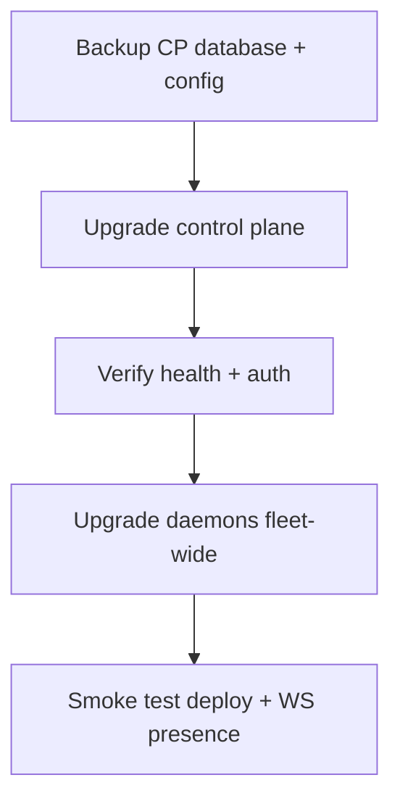

# Upgrade and rollback

Every release is a GitHub Release with its packages as assets. The installer and the daemon
both follow a **channel** — `release` (the latest promoted release), `rc` (the current
release candidate) or `canary` (the newest green build of `trunk`, for a
[canary environment](/docs/development/canary)) — and resolve that channel's `manifest.json`
straight from GitHub. There is no self-update inside the control plane: upgrading it means
running the installer again.

## Control plane (self-hosted)

1. **Back up Postgres** (`pg_dump` or a volume snapshot) and `/etc/turbopanel`.
2. Re-run the installer on the control-plane host:

   ```bash
   curl -fsSL turbopanel.sh | sh
   ```

   It downloads the channel's current instance and UI packages, verifies each against the
   release manifest, re-converges the host, applies pending database migrations with the
   instance binary's own `migrate` verb, and restarts the units. Add
   `TURBOPANEL_UPDATE_CHANNEL=rc` to move to the release candidate instead.
3. Verify `GET /api/health` — it reports the version and the exact release commit — and sign in.

The instance checks the database's migration history against the migrations it ships at every
boot and refuses to serve a mismatch: a database migrated by a **newer** release than the
binary (for example after a rollback of the binary alone) stops the instance with
`database was migrated by files this build does not ship`. Roll the database back with the
binary, or move the binary forward — never serve one release's schema with another's code.

### Rollback

Restore the Postgres backup and re-run the installer on a channel that points at the previous
release. Pinning the control plane itself to one exact release is not yet an installer flag.

## Control plane (TurboPanel High Availability)

TurboPanel operates the Workers deploys. Customers receive upgrades as they roll out — no
operator action unless the release notes say otherwise.

## Daemon fleet

### In-console update

Use **Update** on the server detail page when the daemon is online. The control plane resolves
the target from the instance's own channel; the page names the target by version and commit.

### Manual refresh

Re-run the installer on the host — see [Daemon update](/docs/deployment/daemon-update):

```bash
curl -fsSL turbopanel.sh | TURBOPANEL_LICENSE=<license> sh
```

The installer keeps exactly one previous generation beside the new one:
`/opt/turbopanel/bin/turbopaneld.prev` and `/opt/turbopanel/share/orchestration.prev`.

### Rollback: pin the previous release

Point the host at one exact manifest instead of whatever the channel resolves to now:

```bash
curl -fsSL turbopanel.sh \
  | TURBOPANEL_LICENSE=<license> \
    TURBOPANEL_MANIFEST_URL=https://github.com/TurboPanel/turbopaneld/releases/download/v0.1.0/manifest.json sh
```

The pin (`--manifest-url` / `TURBOPANEL_MANIFEST_URL`, https only) is written to `daemon.env`,
so a later console-driven update honours it too. A plain channel install clears it. The
`.prev` copies are the offline emergency: swap them back by hand when the host cannot reach
GitHub at all.

Revoke a compromised daemon key from the server page if enrollment material changed.

## Order of operations



Upgrade the control plane first. It refuses commands to a daemon older than its supported
floor (`daemon_unsupported`) but keeps the connection up, so the update itself still reaches
the daemon — see [Version compatibility](/docs/deployment/compatibility).

## Related

- [Compatibility matrix](/docs/deployment/compatibility)
- [Troubleshooting](/docs/deployment/troubleshooting)
- [Uninstall](/docs/deployment/uninstall)
