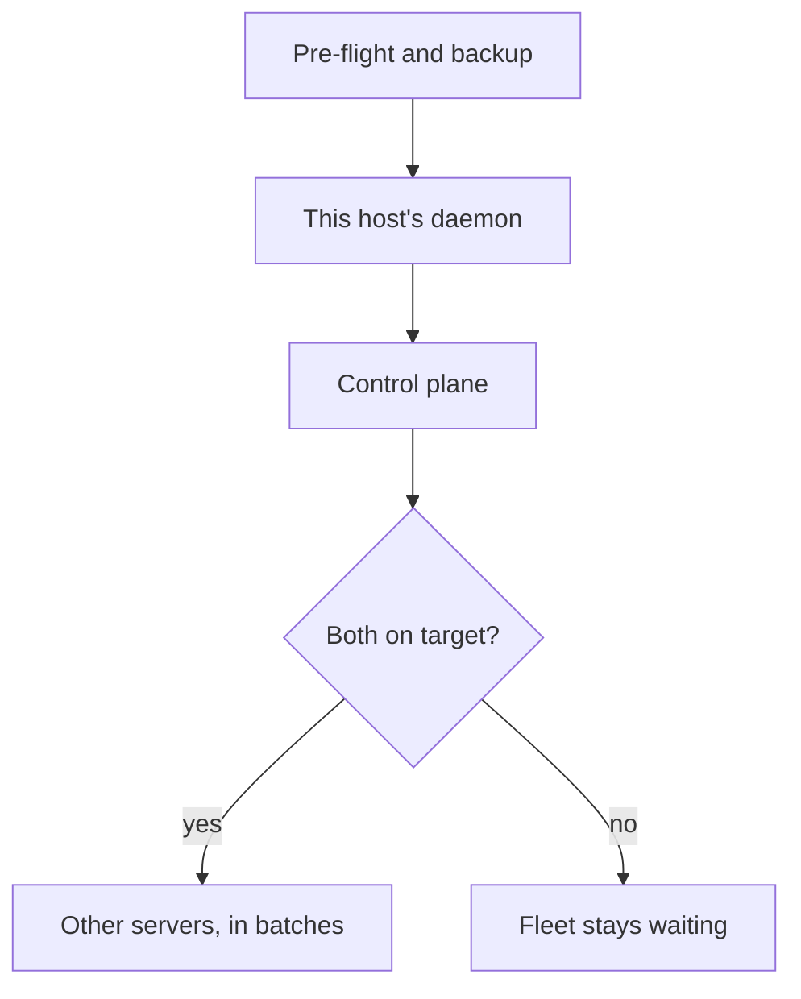

# Upgrade and rollback

Every release is a GitHub Release with its packages as assets. The installer and the daemon
both follow a **channel** — `release` (the latest promoted release), `rc` (the current
release candidate) or `canary` (the newest green build of `trunk`, for a
[canary environment](/docs/development/canary)) — and resolve that channel's `manifest.json`
straight from GitHub. The control plane and the daemon are separate packages. A managed
upgrade installs them in a fixed order. Re-running the installer still moves both on this host.

A run pins the manifest URL and the target commit it resolved when it started. A channel
that moves while the rollout is in progress does not change the bytes a later batch
installs.

## Order

On a self-hosted host the order is fixed:

1. **This host's daemon** — the co-located daemon, the one enrolled on the control plane's own machine.
2. **Control plane** — the instance package and the static UI on that same host.
3. **Other servers** — every other daemon, in batches.

The fleet phase does not start until both earlier steps are on the target build. A failed
control-plane step fails the run and leaves that gate shut. A `trunk` channel has no
control-plane package, so that step is skipped and the gate needs only the co-located
daemon on target.



TurboPanel High Availability deploys the control plane itself. **Admin → Updates** shows
that version as **Managed by TurboPanel** and rolls out daemons only. Per-server **Update**
on the organization console stays off (`updates_managed`).

Mixed versions stay connected the whole time. The version floors do not change, and a
daemon below its floor still holds its socket so the update can reach it. See
[Version compatibility](/docs/deployment/compatibility).

<Callout type="info" title="First upgrade onto this release">
  Backup and automatic rollback need a co-located daemon that advertises
  `managed-upgrade-v1`. A daemon from before this release does not. Pre-flight names
  that and gives the recovery command. Take an operator backup of the control-plane
  database first — this transition cannot use the managed backup yet — then update
  **only the daemon**, pinned to one verified manifest. On a host that already runs
  this control plane, that command refreshes the co-located daemon in socket mode
  (`daemon-colocated-refresh.yml`). It does not run the remote-node installer
  (`daemon-install.yml`), so `daemon.env` keeps dialing the local instance socket,
  shared state and config ownership stay as they are, and the daemon unit still
  starts after the instance. The instance, UI, and database are not replaced.
  When the new daemon attaches and advertises `managed-upgrade-v1`, start the
  upgrade from **Admin → Updates**.

  ```bash
  curl -fsSL turbopanel.sh \
    | TURBOPANEL_DAEMON_ONLY=1 \
      TURBOPANEL_MANIFEST_URL=https://github.com/TurboPanel/turbopaneld/releases/download/v0.1.1/manifest.json \
      sh
  ```
</Callout>

## From the console

**Admin → Updates** (`/admin/updates`). An `admin` or `superadmin` account.

<Tabs items={['Self-hosted', 'TurboPanel High Availability']}>
  <Tab value="Self-hosted">
    The status card reads **TurboPanel is up to date**, **Update available**, **Updating…**, or **Needs attention**.

    **Update TurboPanel** opens **Ready to update TurboPanel?**. The sheet lists the pre-flight checks, notes that the control-plane database is backed up before the install, and shows the **Recovery command** with **Copy command**. **Start update** begins the run. **Cancel** closes the sheet.

    Progress follows **Co-located daemon**, then **Control plane**, then the fleet table. Each step moves through Preparing → Downloading → Installing → Restarting → Verifying → Done. The control plane restarts during its step, so the browser may show a gateway error; the page comes back as **TurboPanel is updating** and polls until the run settles. **Retry** on a fleet row dispatches that step again.

    **Automatic updates** is off until you turn on **Auto-update fleet**. Automatic runs start only when the target differs from what is installed, no run is already active, and — if you enable **Maintenance window** — only inside that UTC window. The default batch is **100%** (Percent). Switch to **Count** to cap how many servers move together, then **Apply**.

    A failed step is terminal for its batch: the next batch still starts. It does not hold the wave.
  </Tab>
  <Tab value="TurboPanel High Availability">
    The control plane line is **Managed by TurboPanel**. There is no **Update TurboPanel** button and no **Auto-update fleet** toggle — daemon rollouts run on their own, inside the maintenance window when one is set.

    **Connected daemons** filters **All**, **Updating**, **Needs attention**, and **Up to date**. **Batch size** still applies (Percent or Count, **Apply**). **Retry** is on a row that needs it.
  </Tab>
</Tabs>

Only one run is active. A second start is refused while a run is `pending` or `running`.

## Batches and the maintenance window

| Setting | Range | Default |
| --- | --- | --- |
| Batch **Percent** | 1–100 | 100 |
| Batch **Count** | 1–10000 | — |
| Maintenance window | off, or a UTC start (minutes after midnight, 0–1439), a length (1–1440 minutes), and optional weekdays (Sunday = 0) | off; when on, empty weekdays means every day |

Percent rounds up so a non-empty fleet always moves at least one server. The next batch starts when every step in the current one is terminal (`done`, `skipped`, `failed`, `rolled_back`, or `needs_attention`). On TurboPanel High Availability a large batch drains across maintenance ticks so one tick does not enqueue the whole fleet at once.

An offline server's step waits (`waiting`) and is dispatched when that daemon reconnects. A step with no progress for 15 minutes is retried, up to 3 dispatches, then `needs_attention`. A step that rolled back is retried once, then `needs_attention`.

## Pre-flight, backup, and `.prev`

Before anything is swapped, the host checks:

| Code | Meaning |
| --- | --- |
| `preflight_disk` | Not enough free space, or the free-space check itself failed. A daemon install needs 512 MiB on `/opt/turbopanel`, 128 MiB on the state directory, and 256 MiB on the temp directory. A control-plane install needs 1 GiB on the install root and 1 GiB on the backup directory. |
| `preflight_manifest` | The pinned manifest could not be fetched, verified, or matched to `targetCommit`. |
| `preflight_trust` | Automatic-update TLS could not be established (public trust or the Platform CA). The daemon does not skip verification. |
| `preflight_backup` | `turbopanel-database` is not running, so the control-plane dump cannot be taken. |
| `preflight_in_progress` | Another install is already running on that host. |

The control-plane step also requires the co-located daemon to advertise `managed-upgrade-v1`. Without it, pre-flight stops and names the installer command above.

The automatic backup is written before the control-plane package swap, at:

```text
<backup dir>/control-plane/<upgrade id>/
```

The backup directory defaults to `/backup` (`TURBOPANEL_BACKUP_DIR` moves it). Each attempt keeps a `pg_dump -Fc` of the control-plane database, a tarball of `/etc/turbopanel`, and `meta.json` (including the migration-history fingerprint). The newest three attempts are kept.

One previous generation stays beside the new files, by rename:

| Package | Previous generation |
| --- | --- |
| Daemon | `/opt/turbopanel/bin/turbopaneld.prev`, `turbopaneld.js.prev` on hosts that run the JS runtime, `/opt/turbopanel/share/orchestration.prev` |
| Control plane | `/opt/turbopanel/bin/turbopanel.prev`, `/opt/turbopanel/lib/libduckdb.so.prev`, `/opt/turbopanel/share/ui.prev` |

## Automatic rollback

After the control plane restarts, the daemon polls `GET /api/health` on the instance socket until `version` and `revision.commit` match the pinned manifest. A timeout or a mismatch restores the `.prev` generation. The database is restored from the dump only when the migration fingerprint changed. A healthy restore reports `rolled_back` with `health_timeout`, `health_mismatch`, or `restart_failed`. A restore that does not come back reports `failed` / `recovery_required` and includes the backup path plus the commands below.

A daemon self-update arms an update guard for about 10 minutes. If the new build crash-loops, the guard restores the daemon `.prev` files and restarts `turbopaneld`. Detail: [Refresh a stuck daemon](/docs/deployment/daemon-update).

### Recovery command

Run as root on the control-plane host. The pre-flight sheet copies the same command, with the upgrade id filled in:

```bash
sudo -n /opt/turbopanel/share/orchestration/scripts/tp-orchestrate playbook -i localhost, -c local \
  -e turbopanel_upgrade_id=<upgrade id> \
  instance-rollback.yml
```

That restores the `.prev` builds and, when the migration fingerprint changed, the database dump under `/backup/control-plane/<upgrade id>/`. The helper is the installed absolute path, so it runs when the panel is stopped and `tp-orchestrate` is not on `PATH`. To reinstall one pinned control-plane manifest instead:

```bash
sudo -n /opt/turbopanel/share/orchestration/scripts/tp-orchestrate update-instance \
  --channel release \
  --manifest-url https://github.com/TurboPanel/turbopanel/releases/download/v0.1.0/manifest.json \
  --no-start
```

`--manifest-url` on that verb is the control-plane pin (`TURBOPANEL_INSTANCE_MANIFEST_URL`). It does not change the daemon pin (`TURBOPANEL_MANIFEST_URL`).

## Pin a package by hand

The same pins work from the installer. Each package keeps its own pin; a later channel install that does not name a pin clears it.

```bash
curl -fsSL turbopanel.sh \
  | TURBOPANEL_INSTANCE_MANIFEST_URL=https://github.com/TurboPanel/turbopanel/releases/download/v0.1.0/manifest.json sh
```

```bash
curl -fsSL turbopanel.sh \
  | TURBOPANEL_LICENSE=<license> \
    TURBOPANEL_MANIFEST_URL=https://github.com/TurboPanel/turbopaneld/releases/download/v0.1.0/manifest.json sh
```

The instance checks migration history at every boot and refuses to serve a database migrated by a newer release than the binary (`database was migrated by files this build does not ship`). Roll the database back with the binary, or move the binary forward.

The daemon refuses a control-plane target below `MIN_SUPPORTED_INSTANCE_VERSION` (today **0.1.0**). A target it cannot parse is allowed. Daemon self-update does not consult that floor.

## History

Finished runs stay for 365 days, and at least the newest 50. Successful steps (`done`, `skipped`) are pruned after `TURBOPANEL_UPGRADE_STEP_RETENTION_DAYS` (default 14). Failed steps (`failed`, `rolled_back`, `needs_attention`) stay 90 days. The run row keeps its summary after the steps are gone. See [Instance configuration](/docs/deployment/instance-configuration).

## Related

- [Compatibility matrix](/docs/deployment/compatibility)
- [Refresh a stuck daemon](/docs/deployment/daemon-update)
- [Troubleshooting](/docs/deployment/troubleshooting)
- [Administering an instance](/docs/using/admin)
