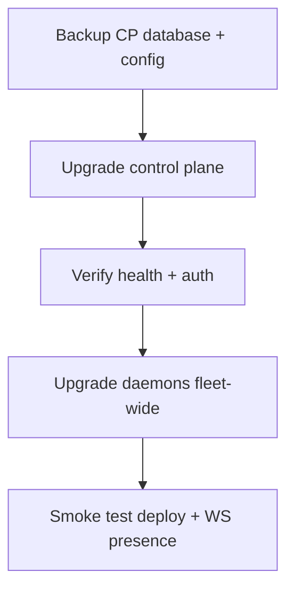

# Upgrade and rollback

## Control plane (self-hosted)

1. **Back up Postgres** (`pg_dump` or volume snapshot) and `/etc/turbopanel`.
2. Pull the target channel artifact or re-converge from a known-good checkout (dev) / release package (production).
3. Run pending database migrations (`pnpm migrate` on Workers deploy path; Deno managed installs run migrations during converge).
4. Restart `turbopanel-instance`, `turbopanel-caddy`, and `turbopanel-ui` (if dev mode).
5. Verify `GET /api/health` and sign-in.

Rollback: restore the database backup and previous artifact tree; restart services. Document the paired daemon versions in [compatibility](/docs/deployment/compatibility).

## Control plane (TurboPanel High Availability)

TurboPanel operates Workers deploys. Customers receive upgrades as they roll out — no operator action unless release notes require it.

## Daemon fleet

### In-console update

Use **Update** on the server detail page when the daemon is online and on a supported channel.

### Manual refresh

Re-run the installer on each node — see [Daemon update](/docs/deployment/daemon-update).

```bash
curl -fsSL turbopanel.sh | TURBOPANEL_LICENSE=<license> sh
```

### Rollback

Re-run the installer pinned to the previous channel manifest, or restore `/opt/turbopanel` from backup taken before upgrade. Revoke compromised daemon keys from the org console if enrollment material changed.

## Order of operations



## Related

- [Compatibility matrix](/docs/deployment/compatibility)
- [Troubleshooting](/docs/deployment/troubleshooting)
- [Uninstall](/docs/deployment/uninstall)
