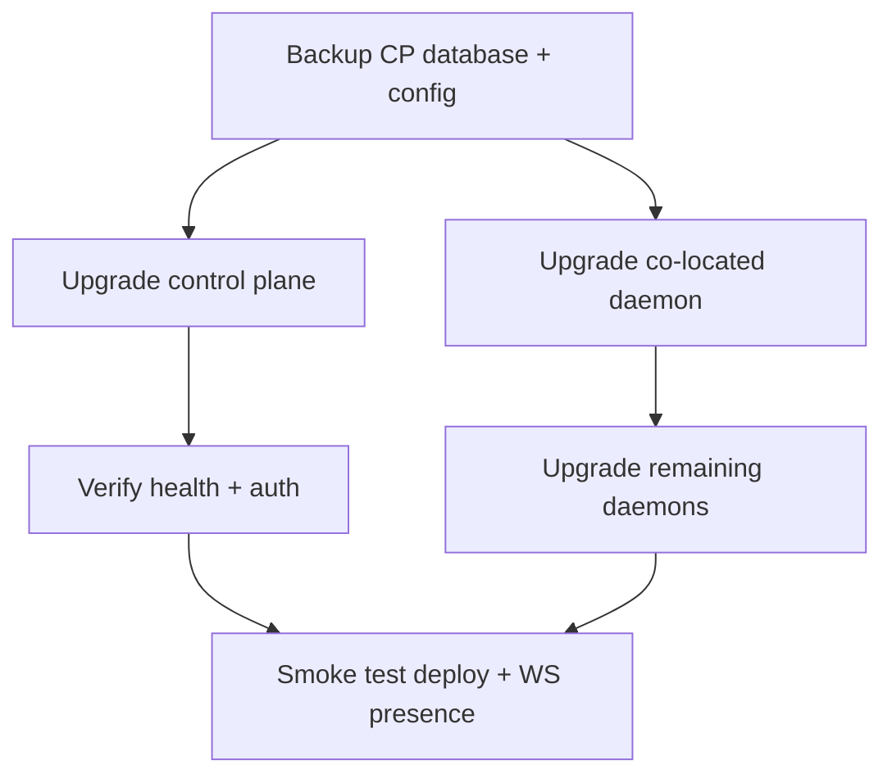

# Upgrade and rollback

Every release is a GitHub Release with its packages as assets. The installer and the daemon
both follow a **channel** — `release` (the latest promoted release), `rc` (the current
release candidate) or `canary` (the newest green build of `trunk`, for a
[canary environment](/docs/development/canary)) — and resolve that channel's `manifest.json`
straight from GitHub. The control plane and the daemon are separate packages. Each can
move from **Admin → Updates**, and re-running the installer still moves both.

## Control plane (self-hosted)

The control plane and the co-located daemon each have a row on **Admin → Updates**.
Upgrade on one row installs that unit and leaves the other where it is. They do
not share a manifest pin: a daemon pinned with `TURBOPANEL_MANIFEST_URL` still
follows the channel for the control plane, and `TURBOPANEL_INSTANCE_MANIFEST_URL`
pins only the control plane.

1. **Back up Postgres** (`pg_dump` or a volume snapshot) and `/etc/turbopanel`.
2. On **Admin → Updates**, use **Upgrade** on the **Control plane** row.

   The control plane queues `instance-update` for the co-located daemon and
   returns immediately. The daemon runs `run.sh --instance` for `canary`, `rc`,
   or `release` (a `trunk` control plane has no package, so that Upgrade stays
   disabled). The install restarts the panel, so the browser often sees a
   gateway error while it proceeds. The page polls until the installed version
   matches the target.

   Re-running the installer does the same install and also refreshes the daemon:

   ```bash
   curl -fsSL turbopanel.sh | sh
   ```

   Add `TURBOPANEL_UPDATE_CHANNEL=rc` to move to the release candidate instead.
3. Verify `GET /api/health` — it reports the version and the exact release commit — and sign in.

The instance checks the database's migration history against the migrations it ships at every
boot and refuses to serve a mismatch: a database migrated by a **newer** release than the
binary (for example after a rollback of the binary alone) stops the instance with
`database was migrated by files this build does not ship`. Roll the database back with the
binary, or move the binary forward — never serve one release's schema with another's code.

The daemon refuses to install a control plane older than its own floor
(`MIN_SUPPORTED_INSTANCE_VERSION`, today **0.1.0**). A target it cannot parse
is allowed. The control plane accepts the dispatch from any connected daemon;
the connection is how the install arrives. See
[Version compatibility](/docs/deployment/compatibility).

### Rollback

Restore the Postgres backup and re-run the installer pinned to one exact control-plane
manifest. The pin is `TURBOPANEL_INSTANCE_MANIFEST_URL` / `--instance-manifest-url`
(https only). It is independent of the daemon pin (`TURBOPANEL_MANIFEST_URL` /
`--manifest-url`): each package keeps its own pin.

```bash
curl -fsSL turbopanel.sh \
  | TURBOPANEL_INSTANCE_MANIFEST_URL=https://github.com/TurboPanel/turbopanel/releases/download/v0.1.0/manifest.json sh
```

`--instance-manifest-url` is the same pin when `run.sh` is invoked with flags.
`tp-orchestrate update-instance` maps its `--manifest-url` onto that flag, which
records `TURBOPANEL_INSTANCE_MANIFEST_URL` and leaves the daemon pin
(`TURBOPANEL_MANIFEST_URL`) unchanged. The value is written to `daemon.env`; a
later install that names only a channel clears it.

## Control plane (TurboPanel High Availability)

TurboPanel operates the Workers deploys. Customers receive upgrades as they roll out — no
operator action unless the release notes say otherwise.

## Daemon fleet

### In-console update

Use **Upgrade** on the **Daemon** row of **Admin → Updates** for the control-plane
host. Use **Update** on any other server's detail page when that daemon is
online. The control plane resolves the target from the instance's own channel;
the page names the target by version and commit. The per-server action refuses
the co-located host so it cannot race the **Daemon** row.

The control plane keeps a daemon below its floor connected and fails that
daemon's commands with `daemon_unsupported` until it updates. The floor today
is **0.1.0**. A daemon that reports no version is treated as unknown and its
commands still run. The other direction is the daemon's own floor for the
control plane, also **0.1.0**: an older control plane stays connected and is
flagged, and the daemon will not install a control plane below that floor.
See [Version compatibility](/docs/deployment/compatibility).

### Manual refresh

Re-run the installer on the host — see [Daemon update](/docs/deployment/daemon-update):

```bash
curl -fsSL turbopanel.sh | TURBOPANEL_LICENSE=<license> sh
```

The installer keeps exactly one previous generation beside the new one:
`/opt/turbopanel/bin/turbopaneld.prev` and `/opt/turbopanel/share/orchestration.prev`.

### Rollback: pin the previous release

Point the host at one exact manifest instead of whatever the channel resolves to now:

```bash
curl -fsSL turbopanel.sh \
  | TURBOPANEL_LICENSE=<license> \
    TURBOPANEL_MANIFEST_URL=https://github.com/TurboPanel/turbopaneld/releases/download/v0.1.0/manifest.json sh
```

The pin (`--manifest-url` / `TURBOPANEL_MANIFEST_URL`, https only) is written to `daemon.env`,
so a later console-driven update honours it too. A plain channel install clears it. The
`.prev` copies are the offline emergency: swap them back by hand when the host cannot reach
GitHub at all.

Revoke a compromised daemon key from the server page if enrollment material changed.

## Order of operations



Upgrade either unit when you are ready. The control plane refuses commands to a
daemon older than its supported floor (`daemon_unsupported`) but keeps the
connection up, so a daemon update still reaches that host. A control-plane
update does not wait for the daemon to be on the newest build. There is no
required order between the two units. See
[Version compatibility](/docs/deployment/compatibility).

## Related

- [Compatibility matrix](/docs/deployment/compatibility)
- [Troubleshooting](/docs/deployment/troubleshooting)
- [Uninstall](/docs/deployment/uninstall)
