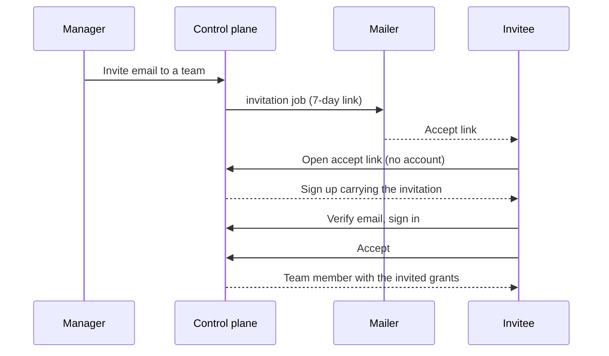

# Accounts and access

How operators sign in, protect an account, and invite teammates. Two-factor, passkeys, and GitHub / Google sign-in are managed from the signed-in console; invitations are team-scoped.

<Callout type="info" title="Private alpha — not yet publicly available">
  Self-hosted and TurboPanel High Availability are both in **private alpha**. This page describes
  the account and access flows that already exist in the console — not a public sign-up path.
</Callout>

## Two-factor with an authenticator app

Two-factor lives in the signed-in console → account menu → **Security** (`/account/security`).

<Steps>
  <Step>
    Confirm your password.
  </Step>
  <Step>
    Scan or paste the base32 key / `otpauth://` URI into an authenticator app.
  </Step>
  <Step>
    Enter the first 6-digit code. Nothing is enabled until that code verifies.
  </Step>
</Steps>

**Backup codes are shown once** at verification — ten one-time codes. Regenerating invalidates the previous set. Store them somewhere you can reach without the authenticator.

Sign-in then becomes two steps: password, then a 6-digit code, with a **Use a backup code** toggle. The challenge is short-lived (5 minutes) and dies after five wrong codes; you simply sign in again.

Disabling 2FA, regenerating backup codes, and removing a passkey need re-authentication: your password, or a session younger than 15 minutes.

<Callout type="info" title="Passkey sign-in skips the code">
  A passkey sign-in never asks for the authenticator code. The passkey *is* the second factor.
</Callout>

## Passkeys

**Web only in this release.** Passkeys require a browser on the same origin as the control plane. Native iOS and Android show a short “use a browser” note rather than a broken button — that is the most likely support question.

Register from the Security screen with a name. User verification (biometric / device PIN) is required.

Sign in with the passkey alone from the sign-in screen — no email, no password, and **no second-factor prompt**, because the passkey is the second factor.

Delete requires the same re-authentication as two-factor (password, or a session younger than 15 minutes). Keep at least one other way to sign in.

## Sign in with GitHub or Google

Buttons appear on sign-in **only when that provider is configured** on the instance.

<Tabs items={['Self-hosted', 'TurboPanel High Availability']}>
  <Tab value="Self-hosted">
    A superadmin sets the client id / secret at **Admin → Auth providers** (`/admin/auth-providers`). Secrets are write-only — the API reports presence only and never echoes a value.

    Environment always wins over the stored `SYSTEM_AUTH_PROVIDERS` row, same rule as system email:

    - `TURBOPANEL_AUTH_PROVIDERS__GITHUB_CLIENT_ID`
    - `TURBOPANEL_AUTH_PROVIDERS__GITHUB_CLIENT_SECRET`
    - `TURBOPANEL_AUTH_PROVIDERS__GOOGLE_CLIENT_ID`
    - `TURBOPANEL_AUTH_PROVIDERS__GOOGLE_CLIENT_SECRET`

    A key set by environment renders locked in the admin screen.
  </Tab>
  <Tab value="TurboPanel High Availability">
    TurboPanel High Availability binds those same four names as Wrangler secrets (`wrangler secret put`); the database row stays empty there. **Name the variables, never a value.**
  </Tab>
</Tabs>

<Callout type="warn" title="No automatic linking by email address">
  A provider identity that matches no linked account either creates a new user (when sign-up is
  enabled) or fails with a clear message. Linking an existing account to GitHub or Google happens
  only from the signed-in Security screen → **Linked accounts**.
</Callout>

TurboPanel stores the provider identity only — no provider access or refresh tokens.

An account with 2FA enabled still gets the code step after the provider round trip.

Unlinking refuses when it would remove your last way to sign in.

## Invite a teammate

Invitations are **team-scoped**: you invite someone to a team, and org access follows from team membership.

Who can invite: a manager of that team (`organization:manage` / team manage). **Only an organization owner may attach explicit permission grants** — everyone else's invitation carries the default organization-manage grant.

Expiry is **7 days**. There is one pending invitation per team + email address. Managers can revoke a pending invitation, which prevents the accept.

The invitee gets an email with an accept link. If email is not reachable on the instance, the invitation is refused rather than created silently — see [Control plane](/docs/deployment/control-plane) for mail configuration.

**An invitee without an account:** the accept link offers sign-in and sign-up. The sign-up carries the invitation, so it works **even while public sign-up is disabled**, as long as the email matches the invitation. Email verification behaves exactly as it does for any other sign-up. After signing in they land back on the accept screen and join the team.

## Related

- [Control plane](/docs/deployment/control-plane) — Instance configuration, including mail and OAuth environment variables
- [Security](/docs/deployment/security) — TLS, authentication, and secret envelopes
- [Password safety](/docs/security/password-safety) — Compromised-password checks on sign-up and password changes
- [Instance API architecture](/docs/architecture/api) — Auth routes and secret envelopes
