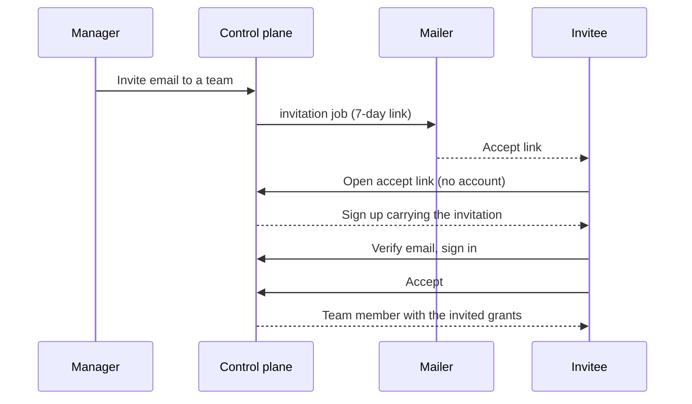

# Accounts and access

How operators sign in, protect an account, and invite teammates. Two-factor, passkeys, and GitHub / Google sign-in are managed from the signed-in console; invitations are team-scoped.

<Callout type="info" title="Private alpha — not yet publicly available">
  Self-hosted and TurboPanel High Availability are both in **private alpha**. This page describes
  the account and access flows that already exist in the console — not a public sign-up path.
</Callout>

## Protecting an account

Two-factor with an authenticator app, backup codes, passkeys and linked GitHub / Google identities are managed by each person from the account menu → **Security** (`/account/security`). The user-facing procedures, the re-authentication rule (password, or a session younger than 15 minutes) and every refusal are in [Account security](/docs/using/account-security). The operator's part is below: configuring the providers the instance offers.

## Sign in with GitHub or Google

Buttons appear on sign-in **only when that provider is configured** on the instance.

<Tabs items={['Self-hosted', 'TurboPanel High Availability']}>
  <Tab value="Self-hosted">
    A superadmin sets the client id / secret at **Admin → Auth providers** (`/admin/auth-providers`). Secrets are write-only — the API reports presence only and never echoes a value.

    Environment always wins over the stored `SYSTEM_AUTH_PROVIDERS` row, same rule as system email:

    - `TURBOPANEL_AUTH_PROVIDERS__GITHUB_CLIENT_ID`
    - `TURBOPANEL_AUTH_PROVIDERS__GITHUB_CLIENT_SECRET`
    - `TURBOPANEL_AUTH_PROVIDERS__GOOGLE_CLIENT_ID`
    - `TURBOPANEL_AUTH_PROVIDERS__GOOGLE_CLIENT_SECRET`

    A key set by environment renders locked in the admin screen.
  </Tab>
  <Tab value="TurboPanel High Availability">
    TurboPanel High Availability binds those same four names as Wrangler secrets (`wrangler secret put`); the database row stays empty there. **Name the variables, never a value.**
  </Tab>
</Tabs>

<Callout type="warn" title="No automatic linking by email address">
  A provider identity that matches no linked account either creates a new user (when sign-up is
  enabled) or fails with a clear message. Linking an existing account to GitHub or Google happens
  only from the signed-in Security screen → **Linked accounts**.
</Callout>

TurboPanel stores the provider identity only — no provider access or refresh tokens.

An account with 2FA enabled still gets the code step after the provider round trip.

Unlinking refuses when it would remove your last way to sign in.

## Invite a teammate

Invitations are **team-scoped**: you invite someone to a team, and organization access follows from team membership. A manager of the team invites; only an organization owner may attach explicit permission grants; the link is good for **7 days**; and an instance without outbound email refuses to create one rather than creating it silently (see **Email** in [Administering an instance](/docs/using/admin#email)). The console procedure, the accept flow for someone without an account, and the permission catalogue are in [Organizations, teams and access](/docs/using/access).

## Related

- [Account security](/docs/using/account-security) and [Organizations, teams and access](/docs/using/access) — the user guide chapters
- [Control plane](/docs/deployment/control-plane) — Instance configuration, including mail and OAuth environment variables
- [Security](/docs/deployment/security) — TLS, authentication, and secret envelopes
- [Password safety](/docs/security/password-safety) — Compromised-password checks on sign-up and password changes
- [Instance API architecture](/docs/architecture/api) — Auth routes and secret envelopes
