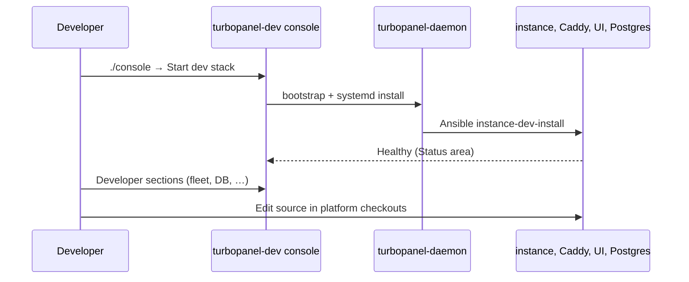

# Local development

This guide covers contributor local development. For supported OSes and required tooling, see [Prerequisites](/docs/development/prerequisites). For layout and service dependencies, see [Development architecture](/docs/architecture/development-architecture). For common failures, see [Dev console troubleshooting](/docs/getting-started/tilt-troubleshooting).

TurboPanel is **not a monorepo**. The [turbopanel-dev](https://github.com/turbopanel/turbopanel-dev) repository is the entry point — it installs the dev console and orchestrates platform checkouts under `/opt/turbopanel/platform/`.

## Quick start

**1. Bootstrap the dev console**

One-liner (fresh machine):

```bash
curl -fsSL https://develop.trbp.nl | sh
cd turbopanel-dev
```

Or, from an existing checkout:

```bash
sh scripts/install.sh   # update turbopanel-dev only
./console
```

**2. Start the dev stack**

From `./console`, choose **Start dev stack** in the Actions area. The console:

- Installs the **daemon** repo under `/opt/turbopanel/platform/daemon` (if missing)
- Writes developer identity (`TURBOPANEL_DEV_USER/UID/GID`) into the daemon `.env`
- Runs `bootstrap-orchestration.sh` and `install-daemon-systemd.sh`
- Lets the daemon install instance, UI, Caddy, and Postgres via Ansible

**3. Open**

| Service | URL |
| ------- | --- |
| App (Caddy → UI + API) | `https://localhost:8443` |
| API health | `https://localhost:8443/api/health` |
| Website (docs + API reference) | `http://localhost:19820` (when running separately) |
| Mailpit | `http://localhost:19826` (when configured) |

Trust the platform CA at `instance/certs/ca.crt` in your browser to avoid TLS warnings on `:8443`.

Smoke test:

```bash
curl -k https://localhost:8443/api/health
curl -k https://localhost:8443/api/install/v1/status
```

## Dev console areas

Use **←** / **→** to switch areas in `./console`:

| Area | Contents |
| ---- | -------- |
| **Status** | Runtime, platform checkout, dev stack units |
| **Instance** | Runtime mode (Deno/Workers), instance unit status, switch action |
| **Developer** | Fleet, services, shell, database, … (when `instance.sock` is present) |
| **Actions** | Install daemon, start stack, follow logs, build mode, refresh, quit |

In the **Developer** area: **↑↓** picks a section, **Enter** opens it, **Esc** returns to the section list.

## Instance runtime modes

`TURBOPANEL_INSTANCE_RUNTIME` in the daemon `.env` selects how the instance runs locally. Switch via the **Instance** area in the console.

| Mode | Behaviour |
| ---- | --------- |
| **deno** (default) | `turbopanel-instance` systemd unit + Unix socket at `/run/turbopanel/instance.sock` |
| **workers** | Stops the systemd unit, exposes Postgres on TCP (`127.0.0.1:5432`), expects `pnpm dev` in `platform/instance` manually |

Workers mode has no Redis. Set `CLOUDFLARE_HYPERDRIVE_LOCAL_CONNECTION_STRING_HYPERDRIVE` in `instance/.dev.vars`.

## Repository layout

Platform repos live under `/opt/turbopanel/platform/` (installed by the daemon via Ansible):

```
/opt/turbopanel/
├── platform/
│   ├── daemon/    # turbopanel-daemon — installed by the console
│   ├── turbopanel/  # instance (Hono API — Workers + Deno)
│   ├── ui/        # Expo frontend
│   └── website/   # marketing + docs (optional local run)
└── runtimes/
    └── deno/v2.8.3/   # pinned Deno runtime (console-managed)
```

Your `turbopanel-dev` checkout stays wherever you cloned it (for example `./turbopanel-dev` in your home directory).

## Common tasks

### Database schema

TurboPanel uses **drizzle-kit push** (no versioned migration files in early development). From `instance/`:

```bash
./sync.sh          # push schema.ts → Postgres (interactive)
./sync.sh --force  # skip destructive-change prompts (dev only)
./introspect.sh    # pull live DB → schema.ts
```

For errors and resets, see [Database troubleshooting](/docs/getting-started/database-troubleshooting). The dev console **Database** section can reset the dev instance or start Drizzle Studio.

### Drizzle Studio

In the developer console **Database** section, start Studio via the API. The instance spawns `drizzle-kit studio` on **4983**; open **`https://local.drizzle.studio?host=localhost&port=4983`** in your browser.

### Formatting

Each repo formats independently — run the formatter configured in that repo before committing.

## Workflow diagram



## Port reference

| Service | Port | Notes |
| ------- | ---- | ----- |
| Caddy (HTTPS app) | 8443 | Browser entrypoint |
| Website | 19820 | Next.js (when run locally) |
| Wrangler (Workers mode) | 18787 | Not browser-facing |
| Expo web | 8081 | Proxied by Caddy in dev |
| Postgres | 5432 | Docker, `127.0.0.1:5432` (Workers mode) or Unix socket (Deno) |
| Mailpit web | 19826 | Dev email UI |
| Mailpit SMTP | 19825 | Dev email SMTP |
| Drizzle Studio | 4983 | HTTP API; UI at `local.drizzle.studio` |

## Related

- [Dev console troubleshooting](/docs/getting-started/tilt-troubleshooting)
- [Database troubleshooting](/docs/getting-started/database-troubleshooting)
- [Development architecture](/docs/architecture/development-architecture)
- [API architecture](/docs/architecture/api)
