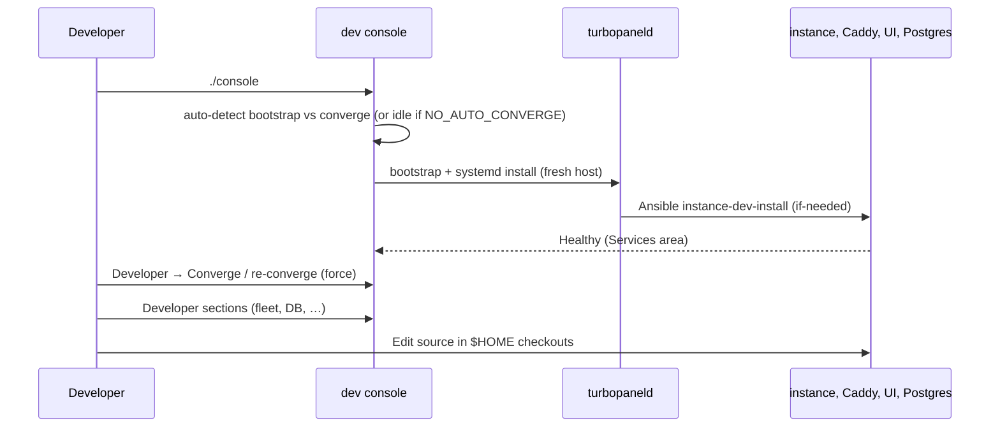

# Local development

This guide covers contributor local development. For supported OSes and required tooling, see [Prerequisites](/docs/development/prerequisites). For layout and service dependencies, see [Development architecture](/docs/architecture/development-architecture). For common failures, see [Dev console troubleshooting](/docs/getting-started/tilt-troubleshooting).

TurboPanel is **not a monorepo**. Clone the five sibling repos into `$HOME` (`~/dev`, `~/turbopaneld`, `~/turbopanel`, `~/ui`, `~/website`). The [dev](https://github.com/turbopanel/dev) repository is the entry point — it installs the dev console and orchestrates the stack via Ansible.

## Fresh-clone → working dev

1. Clone the five repos into `$HOME` (`~/dev`, `~/turbopaneld`, `~/turbopanel`, `~/ui`, `~/website`).
2. From `~/dev`, run `./console` → prereqs, pinned Node, `pnpm install`, TUI launch (exports `TURBOPANEL_MODE=development`, `TURBOPANEL_DEV_ROOT`, `TURBOPANEL_<DIR>_REPO`).
3. **Bootstrap / converge** → on launch the console auto-bootstraps when prerequisites are missing (daemon install → systemd unit → `instance-dev-install --if-needed`), otherwise auto-converges (`if-needed`, skip-when-unchanged). Set `TURBOPANEL_CONSOLE_NO_AUTO_CONVERGE` (any non-empty value) to skip auto-converge on launch; Developer → **Converge / re-converge** always force-runs. Daemon bootstraps as the dev user, writes `/etc/turbopanel/daemon.env`, runs the `dev/orchestration` overlay: runtimes into `/opt/turbopanel/vendor`, systemd units + Docker (postgres/redis/rabbitmq/mailpit) as the dev user, mutable data under FHS trees dev-user-owned. No `tp` / `tpctrl` / `tpcache` accounts created.
4. Open `https://localhost:8443` (or dev `http://localhost:8880`); edit source in place under `$HOME`.

## Quick start

**1. Bootstrap the dev console**

One-liner (fresh machine):

```bash
curl -fsSL dev.turbopanel.sh | sh
```

The one-liner clones or updates `~/dev` (or `${TURBOPANEL_DEV_ROOT}/dev`) and launches `./console` automatically.

Or, from an existing checkout:

```bash
cd ~/dev
sh scripts/develop.sh   # update dev repo only
./console
```

**2. Launch the console and converge**

Run `./console`. On a fresh host the TUI auto-drives daemon bootstrap (`bootstrap-orchestration.ts` + `install-daemon-systemd.sh`) then auto-chains into converge (`if-needed`). On an already-installed host it auto-converges on launch the same way (skip-when-unchanged). Set `TURBOPANEL_CONSOLE_NO_AUTO_CONVERGE=1` to skip that auto-converge; open **Developer** → **Converge / re-converge** anytime to force a full re-run. The daemon:

- Ensures the **daemon** repo exists at `~/turbopaneld` (or `TURBOPANEL_DAEMON_REPO`)
- Writes developer identity (`TURBOPANEL_DEV_USER/UID/GID`) into `/etc/turbopanel/daemon.env`
- Runs orchestration (uv, Python, Ansible under `/opt/turbopanel/vendor/`)
- Lets Ansible install instance, UI, Caddy, and Postgres (dev overlay in `dev/orchestration/`)

**3. Open**

| Service | URL |
| ------- | --- |
| App (Caddy → UI + API, HTTPS) | `https://localhost:8443` |
| App (Caddy → UI + API, dev plaintext) | `http://localhost:8880` — co-located dev only; requires `TURBOPANEL_DEV_HTTP_CONTROL_PLANE=1` |
| API health (HTTPS) | `https://localhost:8443/api/health` |
| API health (dev plaintext) | `http://localhost:8880/api/health` |
| Website (docs + API reference) | `http://localhost:19820` (when running separately) |
| Mailpit | `http://localhost:8025` (when configured) |

Trust the platform CA at `instance/certs/ca.crt` in your browser to avoid TLS warnings on `:8443`. The **`:8880`** entrypoint is a dev-only plaintext mirror of `:8443` — gated by **`TURBOPANEL_DEV_HTTP_CONTROL_PLANE=1`** (set automatically on co-located dev) — and works the same for **`TURBOPANEL_INSTANCE_RUNTIME=deno`** and **`=workers`** because both runtimes sit behind the same Caddy proxy.

Smoke test:

```bash
curl -k https://localhost:8443/api/health
curl -k https://localhost:8443/api/client/v1/status
# Co-located dev plaintext mirror (no -k needed):
curl http://localhost:8880/api/health
curl http://localhost:8880/api/client/v1/status
```

## Dev console areas

Use **←** / **→** to switch areas in `./console` (`ActiveArea = "developer" | "services" | "bootstrap"` — bootstrap is the transient provisioning overlay, not a persistent tab):

| Area | Contents |
| ---- | -------- |
| **Services** | Service list/detail, restart, runtime switch (Deno/Workers) |
| **Developer** | Fleet, database, shell, **Converge / re-converge**, cell trace |

In the **Developer** area: **↑↓** picks a section, **Enter** opens it, **Esc** returns to the section list.

## Instance runtime modes

`TURBOPANEL_INSTANCE_RUNTIME` in `/etc/turbopanel/daemon.env` selects how the instance runs locally. Switch via the **Services** area in the console.

| Mode | Behaviour |
| ---- | --------- |
| **deno** (default) | `turbopanel-instance` systemd unit + Unix socket at `/run/turbopanel/instance.sock` |
| **workers** | Stops the systemd unit, exposes Postgres on TCP (`127.0.0.1:5432`), expects `pnpm dev` in `~/turbopanel` manually |

Workers mode has no Redis. Set `CLOUDFLARE_HYPERDRIVE_LOCAL_CONNECTION_STRING_HYPERDRIVE` in `instance/.dev.vars`.

## Repository layout

Source repos live under `$HOME` (override with `TURBOPANEL_DEV_ROOT` and `TURBOPANEL_<DIR>_REPO`):

```
~/
├── dev/           # turbopanel/dev — console entrypoint
├── daemon/        # turbopanel/turbopaneld
├── instance/      # Hono API (Workers + Deno)
├── ui/            # Expo frontend
└── website/       # marketing + docs (optional local run)

/opt/turbopanel/
└── vendor/
    ├── deno/2.9.5/        # pinned Deno runtime (orchestration-managed)
    ├── node/              # pinned Node runtime (console-managed)
    ├── uv/                # shared orchestration runtime (daemon bootstrap)
    ├── python/            # managed Python for Ansible venv
    └── ansible/           # ansible-playbook venv + Galaxy content

/etc/turbopanel/           # config (dev-user-owned)
/var/lib/turbopanel/       # state (dev-user-owned)
/var/log/turbopanel/       # service logs (dev-user-owned)
/run/turbopanel/           # runtime sockets (dev-user-owned)
```

## Common tasks

### Database schema

TurboPanel ships versioned SQL migrations in `instance/migrations/`. Co-located dev converge and Workers deploy apply them via `pnpm migrate`. For quick Deno-only iteration without committing migration files, use drizzle-kit push from the dev checkout:

```bash
./scripts/sync.sh          # push instance schema.ts → Postgres (interactive)
./scripts/sync.sh --force  # skip destructive-change prompts (dev only)
./scripts/introspect.sh    # pull live DB → instance schema.ts
```

For errors and resets, see [Database troubleshooting](/docs/getting-started/database-troubleshooting). The dev console **Database** section can reset the dev instance or start Drizzle Studio.

### Drizzle Studio

In the developer console **Database** section, start Studio via the API. The instance spawns `drizzle-kit studio` on **loopback:4983** only (`localhost` / `127.0.0.1` / `::1` — never a LAN bind); open **`https://local.drizzle.studio?host=localhost&port=4983`** in your browser.

### Formatting

Each repo formats independently — run the formatter configured in that repo before committing.

## Workflow diagram



## Port reference

| Service | Port | Notes |
| ------- | ---- | ----- |
| Caddy (HTTPS app) | 8443 | Primary browser entrypoint (TLS) |
| Caddy (HTTP dev mirror) | 8880 | Plaintext mirror of `:8443`; requires `TURBOPANEL_DEV_HTTP_CONTROL_PLANE=1`; co-located dev only |
| Website | 19820 | Next.js (when run locally) |
| Wrangler (Workers mode) | 18787 | Not browser-facing |
| Expo web | 8081 | Proxied by Caddy in dev |
| Postgres | 5432 | Docker, `127.0.0.1:5432` (Workers mode) or Unix socket (Deno) |
| Mailpit web | 8025 | Dev email UI |
| Mailpit SMTP | 1025 | Dev email SMTP |
| Drizzle Studio | 4983 | HTTP API; UI at `local.drizzle.studio` |

## Related

- [Dev console troubleshooting](/docs/getting-started/tilt-troubleshooting)
- [Database troubleshooting](/docs/getting-started/database-troubleshooting)
- [Development architecture](/docs/architecture/development-architecture)
- [API architecture](/docs/architecture/api)
