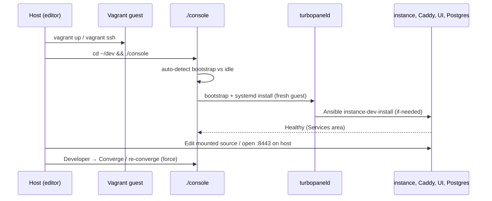

# Local development

This guide covers contributor local development. For host tooling, see [Prerequisites](/docs/development/prerequisites). For layout and service dependencies, see [Development architecture](/docs/architecture/development-architecture). For common failures, see [Dev console troubleshooting](/docs/getting-started/tilt-troubleshooting).

TurboPanel is **not a monorepo**. Clone (or fork) six sibling repositories under one parent directory, then run the stack inside a **Vagrant** guest. Edit on the host with VS Code / Cursor; Node, Deno, Docker, and systemd run in the VM.

## Repository layout

Use your own forks and feature branches so you can open PRs against `trunk`:

```
turbopanel/
├── dev/          # Vagrantfile + Ink console — https://github.com/turbopanel/dev
├── turbopaneld/  # host daemon + Ansible — https://github.com/turbopanel/turbopaneld
├── turbopanel/   # control plane — https://github.com/turbopanel/turbopanel
├── ui/           # Expo product console — https://github.com/turbopanel/ui
├── website/      # marketing + docs — https://github.com/turbopanel/website
└── .github/      # community health — https://github.com/turbopanel/.github
```

Inside the guest these mount at `~/dev`, `~/turbopaneld`, `~/turbopanel`, `~/ui`, `~/website`, and `~/.github`.

## Quick start

**1. Install Vagrant and a provider** (see [Prerequisites](/docs/development/prerequisites)).

**2. Boot the guest** from the `dev` checkout:

```bash
cd path/to/turbopanel/dev
vagrant up
vagrant ssh
```

Plain `vagrant up` selects **libvirt** on Linux and **UTM** on macOS. First boot downloads the box and may reboot once when a newer kernel is pending.

**3. Start the console** inside the guest:

```bash
cd ~/dev && ./console
```

That ensures pinned Node, runs `pnpm install`, and launches the Ink developer console. On a fresh guest the console bootstraps the daemon and converges the stack (optional-services picker after bootstrap). On later launches it sits idle until Developer → **Converge / re-converge**.

**4. Open the control plane from the host**

| Service | URL |
| ------- | --- |
| App (Caddy → UI + API, HTTPS) | `https://localhost:8443` |
| App (Caddy → UI + API, plaintext) | `http://localhost:8880` |
| API health (HTTPS) | `https://localhost:8443/api/health` |
| API health (plaintext) | `http://localhost:8880/api/health` |
| Website (docs + API reference) | `http://localhost:19820` (when enabled) |
| Mailpit | `http://localhost:8025` (when enabled; host loopback only) |

Trust the platform CA at `turbopanel/certs/ca.crt` (guest checkout) in your browser to avoid TLS warnings on `:8443`.

Smoke test from the **host**:

```bash
curl -k https://localhost:8443/api/health
curl http://localhost:8880/api/health
```

## Ports forwarded to the host

Vagrant forwards these guest ports. Use them from the IDE, browsers, or remote test machines.

| Port | Service | Host bind |
| ---- | ------- | --------- |
| **8443** | Control plane (Caddy HTTPS) | `0.0.0.0` (LAN) |
| **8880** | Control plane (Caddy plaintext HTTP) | `0.0.0.0` (LAN) |
| **8088** | Optional extra forward (guest must listen) | `0.0.0.0` (LAN) |
| **19820** | Website (Next.js) | `0.0.0.0` (LAN) |
| **4983** | Drizzle Studio (unauthenticated) | `127.0.0.1` only |
| **8025** | Mailpit web UI (unauthenticated) | `127.0.0.1` only |
| **5540** | Redis Insight (unauthenticated) | `127.0.0.1` only |
| **8125** | Tabix (unauthenticated) | `127.0.0.1` only |

- **Local browsing / VS Code / Cursor:** `https://localhost:8443` or `http://localhost:8880`.
- **Remote test machines / extra daemons:** give your development host a hostname (for example `https://dev.lan:8443` or your LAN IP) so clients are not stuck on `localhost`. Ports `8443` / `8880` / `8088` / `19820` listen on all host interfaces.
- **Studio / Mailpit / Redis Insight / Tabix** stay loopback-only on purpose — those UIs are unauthenticated. Open Drizzle Studio at `https://local.drizzle.studio?host=localhost&port=4983`.

## Dev console areas

Use **←** / **→** to switch areas in `./console` (`ActiveArea = "developer" | "services" | "bootstrap"` — bootstrap is the transient provisioning overlay, not a persistent tab):

| Area | Contents |
| ---- | -------- |
| **Services** | Service list/detail, restart, runtime switch (Deno/Workers) |
| **Developer** | Fleet, database, shell, **Converge / re-converge**, cell trace |

In the **Developer** area: **↑↓** picks a section, **Enter** opens it, **Esc** returns to the section list.

## Instance runtime modes

`TURBOPANEL_INSTANCE_RUNTIME` in `/etc/turbopanel/daemon.env` selects how the instance runs locally. Switch via the **Services** area in the console.

| Mode | Behaviour |
| ---- | --------- |
| **deno** (default) | `turbopanel-instance` systemd unit + Unix socket at `/run/turbopanel/instance.sock` |
| **workers** | Stops the systemd unit, exposes Postgres on TCP (`127.0.0.1:5432`), expects `pnpm dev` in `~/turbopanel` manually |

Workers mode has no Redis. Set `CLOUDFLARE_HYPERDRIVE_LOCAL_CONNECTION_STRING_HYPERDRIVE` in `instance/.dev.vars`.

## Guest filesystem (after converge)

```
~/dev/ ~/turbopaneld/ ~/turbopanel/ ~/ui/ ~/website/ ~/.github/   # mounted checkouts

/opt/turbopanel/vendor/   # pinned Node, Deno, Caddy, uv, Ansible, …
/etc/turbopanel/          # config (dev-user-owned)
/var/lib/turbopanel/      # state (dev-user-owned)
/var/log/turbopanel/      # service logs (dev-user-owned)
/run/turbopanel/          # runtime sockets (dev-user-owned)
```

## Common tasks

### Database schema

TurboPanel ships versioned SQL migrations in `turbopanel/migrations/`. Co-located dev converge and Workers deploy apply them via `pnpm migrate`. For quick Deno-only iteration without committing migration files, use drizzle-kit push from the guest `dev` checkout:

```bash
./scripts/sync.sh          # push instance schema.ts → Postgres (interactive)
./scripts/sync.sh --force  # skip destructive-change prompts (dev only)
./scripts/introspect.sh    # pull live DB → instance schema.ts
```

For errors and resets, see [Database troubleshooting](/docs/getting-started/database-troubleshooting). The dev console **Database** section can reset the dev instance or start Drizzle Studio.

### Formatting

Each repo formats independently — run the formatter configured in that repo before committing.

## Workflow diagram



## Related

- [Dev console troubleshooting](/docs/getting-started/tilt-troubleshooting)
- [Database troubleshooting](/docs/getting-started/database-troubleshooting)
- [Development architecture](/docs/architecture/development-architecture)
- [API architecture](/docs/architecture/api)
