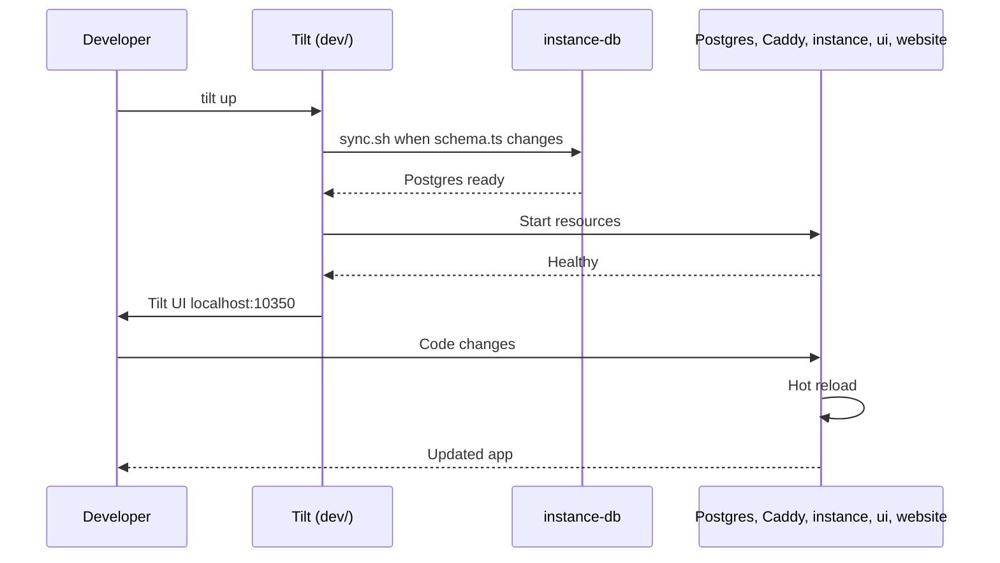

# Local development

This guide covers contributor local development. For supported OSes and required tooling, see [Prerequisites](/docs/development/prerequisites). For Tilt layout and resource dependencies, see [Development architecture](/docs/architecture/development-architecture). For Tilt-specific failures, see [Tilt troubleshooting](/docs/getting-started/tilt-troubleshooting).

TurboPanel is **not a monorepo**. The [turbopanel-dev](https://github.com/turbopanel/turbopanel-dev) repository bootstraps sibling checkouts and runs Tilt.

## Quick start

**1. Bootstrap sibling repos**

One-liner (fresh machine):

```bash
curl -fsSL https://develop.trbp.nl | sh
```

Or, from an existing `dev/` checkout:

```bash
sh pull.sh
```

This clones or updates `instance/`, `ui/`, `daemon/`, and `website/` next to `dev/`. All repos use branch **`trunk`**.

**2. Start Tilt**

From the `dev/` checkout:

```bash
tilt up
```

First run creates `dev/.env` from `.env.example` and fills missing secrets. Tilt syncs env into sibling repos, starts Postgres + Caddy (Docker), the instance, Expo web, and the website.

**3. Tear down**

Ctrl+C stops Tilt `serve_cmd` resources but leaves Docker containers running. Remove everything with:

```bash
tilt down
```

**4. Open**

| Service | URL |
| ------- | --- |
| App (Caddy → UI + API) | `https://localhost:8443` |
| API health | `https://localhost:8443/api/health` |
| Website (docs + API reference) | `http://localhost:19820` |
| Tilt UI | `http://localhost:10350` |
| Mailpit | `http://localhost:19826` |

Trust the platform CA at `instance/certs/ca.crt` in your browser to avoid TLS warnings on `:8443`.

Smoke test:

```bash
curl -k https://localhost:8443/api/health
curl -k https://localhost:8443/api/client/v1/install/status
```

## Instance runtime modes

Local dev defaults to **Workers** (`TURBOPANEL_INSTANCE_RUNTIME=workers`): the instance runs via `pnpm dev` / `wrangler dev` in `instance/`, and Caddy proxies `/api/*` and `/ws/*` to wrangler.

| Mode | Instance process | Caddy upstream |
| ---- | ---------------- | -------------- |
| **Workers** (default) | `wrangler dev` on `INSTANCE_DEV_PORT` (default **18787**) | TCP to host wrangler |
| **Deno** | `deno run` on Unix socket under `/run/turbopanel/` | Mounted Unix socket |

Switch at runtime with **Switch to Deno Mode** / **Switch to Workers Mode** in the Tilt UI nav (updates `dev/.env`, re-syncs env, recreates Caddy, restarts the instance). Deno mode requires Deno on the host.

## Repository layout

```
turbopanel/
├── dev/      # turbopanel-dev — pull.sh, Tiltfile, dev/.env
├── instance/ # turbopanel/turbopanel — Hono API (Workers + Deno)
├── ui/       # turbopanel/turbopanel-ui — Expo frontend
├── daemon/   # turbopanel/turbopanel-daemon — agent daemon (not started by Tilt)
└── website/  # turbopanel/turbopanel-website — marketing + docs (port 19820)
```

`dev/.env` is the single source of truth. `scripts/sync-env.sh` writes `instance/.dev.vars`, `instance/.env`, and `docker/.env`.

## Tilt UI

- **Dashboard:** http://localhost:10350 after `tilt up`.
- **Status:** Green = healthy; click a resource for logs.
- **instance-db:** Runs `./sync.sh --force` when `schema.ts` changes — pushes schema to local Postgres before the instance starts.

### Custom buttons

- **Switch to Deno Mode** / **Switch to Workers Mode** — hot-swap instance runtime (see above).

## Hot reload

- **UI:** Expo Fast Refresh (`ui/src`).
- **Instance:** Wrangler dev reload (Workers) or Deno `--watch` (Deno mode).
- **Website:** Next.js Fast Refresh (`website/src`, `website/docs`).

## Common tasks

### Database schema

TurboPanel uses **drizzle-kit push** (no versioned migration files in early development). From `instance/`:

```bash
./sync.sh          # push schema.ts → Postgres (interactive)
./sync.sh --force  # skip destructive-change prompts (dev only)
./introspect.sh    # pull live DB → schema.ts
```

Tilt's `instance-db` resource runs `./sync.sh --force` when `src/db/schema.ts` changes. For errors and resets, see [Database troubleshooting](/docs/getting-started/database-troubleshooting).

### Drizzle Studio

In the developer console (`/developer/database`), superadmin sessions can start Studio via the API. Caddy exposes it on HTTPS port **8444** in dev mode. Trust the same platform CA as `:8443`.

### Developer console

In `__DEV__`, authenticated superadmins can open `/developer/fleet` for fleet health, upgrade/sync actions, Expo PTY, and database tools.

### Formatting

Each repo formats independently — run the formatter configured in that repo before committing.

## Co-located dev on a VM (systemd)

For parity with managed hosts, run `./develop.sh` from the `instance/` checkout on Debian/Ubuntu. It bootstraps the daemon, enables co-located dev mode (`TURBOPANEL_DEV_INSTANCE=1`), and lets Ansible install instance + Caddy + UI as systemd units on **`:8443`**. Requires sibling `daemon/` checkout. This path does not use Tilt.

## Workflow diagram



## Port reference

| Service | Port | Notes |
| ------- | ---- | ----- |
| Tilt UI | 10350 | Dev dashboard |
| Caddy (HTTPS app) | 8443 | Browser entrypoint (`CADDY_PORT`) |
| Website | 19820 | Next.js (`WEBSITE_PORT`) |
| Wrangler (internal) | 18787 | Not browser-facing (`INSTANCE_DEV_PORT`) |
| Expo web | 8081 | Proxied by Caddy in dev (`EXPO_PORT`) |
| Postgres | 5432 | Docker, `127.0.0.1:5432` |
| Mailpit web | 19826 | Dev email UI |
| Mailpit SMTP | 19825 | Dev email SMTP |
| Drizzle Studio | 8444 | HTTPS via Caddy when started from dev console |

## Related

- [Tilt troubleshooting](/docs/getting-started/tilt-troubleshooting)
- [Database troubleshooting](/docs/getting-started/database-troubleshooting)
- [Development architecture](/docs/architecture/development-architecture)
- [API architecture](/docs/architecture/api)
- [Tilt documentation](https://docs.tilt.dev/)
