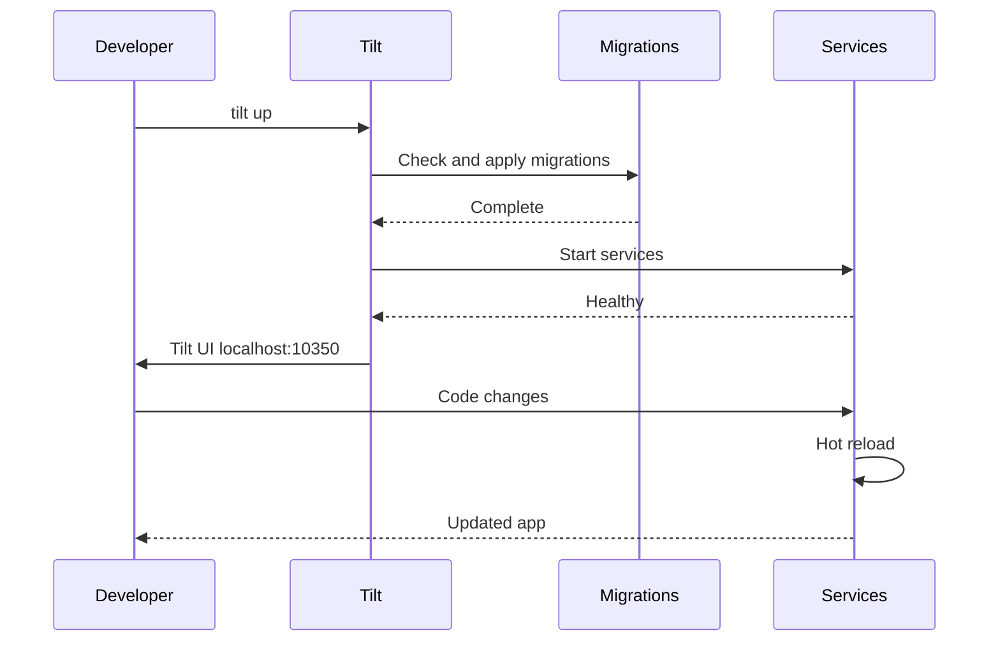

# Local development

This guide covers local development setup. For supported OSes and required tooling (Node.js, pnpm, Tilt, Docker), see [Prerequisites](/docs/development/prerequisites). For monorepo and Tilt layout details, see [Monorepo architecture](/docs/architecture/monorepo). For Tilt-specific failures, see [Tilt troubleshooting](/docs/getting-started/tilt-troubleshooting).

## Quick start

**1. Clone**

```bash
git clone https://github.com/turbopanel/turbopanel.git
cd turbopanel
```

**2. Install**

```bash
pnpm install
```

**3. Start**

```bash
# Edge mode (default)
tilt up

# Self-Hosted mode
tilt up self-hosted
```

**4. Open**

- **Tilt UI:** http://localhost:10350
- **API health:** http://localhost:19823/api/client/v1/health
- **App (Expo):** http://localhost:19822
- **Website:** http://localhost:19820
- **Daemon (Deno):** no HTTP port in dev; connects outbound to the API WebSocket (see Tilt `daemon` resource logs).

## Backend modes

| Feature             | Edge                                | Self-Hosted                                                                   |
| ------------------- | ----------------------------------- | ----------------------------------------------------------------------------- |
| **Control plane**   | Cloudflare Workers (local D1)       | Node on your machine                                                          |
| **Communication**   | Durable Objects (dev simulation)    | WebSocket                                                                     |
| **Daemon**          | Required per managed server in prod | Integrated on control plane; separate daemon on extra hosts                   |
| **Local databases** | Remote Postgres via `TURBOPANEL_DATABASE_URL` (Hyperdrive in prod) | Local Postgres 18 (Tilt **database** resource, port **19836**) or Docker **`turbopanel-database`** |

- **Edge** (`tilt up`): full stack including the `start` worker; migrations target your configured Postgres URL.
- **Self-Hosted** (`tilt up self-hosted`): Node API, local Postgres container, no `start` service.
- **Switch:** `tilt down`, then start the other mode (or use the Tilt UI buttons when using `pnpm dev` wrappers).

Pricing and product positioning for hosted Edge vs Self-Hosted are summarized in [Introduction](/docs/getting-started/introduction).

## Tilt UI

- **Dashboard:** http://localhost:10350 after `tilt up`.
- **Status:** Green = healthy; click a resource for logs.
- **Migrations:** The `migrate` resource runs before the API in typical setups; watch it if the API fails to start.

### Custom buttons

- Switch between Edge and Self-Hosted (full restart when not using the root dev wrapper).
- Drizzle Studio links (per logical database).
- View Expo QR code for device testing.

## Hot reload

- Changes under `apps/*/src` trigger reloads.
- **App:** Expo Fast Refresh.
- **API:** `tsx` watch (Self-Hosted) or Wrangler dev (Edge).
- **Website:** Next.js Fast Refresh.

## Common tasks

### Migrations

- **Automatic:** `scripts/check-migrations.mjs` runs as part of Tilt before the API starts (unless skipped).
- **Manual (Self-Hosted):** `pnpm db:migrate` (same as `pnpm --filter @turbopanel/api db:migrate`).
- **Manual (Edge / D1 local):** `wrangler d1 migrations apply <binding_or_name> --local` per database in `apps/api/wrangler.jsonc`.
- **New migration files:** `pnpm db:migration:new <name>` from repo root.

See [Migration troubleshooting](/docs/getting-started/migration-troubleshooting) for errors and recovery.

### Drizzle Studio

Self-Hosted dev runs a single Postgres database. Tilt starts Drizzle Studio on port **19824** (see `scripts/drizzle-studio.mjs`).

**CLI:**

```bash
pnpm --filter @turbopanel/api db:studio
```

Open `https://local.drizzle.studio/?port=19824`.

Close Studio before applying migrations to avoid connection contention.

### Mobile testing

- Tilt UI: **View Expo QR Code**, or run `node scripts/expo-qr.mjs`.
- Device must reach your dev machine on the LAN.

### Formatting

```bash
pnpm format
```

### Package-scoped commands

```bash
pnpm --filter @turbopanel/api <command>
pnpm --filter @turbopanel/app <command>
pnpm --filter @turbopanel/website <command>
```

## Workflow diagram



## Port reference

| Service | Port  | Inspector | Description                                                  |
| ------- | ----- | --------- | ------------------------------------------------------------ |
| Tilt UI | 10350 | —         | Dev dashboard                                                |
| start   | 19821 | 29821     | Edge-only installer                                          |
| App     | 19822 | —         | Expo                                                         |
| API     | 19823 | 29823     | Hono / Worker                                                |
| Daemon  | —     | —         | Deno dev: outbound WS only (production image uses **18284**) |
| Website | 19820 | —         | Next.js site                                                 |

Self-Hosted mode also uses Mailpit, Redis, RabbitMQ, and Drizzle Studio ports — see [Tilt troubleshooting](/docs/getting-started/tilt-troubleshooting).

## Related

- [Tilt troubleshooting](/docs/getting-started/tilt-troubleshooting)
- [Migration troubleshooting](/docs/getting-started/migration-troubleshooting)
- [Monorepo architecture](/docs/architecture/monorepo)
- [API architecture](/docs/architecture/api)
- [Tilt documentation](https://docs.tilt.dev/)
