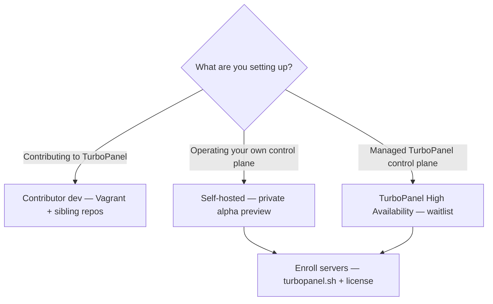

# Installation

TurboPanel spans multiple repositories. **Pick the path that matches your goal** — the three primary paths below do not substitute for one another.



## Path comparison

| Path | Who it is for | Status today |
| --- | --- | --- |
| **Contributor development** | Engineers working on TurboPanel source | Available for contributors |
| **Self-hosted control plane** | Operators who run the panel on their infrastructure | Private alpha — preview docs only |
| **TurboPanel High Availability** | Operators who want TurboPanel to run the panel | Private alpha — [join the waitlist](https://turbopanel.io/sign-up) |

Enrolling **additional managed servers** (daemons on workload hosts) uses the production installer at `turbopanel.sh` once you have a control plane — see [Additional managed server daemons](#additional-managed-server-daemons) below.

## Contributor development

For **contributors** building TurboPanel itself — not for production self-hosted or TurboPanel High Availability installs.

<Steps>
  <Step>
    Clone (or fork) the six sibling repos under one parent directory (`dev`, `turbopaneld`, `turbopanel`, `ui`, `website`, `.github`). See [Local development](/docs/getting-started/development).
  </Step>
  <Step>
    Confirm the host has **at least 16 GB of RAM**, then install [Vagrant](https://developer.hashicorp.com/vagrant) plus a provider (libvirt on Linux, UTM on macOS) — [Prerequisites](/docs/development/prerequisites).
  </Step>
  <Step>
    From the `dev` checkout:

    ```bash
    vagrant up
    vagrant ssh
    dev/console
    ```

    The console installs pinned Node, converges the stack, and starts the Ink UI.
  </Step>
  <Step>
    On the host, open `https://localhost:8443` (ports are forwarded). Prefer a LAN hostname when attaching remote test machines.
  </Step>
</Steps>

See [Local development](/docs/getting-started/development) for ports, console areas, and day-to-day workflow.

## Self-hosted control plane (preview)

<Callout type="info" title="Private alpha — not yet publicly available">
  Self-hosted production installs are in private alpha alongside TurboPanel High Availability. This
  section documents the **planned** managed install path — not the contributor dev console.
</Callout>

When self-hosted is publicly available, you provision a control plane on Debian or Ubuntu and enroll servers with the production daemon installer. **Today**, use contributor development only if you are building TurboPanel; otherwise [preview self-hosted docs](/docs/deployment/self-hosted).

<Steps>
  <Step>
    Provision a 64-bit Linux host (Debian 12+ recommended).
  </Step>
  <Step>
    Install the control plane with the planned managed production path — see
    [Control plane](/docs/deployment/control-plane) (private alpha preview; converges via daemon Ansible
    roles when publicly available).
  </Step>
  <Step>
    Complete the install wizard at `https://<host>:8443` (host PAM + superadmin).
  </Step>
  <Step>
    Enroll each managed server with `turbopanel.sh` and a license — [Daemon setup](/docs/deployment/daemon-setup).
  </Step>
</Steps>

<Callout type="warn" title="Not the contributor Vagrant workflow">
  Contributor development uses Vagrant and sibling checkouts — see [Local development](/docs/getting-started/development).
  It is not the production self-hosted install path.
</Callout>

## TurboPanel High Availability

<Callout type="info" title="Private alpha — join the waitlist">
  TurboPanel High Availability is **not yet publicly available**. [Join the waitlist](https://turbopanel.io/sign-up)
  for access updates. The instance runs on Cloudflare Workers; remote daemons connect over HTTPS/WSS.
  See [Control plane](/docs/deployment/control-plane) for how hosted coordination works.
</Callout>

When access is available, you create an organization in the hosted panel, obtain server licenses, and enroll nodes with `turbopanel.sh` (no `TURBOPANEL_HOST` required — the installer uses the channel manifest default).

## Additional managed server daemons

Install the daemon on servers that should be managed remotely (not the co-located control plane). Obtain a license from your organization first.

<CodeGroup titles={['TurboPanel High Availability', 'Self-hosted']}>

```bash
curl -fsSL turbopanel.sh | TURBOPANEL_LICENSE=<base64url-encoded-license> sh
```

```bash
curl -fsSL turbopanel.sh | \
  TURBOPANEL_LICENSE=<base64url-encoded-license> \
  TURBOPANEL_HOST=https://<instance-host>:8443 \
  sh
```

</CodeGroup>

The installer self-escalates with `sudo` and prompts for your password when needed — do not prefix the pipeline with `sudo`.

Replace host and port with where the instance is reachable from the node. The installer fetches the platform CA from `/api/daemon/v1/instance/ca` automatically for HTTPS instances.

### Supported platforms (managed nodes)

| OS | Architecture |
| -- | ------------ |
| Debian 12+ | `x86_64` (amd64), `aarch64` (arm64) |
| Raspberry Pi OS **64-bit** | `aarch64` (arm64) only |

32-bit ARM (including 32-bit Raspberry Pi OS) is **not** supported.

Full options and examples: [Daemon setup](/docs/deployment/daemon-setup).

## Prerequisites (all paths)

- **64-bit** Linux server (Debian 12+ recommended for Ansible paths; Raspberry Pi OS 64-bit on arm64)
- Docker (optional — installed on demand when a node runs container workloads)
- SSH access to GitHub for platform repo clones on co-located dev hosts (`git@github.com:turbopanel/...`)
- For contributor dev: see [Prerequisites](/docs/development/prerequisites)

## Next steps

- [Deployment hub](/docs/deployment) — Operator overview and related guides
- [Daemon setup](/docs/deployment/daemon-setup) — Node installer flags and communication
- [Security](/docs/deployment/security) — TLS, socket access, and hardening
