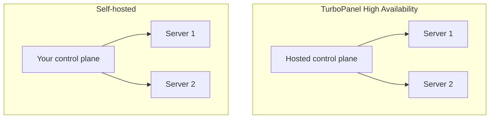

# Introduction

TurboPanel is one place to run everything you host. Deploy websites, applications, and databases across your servers, choose where projects run, and ship from one console.

A lightweight TurboPanel daemon on each server connects it to your control plane and runs approved operations locally. Your workloads stay on your servers.

<Callout type="info" title="Private alpha — not yet publicly available">
  Both deployment models below are in **private alpha** and **not yet publicly available**. This page
  describes where we are headed as we work toward a beta release — see the
  [roadmap](https://turbopanel.io/roadmap) for current progress.
</Callout>

## Deployment models

<ControlPlaneOptions />

### TurboPanel High Availability

- Control plane on a global edge network — fast and always on, close to your team worldwide (planned)
- No control-plane infrastructure, upgrades, backups, or public TLS for you to manage
- **Private alpha · Not yet available** — [join the waitlist](https://turbopanel.io/sign-up)

### Self-hosted

- Run the control plane on infrastructure you operate
- Same product experience as TurboPanel High Availability
- You are responsible for control-plane uptime, upgrades, backups, and public access
- Planned to be **free, unlimited servers** once it ships — you pay for the infrastructure you run
- **Private alpha · Not yet available** — [preview self-hosted docs](/docs/deployment/self-hosted)

<Callout type="info" title="Not sure which to choose?">
  TurboPanel High Availability is the planned default when you want TurboPanel to operate the control
  plane. Choose self-hosted when your team wants full operational custody — same product, your
  infrastructure. Neither path is publicly available yet.
</Callout>

## What you get

- **One console** — servers, deploys, networks, and access in a single UI
- **Fast worldwide access** — the control plane is served from a global edge network, so it stays quick for distributed teams (planned for TurboPanel High Availability)
- **Managed servers** — enroll hosts with the production daemon installer when your control plane is available
- **Private networking** — securely link cloud, datacenter, and office infrastructure
- **Automation when you need it** — use the API to plug TurboPanel into your workflow

## Architecture overview

## Next steps

- [Installation paths](/docs/getting-started/installation) — Contributor dev, self-hosted preview, and TurboPanel High Availability status
- [Self-hosted overview](/docs/deployment/self-hosted) — Control plane and node setup (preview)
- [Local development](/docs/getting-started/development) — Contributor Vagrant + dev console workflow
- [Daemon setup](/docs/deployment/daemon-setup) — Adding managed servers
- [Licensing](/docs/getting-started/licensing) — Repository licenses, notices, and Corresponding Source
