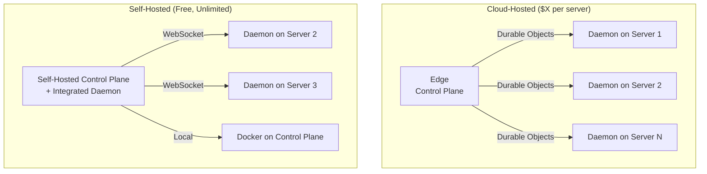

# Introduction

TurboPanel is a comprehensive platform for managing dockerized applications and infrastructure. It provides a centralized control surface for Docker management across multiple servers.

TurboPanel offers a unified interface for managing Docker containers across multiple servers, whether you choose cloud-hosted or self-hosted deployment. The platform uses a daemon-based architecture where lightweight daemons run on managed servers to execute Docker commands and stream logs back to the central control plane.

## Deployment Models

TurboPanel supports two deployment models to suit different needs:

| Feature             | Edge                                 | Self-Hosted                                              |
| ------------------- | ------------------------------------ | -------------------------------------------------------- |
| **Pricing**         | Pay per server                       | Free, unlimited servers                                  |
| **Control Plane**   | Global Edge Platform                 | Your infrastructure                                      |
| **Communication**   | Durable Objects                      | WebSocket                                                |
| **Daemon required** | Yes (on each managed server)         | Yes (on additional servers, integrated on control plane) |
| **Best For**        | Teams wanting managed infrastructure | Teams wanting full control and cost savings              |

### Edge

- Pay per server pricing model
- Runs on global edge platform for low-latency deployment
- Uses Durable Objects for stateful communication with daemons
- Managed infrastructure, no server maintenance required

### Self-Hosted

- Free with unlimited servers
- Runs on your own infrastructure
- Uses WebSocket for persistent bidirectional communication
- Full control over data and infrastructure

<Callout type="info" title="Integrated daemon">
  The first server (where the control plane runs) includes integrated daemon functionality. You do
  not need a separate daemon process on the control plane node.
</Callout>

## Key Features

- **Centralized Control Surface** - Manage Docker containers across multiple servers from a single interface
- **Dual Deployment Options** - Choose cloud-hosted (pay per server) or self-hosted (free, unlimited servers)
- **Daemon-based architecture** - Lightweight daemons manage Docker containers on remote servers
- **Cross-Platform Frontend** - Web, iOS, and Android applications via Expo/React Native
- **Dual Communication Modes** - WebSockets for self-hosted, Durable Objects for cloud
- **Integrated Control Plane** - Self-Hosted mode includes daemon functionality on control plane node

## Architecture Overview

TurboPanel uses a control plane + daemons architecture:

## Next Steps

- [Installation](/docs/getting-started/installation) — Install TurboPanel using the one-line install script
- [Daemon Setup](/docs/deployment/daemon-setup) — Daemon architecture and configuration
- [Installation](/docs/deployment/control-plane) — Production deployment instructions
