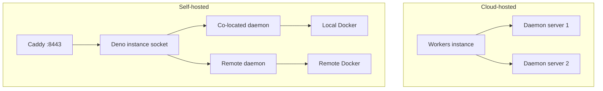

# Introduction

TurboPanel is a platform for managing dockerized applications and infrastructure. It provides a centralized control surface for Docker management across multiple servers.

TurboPanel offers a unified interface for managing Docker containers across multiple servers, whether you choose cloud-hosted or self-hosted deployment. Lightweight **daemons** run on managed servers, connect to the **instance** (control plane API) over HTTPS/WebSocket, and execute orchestration locally via Ansible.

## Deployment models

| Feature | Cloud-hosted (Workers) | Self-hosted (Deno) |
| ------- | ---------------------- | ------------------ |
| **Pricing** | Pay per server | Free, unlimited servers |
| **Control plane** | Cloudflare Workers | Your server (Deno + Caddy) |
| **Communication** | HTTPS / WebSocket | HTTPS / WebSocket (Caddy) |
| **Daemon required** | Yes (on each managed server) | Yes on extra servers; co-located on control plane |
| **Best for** | Managed, global edge | Full control and cost savings |

### Cloud-hosted (Workers)

- Instance can run on Cloudflare Workers with Hyperdrive to Postgres (`pnpm deploy` with `TURBOPANEL_DATABASE_URL` and `CLOUDFLARE_ENV` set)
- Remote daemons connect to your Workers URL over HTTPS/WSS today
- **Durable Objects** for edge daemon coordination are **not implemented yet**

### Self-hosted (Deno)

- Instance runs as Deno on a Unix socket; **Caddy** terminates TLS (default **`:8443`**) and proxies `/api/*` and `/ws/*`
- Co-located **daemon** on the control plane host installs and updates the stack via Ansible
- Additional servers use the [CDN node installer](/docs/deployment/daemon-setup)

<Callout type="info" title="Co-located daemon">
  On the control plane server, a co-located daemon connects to the local instance socket (or through
  Caddy) and runs Ansible to manage the instance, UI, Caddy, and Postgres. You do not need a
  separate remote daemon on the same machine.
</Callout>

## Key features

- **Centralized control surface** — Manage servers from a single UI
- **Dual deployment options** — Cloudflare Workers or self-hosted Deno
- **Daemon-based architecture** — Ansible-driven installs on each node
- **Cross-platform frontend** — Web, iOS, and Android via Expo / React Native
- **Multi-repo codebase** — Instance, UI, daemon, website, and dev orchestration are separate Git repositories

## Architecture overview

## Next steps

- [Installation](/docs/getting-started/installation) — Control plane and node setup
- [Local development](/docs/getting-started/development) — Contributor Tilt workflow
- [Daemon setup](/docs/deployment/daemon-setup) — Adding managed servers
- [Control plane](/docs/deployment/control-plane) — Self-hosted production layout
